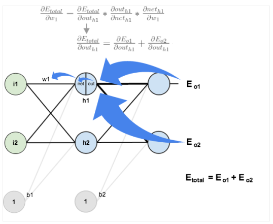

### 인공신경망

- 사람의 뇌와 비슷하다. ⇒ 뉴런과 비슷하다.

### ⭐ 인공 뉴런(퍼셉트론)

- 다중선형회귀
    - weight (가중치), bias (편향), h() : Activation Functinon

> $a = b + w1x1 + w2x2 + ... + wnxn$
> 
> 
> $y = h(a)$
> 
- a를 h()를 통해 비선형으로 변경 시킨다. ⇒ 세상 모든 것은 선형보다는 비선형이기 때문에

- x를 모아놓은 것 : 벡터
- x에 해당하는 weight가 존재 (w : 파라미터)
- x → w : x와 w를 곱한다.
- 각 값을 합한다. (시그마)
- bias도 합한다.
- 해당 값을 Activation Function에 넣는다.

### 딥러닝 (Deep Learning)

- 노란색 하나하나가 퍼셉트론(인공뉴런)이다.
    - 하나하나에 다중선형회귀를 Activation Function에 넣어 비선형으로 만든 것들이 들어가 있다.
- ⭐ 딥러닝은 머신러닝이 처리하기 어려운 데이터 (비정형 데이터)를 더 잘 처리한다.
    - 머신러닝은 사람이 Feature를 만들어 준다.
    - 딥러닝은 사람이 전처리, Cleaning은 하지만 Feature를 만들지는 않는다. ⇒ 전처리가 제일 중요하다.
    - **모델이 스스로 Feature를 생성하고 정의하면서 스스로 학습한다.**

### 손실함수 (Loss Function)

- 회귀 (Regression)에서의 손실함수
    - MSE (Mean Squared Error)
        - L2 loss
        - 이상치에 민감 (제곱이라서 값이 많아지기 때문에)
    - MAE (Mean Absolute Error)
        - L1 loss
        - 이상치에 강건 (절대값이라 값은 그대로다)
    
    

- 다중 분류 (Multi-class Classification)에서의 손실함수
    - CE (Cross Entropy)
    - 예측확률이 실제값과 얼마나 비슷한가를 측정
    
    

### 경사하강법 (Grandient Descent)

- 모델이 잘 학습할 수 있도록 기울기 (변화율)을 사용해 모델 파라미터를 저장하는 방법
    - 예측과 실제값을 비교해 손실을 구한다.
    - 손실이 작아지는 방향으로 파라미터를 수정한다.
    - 미분해서 기울기가 0일 때까지 학습을 한다.
        - 경사 (기울기) : + = 파라미터 ↓, - = 파라미터 ↑
- 학습률 (Learning Rate)
    - 파라미터를 업데이트하는 정도를 조절
    - 학습의 영향이 가장 크다.
    - Local Minima : Over Fitting, Under Fitting이 일어난 상태
    
    

### 역전파 (Back-propagation)

- 파라미터를 업데이트 할 때, 필요한 손실에 대한 기울기를 역방향으로 업데이트
    - a1을 알기 위해 a3를 알아야 하고, a3를 알기 위해 a6를 알아야 하기 때문

### 기울기 소실 문제와 활설화 함수

- 역으로 파라미터를 변경해주면서 최적을 파라미터를 찾는다.
- 하지만 역으로 가기 위해서는 미분이 필요하다.
- 기울기 소실은 활성화 함수 (Activation Function)의 기울기와 관련이 깊다.
- 미분을 계속 하다 보면 오차범위가 줄어드는데 중간에 0이 되어버리거나 매우 작아지면 경사 소실 (기울기 소실 : vanishing gradient) 문제가 발생 ⇒ sigmoid
- Activation Function
    - 선형 → 비선형
- 기울기 소실 예시
    
    

- 기울기 소실 해결방법
    - 활성화 함수 종류가 많아졌다.
        
        

    - ReLU (Rectified Linear Unit)가 가장 많이 쓰임
        - 미분해서 결과가 음수면 연산을 하지 않는다.
        - 무조건 0 (음수) 아니면 1 (양수) 을 준다.
        - 연산이 간편하다. ⇒ 속도가 빠르다
        
        

### 배치 (Batch)

- 일정 주기, 일정 크기로 프로세스가 진행.
- 한 번에 여러 개의 데이터를 묶어서 입력하는 것.

- Gradient Descent 방법
    - 전체 데이터를 로드 → 학습 → 손실함수 계속 → 업데이트
    
    

- SGD (Stochastic Gradient Descent)
    - 데이터를 n개로 나누어 (batch size)일부만 로드 → 학습 → 손실함수 계산 → 업데이트 ⇒ n번 반복
    
    

### Epoch

- 배치를 1번 다 돈 상태
- 머신러닝은 1 Epoch ⇒ 정형 데이터 이기 때문에

- Batch Normalization
    - 데이터 분포도를 보기 좋게 치환

### Optimizer

- 미니배치 경사하강법 방식 보안.
- 가속도가 너무 크면 췽겨져 나갈 수 있다.
