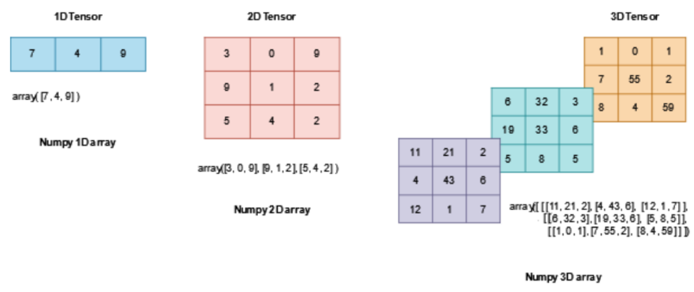
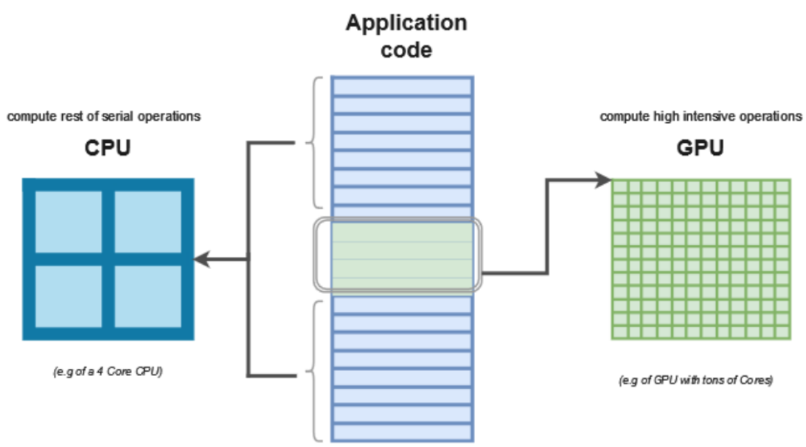
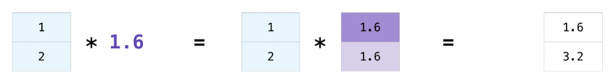

**⭐ 차원, shape 신경을 써야 한다.**

### Tensor

- tensor는 객체이다. (인스턴스)
- 기본적으로 얕은복사



- torch.tensor : list → tensor 형변환

```python
import torch

data = [
    [1, 2], [3, 4], [5, 6]
]

data_tensor = torch.tensor(data)
```

- np.array : list → numpy 형변환

```python
arr = np.array(data)
```

- torch.from_numpy : numpy → tensor 형변환

```python
arr = np.array(data)
arr_tensor = torch.from_numpy(arr)
# arr 값이 바뀌면 arr_tensor 값도 바뀐다. => 얕은 복사

print(f'Numpy arr value: \n {arr} \n')
print(f'Tensor arr_tensor value: \n {arr_tensor}')
```

- 곱하기

```python
np.multiply(arr, 2, out=arr)

print(f'Numpy arr after * 2 operation: \n {arr} \n')
print(f'Tensor arr_tensor value after modifying numpy array: \n {arr_tensor}')

'''
Numpy arr after * 2 operation: 
 [[ 2  4]
 [ 6  8]
 [10 12]] 

Tensor arr_tensor value after modifying numpy array: 
 tensor([[ 2,  4],
        [ 6,  8],
        [10, 12]])
'''
```

- CPU 는 RAM에 있는 데이터를 가져와 연산을 한다.
- 실제 데이터를 두는 곳을 따로 둔다. (변수도 따로.)
- 변수에 해당 데이터에 있는 주소를 할당
- 얕은복사 (python은 기본적으로 얕은 복사)
    - 주소 복사 ⇒ 원 데이터가 바뀌면 해당 주소를 가리키는 변수의 값도 바뀌게 된다.
    
    ```python
    import pandas as pd
    
    data = [ [1, 2], [3, 4], [5, 6] ]
    df1 = pd.DataFrame(data)
    df2 = df1
    ```
    
- 깊은복사 (따로 코드를 짜야한다.)
    - 다른 주소
    
    ```python
    import pandas as pd
    
    data = [ [1, 2], [3, 4], [5, 6] ]
    df1 = pd.DataFrame(data)
    df2 = df1.copy()
    ```
    
- torch.ones_like : tensor로 tensor 만들고 모든 요소가 1로 초기화
    - 동일한 shape
- torch.rand_like : tensor로 tensor 만들고 모든 요소 랜덤값

```python
x_ones = torch.ones_like(data_tensor)
x_rand = torch.rand_like(data_tensor, dtype=torch.float)
```

- With random or constant values

```python
shape = (2,3,)
# 0 ~ 1 사이의 숫자를 랜덤으로 생성
rand_tensor = torch.rand(shape)
# 0 ~ 1 사이의 숫자를 가우시안 정규분포를 이용해 생성
rnad_normal_tensor = torch.randn(shape)
ones_tensor = torch.ones(shape)
zeros_tensor = torch.zeros(shape)
# 특정한 값으로 초기화를 하지 않는 행렬
empty_tensor = torch.empty(shape)

print(f"Random Tensor: \n {rand_tensor} \n")
print(f"Random Normal Distribution Tensor: \n {rnad_normal_tensor} \n")
print(f"Ones Tensor: \n {ones_tensor} \n")
print(f"Zeros Tensor: \n {zeros_tensor}")
print(f"Real Random Tensor: \n {empty_tensor}")

'''
Random Tensor: 
 tensor([[0.2607, 0.0874, 0.0423],
        [0.1102, 0.2826, 0.5561]]) 

Random Normal Distribution Tensor: 
 tensor([[-0.6487, -1.9272,  1.0536],
        [-0.9623, -0.2789, -0.1155]]) 

Ones Tensor: 
 tensor([[1., 1., 1.],
        [1., 1., 1.]]) 

Zeros Tensor: 
 tensor([[0., 0., 0.],
        [0., 0., 0.]])
Real Random Tensor: 
 tensor([[-6.0635e+21,  4.5150e-41, -6.0635e+21],
        [ 4.5150e-41, -5.6000e+03,  4.5151e-41]])
'''
```

### Tensor 속성

```python
tensor = torch.rand(3,4)

print(f"Shape of tensor: {tensor.shape}")
print(f"Datatype of tensor: {tensor.dtype}")
print(f"Device tensor is stored on: {tensor.device}")

'''
Shape of tensor: torch.Size([3, 4])
Datatype of tensor: torch.float32
Device tensor is stored on: cpu
'''
```



### Tensor 연산

- Indexing and Slicing

```python
data = [
    [1, 2, 3], [4, 5, 6], [7, 8, 9]
]
tensor = torch.tensor(data, dtype=torch.float)

print(tensor)
print('-'*50)

print('First row: ',tensor[0])
print('Last row: ',tensor[-1])
print('First column: ', tensor[:, 0])
print('Last column1:', tensor[:, -1])
print('Last column2:', tensor[..., -1])

print('-'*50)
tensor[:,1] = 0
tensor[1] = 0
print(tensor)

'''
tensor([[1., 2., 3.],
        [4., 5., 6.],
        [7., 8., 9.]])
--------------------------------------------------
First row:  tensor([1., 2., 3.])
Last row:  tensor([7., 8., 9.])
First column:  tensor([1., 4., 7.])
Last column1: tensor([3., 6., 9.])
Last column2: tensor([3., 6., 9.])
--------------------------------------------------
tensor([[1., 0., 3.],
        [0., 0., 0.],
        [7., 0., 9.]])
'''
```

- Joining tensors
    - torch.cat() : 주어진 차원을 기준으로 tensor들을 concat
    - torch.stack() : 새로운 차원으로 주어진 tensor를 붙인다.

```python
# cat()
t1 = torch.tensor([[1, 2],
                   [3, 4]])
t2 = torch.tensor([[5, 6],
                   [7, 8]])
t1.shape, t2.shape  # [2,2], [2,2]

# row가 0차원, col이 1차원
# 앞에가 0, 뒤에가 1
torch.cat((t1, t2), dim=0)
'''
tensor([[1, 2],
        [3, 4],
        [5, 6],
        [7, 8]])
'''

torch.cat((t1, t2), dim=1)
'''
tensor([[1, 2, 5, 6],
        [3, 4, 7, 8]])
'''

# stack()
torch.stack((t1, t2), dim=0)
'''
tensor([[[1, 2],
         [3, 4]],

        [[5, 6],
         [7, 8]]])
'''

torch.stack((t1, t2), dim=1)
'''
torch.stack((t1, t2), dim=1)
output
tensor([[[1, 2],
         [5, 6]],

        [[3, 4],
         [7, 8]]])
'''

torch.stack((t1, t2), dim=2)
'''
tensor([[[1, 5],
         [2, 6]],

        [[3, 7],
         [4, 8]]])
'''
```

### Arithmetic Operations (연산)

- broadcasting
    
    

- torch.mm (행렬 곱)
    - 다른 모양의 tensor의 곱 (2D tensor X 2D tensor)
    - 결과는 다른 크기와 모양의 새로운 행렬

```python
mat1 = torch.randn(2, 3)
mat2 = torch.randn(3, 3)

# (2, 3) x (3, 3) = (2, 3)
torch.mm(mat1, mat2)
# broadcasting이 아니기 때문에 오류 발생
torch.mm(mat2, mat1)
```

- torch.mul (요소의 곱)
    - 같은 모양의 tensor를 곱하여 동일한 모양의 결과

```python
tensor1 = torch.randn(3, 4)
tensor2 = torch.randn(4)

# broadcasting (3, 4) (4, 4) => (3, 4)
torch.mul(tensor1, tensor2).size()
# not broadcasting
torch.mm(tensor1, tensor2).size()
```

- batch 연산 - torch.bmm
    - 0번째 차원은 batch
    - batch 크기가 같아야 한다.
    - a @ b 와 동일

```python
# (5,6)을 256번 실행 => 0번째 차원은 batch
a = torch.zeros((256, 5, 6))
b = torch.zeros((256, 6, 7))
torch.bmm(a,b).shape # torch.Size([256, 5, 7])
```

- batch 연산 - torch.matmul
    - 0번째 차원은 batch
    - batch 크기가 같아야 한다.

```python
a = torch.zeros((256, 5, 6))
b = torch.zeros((6, 7))

torch.matmul(a,b).shape
torch.bmm(a,b).shape # broadcasting이 지원되지 않음
```

### **Single-element tensors**

- 산수 함수를 쓰면 차원이 줄어든다.

```python
tensor2 = torch.randn(4)
agg = tensor2.sum() # tensor(-0.1632)

agg_item = agg.item() # tensor -> python 형변환
# -0.16319499909877777

agg = tensor2.sum() # 1D -> 0D 차원축소
agg_item = agg.item() # get a value / tensor 0D(Scalar) -> python 데이터
print(agg_item, type(agg_item)) # -0.16319499909877777 <class 'float'>
```

### In-place operations

- inplace : 해당 결과를 자신에게 반영
    - _ (언더바) 사용

```python
print(tensor2, "\n")
print(f"{tensor2.add(5)}\n")
print('-'*50)
print(tensor2, "\n")
tensor2.add_(5) # inplace : 해당 결과를 자기 자신에게 반영
print(tensor2)

'''
tensor([-1.3365,  0.9018,  0.2131,  0.0583]) 
tensor([3.6635, 5.9018, 5.2131, 5.0583])
--------------------------------------------------
tensor([-1.3365,  0.9018,  0.2131,  0.0583]) 
tensor([3.6635, 5.9018, 5.2131, 5.0583])
'''
```

### **Bridge with Numpy**

- Tensor to Numpy array
    
    ```python
    t = torch.ones(5) # 1로만 채워진 tensor
    print(f"t: {t}")
    n = t.numpy() # tensor -> numpy
    print(f"n: {n}")
    
    t.add_(1)
    print(f"t: {t}")
    print(f"n: {n}") # 얕은복사
    ```
    
- Numpy array to Tensor
    
    ```python
    n = np.ones(5)
    t = torch.from_numpy(n)
    ```
    

### **Dimesion Change**

- reshape()
    - shape 변경
    - view()와 비슷
    - 바꿀 수 있는 shape (데이터 동일), 바꿀 수 없는 shape (데이터 다름)
    - 알 수 없는 것을 연산을 해야 할 때가 존재한다. ⇒ -1 사용
    
    ```python
    # 2 x 3 x 4 = 24 ex) (1, 24) (24, 1) (12, 2) (6, 4)
    x = torch.rand(2, 3, 4)
    # (2, 12)
    x.reshape(2, -1).shape
    # # (6, 4)
    x.reshape(-1, 4).shape
    # (1, 24)
    x.reshape(1, -1).shape
    x.reshape(3, 4, 2).shape
    ```
    
- permute()
    - transpose()와 비슷
    - 차원 순서 변경
    
    ```python
    x = torch.rand(16, 32, 3)
    
    # torch.Size([3, 32, 16])
    x.permute(2, 1, 0).shape
    ```
    
- squeeze()
    - 1인 차원을 제거
    - 특정차원 제가 가능 (dim) ⇒ 특정차원이 1이어야 한다.
    
    ```python
    # 1 x 3 x 1 x 20 x 1 = 60
    # torch.Size([1, 3, 1, 20, 1])
    x = torch.rand(1, 3, 1, 20, 1)
    
    # 3 x 20 = 60
    x.squeeze().shape
    
    # torch.Size([3, 1, 20, 1])
    x.squeeze(dim=0).shape
    
    # torch.Size([1, 3, 1, 20])
    x.squeeze(dim=-1).shape
    ```
    
- unsqueeze()
    - 1인 차원 생성
    - dim 파라미터 필수
    
    ```python
    x = torch.rand(3, 20, 128)
    
    # torch.Size([3, 1, 20, 128])
    x.unsqueeze(dim=1).shape
    
    # torch.Size([3, 20, 128, 1])
    x.unsqueeze(dim=-1).shape
    
    # Error
    # unsqueeze()를 사용할 때는 무조건 dim값을 정의해야 함!!
    x.unsqueeze().shape
    ```
