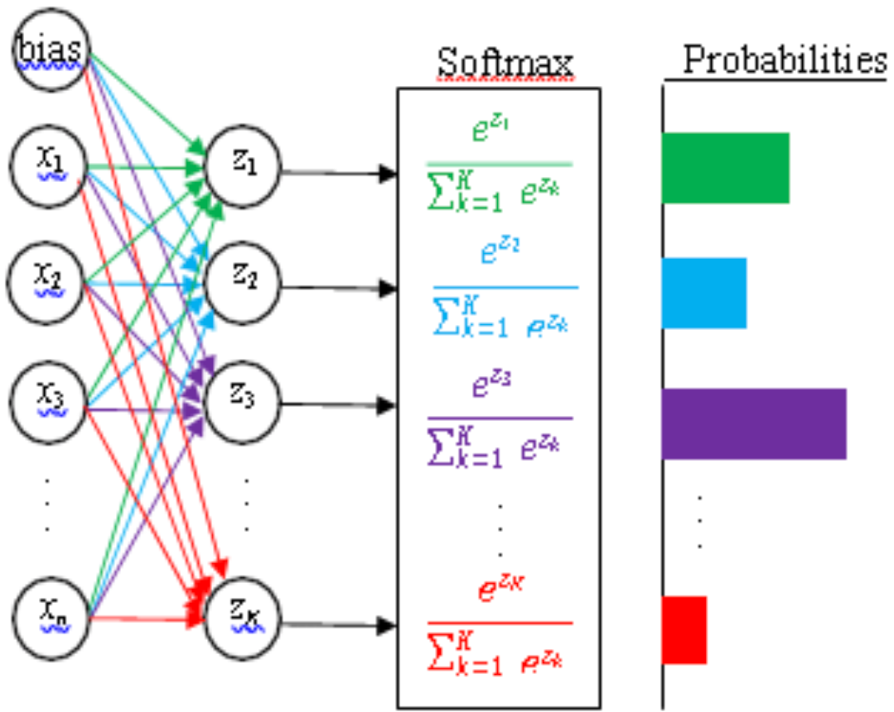

- 앞에 있는 layer의 input 조작 불가
    - Feature 갯수, output shape 등등
- 본인 layer의 output은 조작 가능
- Input layer : 벡터 (1D)
    - 2차원이라면 Flatten으로 늘려줘야 한다.
- 단순 많이 : GPU / 어려운 것 : CPU
    - model, feature, target은 같은 환경에 있어야 한다.

### Build a neural network

- https://learn.microsoft.com/en-us/training/modules/intro-machine-learning-pytorch/4-model

```python
%matplotlib inline
import os # window, 리눅스 관련

import torch # 딥러닝 모듈
# nn : Neural Network (모델 or 레이어)
from torch import nn

# utils(유용한) data 중에 DataLoader
from torch.utils.data import DataLoader 
#  딥러닝 이미지 모듈 중 datesets(학습용 데이터들)
# transform 데이터 변환 모듈
from torchvision import datasets, transforms
```

1. Get a hardware device for training

```python
# is_available() : torch(딥러닝)에 사용할 cuda(GPU)가 있나?
device = 'cuda' if torch.cuda.is_available() else 'cpu'
print('Using {} device'.format(device))
```

2. Define the class
- 모델 클래스 만들기
    - init(생성함수) 필요 ⇒ 다른 메소드(함수)를 실행하기 위해 필요한 변수 등을 미리 생성(선언)하는 역할

```python
# nn : Neural Network (모델 or 레이어)
# nn.Module : torch에 있는 사용자의 모델 부모 클래스
# -> 앞으로 모델을 만든다면, nn.Module을 상속 받아야 한다.
class NeuralNetwork(nn.Module):
    # 다른 메소드(함수)를 실행하기 위해 필요한 변수 등을 미리 생성(선언)하는 역할
    def __init__(self):
        # super() : 부모(nn.Module) 클래스
        # super().__init__() : 부모 클래스의 인스턴스 생성
        super().__init__() # super(NeuralNetwork, self).__init__()

        # nn.Flatten()
				# 선형회귀모델의 input share(1D)에 맞게 feature(2D)를 1D로 변경한다.
        self.flatten = nn.Flatten()

        # nn.Sequential() : 순서대로 진행
        # 데이터를 받으면 layer들을 끝까지 실행 후 반환
        # Linear는 1D로 input 받는다.
        self.linear_relu_stack = nn.Sequential(
            # (input shape, output shape)
            nn.Linear(28*28, 512),
            # Activation Function
            nn.ReLU(),
            # (intput shape = 앞에 layer의 output shape, output shape)
            nn.Linear(512, 512),
            # Activation Function
            nn.ReLU(),
            # (intput shape = 앞에 layer의 output shape, output shape = target shape, 결과를 비교해야 하니까)
            nn.Linear(512, 10),
            # Activation Function
            nn.ReLU()
        )

    # 필수함수(정방향) - 학습 함수
    # sklearn은 학습과 score를 둘다 해주기 때문에 (feature, target)
    # 딥러닝은 학습만 하기에 feature만 사용. (x : feature)
    def forward(self, x): # (28, 28)
        out_flatten = self.flatten(x) # out_flatten: (28*28,) => 데이터의 변화는 없다.
        logits = self.linear_relu_stack(out_flatten) # logits: (10,)
        return logits
```

- Neural Network를 만들고 devie에 적용

```python
# 딥러닝 인스턴스이면서 device에 적용
# 동인한 환경에 해주어야 한다.
model = NeuralNetwork().to(device)
# 모델 인스턴스를 print 하면 생성함수 결과가 보여짐
print(model)
```

- 임의 데이터 생성

```python
X = torch.rand(1, 28, 28, device=device)
X.shape # (batch_size, height_size, width_size)
```

- 모델 학습

```python
# model(X) : 모델 학습 => forward 함수가 실행됨
logits = model(X)
# (batch_size, target_size)
logits.shape
```

- 확률값

```python
# Softmax : 숫자를 확률값으로 변경해 준다.
# tensor는 dim(차원)이 중요하다.
# target_size에 해당하는 차원으로 결과를 내야한다.
pred_probab = nn.Softmax(dim=1)(logits)
pred_probab.shape
```

- 가장 큰 값

```python
# argmax : 가장 큰값
y_pred = pred_probab.argmax(1)
print(f"Predicted class: {y_pred}")
```

3. Weight and Bias
   1. wight와 Bias 확인

	```python
	# 왜 순서가 바뀐 것일까
	# 행렬로 포현했을 때, (세로, 가로)이기에
	print(f"1 Linear weights: {model.linear_relu_stack[0].weight.shape} \n") # (512, 28*28)
	print('-'*50)
	print(f"1 Linear weights: {model.linear_relu_stack[0].bias.shape} \n") # (512)
	'''
	1 Linear weights: torch.Size([512, 784]) 
	--------------------------------------------------
	1 Linear weights: torch.Size([512])
	'''
	```
	
	```python
	print(f"2 Linear weights: {model.linear_relu_stack[2].weight.shape} \n") # (512, 512)
	print('-'*50)
	print(f"2 Linear weights: {model.linear_relu_stack[2].bias.shape} \n") # (512, 512)
	'''
	2 Linear weights: torch.Size([512, 512]) 
	--------------------------------------------------
	2 Linear weights: torch.Size([512])
	'''
	```
	
	```python
	print(f"3 Linear weights: {model.linear_relu_stack[4].weight.shape} \n") # (10, 512)
	print('-'*50)
	print(f"3 Linear weights: {model.linear_relu_stack[4].bias.shape} \n") # (10)
	'''
	3 Linear weights: torch.Size([10, 512]) 
	--------------------------------------------------
	3 Linear weights: torch.Size([10])
	'''
	```
	
	```python
	model.linear_relu_stack[4].weight
	model.linear_relu_stack[4].bias
	```
4. Model layers
    1. nn.Flatten
        1. 선형회귀모델의 input share(1D)에 맞게 feature(2D)를 1D로 변경
        
        

        ```python
        # flatten 생성
        flatten = nn.Flatten()
        
        flat_image = flatten(input_image) # (3, 28, 28)
        print(flat_image.size()) # (3, 28 * 28)
        ```
        
    2. nn.Linear
        1. output = input * weight^T + bias
        
        ```python
        # linear 생성
        layer1 = nn.Linear(in_features=28*28, out_features=20)
        
        hidden1 = layer1(flat_image) # (3, 28 * 28)
        print(hidden1.size())
        ```
        
    3. nn.ReLU
        1. Linear output: x = weight * input + bias
        2. ReLU: f(x) = 0 if x < 0 else x
        
        ```python
        print(f"Before ReLU: {hidden1}\n\n")
        hidden1 = nn.ReLU()(hidden1)
        print(f"After ReLU: {hidden1}")
        ```
        
    4. nn.Sequential
        1. 데이터를 받으면 layer들을 끝까지 실행 후 반환
        2. input = 1D
        
        ```python
        seq_modules = nn.Sequential(
            flatten,
            layer1, # (28*28, 20)
            nn.ReLU(),
            nn.Linear(20, 10)
        )
        
        input_image = torch.rand(3,28,28)
        
        logits = seq_modules(input_image)
        
        logits.shape
        ```
        
    5. nn.Softmax
        1. 결과 확률
        
        ```python
        softmax = nn.Softmax(dim=1)
        pred_probab = softmax(logits)
        pred_probab.shape
        ```
        
        
    
5. Model parameters
    
    ```python
    print("Model structure: ", model, "\n\n")
    
    for i, (name, param) in enumerate(model.named_parameters()):
        print(f"{i}번째, Layer: {name} | Size: {param.size()} | Values : {param[:2]} \n")
    ```
