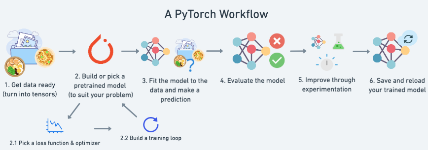
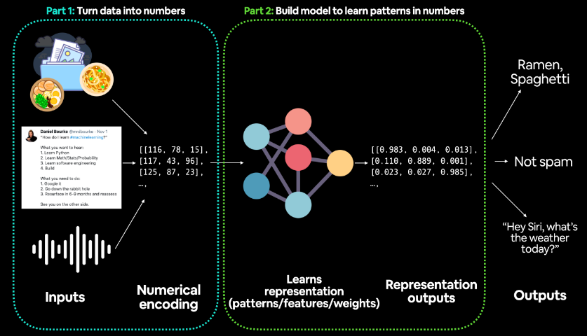
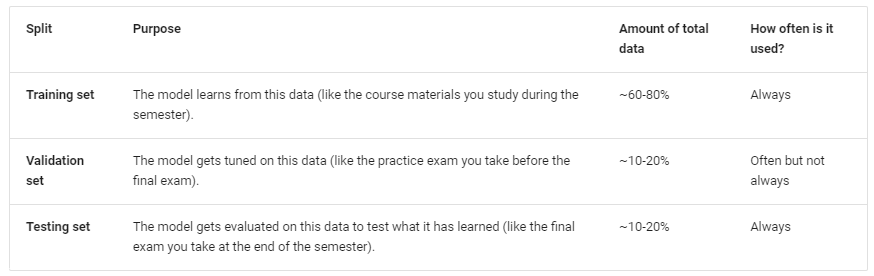
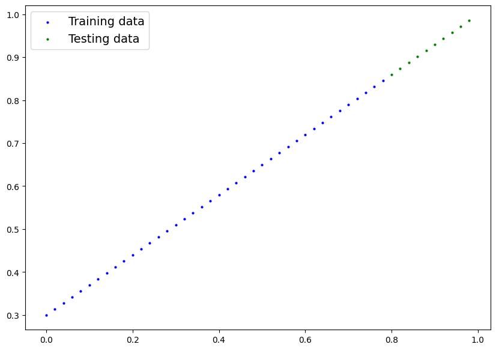
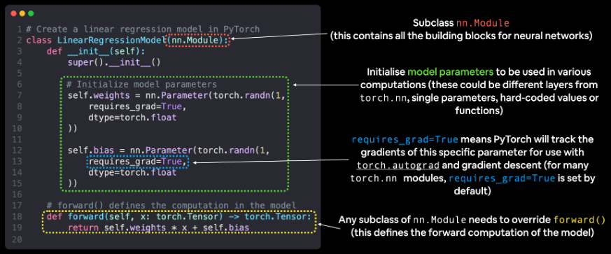
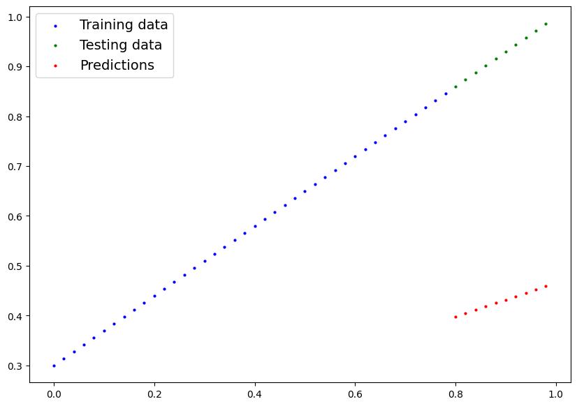
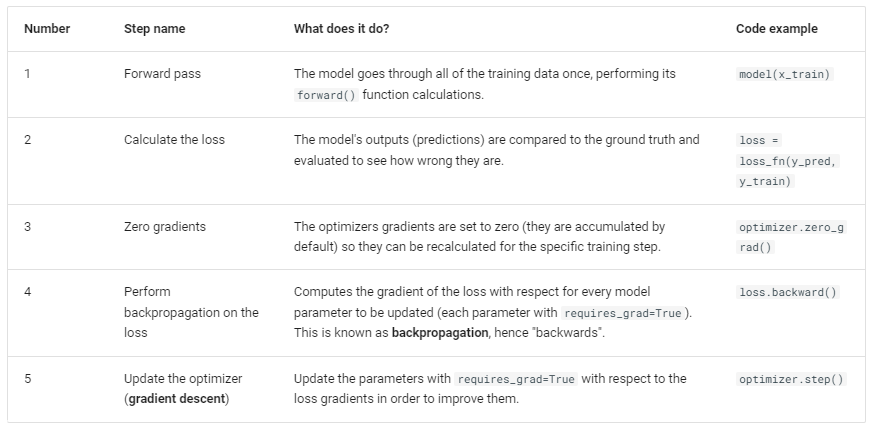
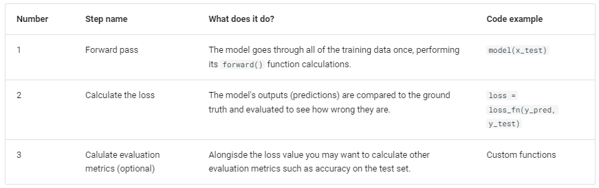
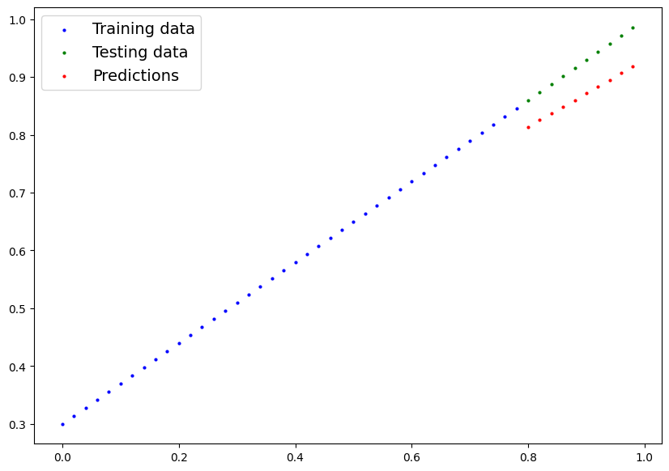
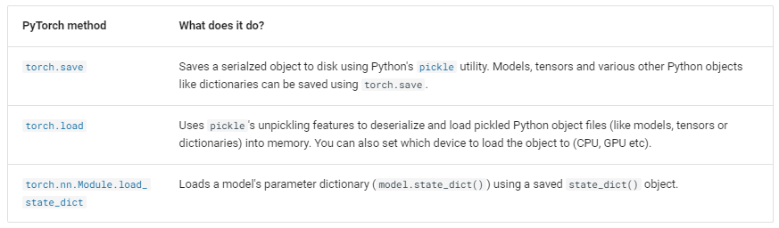

### Pytorch Workflow



1. row 데이터를 tensor로 바꾸기
2. 데이터 로드
3. 모델 학습
4. 모델 평가
5. 여러 실험을 통해 향상
6. 서비스

```python
import torch
from torch import nn # nn contains all of PyTorch's building blocks for neural networks
import matplotlib.pyplot as plt

plt.ion()
# Check PyTorch version
torch.__version__
```

### 1. 데이터 준비



1. 데이터 생성
    1. $y = weight * X + bias$
    
    ```python
    # Create *known* parameters
    weight = 0.7
    bias = 0.3
    
    # Create data
    start = 0
    end = 1
    step = 0.02
    X = torch.arange(start, end, step).unsqueeze(dim=1)
    y = weight * X + bias
    
    # X : feature, y : target
    X[:5], y[:5]
    ```
    
2. 데이터 분리
    
    

    ```python
    # Create train/test split
    train_split = int(0.8 * len(X)) # 80% of data used for training set, 20% for testing
    X_train, y_train = X[:train_split], y[:train_split]
    X_test, y_test = X[train_split:], y[train_split:]
    
    len(X_train), len(y_train), len(X_test), len(y_test)
    ```
    
3. 데이터 확인 (시각화)
    
    ```python
    def plot_predictions(
        train_data=X_train,
        train_labels=y_train,
        test_data=X_test,
        test_labels=y_test,
        predictions=None):
        """
        Plots training data, test data and compares predictions.
        """
        plt.figure(figsize=(10, 7))
    
        # Plot training data in blue
        plt.scatter(train_data, train_labels, c="b", s=4, label="Training data")
    
        # Plot test data in green
        plt.scatter(test_data, test_labels, c="g", s=4, label="Testing data")
    
        if predictions is not None:
            # Plot the predictions in red (predictions were made on the test data)
            plt.scatter(test_data, predictions, c="r", s=4, label="Predictions")
    
        # Show the legend
        plt.legend(prop={"size": 14});
    
    plot_predictions();
    ```
    
    

### 2. 모델링 정의

1. 모델 정의
    
    

    ```python
    # Create a Linear Regression model class
    # 기본 회귀 모델
    class LinearRegressionModel(nn.Module): # <- almost everything in PyTorch is a nn.Module (think of this as neural network lego blocks)
      def __init__(self):
        super().__init__()
        self.weights = nn.Parameter(torch.randn(1, # <- start with random weights (this will get adjusted as the model learns)
                                                dtype=torch.float), # <- PyTorch loves float32 by default
                                                requires_grad=True) # <- can we update this value with gradient descent?)
    
        self.bias = nn.Parameter(torch.randn(1, # <- start with random bias (this will get adjusted as the model learns)
                                            dtype=torch.float), # <- PyTorch loves float32 by default
                                            requires_grad=True) # <- can we update this value with gradient descent?))
    
      # Forward defines the computation in the model
      def forward(self, x: torch.Tensor) -> torch.Tensor: # <- "x" is the input data (e.g. training/testing features)
        return self.weights * x + self.bias # <- this is the linear regression formula (y = m*x + b)
    ```
    
    ```python
    # Set manual seed since nn.Parameter are randomly initialzied
    torch.manual_seed(42)
    
    # Create an instance of the model (this is a subclass of nn.Module that contains nn.Parameter(s))
    # 모델 선언 (인스턴스를 만들었다)
    model_0 = LinearRegressionModel()
    model_0
    ```
    
    ```python
    # List named parameters
    # 파라미터 확인
    model_0.state_dict()
    ```
    
2. 학습하기 전 모델 예측
    
    ```python
    # Make predictions with model
    # = torch_no_grad와 비슷하다.
    # 학습을 하지 않고 예측만 하기 위해서
    with torch.inference_mode():
        y_preds = model_0(X_test)
    ```
    
    ```python
    # Check the predictions
    print(f"Number of testing samples: {len(X_test)}")
    print(f"Number of predictions made: {len(y_preds)}")
    ```
    
    ```python
    plot_predictions(predictions=y_preds)
    ```
    
    

    - 실제값과 예측값의 차이를 줄이는 방향으로 모델을 학습

### 3. 모델 학습

1. Loss function & Optimizer
    1. Loss function : 실제값과 예측값의 차이를 계산하는 함수
        1. Regression Tasks
            1. nn.MSELoss(Mean Square Error)
            2. nn.L1Loss(Mean Absolute Error)
        2. Binary Classification Tasks
            1. nn.BCELoss
            2. nn.BCEWithLogitsLoss: combines nn.Sigmoid and nn.BCELoss
        3. Multi Classification Tasks
            1. nn.CrossEntropyLoss: combines nn.LogSoftmax and nn.NLLLoss
        
        ```python
        # Create the loss function
        loss_fn = nn.L1Loss() # MAE loss is same as L1Loss >> L2Loss(Mean Squared Error): nn.MSELoss
        # L2는 제곱이기에 같은 상황에서 데이터 양도 많고 더 민감하다.
        # 딥러닝은 loss를 계산하는 것이 모델 내부에 구현이 안되어 있기에 직접 구현 해야한다.
        ```
        
    2. Optimization : 모델이 학습하는 방법
        1. SGD / Adam
        2. batch 때문에 선언해주어야 한다.
        3. 한 번에 학습하기에 데이터 양이 많기 때문에
        
        ```python
        # Create the optimizer
        # 모델 파라미터를 loss에 맞게끔 조절을 한다.
        optimizer = torch.optim.SGD(params=model_0.parameters(), # parameters of target model to optimize
                                    lr=0.01) # learning rate (how much the optimizer should change parameters at each step, higher=more (less stable), lower=less (might take a long time))
        ```
        
2. 학습 (필수 선언 ⇒ 모델 인스턴스, loss function, optimizer)
    1. Training Loop
        1. Foward pass : 모델 학습
        2. Calculate the loss : loss 계산
        3. Zero gradients : Optimization (역전파)
        4. Perform Backpropagation the loss : Optimization (역전파)
        5. Update the optimizer (gradient descent) : Optimization (역전파)
        
        

    2. Testing Loop
        1. Foward pass
        2. Calculate the loss
        
        

    3. 학습 실행 (with 코드)
        
        ```python
        torch.manual_seed(42)
        
        # Set the number of epochs (how many times the model will pass over the training data)
        # train 데이터를 100번 학습
        epochs = 100
        
        # Create empty loss lists to track values
        # 오버피팅 유무 확인하기 위해 loss 저장 리스트
        train_loss_values = []
        test_loss_values = []
        epoch_count = []
        
        for epoch in range(epochs):
            ### Training
        
            # Put model in training mode (this is the default state of a model)
            # 모델 인스턴스에 학습모드
            model_0.train()
        
            # 1. Forward pass on train data using the forward() method inside
            # model_0(X_train) : forward 를 통해 인스턴스 학습
            # y_pred : 인스턴스 학습에 대한 예측 결과
            y_pred = model_0(X_train)
            # print(y_pred)
        
            # 2. Calculate the loss (how different are our models predictions to the ground truth)
            # loss_fn(예측값, 정답)을 이용해서 loss 계산
            loss = loss_fn(y_pred, y_train)
        
            # 3-5 : 역전파 프로세스 (training에서만 사용)
            # 3. Zero grad of the optimizer
            # 기울기 초기화
            optimizer.zero_grad()
        
            # 3-5 : 역전파 프로세스 (training에서만 사용)
            # 4. Loss backwards
            # 역전파
            loss.backward()
        
            # 3-5 : 역전파 프로세스 (training에서만 사용)
            # 5. Progress the optimizer
            optimizer.step()
            # 학습 끝
            
            ### Testing
        
            # Put the model in evaluation mode
            # 모델 인스턴스 평가모드
            model_0.eval()
        
            # 인스턴스(모델)의 파라미터를 고정(no 수정)하는 모드
            # with절 안에 있어야 한다.
            with torch.inference_mode():
              # 1. Forward pass on test data
              # 예측
              test_pred = model_0(X_test)
        
              # 2. Caculate loss on test data
              # loss_fn(예측값, 정답)
              test_loss = loss_fn(test_pred, y_test.type(torch.float)) # predictions come in torch.float datatype, so comparisons need to be done with tensors of the same type
        
              # Print out what's happening
              # 10 단위로 찍는다.
              if epoch % 10 == 0:
                    epoch_count.append(epoch)
                    # train loss에 model에서 빠져나오게 하고 numpy화 한다.
                    train_loss_values.append(loss.detach().numpy())
                    # test loss에 model에서 빠져나오게 하고 numpy화 한다.
                    test_loss_values.append(test_loss.detach().numpy())
                    print(f"Epoch: {epoch} | MAE Train Loss: {loss} | MAE Test Loss: {test_loss} ")
        ```
        

### 4. 모델 평가

```python
# 1. Set the model in evaluation mode
# 모델 평가
model_0.eval()

# 2. Setup the inference mode context manager
with torch.inference_mode():
  # 3. Make sure the calculations are done with the model and data on the same device
  # in our case, we haven't setup device-agnostic code yet so our data and model are
  # on the CPU by default.
  # model_0.to(device)
  # X_test = X_test.to(device)
  y_preds = model_0(X_test)
y_preds[:5]
```

```python
plot_predictions(predictions=y_preds)
```



### 5. 모델 저장

1. save model
    
    

    ```python
    from pathlib import Path
    
    # 1. Create models directory
    MODEL_PATH = Path("models")
    MODEL_PATH.mkdir(parents=True, exist_ok=True) # mkdir: make directory
    
    # 2. Create model save path
    # train = 모델의 파라미터를 찾는다 (weight, bias)
    MODEL_NAME = "01_pytorch_workflow_model_0.pth"
    MODEL_SAVE_PATH = MODEL_PATH / MODEL_NAME
    
    # 3. Save the model state dict
    print(f"Saving model to: {MODEL_SAVE_PATH}")
    torch.save(obj=model_0.state_dict(), # only saving the state_dict() only saves the models learned parameters
                f=MODEL_SAVE_PATH)
    ```
    
2. load model
    1. 학습한 모델 적용
    
    ```python
    # Instantiate a new instance of our model (this will be instantiated with random weights)
    loaded_model_0 = LinearRegressionModel()
    
    # Load the state_dict of our saved model (this will update the new instance of our model with trained weights)
    # 학습한 model을 넣어준다.
    loaded_model_0.load_state_dict(torch.load(f=MODEL_SAVE_PATH))
    ```
    
    ```python
    # 1. Put the loaded model into evaluation mode
    loaded_model_0.eval()
    
    # 2. Use the inference mode context manager to make predictions
    with torch.inference_mode():
        loaded_model_preds = loaded_model_0(X_test) # perform a forward pass on the test data with the loaded model
    ```
