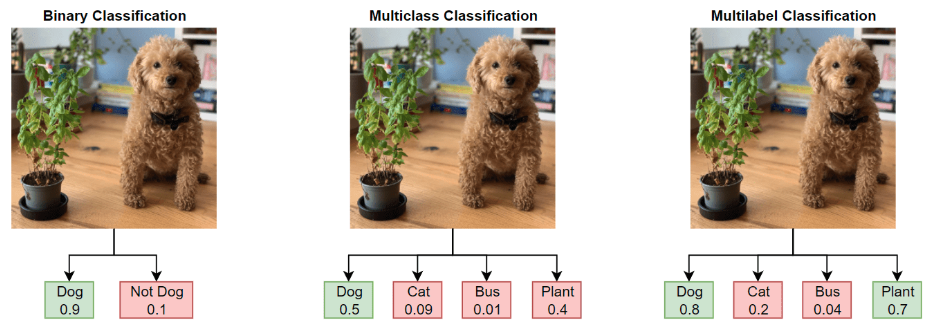
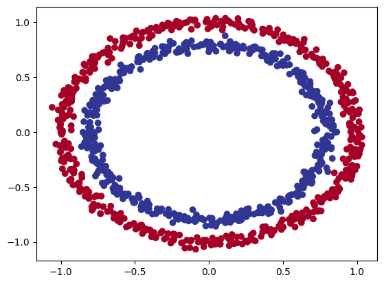
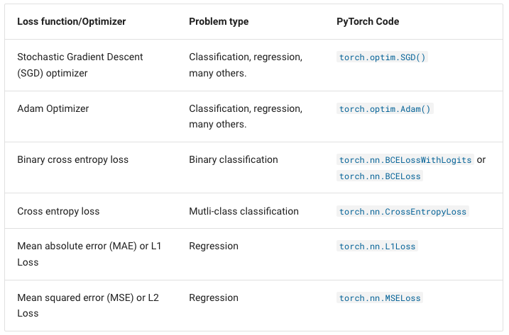
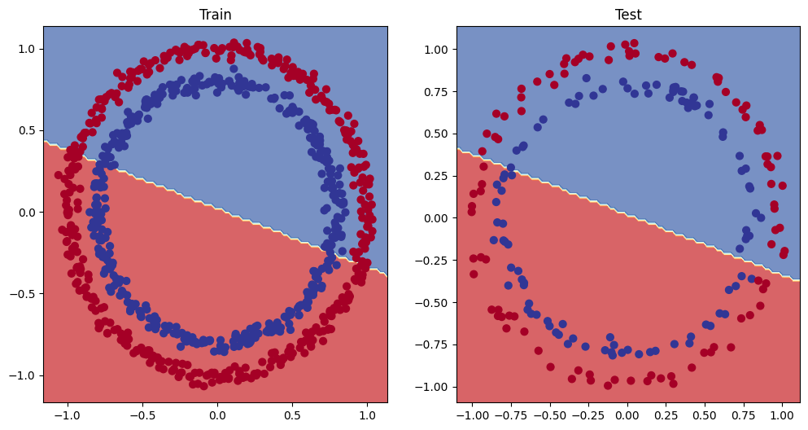
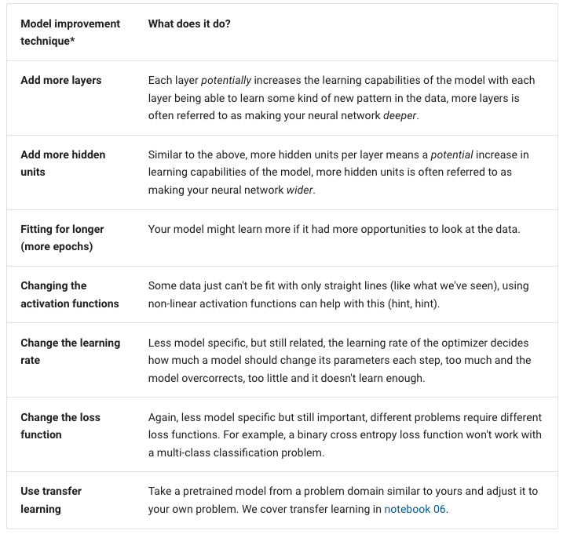
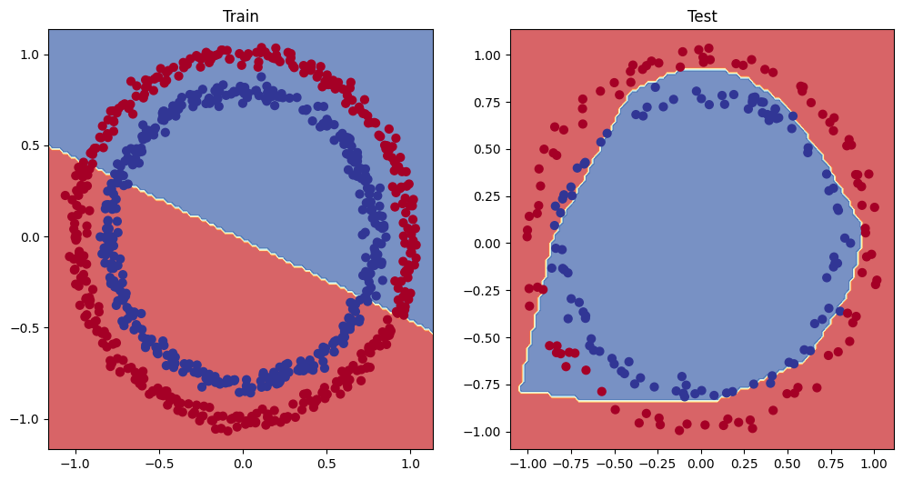

### Neural Network Classification

1. Binary Classification
    1. 단순 이진 분류 (0과 1)
2. Multi class Classification
    1. 다수의 class 중 정답은 1개
3. Multi label Classification
    1. 다수의 class, 다수 정답



- Loss function
    - Regression Tasks
        - nn.MSELoss(Mean Square Error)
        - nn.L1Loss(Mean Absolute Error)
    - Binary Classification Tasks
        - nn.BCELoss : 로스 함수
            - test Loop 할 때, 직접 sigmoid 해야한다.
        - nn.BCEWithLogitsLoss: combines nn.Sigmoid and nn.BCELoss
            - sigmoid 함수가 적용된 것 (이진분류)
            - test Loop 할 때, 유용
    - Multi Classification Tasks
        - nn.CrossEntropyLoss: combines nn.LogSoftmax and nn.NLLLoss
            - 확률로 보기가 좋다. (Softmax)

### Binary Classification

1. 이진 분류 데이터 준비

```python
from sklearn.datasets imports make_circles

n_samples = 1000

# 임의의 데이터 만들자
X, y = make_circles(n_samples, noise=0.03, random_state=42)
X.shape # (1000, 2)
y.shape # (1000, )
```

- DataFrame화

```python
import pandas as pd

# 결과가 0과 1
circles = pd.DataFrame({"X1": X[:, 0], "X2": X[:, 1], "label":y)
```

- labels balabce 확인

```python
circles.label.value_counts()
```

- 데이터 시각화

```python
import matplotlib.pyplot as plt

plt.scatter(x = X[:, 0],
            y = X[:, 1],
            c = y,
            cmap = plt.cm.RdYlBu)
```



- 데이터를 tensor로 변환하고 데이터 분할

```python
import torch
from sklearn.model_selection import train_test_split

# 임시로 python으로 변경
X = torch.from_numpy(X).type(torch.float)
y = torch.from_numpy(y).type(torch.float)

X_train, X_test, y_train, y_test = 
	train_test_split(X, y, test_size = 0.2, random_state = 42)
```

1. Pytorch 분류 모델 구축
    1. 디바이스 통일
        
        ```python
        import torch
        from torch import nn
        
        # 학습환경이 gpu인지 cpu인지 확인
        device = "cuda" if torch.cuda.is_available() else "cpu"
        ```
        
    2. nn.Module 구축
        
        ```python
        class CircleModelV0(nn.Module):
        	def __init__(self):
        		super().__init__()
        		
        		# 시작 데이터: feature shape, 끝 데이터: output shape
        		# 시작 데이터: 2 (feature), 끝 데이터: 1 (target)
        		self.layer_1 = nn.Linear(in_features=2, out_features=5)
        		self.layer_2 = nn.Linear(in_features=5, out_features=1)
        
        	def forward(self, x):
        		layer_1_out = self.layer_1(x)
        		layer_2_out = self.layer_2(layer_1_out)
        		return layer_2_out
        ```
        
        ```python
        # 동일한 환경에서 해야한다.
        model_0 = CircleModelV0().to(device)
        ```
        
        - torch 정보 확인
        
        ```python
        !pip install torchinfo
        
        # 실제 모델이 학습을 할 때 진행되는 프로세스 확인
        import torchinfo
        
        # input, output, parameter 등의 정보
        # summary : 내부에서 forward 함수가 실행되고, forward의 결과를 보여준다.
        # 모델의 순서확인, 모델이 필요한 자원 정보 확인, 모델의 크기 확인 기능
        torchinfo.summary(model_0, (10, 2))
        ```
        
        - https://playground.tensorflow.org/#activation=tanh&batchSize=10&dataset=circle&regDataset=reg-plane&learningRate=0.03&regularizationRate=0&noise=0&networkShape=4,2&seed=0.02491&showTestData=false&discretize=false&percTrainData=50&x=true&y=true&xTimesY=false&xSquared=false&ySquared=false&cosX=false&sinX=false&cosY=false&sinY=false&collectStats=false&problem=classification&initZero=false&hideText=false
    3. 손실함수 및 역전화 정의
        
        

        ```python
        # 이진분류에서 사용하는 Loss Function과 Optimizer
        # torch.nn.BCELoss() / torch.nn.BCEWithLogitsLoss()
        loss_fn = nn.BCEWithLogitsLoss()
        
        # Optimizer 생성
        optimizer = torch.optim.SGD(params = model_0.parameters(), lr=0.1)
        ```
        
        ```python
        def accuracy_fn(y_true, y_pred):
        	# tensor -> python
        	correct = torch.eq(y_true, y_pred).sum().item()
        	# (맞은 갯수 / 전체 갯수) * 100
        	acc = (correct / len(y_pred)) * 100
        	return acc
        ```
        
2. Training Loop a및 학습
    1. Foward pass : 모델 학습
    2. Calculate the loss : loss 계산
    3. Zero gradients : Optimization (역전파)
    4. Perform Backpropagation on the loss : Optimization (역전파)
    5. Step the optimizer (gradient descent) : Optimization (역전파)
    
    ```python
    # 고정값
    torch.manual_seed(42)
    
    # 학습을 100번 실행
    epochs = 100
    
    # 학습을 같은 디바이스에서 진행해야 한다. (train, test)
    X_train, y_train = X_train.to(device), y_train.to(device)
    X_test, y_test = X_test.to(device), y_test.to(device)
    
    # 학습을 epochs이 값 만큼 반복
    for epoch in range(epochs):
    	## Training
    	# 학습 실행
    	model_0.train()
    	# 1. Forward pass
    	# 차원축소: 학습에 맞에 차원을 맞춘다.
    	y_logits = model_0(X_train).squeeze()
    	# model 예측값을 확률값으로 바꾸고 반올림하여 1과 0으로 분리
    	y_pred = torch.round(torch.sigmoid(y_logits))
    
    	# 2. Calulate loss/accuracy
    	# train loss 계산 (예측값, 실제값)
    	loss = loss_fn(y_logits, y_train)
    	# accuract 계산
    	acc = accuracy_fn(y_true = y_train, y_pred = y_pred)
    
    	# 3. Optimizer zero grad
    	# 기울기 초기화: 초기화 안해주면 이미 있는 모델에서 학습을 진행하기 때문에
    	optimizer.zero_grad()
    
    	# 4. Loss backwards
    	# 역전파 -> 안해주면 모델 결과 값이 동일하다.
    	loss.backward()
    
    	# 5. Optimizer step
    	# 해당 점에서 다음으로 넘어가서 학습
    	# 안해주면 계속 동일한 곳에서만 학습하기 때문에 결과가 동일하다
    	optimizer.step()
    
    	## Testing
    	# 모델 예측
    	model_0.eval()
    	# 모델 파라미터를 고정한 상태로 test 해야하기 때문에 with 절 안에서 예측해야 한다.
    	with torch.inference_model():
    		# test 차원축소
    		test_logits = model_0(X_test).squeeze()
    		# test loss 계산
    		test_loss = loss_fn(test_logits, y_test)
    
    		# test 예측값 확률로 변경
    		test_pred = torch.round(torch.sigmoid(test_logits))
    		# test 점수 확인
    		test_acc = accuracy_fn(y_true = y_test, y_pred = test_pred)
    
    	# epoch 10 단위로 결과를 찍는다.
    	if epoch % 10 == 0:
    		print(f"Epoch: {epoch} | Loss: {loss:.5f}, Accuracy: {acc:.2f}% | Test loss: {test_loss:.5f}, Test acc: {test_acc:.2f}%")
    ```
    
3. 예측 및 모델 평가
    
    ```python
    import requests # 웹에서 자료 가져오기 위해
    from pathlib import Path
    
    if Path("helper_functions.py").is_file():
      print("helper_functions.py already exists, skipping download")
    else:
      print("Downloading helper_functions.py")
      # 그림 그리는 모듈
      request = requests.get("https://raw.githubusercontent.com/mrdbourke/pytorch-deep-learning/main/helper_functions.py")
    
      # 파일 만들기
      with open("helper_functions.py", "wb") as f:
        # 받아온 파일을 쓴다.
        f.write(request.content)
    
    # 받아온 파일 사용
    from helper_functions import plot_predictions, plot_decision_boundary
    ```
    
    ```python
    plt.figure(figsize=(12, 6))
    
    plt.subplot(1, 2, 1)
    plt.title("Train")
    plot_decision_boundary(model_0, X_train, y_train)
    
    plt.subplot(1, 2, 2)
    plt.title("Test")
    plot_decision_boundary(model_0, X_test, y_test)
    
    # 선형 모델을 가지고 비선형 모델을 분류하려 하기 때문에 안된 것.
    ```
    
    

    
4. 모델 개선
    - Improving a model
        - under fitting 해결법
            - 모델을 키우자 (모델이 작으면 학습이 잘 안된다.)
                - Add moer layers
                - Add more hidden units
            - epoch 사이즈를 늘려보자
    
    

    
5. 비선형
    1. 선형회귀모델은 비선형을 학습 및 예측할 수 없다.
    2. 모델은 비선형 모델로 설정하자.
    
    ```python
    from torch import nn
    
    class CircleModelV2(nn.Module):
        def __init__(self):
            super().__init__()
            self.layer_1 = nn.Linear(in_features=2, out_features=10)
            self.layer_2 = nn.Linear(in_features=10, out_features=10)
            self.layer_3 = nn.Linear(in_features=10, out_features=1)
            
            self.relu = nn.ReLU()
    
        def forward(self, x):      
          out = self.layer_1(x)    # 선형 모델 학습
          out = self.relu(out)     # Activate Function 적용 (비선형)
    
          out = self.layer_2(out)  # 선형 모델 학습
          out = self.relu(out)     # Activate Function 적용 (비선형)
    
          out = self.layer_3(out)  # 선형 모델 학습
          return out
          # return self.layer_3(self.relu(self.layer_2(self.relu(self.layer_1(x)))))
    ```
    
    
    

### Multi-class classification

1. datasets 가져오기
    
    ```python
    from torchvision import datasets
    from torchvision.transforms import ToTensor
    
    # training datasets
    train_data = datasets.FashionMNIST(
    	root = "data",
    	train = True,
    	download = True,
    	transform = ToTensor(),
    	target_transform = None
    )
    
    # testing datasets
    test_data = datasets.FashionMNIST(
    	root = "data"
    	train = False,
    	download = True,
    	transform = ToTensor()
    )
    ```
    
    ```python
    # [color_channels=1, height=28, width=28]
    # 첫번째 : 컬러 (1 = 흑백, 3 = 컬러), 두번째 : 높이, 세번째 : 너비
    train_data[0].shape
    ```
    
    - Check out data
    
    ```python
    len(train_data.data), len(train_data.targets), len(test_data.data), len(test_data.targets)
    ```
    
2. Data Loader
    1. train, test 데이터를 배치 사이즈로 분리
    
    ```python
    from torch.utils.data import DataLoader
    
    # 데이터를 배치 사이즈로 분리 -> DataLoader
    BATCH_SIZE = 32
    
    # training datasets
    train_dataloader = DataLoader(train_data,
    															batch_size=BATCH_SIZE,
    															shuffle = True)
    # testing datasets
    test_dataloader = DataLoader(test_data,
    														 batch_size=BATCH_SIZE,
    														 shuffle = True)
    ```
    
    - Check out data
    
    ```python
    train_features_batch, train_labels_batch = next(iter(train_dataloader))
    
    # 중요!! => shape: [batch_size=32, color_channels=1,height=28, width=28]
    # shape : [batch_size, feature_size]
    # label은 0차원이었다. => +1 해서 1D가 되었다. (+ batch_size)
    train_features_batch.shape, train_labels_batch.shape
    ```
    
3. Model
    
    ```python
    from torch import nn
    
    class MultiClassModel(nn.Module):
      def __init__(self, input_shape: int, hidden_units: int, output_shape: int):
        super().__init__()
        # 선형은 input이 1D이다. -> 차원을 맞춰주기 위해 Flatten() 사용
        self.layer_stack = nn.Sequential(
            # input shape : (32, 1, 28, 28) [batch_size=32, color_channels=1,height=28, width=28]
            # output shape : (32, 784) [batch_size=32, hidden_layer=784]
            nn.Flatten(), # batch_size는 그대로 두고, 나머지 차원 데이터는 곱하라.
            # input shape : (32, 784) [batch_size=32, hidden_layer=784]
            # output shape : (32, 10) [batch_size=32, hidden_layer=n]
            nn.Linear(in_features=input_shape, out_features=hidden_units), 
            nn.ReLU(),
            # input shape : (32, 10) [batch_size=32, hidden_layer=n]
            # output shape : (32, 10) [batch_size=32, hidden_layer=n]
            nn.Linear(in_features=hidden_units, out_features=hidden_units),
            nn.ReLU(),
            # input shape : (32, 10) [batch_size=32, hidden_layer=n]
            # output shape : (32,, 10) [batch_size=32, target_size=10]
            nn.Linear(in_features=hidden_units, out_features=output_shape)
        )
    
      # DataLoader를 통해서 나온 feature 데이터
      def forward(self, x): # shape : [batch_size=32, color_channels=1,height=28, width=28]
        # input shape : (32, 1, 28, 28) [batch_size=32, color_channels=1,height=28, width=28]
        # output shape : (32, 10) [batch_size=32, target_size=10]
        return self.layer_stack(x)
    ```
    
    ```python
    multi_class_model = MultiClassModel(input_shape=784,
    																	  hidden_units=10,
    																	  output_shape=len(class_names))
    
    multi_class_model.to(device)
    ```
    
    - torchinfo
    
    ```python
    torchinfo.summary(multi_class_model # 모델
                      , (32, 1, 28, 28) # input_shape
                      , col_names=["input_size", "output_size", "num_params"]
                      , col_width=20) # [batch_size, color_channels, height, width]
    ```
    
4. Training
    
    ```python
    loss_fn = nn.CrossEntropyLoss()
    optimizer = torch.optim.SGD(params = multi_class_model.parameters(), ir=0.1)
    ```
    
    ```python
    # 진행률을 시각화 해주는 module
    from tqdm.auto import tqdm
    
    # 학습 반복할 수
    epochs = 3
    
    # 학습 프로세스
    # epochs 수만큼 반복
    for epoch in tqdm(range(epochs)):
    	print(f"Epoch: {epoch}\n-------")
    	
    	## Training Loop
    	# epoch마다의 loss 값을 알기 위해 train_loss 변수 선언 및 초기화
    	train_loss = 0
    
    	# enumerate를 통해 train 데이터를 하나찍 뽑아온다. (인덱스, item 값)
    	# 인덱스 = batch_size, item = (X,y)
    	# train이 총 60000개 중 배치가 32이므로 for문은 1875번 반복
    	for batch, (X,y_ in enumerate(train_dataloader):
    		# 모델 학습모드로 들어간다.
    		multi_class_model.train()
    
    		# 1. Forward pass
    		# 모델에 train 데이터를 넣어 train 예측값을 뽑아온다.
    		y_pred = multi_class_model(X)
    
    		# 2. Calculate loss
    		# train loss 값을 loss function을 통해 얻어낸다.
    		loss = loss_fn(y_pred, y)
    		# train loss 값들을 더한다.
    		train_loss += loss
    
    		# 3. Optimizer zero grad
    		# 기울기 초기화: 기존 모델을 기준으로 학습을 하기 때문에
    		optimizer.zero_grad()
    
    		# 4. Loss Backward
    		# 역전화: 최고의 학습 파라미터를 찾기위해 역으로 확인
    		loss.backward()
    
    		# 5. Optimizer step
    		# 학습을 다음 단계로 이동한다.
    		optimizer.step()
    
    		# 400마다 학습 진행 정보를 출력
    		if batch % 400 == 0
    			print(f"Looked at {batch * len(X)}/{len(train_dataloader.dataset)} samples")
    
    	train_loss /= len(train_dataloader)
    
    	## Testing dataset
    	# test_loss, test_acc 변수 선언 및 초기화
    	test_loss, test_acc = 0, 0
    	# 만든 모델을 예측하기 위해 모델 예측 모드로 들어간다.
    	multi_class_model.eval()
    	# 모델 파라미터를 고정하기 위해 with 안에서 평가 실행
    	with torch.inference_mode():
    		# test 데이터를 하나씩 뽑아온다.
    		for X,y in test_dataloader:
    			# 1. Forward pass
    			# 모델 test 데이터를 넣어 test 예측값을 뽑아온다.	
    			test_pred = multi_class_model(X)
    
    			# 2. Calculate loss
    			# test loss 값을 loss function을 통해 얻어낸다. (예측값, 실제값)
    			# test loss 값들을 더한다.
    			test_loss += loss_fn(test_pred, y)
    
    			# 3. Calculate accuracy (preds need to be same as y_true)
          # accuracy(정확도) 값을 얻어낸다.(맞춘 것 / 전체)
          # y_true: 실제값, y_pred: 예측값
          # argmax: tensor에서 최대값을 가지는 요소의 인덱스 반환
          # dim=0 : batch_size, dim=1: test_pred의 값
          # test_pred가 가장 높은 값을 반환
          # test_acc += accuracy_fn(y_true=y, y_pred=test_pred.argmax(dim=1))
          test_acc += accuracy_fn(y_true=y, y_pred=torch.softmax(test_pred, dim=1).argmax(dim=1))
          # 큰차이는 없지만 더 정확하다.
    
        # test loss 값을 test 전체데이터로 나누고 test_loss 변수에 update (평균값)
        test_loss /= len(test_dataloader)
    
        # test accuracy 값을 test 전체 데이터로 나누고 test_acc 변수에 update (평균값)
        test_acc /= len(test_dataloader)
    
    # 최종 train loss와 test loss, test acc의 값을 출력한다.
    print(f"\nTrain loss: {train_loss:.5f} | Test loss: {test_loss:.5f}, Test acc: {test_acc:.2f}%\n")
    ```
    
5. Predictions
    
    ```python
    # 예측하는 함수
    # input parameter
      # 학습된 모델
      # 예측할 데이터 리스트
      # 디바이스: 모델이 학습된 디바이스
    # output parameter
      # return 예측 확률 값들
    def make_predictions(model: torch.nn.Module, data: list, device: torch.device = device):
        # 예측한 확률 값을 저장할 리스트 생성 및 초기화
        pred_probs = []
        # 모델 예측 모드
        model.eval()
        # 평가할 때 파라미터를 고정시키기 위해 with 선언
        # 예측 데이터를 모델이 학습하지 못하게 막는다.
        with torch.inference_mode():
            # 예측할 list 루프를 돈다.
            for sample in data: # sample -> (컬러, 높이, 너비) -> (1, 28, 28)
                # Prepare sample
                # 모델을 학습할 때는 0 번째는 차원 무조건 batch 차원
                # sample 데이터를 차원을 늘린다. (1인 차원 생성) (unsqueeze())
                # model에서 사용되는 차원은 맞춰주기 위해 차원을 늘린다. 0번째에
                # 차원 변경 후, 모델과 같은 디바이스로 옮겨준다.
                sample = torch.unsqueeze(sample, dim=0).to(device) # Add an extra dimension and send sample to device
    
                # Forward pass (model outputs raw logit)
                # sample을 학습한 model을 통해 예측한다.
                # sample -> (batch(=1), color(=1), height(=28), width(=28))
                # pred_logit -> (batch(=1), preds(=10))
                pred_logit = model(sample)
    
                # Get prediction probability (logit -> prediction probability)
                # 예측한 값을 차원축소(squeeze) 하여 각 수치를 확률화(softmax) 시킨다.
                # 예측을 다 했으니 다시 치원을 축소해준다. (squeeze())
                # pred_logit.squeeze() -> (preds(=10))
                # torch.softmax(dim=0) -> preds가 0번째 차원에 있음.
                # pred_prob -> (pred_probs(=10))
                pred_prob = torch.softmax(pred_logit.squeeze(), dim=0)
    
                # Get pred_prob off GPU for further calculations
                # python은 기본적으로 cpu에서만 연산이 가능
                # 그래서 python에 적용하려면, 무조건 cpu로 옮겨야 한다.
                # pred_prob.cpu() -> pred_prob 값이 무조건 cpu로 옮겨짐
                # 결과 리스트에 예측 확률값을 저장한다.
                pred_probs.append(pred_prob.cpu())
    
        # Stack the pred_probs to turn list into a tensor
        # pred_probs -> 현재 python 리스트이다.
        # torch.stack() -> pytorch로 형 변환
        return torch.stack(pred_probs)
    ```
    
    - Confusion Matrix
    
    ```python
    # Import tqdm for progress bar
    from tqdm.auto import tqdm
    
    # 1. Make predictions with trained model
    y_preds = []
    multi_class_model.eval()
    with torch.inference_mode():
      for X, y in tqdm(test_dataloader, desc="Making predictions"):
        # Send data and targets to target device
        X, y = X.to(device), y.to(device)
        # Do the forward pass
        y_logit = multi_class_model(X)
        # Turn predictions from logits -> prediction probabilities -> predictions labels
        y_pred = torch.softmax(y_logit, dim=1).argmax(dim=1)
        # Put predictions on CPU for evaluation
        y_preds.append(y_pred.cpu())
    # Concatenate list of predictions into a tensor
    y_pred_tensor = torch.cat(y_preds)
    ```
    
- 데이터 전처리, 모델 평가(loss 계산)가 제일 중요
- Optimizer : 모델 파라미터를 업데이트 (최고의 파라미터 찾기)
- f1 score, acu가 더 좋다. accuracy안좋다
