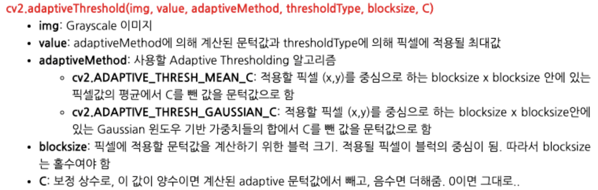
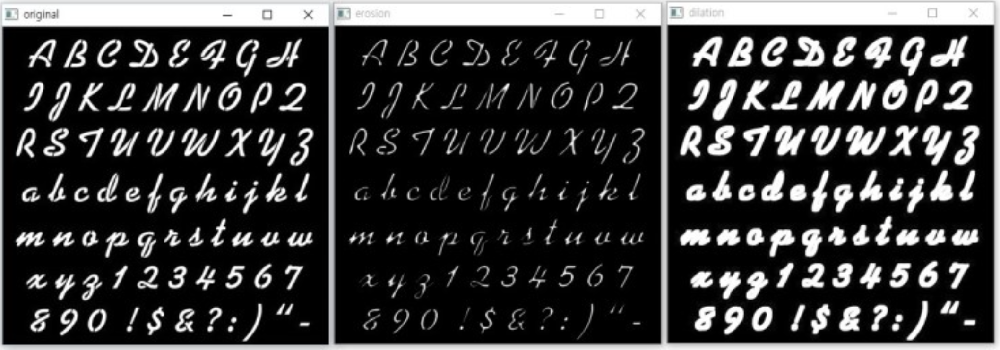
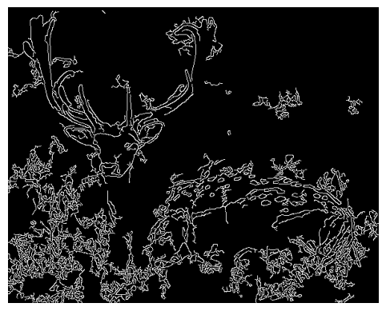

### Install OpenCV

```python
!pip install opencv_python
```

### Read Image

```python
import cv2
import numpy as np
import matplotlib.pyplot as plt

plt.ion();
# interactive mode
# 그래프가 생성되고 업데이트 될 때마다 화면이 실시한으로 갱신된다.
# 데이터를 실시간으로 모니터링하거나 그래프를 동적으로 변경하고 싶을 때 유용
```

- 컬러 이미지 읽기

```python
image_BGR = cv2.imread({이미지 경로}, cv2.IMREAD_COLOR)
print(f"{image_BGR.shape}")
# cv2.imread는 BGR로 불러오므로 plt를 이용하려면 RGB로 바꾸어야함.
img_RGB = cv2.cvtColor(image_BGR, cv2.COLOR_BGR2RGB)

plt.imshow(image_RGB)
plt.axis("off")
plt.show()
```

- 흑백 이미지 읽기

```python
# cv2.IMREAD_GRAYSCALE
image_gray = cv2.imread({이미지경로}, cv2.IMREAD_GRAYSCALE)

plt.imshow(image_gray, cmap="gray")
plt.axis("off")
plt.show()
```

### 이미지 저장

```python
# imwrite : 이미지 저장
cv2.imwrite({이미지경로}, image_gray
```

### Resizing

- 사이즈 변경

```python
image_BGR = cv2.imread({이미지경로}, cv2.IMREAD_COLOR)
img_RGB = cv2.cvtColor(image_BGR, cv2.COLOR_BGR2RGB)

# shape (height, width, color)
img_RGB.shape

# height, width 뽑기
height, width = img_RGB[:2]

# resize
img_resize = cv2.resize(img_RGB, (int(width/4), int(height/4)), interpolation = cv2.INTER_CUBIC)
```

### Cropping

- 특정 부분 자르기
- Matrix 입장에서는 특정 부분 슬라이싱

```python
image_BGR = cv2.imread({이미지경로}, cv2.IMREAD_COLOR)
img_RGB = cv2.cvtColor(image_BGR, cv2.COLOR_BGR2RGB)
height, width = img_RGB[:2]

# crop
# height, width
cropped_image = img_RGB[80:280, 150:300]
```

### Rotating

- center를 기준으로 돌린다.

```python
image_BGR = cv2.imread({이미지경로}, cv2.IMREAD_COLOR)
img_RGB = cv2.cvtColor(image_BGR, cv2.COLOR_BGR2RGB)

height, width = img_RGB[:2]
center = (width/2, height/2)

rotate_matrix = cv2.getRotationMatrix2D(center=center, angle=45, scale=1)
rotate_image = cv2.warpAffine(src-img_RGB, M=rotate_matrix, dsize=(width, height))
```

```python
rotate_matrix = cv2.getRotationMatrix2D(center=(589,0), angle=45, scale=1)
rotated_image = cv2.warpAffine(src=img_RGB, M=rotate_matrix, dsize=(width, height))
```

### Thresholding

- 특정수치를 기준으로 작으면 0 (검정), 크면 255 (흰색)



- ADAPTIVE_THRESH_MEAN_C
    - 평균 기준
        
        ```python
        image_gray = cv2.imread({이미지경로}, cv2.IMREAD_GRAYSCALE)
        image_thr1 = cv2.adaptiveThreshold(image_gray, 255, cv2.ADAPTIVE_THRESH_MEAN_C, cv2.THRESH_BINARY, 11, 2)
        ```
        
- ADAPTIVE_THRESH_GAUSSIAN_C
    - 정규분포를 통해 평균 기준
        
        ```python
        image_gray = cv2.imread({이미지경로}, cv2.IMREAD_GRAYSCALE)
        image_thr2 = cv2.adaptiveThreshold(image_gray, 255, cv2.ADAPTIVE_THRESH_GAUSSIAN_C, cv2.THRESH_BINARY, 11, 2)
        ```
        

### Bluring

- 윤곽선 흐리게
- cv.blur(img, (val, val))
    - (val, val) : 필터 커널 사이즈, 두 값이 달라도 무관

```python
image_BGR = cv2.imread({이미지경로}, cv2.IMREAD_COLOR)
img_RGB = cv2.cvtColor(image_BGR, cv2.COLOR_BGR2RGB)

val = 21
img_blur = cv2.blur(img_RGB, (val, val))
```

- cv.GaussianBlur(img, (val, val), 0)
    - val : 양의 홀수이어야 함.

```python
image_BGR = cv2.imread({이미지경로}, cv2.IMREAD_COLOR)
img_RGB = cv2.cvtColor(image_BGR, cv2.COLOR_BGR2RGB)

val = 21
img_blur = cv2.GaussianBlur(img_RGB, (val, val), 0)
```

- cv2.medianBlur(img, val)
    - val x val 크기의 박스 내에 있는 모든 픽셀들의 median 값을 취해서 중앙에 있는 픽셀에 적용

```python
image_BGR = cv2.imread({이미지경로}, cv2.IMREAD_COLOR)
img_RGB = cv2.cvtColor(image_BGR, cv2.COLOR_BGR2RGB)

val = 21
img_blur = cv2.medianBlur(img_RGB, val)
```

### Erosion, Delation

- Erosion : 이미지 침식
    - cv2.erode(img, kernel, iterations=1)
- Dilation : 이미지 팽창
    - cv2.dilate(img, kernel, iterations=1)



```python
image_gray = cv2.imread({이미지경로}, cv2.IMREAD_GRAYSCALE)

# 커널 생성
# 커널사이즈를 통해서 이미지 전처리
kernel = np.ones((3,3), np.uint8)

# Erosion
# iteration = Erosion 반복 횟수
image_erosion = cv2.erode(image_gray, kernel, iterations=1)

# Erosion
# iteration = dilate 반복 횟수
image_dilate = cv2.dilate(image_gray, kernel, iterations=1)
```

### Edge

- 가장자리 선 따기
- cv2.Canny(img, minimum thresholding value, maximum thresholding value)

```python
image_gray = cv2.imread(args.default_path+"deer.jpg", cv2.IMREAD_GRAYSCALE)

# 50보다 작으면 0(검정), 300보다 크면 255(흰색)
image_edge1 = cv2.Canny(image_gray, 50, 300)
```

- 가우시안 필터 적용
    - 이미지에 노이즈가 있으면 edge를 제대로 찾는 것이 어려움
    - 가우시안 필터로 노이즈 줄여주고, edge 사용.
    - 가우시안 블러 : 각각의 pixel의 크기를 줄여준다. => 노이즈 제거
    - Edge : 각각의 pixel의 크기를 크게한다.
    
    코드텍스트
    

```python
val = 5

image_gray_blur = cv2.GaussianBlur(image_gray, (val, val), 0)
image_edge1 = cv2.Canny(image_gray_blur, 50, 300)
```



<aside>
💡 Reference

</aside>

- https://www.geeksforgeeks.org/opencv-python-tutorial/?ref=lbp
