### 이미지 처리
- 영상 = 이미지의 연속
- 컬러 = 3차원의 이미지 ⇒ 3개의 matrix로 이루어져 있다.
    - (color, height, width)
    - 흑백 : (1, 28, 28)
    - 컬러 : (3, ?, ?)
- pixel이 모여 Matrix
- 숫자 Matrix가 모이면 컬러
- 학습을 쉽게 할 수 있도록 이미지 처리

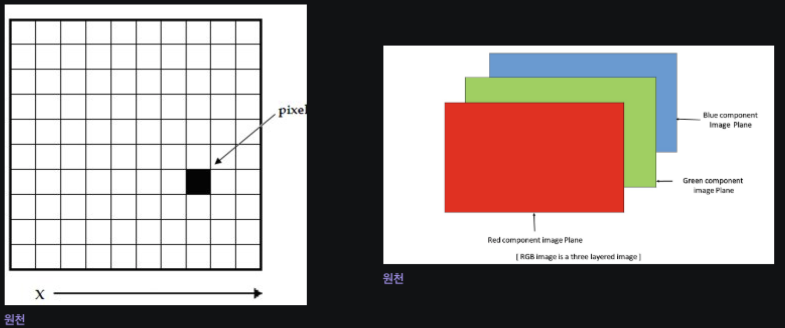

1. Morphological Image Processing (형태학적 이미지 처리)
    1. 숫자가 작다 : 검정, 숫자가 크다 : 흰색
    2. 기준치 숫자보다 작으면 검정, 크면 흰색
    3. Dilation (확장) : pixel 숫자를 크게 한다. (검은색을 흰색으로)
    4. Erosion (침식) : pixel 숫자를 작게 한다. (흰색을 검은색으로)
    
    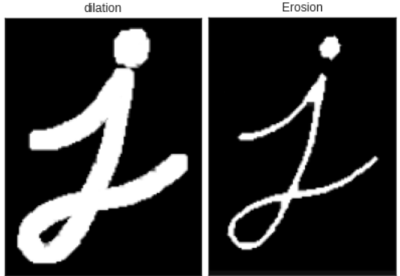

2. Gaussian Image Processing (가우시안 이미지 처리)
    1. 가우시안 : 정규분포 만든 사람
    2. 가운데 부분만 pixel 작업을 한다.
    3. 원본데이터를 유지하면서 윤곽을 흐리게 한다. (블러)
    
    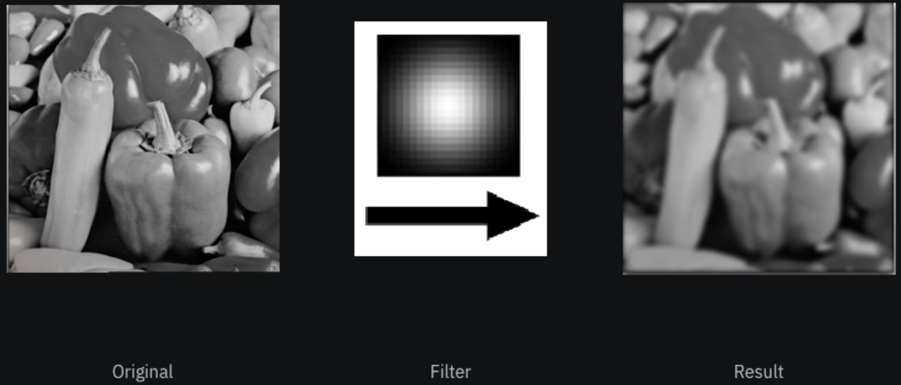

3. Edge Detection in image processing (가장자리 검출 처리)
    1. 특정 값을 기준으로 삭제, 확장
    2. 윤곽선을 뽑아낼 수 있다.
    3. pixel의 주변의 pixel 값이 차이가 생기면 경계선으로 인식을 해서 테두리 검출

### 신경망을 이용한 이미지 처리

**CNN (Convolutional Neural Network)**

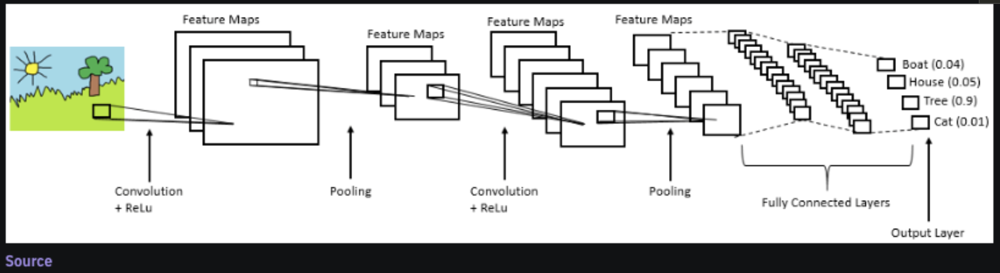

### Image Augmentation

1. Pad
    1. 원본 이미지 안에 검정색 테두리
    
    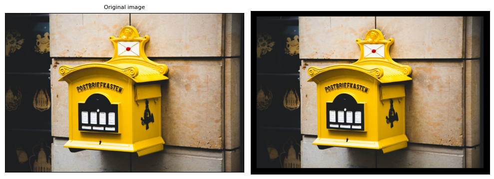

    ```python
    # T -> torchvision의 이미지 전처리 모듈
    # T.pad() -> torchvision의 Padding 이미지 전처리 하는 함수
    # T.Pad(padding=50) -> padding의 두께 설정
    
    # padded_imgs = [T.Pad(padding=padding)(orig_img) for padding in (3, 10, 30, 50)]
    padded_imgs = [T.Pad(padding=150)(orig_img)]
    plot(padded_imgs)
    ```
    
2. Resize
    1. 이미지 크기 변경
    2. 데이터를 drop 한다. ⇒ pixel이 깨진다.
    
    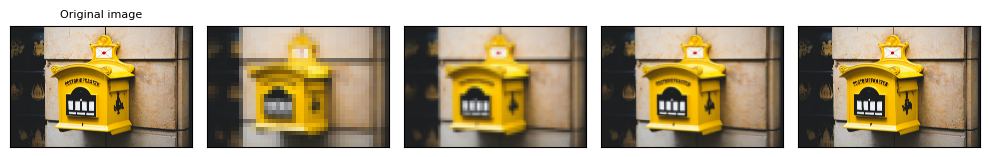
    
    ```python
    resized_imgs = [T.Resize(size=size)(orig_img) for size in (30, 50, 100, orig_img.size[0])]
    plot(resized_imgs)
    ```
    
3. CenterCrop
    1. 센터를 기준으로 랜덤으로 자른다.
    
    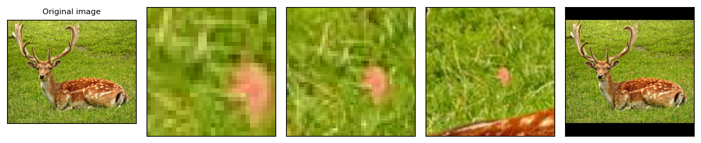

    ```python
    center_crops = [T.CenterCrop(size=size)(orig_img) for size in (30, 50, 100, orig_img.size[0])]
    plot(center_crㅔㅅops)
    ```
    
4. FiveCrop
    1. 랜덤하게 5개를 자른다.
    
    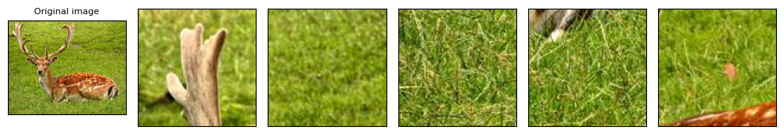

    ```python
    (top_left, top_right, bottom_left, bottom_right, center) = T.FiveCrop(size=(100, 100))(orig_img)
    plot([top_left, top_right, bottom_left, bottom_right, center])
    ```
    
5. Grayscale
    1. 흑백처리 ⇒ color 차원이 1
    
    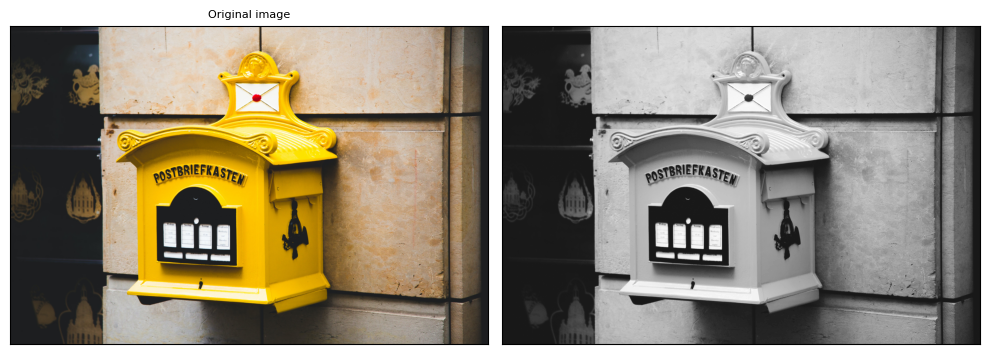

    ```python
    gray_img = T.Grayscale()(orig_img)
    plot([gray_img], cmap='gray')
    ```
    
6. Random transforms : 색상을 랜덤하게 조정
    1. Color Jitter
        1. 색상 조절
        
        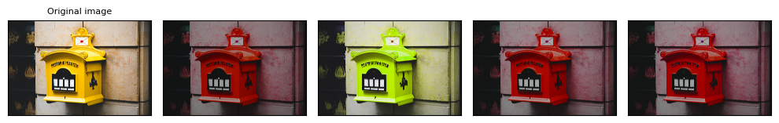

        ```python
        jitter = T.ColorJitter(brightness=.5, hue=.3)
        jitted_imgs = [jitter(orig_img) for _ in range(4)]
        plot(jitted_imgs)
        ```
        
    2. GaussianBlur
        1. 흐리게, 블러처리 한다.
        
        ```python
        blurrer = T.GaussianBlur(kernel_size=(5, 9), sigma=(0.1, 5))
        blurred_imgs = [blurrer(orig_img) for _ in range(4)]
        plot(blurred_imgs)
        ```
        
    3. RandomPerspective
        1. 랜덤으로 휘어지게 한다.
        
        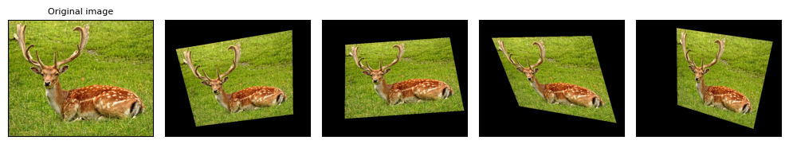
        
        ```python
        perspective_transformer = T.RandomPerspective(distortion_scale=0.6, p=1.0)
        perspective_imgs = [perspective_transformer(orig_img) for _ in range(4)]
        plot(perspective_imgs)
        ```
        
    4. RandomRotation
        1. 랜덤으로 회전
        
        ```python
        rotater = T.RandomRotation(degrees=(0, 180))
        rotated_imgs = [rotater(orig_img) for _ in range(4)]
        plot(rotated_imgs)
        ```
        
    5. RandomAffine
        1. 랜덤으로 위치와 거리뿐만 아니라 거리감
        
        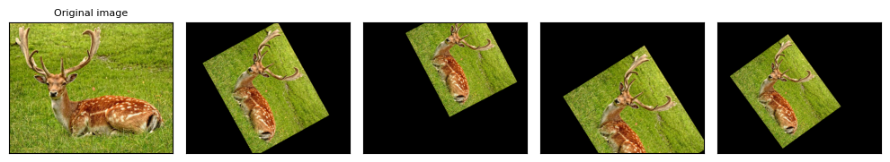

        ```python
        affine_transfomer = T.RandomAffine(degrees=(30, 70), translate=(0.1, 0.3), scale=(0.5, 0.75))
        affine_imgs = [affine_transfomer(orig_img) for _ in range(4)]
        plot(affine_imgs)
        ```
        
    6. ElasticTransform
        1. 물결치는 현상
        
        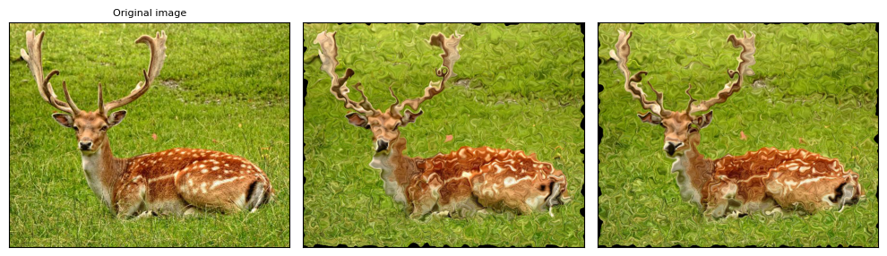

        ```python
        elastic_transformer = T.ElasticTransform(alpha=250.0)
        transformed_imgs = [elastic_transformer(orig_img) for _ in range(2)]
        plot(transformed_imgs)
        ```
        
    7. RandomCrop
        1. 램럼으로 자르기
        
        ```python
        cropper = T.RandomCrop(size=(128, 128))
        crops = [cropper(orig_img) for _ in range(4)]
        plot(crops)
        ```
        
    8. RandomResizeCrop
        1. 랜덤으로 크기로 자른다.
        
        ```python
        resize_cropper = T.RandomResizedCrop(size=(32, 32))
        resized_crops = [resize_cropper(orig_img) for _ in range(4)]
        plot(resized_crops)
        ```
        
    9. RandomInvert
  
        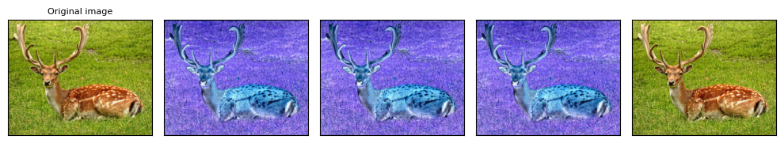       
        
        ```python
        inverter = T.RandomInvert()
        invertered_imgs = [inverter(orig_img) for _ in range(4)]
        plot(invertered_imgs)
        ```
        
    10. RandomPosterize
        
        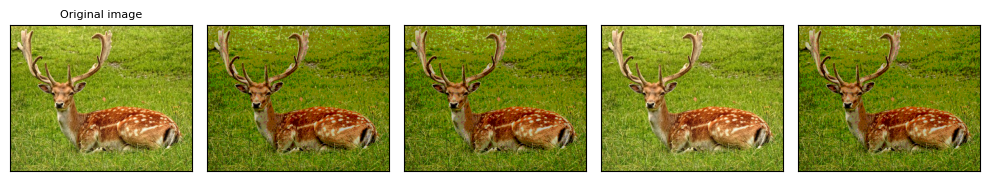

        ```python
        posterizer = T.RandomPosterize(bits=2)
        posterized_imgs = [posterizer(orig_img) for _ in range(4)]
        plot(posterized_imgs)
        ```
        
    11. RandomSolarize
        
        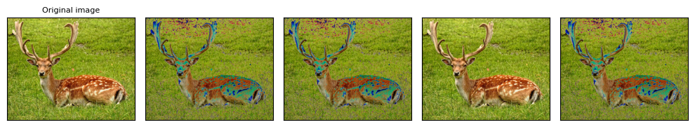

        ```python
        solarizer = T.RandomSolarize(threshold=192.0)
        solarized_imgs = [solarizer(orig_img) for _ in range(4)]
        plot(solarized_imgs)
        ```
        
    12. RandomAdjustSharpness
        
        ```python
        sharpness_adjuster = T.RandomAdjustSharpness(sharpness_factor=2)
        sharpened_imgs = [sharpness_adjuster(orig_img) for _ in range(4)]
        plot(sharpened_imgs)
        ```
        
    13. RandomAutocontrast
        
        ```python
        autocontraster = T.RandomAutocontrast()
        autocontrasted_imgs = [autocontraster(orig_img) for _ in range(4)]
        plot(autocontrasted_imgs)
        ```
        
    14. RandomEqualize
        1. 컬러 조작
        
        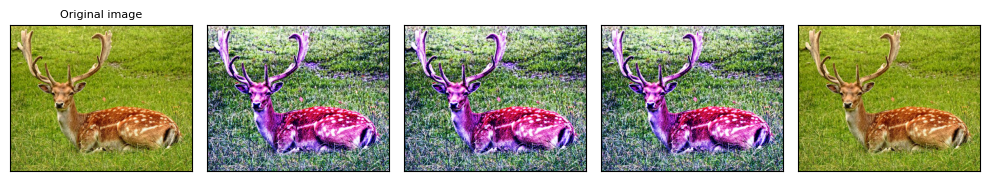

        ```python
        equalizer = T.RandomEqualize()
        equalized_imgs = [equalizer(orig_img) for _ in range(4)]
        plot(equalized_imgs)
        ```
        
    15. AutoAugment
        
        ```python
        policies = [T.AutoAugmentPolicy.CIFAR10, T.AutoAugmentPolicy.IMAGENET, T.AutoAugmentPolicy.SVHN]
        augmenters = [T.AutoAugment(policy) for policy in policies]
        imgs = [
            [augmenter(orig_img) for _ in range(4)]
            for augmenter in augmenters
        ]
        row_title = [str(policy).split('.')[-1] for policy in policies]
        plot(imgs, row_title=row_title)
        ```
        
    16. RandAugment
        
        ```python
        augmenter = T.RandAugment()
        imgs = [augmenter(orig_img) for _ in range(4)]
        plot(imgs)
        ```
        
    17. TrivialAugmentWide
        
        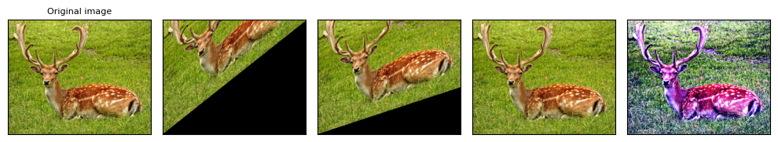

        ```python
        augmenter = T.TrivialAugmentWide()
        imgs = [augmenter(orig_img) for _ in range(4)]
        plot(imgs)
        ```
        
    18. AugMix
        
        ```python
        augmenter = T.AugMix()
        imgs = [augmenter(orig_img) for _ in range(4)]
        plot(imgs)
        ```
        
7. Randomly-applied transforms
    1. RandomHorizontalFlip
        1. 랜덤 이미지 반전 (좌우)
        
        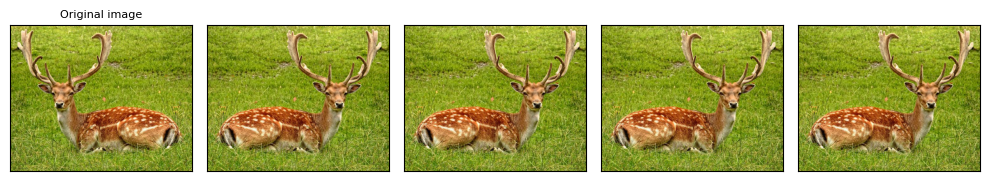

        ```python
        hflipper = T.RandomHorizontalFlip(p=0.5)
        transformed_imgs = [hflipper(orig_img) for _ in range(4)]
        plot(transformed_imgs)
        ```
        
    2. RandomVerticalFlip
        1. 랜덤 이미지 반전 (상하)
        
        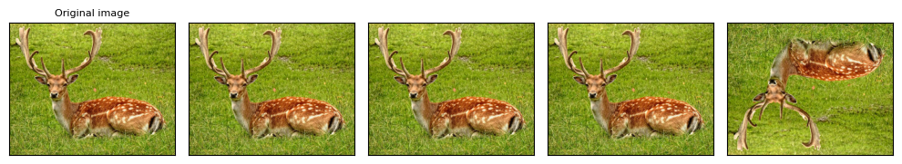

        ```python
        vflipper = T.RandomVerticalFlip(p=0.5)
        transformed_imgs = [vflipper(orig_img) for _ in range(4)]
        plot(transformed_imgs)
        ```
        
    3. RandomApply
        1. 랜덤 적용
        
        ```python
        applier = T.RandomApply(transforms=[T.RandomCrop(size=(64, 64))], p=0.5)
        transformed_imgs = [applier(orig_img) for _ in range(4)]
        plot(transformed_imgs)
        ```
        

⭐ 딥러닝은 오버피팅을 줄이는 방향으로 전처리

<aside>
💡 Reference

</aside>

- https://neptune.ai/blog/image-processing-python
