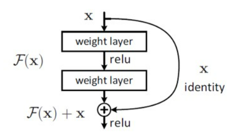
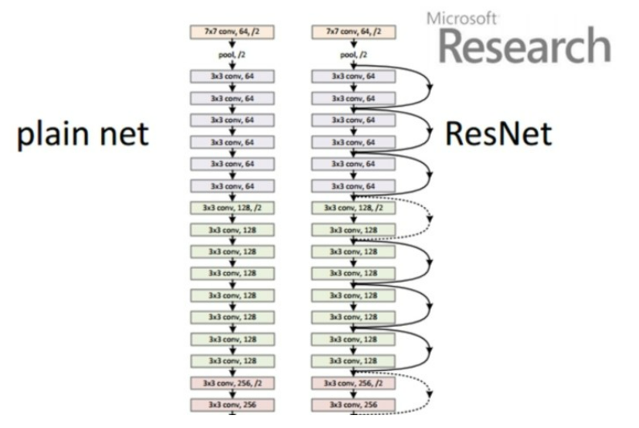

- VGG
    - Layer가 많을수록 Error가 감소할 것이라고 생각했다.
    - 하지만 모델이 클수록 성능이 떻어지는 것을 발견
    - 모델이 더 어려워져서 score가 낮아지는 것이다.

### ResNet

- VGG 단점 보안
    - 모델 학습 난이도를 줄이고 Layer를 늘려보자.
    - 하나의 Layer가 끝날 때마다 input data(x)를 더해준다.
    
- BasicBlock



- ResNet은 BasicBlock이 여러개 반복



### ResNet Code

- Model

```python
import torch.nn.functional as F
```

```python
class BasicBlock(nn.Module):
    expansion = 1

    def __init__(self, in_planes, planes, stride=1):
        super().__init__()
        self.conv1 = nn.Conv2d(
            in_planes, planes, kernel_size=3, stride=stride, padding=1, bias=False)
        # batch normalization
        # 배치가 너무 깊어지면 정규화가 무너지기 때문에 배치별 평균과 분산을 이용해 정규화
        # 안정성과 학습속도 향상
        self.bn1 = nn.BatchNorm2d(planes)
        self.conv2 = nn.Conv2d(planes, planes, kernel_size=3,
                               stride=1, padding=1, bias=False)
        self.bn2 = nn.BatchNorm2d(planes)

        # shortcut : x 새치기
        if stride != 1 or in_planes != self.expansion*planes:
            # x를 더하면 shape이 맞지 않기 때문에 차원을 맞추어주어야 해서 연산을 해준다.
            self.shortcut = nn.Sequential(
                nn.Conv2d(in_planes, self.expansion*planes,
                          kernel_size=1, stride=stride, bias=False),
                nn.BatchNorm2d(self.expansion*planes)
            )
        else:
          self.shortcut = nn.Sequential()

    def forward(self, x):
        # out1 = F.relu(self.bn1(self.conv1(x)))
        # out2 = self.bn2(self.conv2(out1))
        # out2 += self.shortcut(x)
        # out = F.relu(out2)

        # 일반적인 CNN(VGG)
        conv1_out = self.conv1(x)
        bn1_out = F.relu(self.bn1(conv1_out))
        conv2_out = self.conv2(bn1_out)
        bn2_out = self.bn2(conv2_out)
        # 여기까지 일반적인 CNN(VGG)

        # shortcut()이 ResNet 모델의 특징
        bn2_out += self.shortcut(x)

        out = F.relu(bn2_out)

        return out
```

```python
class ResNet(nn.Module):
  # block : BasicBlock 클래스
  # num)blocks : 블럭 종류별 몇개를 생성할지
  def __init__(self, block, num_blocks, num_classes=10):
    super(ResNet, self).__init__()
    self.in_planes = 64

    self.conv1 = nn.Conv2d(3, 64, kernel_size=3,
                            stride=1, padding=1, bias=False)
    self.bn1 = nn.BatchNorm2d(64)

    # layer1 -> 64 크기의 블럭을 num_blocks[0]만큼 만든다.
    self.layer1 = self._make_layer(block, 64, num_blocks[0], stride=1)
    # layer2 -> 128 크기의 블럭을 num_blocks[1]만큼 만든다.
    self.layer2 = self._make_layer(block, 128, num_blocks[1], stride=2)
    # layer3 -> 256 크기의 블럭을 num_blocks[2]만큼 만든다.
    self.layer3 = self._make_layer(block, 256, num_blocks[2], stride=2)
    # layer4 -> 512 크기의 블럭을 num_blocks[3]만큼 만든다.
    self.layer4 = self._make_layer(block, 512, num_blocks[3], stride=2)
    # linear
    self.linear = nn.Linear(2048*block.expansion, num_classes)

  # block : BasicBlock 클래스
  # planes : 블럭의 크기
  # num_blocks : 블럭을 몇개를 만들 것인지
  def _make_layer(self, block, planes, num_blocks, stride):
    # strides : 블럭의 생성 슷자
    strides = [stride] + [1]*(num_blocks-1)
    layers = []

    # strides(블럭 생성 숫자)만큼 layer(BasicBlock) 생성
    for stride in strides:
      # BasicBlock 인스턴스 생성
      # layers.append(block(self.in_planes, planes, stride))
      _block_instance = block(self.in_planes, planes, stride)
      # layer에 인스턴스 추가
      layers.append(_block_instance)
      self.in_planes = planes * block.expansion

    # layers(리스트)를 모델이 학습할 수 있는 Sequential로 형 변환
    return nn.Sequential(*layers)

  def forward(self, x):
    out = F.relu(self.bn1(self.conv1(x)))
    out = self.layer1(out) # shortcut 발생
    out = self.layer2(out) # shortcut 발생
    out = self.layer3(out) # shortcut 발생
    out = self.layer4(out) # shortcut 발생
    out = F.avg_pool2d(out, 4)

    # Flatten과 똑같은 현상
    # flatten() : (batch, 나머지 차원의 곱)
    # = reshape() = view() = (batch, -1)
    # batch 차원 -> out.size(0)
    out = out.view(out.size(0), -1)
    out = self.linear(out)
    return out
```

```python
def ResNet18(num_classes):
    return ResNet(BasicBlock, [2, 2, 2, 2], num_classes)
```

```python
torch.manual_seed(42)
resnet_model = ResNet18(len(train_dataset.classes)).to(device)
resnet_model
```

- Training

```python
# Set random seeds
reset_seeds()

# 모델 정의 (모델 인스턴스)
# 학습은 동일한 환경에서 진행해야한다.
resnet_model = ResNet18(len(train_dataset.classes)).to(device)

# loss_fn, optimizer 생성
# loss_fn : target종류를 파악하여야 무엇을 쓸지 정한다.
loss_fn = nn.CrossEntropyLoss()
# optimizer : 해당 모델 parameter 정의, lr 정의(보통 0.001)
optimizer = torch.optim.Adam(params=resnet_model.parameters(), lr=0.001)

# NUM_TRIALS : 몇번 시도할지
# 모델 저장 경로
early_stopper = EarlyStopper(num_trials=args.NUM_TRIALS, save_path=args.resnet_best_model)

# Start the timer
from timeit import default_timer as timer
start_time = timer()

# Train
resnet_result = main(model=resnet_model,
                        train_dataloader=train_dataloader,
                        test_dataloader=test_dataloader,
                        optimizer=optimizer,
                        early_stopper=early_stopper,
                        loss_fn=loss_fn,
                        epochs=args.NUM_EPOCHS
)

# End the timer and print out how long it took
end_time = timer()
print(f"Total training time: {end_time-start_time:.3f} seconds")
```
