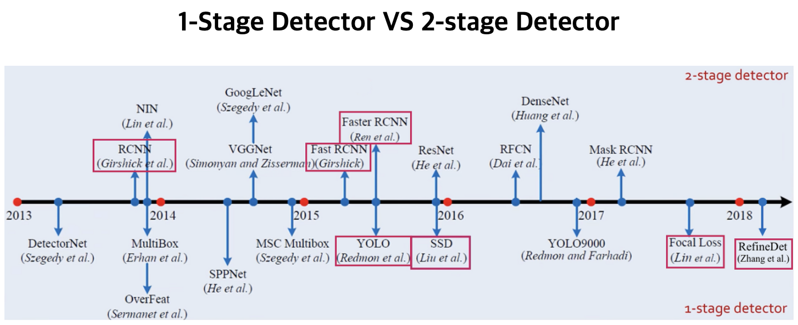

### Object Detection (Classification + Localization)

- 여러 물체 분류 (Classification)
- 물체가 어디 있는지 박스 (Bounding Box)를 통해 위치 정보 나타냄 (Localization)

- 1-stage Detector
    - Localization과 Classification 동시에 실행
    - 비교적 빠르지만 정확도가 낮음
    - YOLO, SSD, RetinalNet
- 2-stage Detector
    - Localization과 Classification 순차적으로 실행
    - 비교적 느리지만 정확도가 높음
    - R-CNN, Fast R-CNN, Faster R-CNN

1. R-CNN (2-stage Detector)
    1. selective search를 통해 후보영역(Region Proposal)을 생성
    2. 후보영역을 고정된 크기로 wrapping해서 CNN의 input으로 사용
    3. CNN에서 나온 Feature map으로 SVM을 통해 분류, Regressor를 통해 Bounding-box를 정함
    4. 강제로 크기를 맞추기 위한 wrapping으로 이미지 변형, 손실이 존재
    5. 후보영역만큼 CNN을 돌려야 하기 때문에 큰 저장공간을 요구하고 느리다는 단점 존재
    
    

2. Fast R-CNN
    1. 이미지 전체에 CNN을 적용하여 생성된 Feature map에서 후보영역을 생성
    2. 후보영역을 RoI Pooling을 통해 고정 사이즈의 Feature Vector로 추출
    3. Feature Vector에 FC layer를 거쳐 Softmax를 통해 분류, Refressor를 통해 Bounding-box를 조정
    
    

3. Faster R-CNN
    1. selective search부분을 딥러닝으로 바꾼 RPN (Region Proposal Network)을 사용
    2. RPN은 Feature map에서 CNN 연산시 Sliding-window가 찍은 지점마다 Anchor-box로 후보영역을 예측
    3. Anchor-box는 미리 지정해놓은 여러 개의 비율과 크기의 Bounding-box
    4. RPN에서 얻은 후보영역으로 IoU순으로 정렬 → NMS (Non-Maximum Suppression) 알고리즘을 통해 최종 후보영역 선택
    5. 선택된 후보영역의 크기를 맞추기 위해 RoI Pooling을 거친 이후, Fast R-CNN과 동일하게 진행
    
    
    

---

1. YOLO
    1. Bounding-box와 Class probability를 하나로 간주해 객체의 종류와 위치를 한번에 예측
    2. 이미지 일정 크기의 그리드로 나눠 각 그리드에 대한 Bounding-box를 예측
    3. Bounding-box의 confidence score와 그리드셀의 class score의 값으로 학습
    4. 간단한 처리과정으로 속도가 매우 빠르지만 정확도는 낮음.
2. SSD
    1. 각 Convolution Layer 이후 나오는 Feature map마다 Bounding-box의 Class 점수와 Offset(위치좌표)를 구하고 NMS 알고리즘을 통해 최종 Bounding-box를 결정
    2. Feature map마다 스케일이 다르기 때문에 작은 물체, 큰 물체 모두 탐지 가능
3. RetinaNet
    1. 모델 학습 시 계산하는 손실함수(loss function)에 변화를 주어 기존 1-stage Detector의 낮은 성능 개선
    2. 1-stage Detector는 많게는 십만개까지의 후보군 제시를 통해 학습을 진행 → 그 중 실제 객체인 것은 일반적으로 10개 이내이고 다수의 후보군이 background 클래스로 잡힘
    3. 상대적으로 분류하기 쉬운 background 후보군들에 대한 loss값을 줄여줌으로써 분류하기 어려운 실제 객체들의 loss 비중을 높이고, 그에 따른 실제 객체들에 대한 학습에 집중하게 한다.
    4. 속도가 빠르면서 2-stage Detector와 유사한 성능

-------------------------------
<aside>
💡 Reference

</aside>

- https://pseudo-lab.github.io/Tutorial-Book/chapters/object-detection/Ch1-Object-Detection.html
