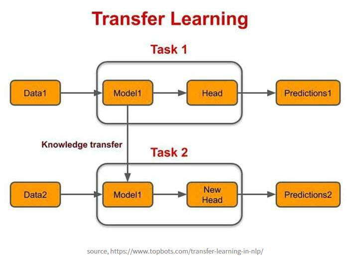
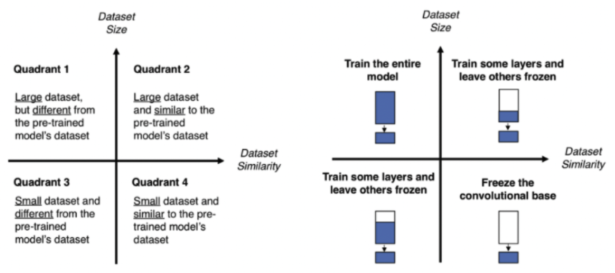
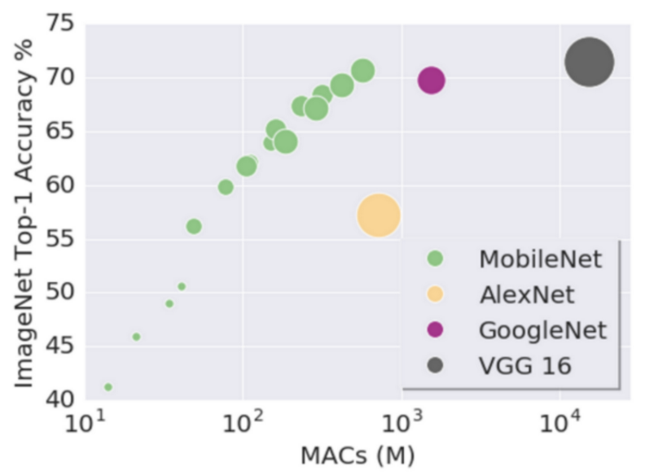

### ⭐ Fine Tunning (미세 조정))

- Pre Training (사전학습)
    - Dataset을 기반으로 충분히 학습을 완료한 모델
    - 사전에 학습된 weight
    - weight 정해진 모델에만 적용된다.
        - VGG weight를 EfficientNet에 적용 불가!!
- Transfer Learning (전이학습)
    - Pre Trained model을 새로운 Dataset(features, label)로 다시 학습시킨다.
- Fine Tunning (미세 조정)
    - Tranfer Learning과 달리 Pre Trained model 일부 layer를 수정해 새로운 Dataset(features, label)로 다시 학습 시키는 것
    - 특정 Layer를 수정

### Transfer Learning (전이학습) 하는 이유

- 모든 기업이 많은 데이터를 가지고 있지 않기 때문에
    - 많은 데이터를 가지고 있는 기업이 Pre Trained model 을 제공한다.



### Transfer Learning / Fine tunning 고르는 기준



- 박스 : Model
    - 긴 박스 : Convolusion + Pooling : features 특징 생성
    - 짧은 박스 : Flatten + Linear : 해당 features 가지고 학습
- 파란색 : Fine Tunning의 정도
    - 1 : 전체 Layer를 수정
    - 4 : 마지막만 수정
1. 가지고 있는 Dataset의 크기
    1. 데이터의 양에 많다. ⇒ 1, 2
    2. 데이터의 양이 적다 ⇒ 3, 4
2. Dataset의 단순한지, 복잡한지
    1. 데이터가 단순 ⇒ 2, 4
    2. 데이터가 복잡 ⇒ 1, 3

### Fine Tunning Code (EfficientNet, MobileNet)

1. 모듈 임포트
    
    ```python
    import os # 환경설정
    
    import numpy as np # 행렬 계산 모듈
    import torch # pytorch 사용할 수 있는 모듈
    from torch import nn # 신경망 모델을 사용하기 위한 모듈
    
    import matplotlib.pyplot as plt # 데이터 시각화관련 모듈
    
    import random # 랜덤 함수 사용 모듈
    from PIL import Image # 이미지 처리를 위한 모듈
    from pathlib import Path # 파일 패스 모듈
    
    from torch.utils.data import DataLoader # 데이터를 batch단위로 자르기 위한 모듈
    # pytorch에서 사용하는 컴퓨터 비전 작업을 위한 모듈
    # (이미지 분류, 동영상 처리, 데이터 증강, 데이터로딩, 객체감지, 전이학습 등)
    import torchvision
    from torchvision import datasets, transforms
    
    # torch 버정 확인
    torch.__version__
    ```
    
    ```python
    # 현재 사용하고 있는 환경 확인(cpu, gpu)
    device = "cuda" if torch.cuda.is_available() else "cpu"
    device
    ```
    
    ```python
    # torchinfo 설치
    # 모델의 구조 및 매개변수 정보 확인 패키지
    !pip install torchinfo
    ```
    
    ```python
    import torchinfo
    
    # summary : pytorch 모델 구조, 레이어, 매개변수, 입출력 크기 정보 제공
    try:
        from torchinfo import summary
    except:
        print("[INFO] Couldn't find torchinfo... installing it.")
        !pip install -q torchinfo
        from torchinfo import summary
    ```
    
2. Global Variable 정의
    
    ```python
    import easydict
    args = easydict.EasyDict()
    
    # 전체 데이터 학습 수
    args.NUM_EPOCHS = 30
    # 몇번 시도할지 시도횟수
    args.NUM_TRIALS = 5
    
    args.BATCH_SIZE = 32
    
    args.EFFICIENTNET_BEST_MODEL = "efficientNet_best_model"
    ```
    
3. 사용할 함수 정의
    
    ```python
    # SEED 고정 함수
    def reset_seeds(seed=42):
        random.seed(seed)
        os.environ['PYTHONHASHSEED'] = str(seed) # 파이썬 환경변수 시드 고정
        np.random.seed(seed)
        torch.manual_seed(seed) # cpu 연산 무작위 고정
        torch.cuda.manual_seed(seed) # gpu 연산 무작위 고정
        torch.backends.cudnn.deterministic = True  # cuda 라이브러리에서 Deterministic(결정론적)으로 예측하기 (예측에 대한 불확실성 제거 )
    ```
    
    ```python
    # loss 그래프 그리는 함수
    def plot_loss_curves(results):
        # train / test loss 값
        loss = results['train_loss']
        test_loss = results['test_loss']
    
        # train / test acc 값
        accuracy = results['train_acc']
        test_accuracy = results['test_acc']
    
        # 전체 epoch 수
        epochs = range(len(results['train_loss']))
    
        # 15, 7 크기의 도화지 생성
        plt.figure(figsize=(15, 7))
    
        plt.subplot(1, 2, 1)
        plt.plot(epochs, loss, label='train_loss')
        plt.plot(epochs, test_loss, label='test_loss')
        plt.title('Loss')
        plt.xlabel('Epochs')
        plt.legend()
    
        plt.subplot(1, 2, 2)
        plt.plot(epochs, accuracy, label='train_accuracy')
        plt.plot(epochs, test_accuracy, label='test_accuracy')
        plt.title('Accuracy')
        plt.xlabel('Epochs')
        plt.legend();
    ```
    
    ```python
    from typing import List, Tuple
    
    # 이미지 예측 점수 시각화
    def pred_and_plot_image(model: torch.nn.Module,
                            image_path: str,
                            class_names: List[str],
                            transform: torchvision.transforms,
                            image_size: Tuple[int, int] = (224, 224),
                            device: torch.device="cpu"):
    
        # 이미지 읽어오기
        img = Image.open(image_path)
    
        # 이미지 전처리 실행
        # 매개변수로 넘어오 transform이 있을 경우
        if transform is not None:
            image_transform = transform
        # 매개변수로 넘어오 transform이 없을 경우
        else:
            image_transform = transforms.Compose([
                transforms.Resize(image_size),
                transforms.ToTensor()
            ])
    
        ### Predict on image ###
    
        # model 환경 통일
        model.to(device)
    
        # model 평가 모드
        model.eval()
        # model 파라미터 고정
        with torch.inference_mode():
          # 이미지 차원 늘리기 (model에서 사용한 것과 통일해 주어야 하기 때문에)
          transformed_image = image_transform(img).unsqueeze(dim=0)
    
          # 이미지 예측
          target_image_pred = model(transformed_image.to(device))
    
        # 평가 점수를 확률값으로 변경
        target_image_pred_probs = torch.softmax(target_image_pred, dim=1)
    
        # 이미지 예측 라벨값
        target_image_pred_label = torch.argmax(target_image_pred_probs, dim=1)
    
        # 이미지 예측 결과 시각화
        plt.figure()
        plt.imshow(img)
        plt.title(f"Pred: {class_names[target_image_pred_label]} | Prob: {target_image_pred_probs.max():.3f}")
        plt.axis(False);
    ```
    
4. 데이터 로드
    
    ```python
    import requests
    import zipfile
    from pathlib import Path
    
    # Setup path to data folder
    data_path = Path("data/")
    image_path = data_path / "pizza_steak_sushi" # data/pizza_steak_sushi
    
    # If the image folder doesn't exist, download it and prepare it...
    if image_path.is_dir():
        print(f"{image_path} directory exists.")
    else:
        print(f"Did not find {image_path} directory, creating one...")
        image_path.mkdir(parents=True, exist_ok=True)
    
        # Download pizza, steak, sushi data
        with open(data_path / "pizza_steak_sushi.zip", "wb") as f:
            request = requests.get("https://github.com/mrdbourke/pytorch-deep-learning/raw/main/data/pizza_steak_sushi.zip")
            print("Downloading pizza, steak, sushi data...")
            f.write(request.content)
    
        # Unzip pizza, steak, sushi data
        with zipfile.ZipFile(data_path / "pizza_steak_sushi.zip", "r") as zip_ref:
            print("Unzipping pizza, steak, sushi data...")
            zip_ref.extractall(image_path)
    ```
    
    ```python
    # 데이터가 존재하는 경로들 프린트
    def walk_through_dir(dir_path):
      for dirpath, dirnames, filenames in os.walk(dir_path):
        print(f"There are {len(dirnames)} directories and {len(filenames)} images in '{dirpath}'.")
    ```
    
    ```python
    train_dir = image_path / "train"
    test_dir = image_path / "test"
    
    train_dir, test_dir
    ```
    
5. EDA
    1. 로드한 데이터 이미지 확인
    
    ```python
    # Set seed
    reset_seeds() # <- try changing this and see what happens
    
    # ("*/*/*.jpg") : 모든 폴더에 있는 jpg 조회
    # * : train/test 폴더
    # */* : train/test 폴어 안에 pizza/steak/sushi 폴더
    image_path_list = list(image_path.glob("*/*/*.jpg"))
    
    # 2. Get random image path
    # random.choice(sample) : 비복원
    # random.choices(samples) : 복원
    random_image_path = random.choice(image_path_list)
    
    # Random 추출된 jpg 파일의 부모 폴더
    image_class = random_image_path.parent.stem
    
    # Random 추출된 jpg 파일 open(읽기)
    img = Image.open(random_image_path)
    
    # 5. Print metadata
    print(f"Random image path: {random_image_path}")
    print(f"Image class: {image_class}")
    print(f"Image height: {img.height}")
    print(f"Image width: {img.width}")
    print(f"Image type: {type(img)}")
    print(f"Image shape: {img.size}")
    img
    ```
    
    ```python
    # 시각화를 사용하기 위해 numpy로 형변환
    img_as_array = np.asarray(img)
    
    # 이미지 시각화
    plt.figure(figsize=(10, 7))
    plt.imshow(img_as_array)
    plt.title(f"Image class: {image_class} | Image shape: {img_as_array.shape} -> [height, width, color_channels]")
    plt.axis(False);
    ```
    
6. Pre-trained Model augment 확인
    1. weights 정보 (transform)
    
    ```python
    # 사전 학습 모델 가져오기 (EfficientNet_B0_Weights)
    # .DEFAULT = 해당 모델 중 최적화된 모델 가져오기
    weights = torchvision.models.EfficientNet_B0_Weights.DEFAULT
    weights
    ```
    
    ```python
    # 사전 학습 모델의 transform 정보
    auto_transforms = weights.transforms()
    auto_transforms
    ```
    
7. Dataset Class 만들기
    1. Pre-trained Model augment 적용한 Dataset Class 만들기
    
    ```python
    # Dataset 만들기
    train_dataset = datasets.ImageFolder(train_dir, transform=auto_transforms)
    test_dataset = datasets.ImageFolder(test_dir, transform=auto_transforms)
    
    train_dataset, test_dataset
    ```
    
8. DataLoader
    1. 배치 사이즈로 나눈 데이터
    
    ```python
    reset_seeds()
    
    # Data를 batch로 나눈다.
    train_dataloader = DataLoader(train_dataset,
                                  batch_size=args.BATCH_SIZE,
                                  shuffle=True)
    
    test_dataloader = DataLoader(test_dataset,
                                 batch_size=args.BATCH_SIZE,
                                 shuffle=False)
    
    train_dataloader, test_dataloader
    ```
    
9. Model
    1. Pre-trained Model 정보 확인 (weights)
        1. Layer 정보
        2. summary
        
        ```python
        # WeightsEnum : 사전학습 weights를 다룰때 사용
        from torchvision.models._api import WeightsEnum
        # torch.hub에서 사전학습 모델을 가져온다.
        # load_state_dict_from_url : 모델의 weights 가져온다.
        from torch.hub import load_state_dict_from_url
        
        def get_state_dict(self, *args, **kwargs):
            kwargs.pop("check_hash")
            return load_state_dict_from_url(self.url, *args, **kwargs)
        
        WeightsEnum.get_state_dict = get_state_dict
        ```
        
        ```python
        # 사전학습(pre-trained) 모델 인스턴스 생성
        # classifier만 확인하면됨
        # 모델의 가장 마지막 레이어의 output은 class와 같다.
        # 첫번째 레이어의 input값 확인 => 3 => 컬러
        model = torchvision.models.efficientnet_b0(weights=weights).to(device)
        model
        ```
        
        ```python
        summary(model=model,
                input_size=(32, 3, 224, 224),
                # col_names=["input_size"], # uncomment for smaller output
                col_names=["input_size", "output_size", "num_params", "trainable"],
                col_width=20,
                row_settings=["var_names"]
        )
        ```
        
    2. 모델 수정 (Quadrant 4의 경우)
        1. 마지막 Layer 수정 (Classifier 수정)
        
        ```python
        # Sequential (classifier)만 False로 해서 학습 시킨다.
        # output_shape도 커스텀한다.
        # 모델의 feature만 고정한다.
        for param in model.features.parameters():
            param.requires_grad = False
        ```
        
        ```python
        reset_seeds()
        
        # 우리의 데이터 output_shape으로 맞추어 준다.
        output_shape = len(train_dataset.classes)
        
        # 사전학습 모델에서 classifier만 우리의 데이터에 맞게 수정하여 생성한다.
        model.classifier = torch.nn.Sequential(
            torch.nn.Dropout(p=0.2, inplace=True),
            torch.nn.Linear(in_features=1280,
                            out_features=output_shape,
                            bias=True)).to(device)
        ```
        
        ```python
        # summary : pytorch 모델 구조, 레이어, 매개변수, 입출력 크기 정보 제공
        summary(model,
                input_size=(32, 3, 224, 224),
                verbose=0,
                col_names=["input_size", "output_size", "num_params", "trainable"],
                col_width=20,
                row_settings=["var_names"]
        )
        ```
        
10. Engine
    1. loss_fn / optimizer
        
        ```python
        # loss함수와 optimizer(역전파) 정의
        loss_fn = nn.CrossEntropyLoss()
        optimizer = torch.optim.Adam(model.parameters(), lr=0.001)
        ```
        
    2. train_loop / test_loop
        
        ```python
        def train_step(model: torch.nn.Module,
                       dataloader: torch.utils.data.DataLoader,
                       loss_fn: torch.nn.Module,
                       optimizer: torch.optim.Optimizer):
            # 학습 모드
            model.train()
        
            # loss와 acc 저장 변수 선언 및 초기화
            train_loss, train_acc = 0, 0
        
            # -> X: features (batch, color, height, width)
            # -> y: target (batch)
            for batch, (X, y) in enumerate(dataloader):
                # 학습 데이터와 모델이 같은 환경에 있어야 한다.
                X, y = X.to(device), y.to(device)
        
                # 1. Forward pass
                # 모델 학습
                y_pred = model(X)
        
                # 2. Calculate  and accumulate loss
                # 2. 학습 결과에 loss 값
                loss = loss_fn(y_pred, y)
                train_loss += loss.item()
        
                # 3. Optimizer zero grad
                # 기울기 고정
                optimizer.zero_grad()
        
                # 4. Loss backward
                # 역전파
                loss.backward()
        
                # 5. Optimizer step
                # 다음 단계로 넘긴다.
                optimizer.step()
        
                # Calculate and accumulate accuracy metric across all batches
                y_pred_class = torch.argmax(torch.softmax(y_pred, dim=1), dim=1)
                train_acc += (y_pred_class == y).sum().item()/len(y_pred)
        
            # Adjust metrics to get average loss and accuracy per batch
            train_loss = train_loss / len(dataloader)
            train_acc = train_acc / len(dataloader)
            return train_loss, train_acc
        ```
        
        ```python
        def test_step(model: torch.nn.Module,
                      dataloader: torch.utils.data.DataLoader,
                      loss_fn: torch.nn.Module):
            # 평가 모드
            model.eval()
        
            # test_loss, test_acc 변수 선언 및 초기화
            test_loss, test_acc = 0, 0
        
            # 모델 파라미터 고정
            with torch.inference_mode():
                # -> X: features (batch, color, height, width)
                # -> y: target (batch)
                for batch, (X, y) in enumerate(dataloader):
                    # 모델과 동일한 환경
                    X, y = X.to(device), y.to(device) # X (), y ()
        
                    # 1. Forward pass
                    test_pred_logits = model(X) # pred ()
        
                    # 2. Calculate and accumulate loss
                    loss = loss_fn(test_pred_logits, y)
                    test_loss += loss.item()
        
                    # Calculate and accumulate accuracy
                    test_pred_labels = test_pred_logits.argmax(dim=1) # pred_labes ()
                    test_acc += ((test_pred_labels == y).sum().item()/len(test_pred_labels))
        
            # Adjust metrics to get average loss and accuracy per batch
            test_loss = test_loss / len(dataloader)
            test_acc = test_acc / len(dataloader)
            return test_loss, test_acc
        ```
        
    3. main (train_loop + test_loop)
        
        ```python
        from tqdm.auto import tqdm
        
        # 1. Take in various parameters required for training and test steps
        def main(model: torch.nn.Module,
                  train_dataloader: torch.utils.data.DataLoader,
                  test_dataloader: torch.utils.data.DataLoader,
                  optimizer: torch.optim.Optimizer,
                  early_stopper,
                  loss_fn: torch.nn.Module = nn.CrossEntropyLoss(),
                  epochs: int = 5):
        
            # 2. Create empty results dictionary
            # 결과값을 넣을 리스트 생성
            results = {"train_loss": [],
                "train_acc": [],
                "test_loss": [],
                "test_acc": []
            }
        
            # 3. Loop through training and testing steps for a number of epochs
            # 설정한 epoch 만큼 학습 및 예측 실행
            for epoch in tqdm(range(epochs)):
                train_loss, train_acc = train_step(model=model,
                                                   dataloader=train_dataloader,
                                                   loss_fn=loss_fn,
                                                   optimizer=optimizer)
                test_loss, test_acc = test_step(model=model,
                                                dataloader=test_dataloader,
                                                loss_fn=loss_fn)
        
                # 4. Print out what's happening
                # 배치단위 당 결과 출력
                print(
                    f"Epoch: {epoch+1} | "
                    f"train_loss: {train_loss:.4f} | "
                    f"train_acc: {train_acc:.4f} | "
                    f"test_loss: {test_loss:.4f} | "
                    f"test_acc: {test_acc:.4f}"
                )
        
                # 5. Update results dictionary
                # 배치단위 당 결과 저장
                results["train_loss"].append(train_loss)
                results["train_acc"].append(train_acc)
                results["test_loss"].append(test_loss)
                results["test_acc"].append(test_acc)
        
                # 6. early stopper
                # over fitting 되지 않게 확인한다.
                if not early_stopper.is_continuable(model, test_loss):
                    print(f'validation: best loss: {early_stopper.best_loss}')
                    break
        
            # 7. Return the filled results at the end of the epochs
            return results
        ```
        
    4. Early Stopping
        
        ```python
        class EarlyStopper(object):
        
            def __init__(self, num_trials, save_path):
                self.num_trials = num_trials
                self.trial_counter = 0
                self.best_loss = np.inf
                self.save_path = save_path
        
            def is_continuable(self, model, loss):
                if loss < self.best_loss: # 현재 loss가 최고 loss보다 더 낮은 경우
                    self.best_loss = loss # 최고 loss를 현재 loss로 업데이트
                    self.trial_counter = 0 # 초기화
                    torch.save(model, self.save_path) # 최고 loss를 갖은 모델 저장
                    return True
                elif self.trial_counter + 1 < self.num_trials: # 현재 loss가 최고 loss보다 작은 경우 & max 시도횟수보다 현재 시도횟수가 작은 경우
                    self.trial_counter += 1 # 기존 시도횟수 + 1
                    return True
                else: # 현재 정확도가 최고 정확도보다 작은 경우 & 현재 시도횟수가 max 시도횟수보다 큰 경우
                    return False
        
            def get_best_model(self, device):
                return torch.load(self.save_path).to(device)
        ```
        
11. 학습
    
    ```python
    # Set the random seeds
    reset_seeds()
    
    loss_fn = nn.CrossEntropyLoss()
    optimizer = torch.optim.Adam(params=model.parameters(), lr=0.001)
    
    early_stopper = EarlyStopper(num_trials=args.NUM_TRIALS, save_path=args.EFFICIENTNET_BEST_MODEL)
    
    # 얼마나 시간이 걸리는지 확인하기 위해 시간 측정
    # Start the timer
    from timeit import default_timer as timer
    start_time = timer()
    
    # Setup training and save the results
    results = main(model=model,
                   train_dataloader=train_dataloader,
                   test_dataloader=test_dataloader,
                   optimizer=optimizer,
                   early_stopper=early_stopper,
                   loss_fn=loss_fn,
                   epochs=args.NUM_EPOCHS)
    
    # End the timer and print out how long it took
    end_time = timer()
    print(f"[INFO] Total training time: {end_time-start_time:.3f} seconds")
    ```
    
12. loss 및 acc 값 그래프로 확인
    
    ```python
    plot_loss_curves(results)
    ```
    
13. Test
    
    ```python
    import random
    num_images_to_plot = 3
    test_image_path_list = list(Path(test_dir).glob("*/*.jpg")) # get list all image paths from test data
    test_image_path_sample = random.sample(population=test_image_path_list, # go through all of the test image paths
                                           k=num_images_to_plot) # randomly select 'k' image paths to pred and plot
    
    # Make predictions on and plot the images
    for image_path in test_image_path_sample:
        pred_and_plot_image(model=model,
                            image_path=image_path,
                            class_names=train_dataset.classes,
                            transform=weights.transforms(), # optionally pass in a specified transform from our pretrained model weights
                            image_size=(224, 224),
                            device=device)
    ```
    
14. Confusion Matrix 확인
    
    ```python
    from tqdm.auto import tqdm
    
    y_preds = []
    model.eval()
    
    with torch.inference_mode():
      # test 데이터 하나씩 가져오기 (feature, target)
      for X,y in tqdm(test_dataloader, desc = "Making predictions"):
        # 모델과 동일한 환경 세팅
        X, y = X.to(device), y.to(device)
        # 예측
        y_logit = model(X)
        # 예측값을 확률값으로 나타낸 후 최대값의 라벨 반환
        y_pred = torch.softmax(y_logit, dim = 1).argmax(dim = 1)
        print(y_pred)
        # 라벨 리스트에 값 저장
        y_preds.append(y_pred.cpu())
      y_pred_tensor = torch.cat(y_preds)
    ```
    
    ```python
    try:
      import torchmetrics, mlxtend
      print(f"mlxtend version: {mlxtend.__version__}")
      assert int(mlxtend.__version__.split(".")[1]) >= 19
    except:
      !pip install -q torchmetrics -U mlxtend
      import torchmetrics, mlxtend
      print(f"mlxtend version: {mlxtend.__version__}")
    ```
    
    ```python
    class_names = train_dataset.classes
    class_names
    ```
    
    ```python
    from torchmetrics import ConfusionMatrix
    from mlxtend.plotting import plot_confusion_matrix
    
    reset_seeds()
    
    confmat = ConfusionMatrix(num_classes=len(class_names), task='multiclass')
    confmat_tensor = confmat(preds=y_pred_tensor,
                            target=torch.tensor(test_dataset.targets))
    
    fig, ax = plot_confusion_matrix(
        conf_mat=confmat_tensor.numpy(), # matplotlib likes working with NumPy
        class_names=class_names, # turn the row and column labels into class names
        figsize=(10, 7)
    );
    ```
    

### MobileNet

- 고성능 환경이 아닌 곳에서 사용 가능
    - 모델 학습은 고성능 환경에서 학습하지만 실제 사용하는 곳은 고성능 환경이 아니기에
- 연산량이 적다.
- 적은 모델로 높은 점수
- 딥러닝 경량화
- 자동차, 드론, 스마트폰 등등



<aside>
💡 Reference

</aside>

- 사전 학습 모델 제공 사이트
    - https://pytorch.org/vision/stable/models.html#models-and-pre-trained-weights
    - https://pytorch.org/vision/main/models.html
    - https://huggingface.co/models
    - https://github.com/huggingface/pytorch-image-models
    - 논문 관련 사전 학습 모델
        - https://paperswithcode.com/
