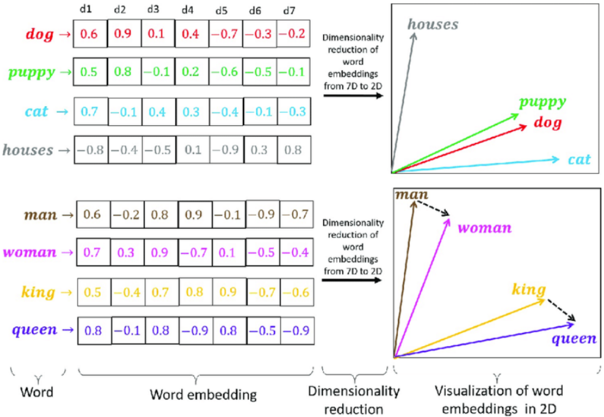
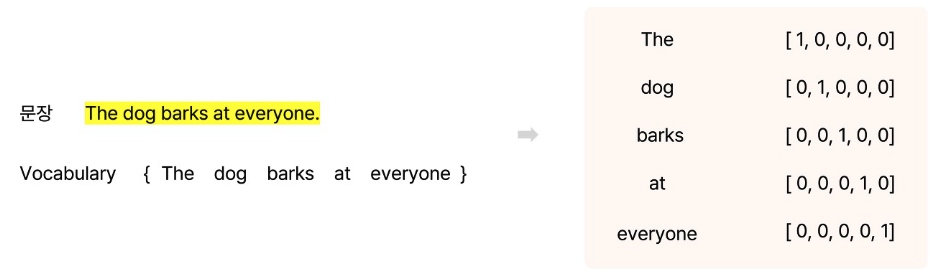
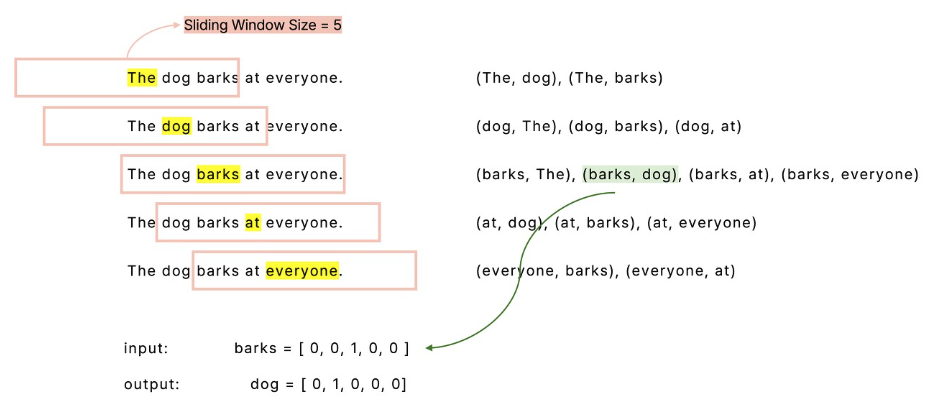
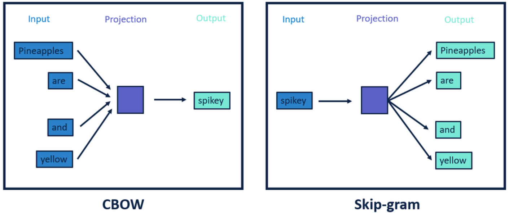

- Embedding
- 단어를 vector화
- 토큰화가 되어있는 상태에서 Embedding
- 문장에서 인접 단어들 간의 의미가 서로 유사할 것

- dog와 puppy는 가깝게 cat과 houses는 각각 멀리
- man과 woman은 가깝게 king과 queen은 가깝게
    - 사람과 직업으로 나누어져 있지만 …??

### Word2Vec 학습과정

1. 토큰화된 단어를 유일한 index 설정
    1. 각각 단어를 one-hot encoding 실행
    
    

2. sliding window
    1. 중심단어를 기준으로 각각의 단어와의 유사도를 계산
    
    

3. 유사도
4. softmax

### Word2Vec 학습 방법

1. CBOW (Bag of Words)
    1. sliding window에서 중심단어가 target
    2. 주변단어가 input
2. Skip-gram
    1. input으로 중심단어
    2. 주변단어를 예측

