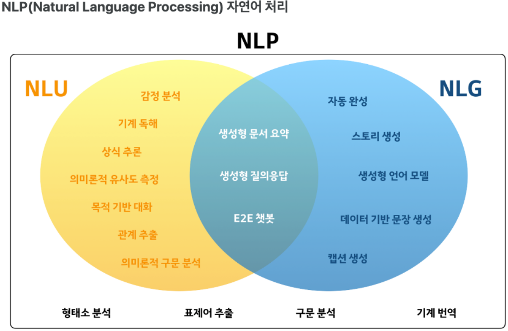
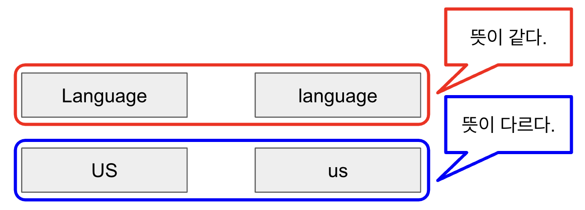
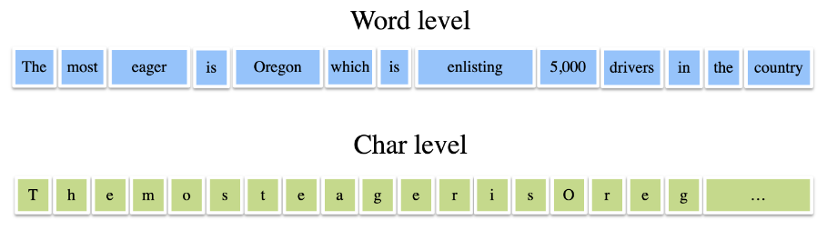
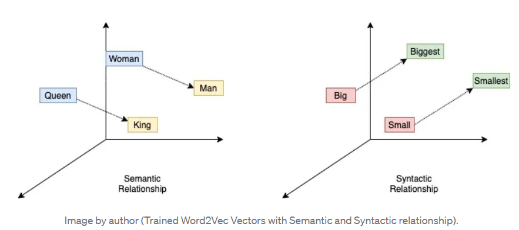
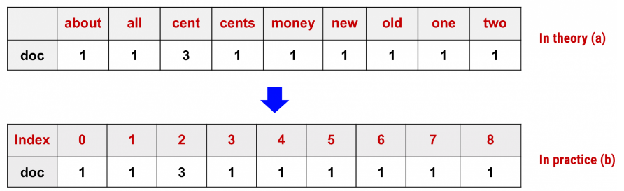

### NLP (Natural Language Processing)

- 자연어 처리
- NLU (Understanding)
    - 자연어 이해
- NLG (Generation)
    - 자연어 생성
- 언어의 대한 이해(NLU)를 통해 언어에 대한 피드백(NLG)

- 이메일 필터링(Email filtering)
- 언어 번역(Language translation)
- 문서 분석(Document analysis)
- 온라인 검색(Online searches)
- 예측 텍스트(Predictive text)
- 자동 요약(Automatic summarization)
- 감정 분석(Sentiment analysis)
- 챗봇(Chatbots)
- 소셜 미디어 모니터링(Social media monitoring)

### 텍스트 전처리 (Text Preprocessing)

- 어떻게 숫자로 표현을 할 수 있을까?
1. Cleaning (정제)
    1. 특수문자(.,?!) 등과 같은 필요없는 문자를 제거
    2. 의미가 동일한 것은 하나로 남겨두고 다르면 남긴다.
    3. 관사, 대명사 등 의미를 부여할 수 없는 글자 제거
    
    

2. Stemming (추출)
    1. 부사, 형용사, 추임새, 접사어를 제거하고 핵심적인 단어 추출
        1. 나는 짜장면을 먹었다 → 나, 짜장면, 먹었다.
        2. 우와, 꽃이 너무 이쁘다 → 꽃, 이쁘다
    2. 어간 추출
        
        > playing -> play(어간) + ing(접사)
        > 
        > 
        > lectures -> lecture(어간) + s(접사)
        > 
        > kindness -> kind(어간) + ness(접사)
        > 
    3. 표제어 추출
        
        > is, are -> be
        having -> have
        > 
3. Stopword (불용어)
    1. 큰 의미가 없는 단어(자주 등장하지만 분석하기에 도움이 되지 않은) 제거
4. Tokenization (토큰화)
    1. 단어를 하나하나 단위단위로, 의미있는 단위로 끊는다.
    2. 분석기마다 토큰화 방법이 다르기에 사용 목적 맞는 분석기 사용
    3. 왜 끊는가?
        1. 각각 단어의 뜻을 학습하고 해석하기 쉽다.
    4. 문자(글자) 수준
        1. 토, 끼, 안, 녕
    5. 단어 수준
        1. 토끼, 안녕
        2. 단어들은 무한하다.
    
    

    - 형태소 분석
        - 명사, 조동사, 동사 등을 구분할 수 있다.
        - 더 분석하면 뜻이 없어지는 말의 단위
        - ex) 한나가 책을 보았다.
        - <형태소 의미 / 기능 구분>
        - 1. 실질 형태소
            - 명사, 동사, 형용사, 부사
            - 한나, 책, 보
        - 2. 형식 형태소
            - 단어 사이의 관계
            - 가, 을, 았, 다
        - <형태소 의존성 구분>
        - 1. 자립 형태소
            - 명사, 대명사, 수사, 관형사, 부사, 감탄사
            - 한나, 책
        - 2. 의존 형태소
            - 조사, 어미, 동사, 형용사
            - 가, 을, 보, 았, 다
        - Vocabulary
            - 유한한 토큰를 vocabulary에 저장
            - 토큰마다 유일한 index 값을 부여
            - index를 통해 해당 토큰을 알 수 있다.
                - index 넣으면 글자가 나온다.
                - 글자를 넣으면 index가 나온다.
            - 재사용 불가
            - 모델이 학습해야 할 토큰의 전체 갯수를 알 수 있다. ⇒ 학습량을 알 수 있다.(small, medium, large)
            - 영화평론에서 사용하는 문장, 개발자들의 언어 등
5. Embedding / Sorting (Encoding)
    1. 토큰화된 상태 후 진행
    2. 문자를 숫자로 변환
    3. 모델은 임베딩된 묶음을 이용해서 문장을 해석하고 사용한다.
    4. 숫자를 벡터화 한다.
        1. 정수 인코딩
        2. One-Hot Encoding → 많이 사용
        3. Word2vec Encoding
        4. Word Enbedding with neural network
    
    

    

6. Padding
    1. 문장들은 길이가 각기 다 다르다.
    2. 학습 문장들의 토큰화된 길이를 동일시 하게 만들어 준다. ⇒ 모델 input size 동일하게 하려고
        1. 다만, 의미있는 해석이 되면 안되기 때문에 0으로 대입
            
            > 재밌다. → 1개
            너무 재밌다. → 2개
            영화가 너무 재밌다. → 3개
            > 

### 유사도 (Similarity)

- 모델에게 Embedding을 통해 단어 간의 유사한 관계를 알려준다.
    - 비슷 / 정반대 / 무상관
- 단어 간의 유사한 관계를 의미있는 숫자들을 묶는 과정
- ex)
    - 나는 → (Vocabulary) → 0 → (Embedding) → [0.5, 0.7, 0.4, 0.2]
    - 학생이다 → (Vocabulary) → 1 → (Embedding) → [0.3, 0.6, 0.5, 0.4]
    - 유사도 ⇒
- 유사도를 통해 상관관계를 표현
