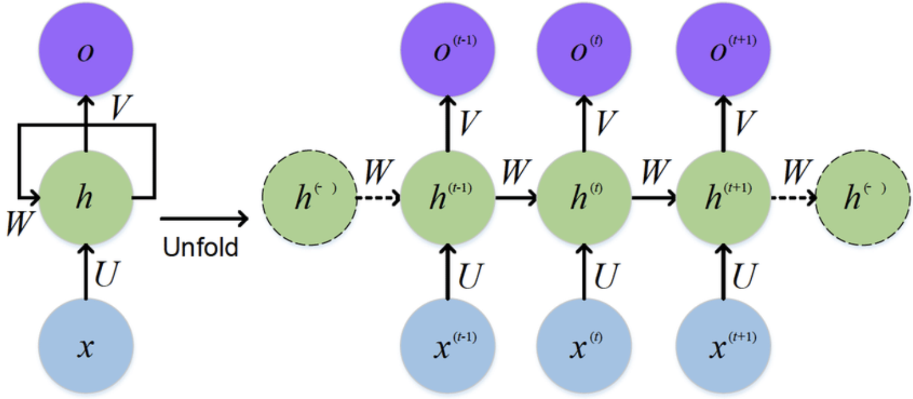

- 선형회귀모델
    - 모델에 input_data의 순서 정보가 들어가지 않는다.
    - 순서정보가 들어가 있지 않다. feature만 학습 ⇒ 문제점 발견!
- NLP는 순서정보를 같이 학습 시켜야 한다. (RNN)
    - A는 B를 좋아한다.
    - B는 A를 좋아한다.
    - 위의 두 문장은 다른 의미이다.

### First Order System

- 현재 시간의 상태가 이전 시간의 상태와 관련이 있다.

$x_t = f(x_{t-1})$

> x : 상태
> 
> t : 시간
> 
> xt : t 시간일 때의 상태
> 
> xt-1 : t-1시간(이전 시간)일 때의 상태
> 

> x0 = 임의 숫자(초기값)
> 
> x1 = f(x0)
> 
> x2 = f(x1)
> 
> x3 = f(x2) = f(f(x1)) = f(f(f(x0)))
> 
- 문제점 : 초기 input만 받고 다음은 받을 수 없다.

### RNN 모델

- Vanilla RNN : 제일 기본적인 RNN
- 학습이 될 때마다 feature 값을 받자

$x_t = f(x_{t-1}, u_t)$

> x : 상태
> 
> t : 시간
> 
> ut : t 시간일 때의 현재(입력) 값 (t 시점의 feature)
> 
> xt : t 시간일 때의 상태
> 
> xt-1 : t-1시간(이전 시간)일 때의 상태
> 

> x0 = 임의 숫자(초기값)
> 
> x1 = f(x0, A는)
> 
> x2 = f(x1, B를)
> 
> x3 = f(x2, 좋아한다)
> 
> !! 순서 정보도 같이 학습
> 
- 최종모델

$x_t = f(x_{t-1}, u_t)$

$y_t = h(x_t)$

> x : 상태(hidden layer의 state)
> 
> t : 시간
> 
> ut : t 시간일 때의 현재(입력) 값 (t 시점의 feature)
> 
> xt : t 시간일 때의 상태
> 
> xt-1 : t-1시간(이전 시간)일 때의 상태
> 
> yt : t 시간일 때의 출력 값
> 

> x0 = 임의 숫자(초기값)
> 
> x1 = f(x0, A는)
> 
> x2 = f(x1, B를)
> 
> x3 = f(x2, 좋아한다)
> 
> y = h(x3) ⇒ Active function
> 
> ⇒ x3 : 각 t 시점의 feature, 각 t 시점에 대한 순서정보 학습
> 

### RNN (Recurrent Neural Network)

- 선형회귀모델은 결과를 새로운 모델에 학습한다.
- RNN은 자기 자신을 학습한다. (결과를 계속 자신에게 input 한다.)
- RNN 특징
    - 초기값을 설정해주어야 한다.
    - input 2개  ($x_{t-1}, u_t$)
        - 초기값 (x_0)
        - 해당 t에 대한 feature (u_1)
    - output 2개 ($x_t, y_t$)
        - 다음 모델을 학습시키기 위한 xt값 (x_1 → x_2)
        - Active function적용한 y값 (y_1)
    - y는 각 시점마다 학습량이 달라진다.
- 최종 결과를 알고 싶은 경우 마지막 y값을 알면된다.

---

- CNN vs RNN
    - CNN은 이미지 구역별로 같은 weight를 공유
    - RNN은 시간별 같은 weight를 공유

---

### RNN 구조 종류

### RNN 연산

- 은닉층(초록)
    - $h_t = tanh(W_xx_t + W_hh_{t-1} + b)$
- 출력층(파랑)
    - $y_t = f(W_yh_t + b)$
    - f()는 Active function

### RNN Code

<aside>
💡 Reference

</aside>
