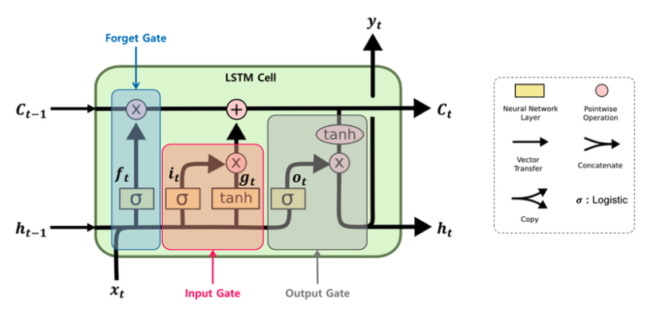

### Vanilla RNN 문제점

- 문장의 길이가 길어지면 문제가 발생
    - 문장의 앞과 끝은 어느 정도 해석할 수 있지만, 중간 단위의 데이터들은 학습이 잘 안된다.
    - 중요한 단어가 중간에 있으면 결과를 잘 에측을 못한다.

### LSTM (Long Short Term Memory)

- input 3개
    - hidden_state : 새로 들어온 x와 과거 데이터 간의 관계(매번 hidden_state가 새로 생성된다. - 재사용 X)
    - cell_state : 과거에 대한 내용을 기억
    - featrue
- output 3개
    - cell_result
    - hidden_result
    - target
- hidden_state와 cell_state의 역할이 분리되어 있다.
- 로직이 크게 3개 있다.
    - Forget Gate (곱셈)
        - 과거에 학습한 input data와 현재 input data(feature)의 중요도 확률 값으로 계산 (0 ≤ x ≤ 1)
        - 얼마나 중요한지에 따라 데이터를 학습
        - 중요도에 따라 학습량을 조절 가능
        - 저장되는 데이터량이 다르다.
        - 해당 비율만큼(중요도) 과거 데이터를 잊어버린다.
    - Input Gate (플러스)
        - 데이터 증가
        - cell과 hidden을 합해서 input을 만든다.
    - Output Gete

### 시계열 분석 (LSTM with time series)

- 시간에 따라서 순차적으로 저장된 데이터
- 주식, 날씨예보, 쇼핑몰 구매 데이터, 소비자 물가지수, 월별/분기별/연도별 특정 사건 수치
- 하나의 컬럼 데이터가 날짜에 따라 때로는 feature, 때로는 target 데이터가 된다.
    - 내가 궁금한 날짜에 따라 feature와 target이 달라진다.
    - 과거 이력 데이터가 중요하다.
- Dataset 만들기가 까다롭다.

### LSTM Code

<aside>
💡 Reference

</aside>

- 시계열
    - [https://velog.io/@lazy_learner/LSTM-시계열-예측-모듈-만들기-1](https://velog.io/@lazy_learner/LSTM-%EC%8B%9C%EA%B3%84%EC%97%B4-%EC%98%88%EC%B8%A1-%EB%AA%A8%EB%93%88-%EB%A7%8C%EB%93%A4%EA%B8%B0-1)
