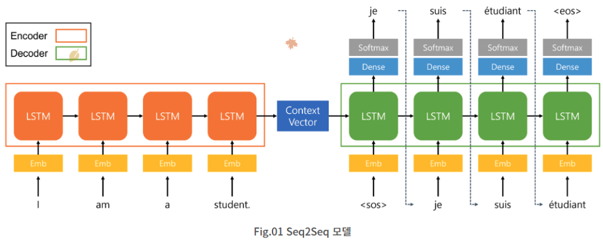
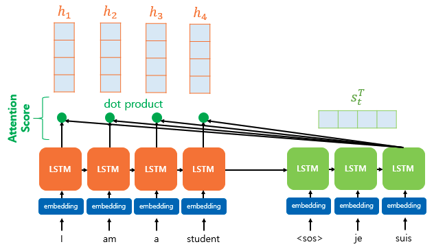
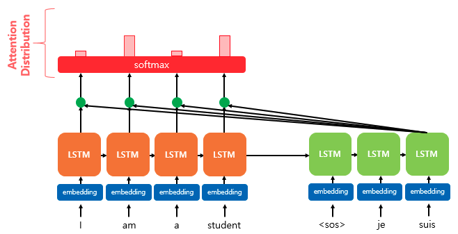
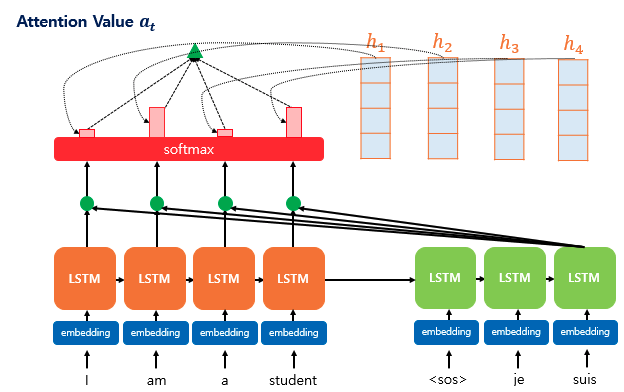
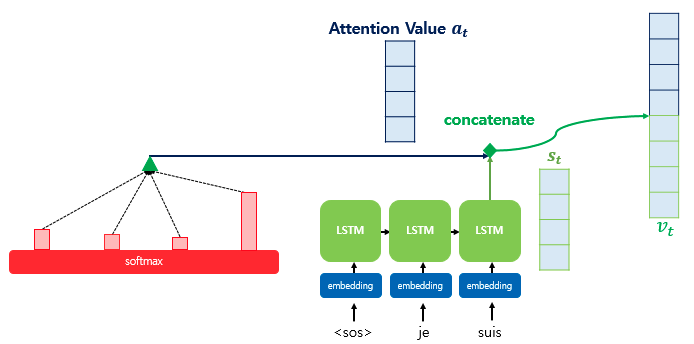
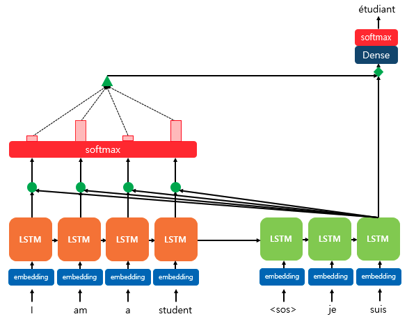

### Seq2Seq

- 번역, 챗봇 등에서 높은 성능
- **RNN 모델** 2개 사용
- Encoder
    - 여태 했던 것들 (RNN, LSTM, GRU)
- ⭐ Context Vector = hidden_state
    - Encoder에서 나온 결과 hidden_state 값
    - Decoder의 초기값으로 사용
- Decoder
    - 초기값 : Context Vector
- 단점
    - gradient vaninshing/exploding
    - RNN류의 모델의 문제점 (RNN, LSTM, GRU)
    - 문장의 길이가 길어지면 문제 발생

### Attention

- Seq2Seq 모델 문제점 개선을 위해 제안
- 번역은 모든 것을 기억하고 학습해야한다.
- 토큰 간의 유사도
- 각 학습 feature를 재정의
    - 유사도에 따라 각 토큰의 학습량이 다르다.
    - 유사도가 높으면 해당 토큰의 학습량이 많아지고, 유사도가 낮으면 해당 토큰의 학습량은 적어진다.

### Attention 동장방법

- Q = Query
    - Decoder에서 input data(feature)
    - suis에 대한 학습 정보
- K = Keys
    - Encoder의 전체 학습데이터
    - I, an, a, student에 대한 학습 정보
- V = Values
    - Query기준으로 Keys의 유사도 결과를 곱해서 더한 값
    - dot product

---

1. Query기준으로 Keys의 유사도를 구한다.
    1. hidden state[Query(Decoder의 input)]와 dot product[Keys(Encoder의 input들)]의 유사도
    
    
    
2. 유사도(실수)를 확률값(softmax)을 구한다. 
    1. 확률 분포 (Attention Distribution) = 유사도 가중치
    
    
    
3. Keys의 결과(y = dot product)와 유사도의 가중치를 곱한다.
    
    
    
4. Query의 결과(y)와 3번의 정보(Attention의 값)를 더한다. (concatenate)
    
    
    
5. Dense layer(Fully Connectted Layer)에 넣어서 학습한다.
    
    
    

<aside>
💡 Reference

</aside>

- Attention
    - https://wikidocs.net/22893