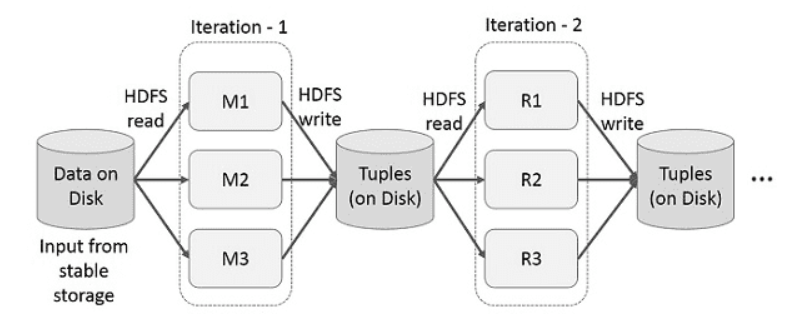
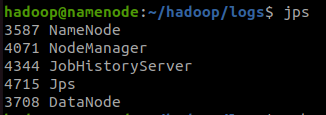
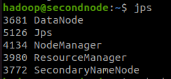
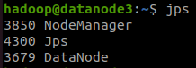

- 데이터
    - 데이터 엔지니어
        - 기존 데이터 통합 및 ETL - 데이터 엔지니어 역할
    - 데이터 분석가
        - 시각화 - BI (Business Intelligence)

---

- 정형 데이터
    - 숫자
    - 온도, 습도, 풍향, 기압 등
- 비정형 데이터
    - 언어, 문자 등
    - 이미지, 텍스트, 동영상
- 반정형 데이터
    - HTML, JSON, XML
    - 웹문서, 신문 등

---

- 하둡
    - 하둡을 왜 써?
        - 데이터의 변화로 인한 데이터를 조직화하기 위해
    - 스케일 아웃 방식
    - 데이터 레이크
    - 병렬처리가 가능한 저장소
    - SQL, NoSQL 사용 가능
    - 무제한으로 데이터를 저장 가능 (컴퓨터 추가시)
    - 방대한 양의 데이터 분석 가능
    - 오픈 소스
    - 기존의 OLAP 시스템과 다르게 클러스터 모델에서는 한 번 쓰고 여러 번 읽는 형태의 작업을 다룸
        - Online Analyrical Processing
        - SQL에서 Transaction, Commit, RollBack 개념
    - 장애 복구 능력이 뛰어남 (클러스터 기능)
        - 하둡은 기본적으로 복제 개수는 3개로 설정
    - 하둡 클러스터
        - 데몬으로 구성되어 있다.
        - 쉽게 확장하거나 줄일 수 있다.
        - JVM 내에서 동작

### Hadoop Cluster

- ⭐ 네임노드 (마스터)
    - 손상되거나 제거되면 복구 불가
    - 데이터의 장부가 적혀있다.
    - HDFS에서 마스터 역할
    - 모니터링을 통해 데이터 노드에 용량이 차면 다른 데이터노드로 옮긴다.
    - fsimage
        - HDFS에 있는 모든 파일 이름
        - HDFS 디렉토리 구조
        - HDFS에 있는 모든 파일의 권한 정보
- 세컨더리 네임노드
    - 네임노드가 백업되어 있음
    - 주기적으로 체크포인트 실행하지만 느리다.
- 데이터 노드
    - 데이터 블록이 생성 및 삭제
    - 클러스터에 걸쳐 데이터 복제
    - 네임노트와 연결 유지하고 파일 시스템에서 일어나는 모든 변화를 네임노트에 업데이트
    - 청크파일 = 기본 128GB

### 얀 서비스 (Resource Manager)

- 리소스 관리자
    - 하둡 클러스터에서 동작하는 모든 애플리케이션 사이에서 중재자 역할
    - 클러스터에 있는 모든 워커 노드를 관리하는 노드 매니저와도 협력
- 모든 데이터 노드의 리소스 할당
- 잡 스케줄링과 실행관리
- 클러스터 레벨 보안을 관리
- 애플리케이션에서 온 리소스를 요청 처리
- 애플리케이션 마스터의 상태를 관찰하고, 실패할 경우 컨테이너 재시작
- 애플리케이션이 완료되거나 소멸된 후, 컨테이너 할당을 해제

---

### VM 확인

- 파일 - 도구 - 네트워크관리자
    - 속성 - DHCP 서버
    - 클러스터시, 최저 주소 한계 - 최고 주소 한계 사이에 IP가 존재해야한다.

---

### putty

- putty로도 접속을 할 수 있다.
- IP 설정, port 22, session 이름 설정
- 로그 파일 설정
    - &Y_&M_&D_&T
- 방확벽 죽이기 (부팅할 때부터 방화벽 데몬 정지)
    - sudo systemctl disable ufw
    - 기본 stop으로는 안된다.
- 방화벽 서비스 끄기
    - sudo service ufw stop
- swap 끄기
    - swapoff -a

### 리눅스 명령어

- 이전 명령어 확인 : history
    - !{번호} : 명령어 실행
    - history | grep {검색할 단어}
- 이전 명령어 찾기 ctrl + r

### 파일 수정

- hdfs-site.xml
    - dfs.replication → value 3
- cat /etc/hosts 확인 - 고정 IP 할 경우
    
    ```bash
    192.168.56.101  client
    192.168.56.102  namenode
    192.168.56.102  datanode1
    192.168.56.103  secondnode
    192.168.56.103  datanode2
    192.168.56.104  datanode3
    ```
    

### Hadoop Cluster

- 가상머신
    - 
    
    
    
    - client (ubuntu)
    - namenode - datanode1 (ubuntu 1)
    - secondnode - datanode2 (ubuntu 2)
    - datanode3 (ubuntu 3)
- DNS보다 /etx/hosts 파일이 먼저 구동되기 때문에 각 노드의 IP 가 먼저 읽힌다.
- datanode1 ↔ datanode2 ↔ datanode3
- 각자의 서버에서 데이터 처리 후 합친다. ⇒ MapReduce
---

### MapReduce



- MapReduce를 진행할 때 기존의 모든 프레임워크에서는 계산된 데이터를 재사용하기 위해 파일 스토리지 시스템에 저장하고 읽는 구조
- 단점
    - 복제, 직렬화, 디스크 io 때문에 데이터 공유가 느려진다.
    - map-reduce 단계마다 중간 결과를 재사용
        - 데이터 복제, 디스크 i/o 직렬화로 인해 오버헤드 발생으로 시스템 속도가 느려진다.

---
- ip 변경
    - cd /etc/netplan/
    - network-namager-all.yaml 파일 수정
        
        ```bash
        network:
        	ehernets:
        		enp0s3:
        			dhcp4: ture
        		enp0s8:
        			dhcp4: false
        			addresses: [/etc/hosts 에서 지정한 ip/24]
        	version: 2
        ```
        
    - sudo netplan apply
- 파티션 설정
    - namenode
        - hadoop namenode -format
        - start-dfs.sh
        - start-yarn.sh
        - jps
- mr-jobhistory-demon.sh start historyserver
    - mr : 로그







- 연결이 안되었을 경우 workers 파일 확인
    - cd ~/hadoop/etc/hadoop
    - workers 파일 확인
    - 변경 후 파일을 나머지 노드들에 옮겨야 한다.
    - scp workers {node명}:/home/hadoop/hadoop/etc/hadoop
    - 재시작
        - stop-dfs.sh
        - start-dfs.sh
- 확인
    - http://192.168.56.102:50070/