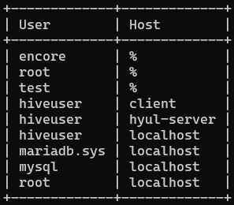
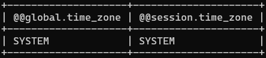
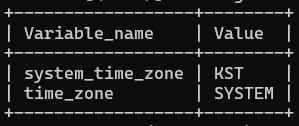
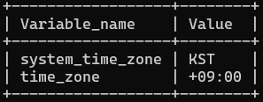

- DB에 있는 데이터를 Hadoop에 넣어 hive에 적용

### Sqoop

- 데이터 마이그레이션 역할
- DB에서 Hadoop으로 데이터를 옮겨준다.
- RDBMS 정보를 MapReduce, hive 같은 고차원 도구로 분석 가능
- Sqoop1의 모든 커넥터는 모든 출력 포맷에 대한 정의필요
- Sqoop2는 서버 컴포넌트, CLI, Web UI, REST API, Java API 등 다양한 클라이언트 제공
- Sqoop2와 Sqoop1은 호환 불가
    - Sqoop2와 Sqoop1의 목적은 마이그레이션이다
- Sqoop Connector
    - MySQL, PostgreSQL, Oracle, SQL Server, DB2 등 RDBMS 지원

### Subway 데이터 집어넣기

- subway.sql 디비 넣기 (client)
    - mysql -u root -p 1234 hivedb < ~/workspace/seul/subway.sql

### Sqoop2 설치

```sql
wget https://archive.apache.org/dist/sqoop/1.99.7/sqoop-1.99.7-bin-hadoop200.tar.gz
```

- 압축 풀고 파일명 변경
    
    ```bash
    # 압축 풀기
    tar xvfz sqoop-1.99.7-bin-hadoop200.tar.gz
    
    # 파일명 변경
    mv ./sqoop-1.99.7-bin-hadoop200 ./sqoop
    ```
    
- jar 파일 sqoop 폴더로 옮기기
    - commons-lang-2.6.jar
    - hive-common-0.10.0.jar
    - mysql-connector-java-8.0.21.jar
- sqoop2 환결설정 추가
    - vi ~/.bashrc
    - source ~/.bashrc

        ```bash
        export JAVA_HOME=/usr/lib/jvm/java-8-openjdk-amd64
        export HADOOP_HOME=/home/hadoop/hadoop
        export HADOOP_CONF_DIR=$HADOOP_HOME/etc/hadoop
        export HADOOP_INSTALL=$HADOOP_HOME
        export HADOOP_MAPRED_HOME=$HADOOP_HOME
        export HADOOP_COMMON_HOME=$HADOOP_HOME
        export HADOOP_HDFS_HOME=$HADOOP_HOME
        export HADOOP_YARN_HOME=$HADOOP_HOME
        # 추가
        export SQOOP_HOME=/home/hadoop/sqoop

        export HADOOP_COMMON_LIB_NATIVE_DIR=$HADOOP_HOME/lib/native
        export HADOOP_OPTS="-Djava.library.path=$HADOOP_HOME/lib/native"
        export HIVE_HOME=/home/hadoop/hive
        # 마지막 PATH 경로 추가 (:$SQOOP_HOME/bin)
        export PATH=$PATH:$HADOOP_HOME/sbin:$HADOOP_HOME/bin:$HIVE_HOME/bin:$HIVE_HOME/bin:$SQOOP_HOME/bin
        ```

- mysql 계정 권한 확인
    - select user,host from mysql.user;
    
    
    
- sqoop.properties 수정
    - 144줄 : mapreduce 사용 경로 수정
        - /home/hadoop/hadoop/etc/hadoop/
    - 100줄 :
        - org.apache.sqoop.repository.jdbc.url=jdbc:derby:/home/hadoop/sqoop/repository/db;create =true
- hadoop 설정 추가
    - {/home/hadoop}/hadoop/etc/hadoop/core-site.xml
        
        ```bash
        <property>
        	<name>hadoop.proxyuser.hadoop-user.hosts</name>
        	<value>hadoop</value>
        </property>
        <property>
        	<name>hadoop.proxyuser.hadoop-user.groups</name>
        	<value>hadoop</value>
        </property>
        ```
        
    - {/home/hadoop}/hadoop/etc/hadoop/container-executor.cfg
        
        ```bash
        allowed.system.users=hadoop
        ```
        
- sqoop2 폴더 생성
    - sudo mkdir /var/lib/sqoop2
- sqoop2 환경변수 추가
    - vi ~/.bashrc
    - source ~/.bashrc
    
        ```bash
        export SQOOP_SERVER_EXTRA_LIB=/var/lib/sqoop2/
        ```
    
- sqoop2 폴더에 필요한 라이브러리 복사
    - cd {/home/hadoop}/hadoop/etc/hadoop
    - sqoop2 폴더 권한 변경
        - sudo chown -R hadoop:hadoop ./sqoop2/
        - var/lib/sqoop2의 폴더가 root 권한이기 때문에 sudo로 설정
    - 파일 옮기기
        
        ```bash
        cp -R {/home/hadoop}/hadoop/share/hadoop/client/*.jar /var/lib/sqoop2/
        cp -R {/home/hadoop}/hadoop/share/hadoop/hdfs/*.jar /var/lib/sqoop2/
        cp -R {/home/hadoop}/hadoop/share/hadoop/hdfs/lib/*.jar /var/lib/sqoop2/
        cp -R {/home/hadoop}/hadoop/share/hadoop/common/*.jar /var/lib/sqoop2/
        cp -R {/home/hadoop}/hadoop/share/hadoop/common/lib/*.jar /var/lib/sqoop2/
        cp -R {/home/hadoop}/hadoop/share/hadoop/mapreduce/*.jar /var/lib/sqoop2/
        cp -R {/home/hadoop}/hadoop/share/hadoop/yarn/lib/*.jar /var/lib/sqoop2/
        cp -R {/home/hadoop}/hadoop/share/hadoop/yarn/*.jar /var/lib/sqoop2/
        ```
        
    
    > - find 명령어 사용하기
    > - find 위치 -name 검색이름
    > - 명령어 : find ./ -name "*.jar"
    > - find / -name "*.jar" 2>/dev/null : 표준에러 무시
    > - 해당 결과를 파일로 저장
    > - 명령어 : find ./ -name "*.jar" 2>/dev/null > result.txt

### Sqoop1로 진행

- Sqoop2 에러로 인해 Sqoop1 으로 다시 진행
- Sqoop1 설정
    - 기존 sqoop폴더는 sqoop2로 변경
        - mv ./sqoop ./sqoop2
    - sqoop1의 파일은 sqoop으로 변경
        - mv {sqoop1 압축푼 폴더 경로} ./sqoop
- jar 파일 sqoop 폴더로 옮기기 (기존거는 sqoop2로 옮겼기 때문)
    - commons-lang-2.6.jar
    - hive-common-0.10.0.jar
    - mysql-connector-java-8.0.21.jar
- MySQL 접속
    - mysql -u root -p
    - 권한을 안주었을 경우
        
        ```bash
        GRANT ALL PRIVILEGES ON *.* TO 'root'@'%' IDENTIFIED BY '1234';
        ```
        
    - Sqoop DB 목록 확인
        - sqoop list-databases : sqoop을 통해 가져올 database 목록을 출력
        - jdbc:mysql://{IP}:3306/ --username root --password 1234 : 데이터베이스에 로그인
        
        ```bash
        sqoop list-databases --connect jdbc:mysql://{IP}:3306/ --username root --password 1234
        ```
        
    - Sqoop을 사용해 DB에 있는 데이터를 Hadoop에 넣기
        - sqoop import : sqoop을 통해 import
        - jdbc:mysql://{IP}:3306/hivedb --username root --password 1234 : 데이터베이스에 로그인
        - --table subway : 가져올 테이블 이름 지정
        - -m 1 : 맵리듀스 작업을 한 개의 맵 태스크로 실행
        - --target-dir /sqoop/subway : 가져올 테이블을 hadoop에 저장할 곳 지정
        
        ```bash
        sqoop import --connect jdbc:mysql://{IP}:3306/hivedb --username root --password 1234 --table subway -m 1 --target-dir /sqoop/subway
        ```
        
    - Hadoop에 넣은 후 hive 테이블에 자동으로 변환하여 저장
        - sqoop import : sqoop을 통해 import
        - jdbc:mysql://{IP}:3306/hivedb --username root --password 1234 : 데이터베이스에 로그인
        - --table subway : 가져올 테이블 이름 지정
        - -m 1 : 맵리듀스 작업을 한 개의 맵 태스크로 실행
        - --hive-import : hive 테이블에 자동으로 변환하여 저장
        
        ```bash
        sqoop import --connect jdbc:mysql://{IP}:3306/hivedb --username root --password 1234 --table subway -m 1 --hive-import
        ```
        

### MySQL Error

- Timezone Error (KST)
    - Error Message
        
        ```bash
        Caused by: 
        com.mysql.cj.exceptions.InvalidConnectionAttributeException: 
        The server time zone value 'KST' is unrecognized 
        or represents more than one time zone. 
        You must configure either the server 
        or JDBC driver (via the 'serverTimezone' 
        configuration property) to use a more specifc time zone 
        value if you want to utilize time zone support.
        ```
        
    - 해결
        - MySQL 접속
            - time_zone 확인
            
            ```bash
            SELECT @@global.time_zone, @@session.time_zone;
            ```
            
            
            
            - global 변수 확인
                
                ```bash
                show global variables like '%time_zone%';
                ```
                
                
                
            - time_zone 설정 변경
                
                ```bash
                SET GLOBAL time_zone='Asia/Seoul';
                SET time_zone='Asia/Seoul';
                # 위의 SET에서 에러가 발생된다면 Asia/Seoul이 설치가 되어 있지 않는 것 
                
                # 그럼 아래처럼 설정
                SET GLOBAL time_zone='+09:00';
                SET time_zone='+09:00';
                ```
                
                
                
- host Error
    - Error Message
        - root계정에 client 호스트로부터 엑세스 권한이 없다.
        
        ```bash
        java.sql.SQLException: Access denied for user 'root'@'client' (using password: YES)
        ```
        
    - 해결
        - 권한 설정
            
            ```bash
            GRANT ALL PRIVILEGES ON *.* TO 'root'@'%' IDENTIFIED BY '1234';
            ```
</br>

### 💡 Reference

- time_zone Error
    - https://maliethy.github.io/posts/mysql_timezone/