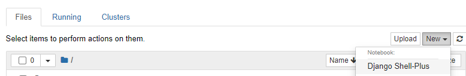

### dajngo 웹 만들기

1. 작업 폴더 만들기
2. 가상환경 만들기
    
    ```bash
    # virtualenv 패키지 설치
    pip install virtualenv
    
    # 가상환경 만들기
    python -m virtualenv venv
    
    # python:select interpreter
    ctrl + shift p -> 권장 버전
    
    # pip list 확인
    pip list
    ```
    
3. django 설치
    
    ```bash
    pip install django
    ```
    
4. mysite project 만들기
    
    ```bash
    django-admin startproject mysite
    ```
    
5. django 구동
    1. manage.py  : django를 관리하는 프로그램
    
    ```bash
    python manage.py runserver
    ```
    
6. db 환경 구축
    
    ```python
    python manage.py migrate
    ```
    
7. model 추가
    1. pybo/models.py
        1. on_delete=models.CASCADE : FK가 삭제되면 같이 삭제된다.
        
        ```python
        from django.db import models
        
        class Question(models.Model):
          subject = models.CharField(max_length=200)
          content = models.TextField()
          create_date = models.DateTimeField()
        
        class Answer(models.Model):
          question = models.ForeignKey(Question, on_delete=models.CASCADE)
          content = models.TextField()
          create_date = models.DateTimeField()
        ```
        
    2. ORM
    3. DB 데이블 만들기
        1. python manage.py makemigrations
            1. Django 모델의 변경 사항을 추적하고 데이터베이스에 적용할 마이그레이션 파일을 생성
            2. 마이그레이션 파일은 데이터베이스 스키마를 변경하는 방법에 대한 정보를 담고 있음
        2. python manage.py migrate
            1. 데이터베이스에 대한 마이그레이션을 실행하여 실제 데이터베이스 스키마를 변경
            2. makemigrations 로 생성된 마이그레이션 파일을 기반으로 데이터베이스에 변경 사항을 적용
8. 더미데이터 넣기
    1. 필요한 확장파일 설치
        1. pip install django-extensions
    2. sqllite3에 넣기
        1. python manage.py shell_plus
            
            ```python
            >>> from pybo.models import Question, Answer
            >>> from django.utils import timezone
            >>> q = Question(subject='pybo가 무엇인가요?', content='pybo에 대해서 알고 싶습니다.', create_date=timezone.now())
            >>> q.save()
            >>> q.id
            1
            ```
            
9. 공용DB 사용
    1. mysite settings.py > DATABASES : DB 관련 내용 수정
        
        ```python
        DATABASES = {
          'default': {
            'ENGINE': 'django.db.backends.mysql',
            'NAME' : 'encore',
            'USER' : 'encore',
            'PASSWORD' : 'dpszhdk!@#',
            'HOST': '3.36.39.116',
            'POST' : '3306',
          }
        }
        ```
        
    2. 필요 패키지 설치
        1. pip install mysqlclient
10. 데이터 처리
    1. 데이터 넣기
        
        ```python
        q = Question(subject='질문질문', content='질문질문', create_date=timezone.now())
        ```
        
    2. 변경내용 저장
        
        ```python
        q.save()
        ```
        
    3. 테이블 조회
        1. filter : 여러 조건을 걸어서 여러 데이터를 반환
        2. get : 조건이 무조건 하나, 반환도 하나
        
        ```python
        # 전체 데이터 조회
        # 테이블.objects.all()
        Question.objects.all()
        
        # filter & get
        # 조건에 해당하는 데이터 가져오기
        # 여러 데이터를 반환
        Question.objects.filter(id=1)
        # <QuerySet [<Question: Question object (1)>]>
        
        # get
        Question.objects.get(id=1)
        # <Question: Question object (1)>
        ```
        
    4. 데이터 수정
        
        ```python
        q.subject = "Django Model Question"
        q.save()
        ```
        
    5. 데이터 삭제
        
        ```python
        q.delete()
        
        # 전체 삭제
        Question.objects.all().dalete()
        ```
        
11. 관리자 계정 생성 및 관리 페이지 (다른 터미널로 실행)
    
    ```python
    python manage.py createsuperuser
    ```
    
12. 화면 코드 작업
    1. mysite settings.py > TEMPLATES
        
        ```python
        TEMPLATES = [
          {
            'BACKEND': 'django.template.backends.django.DjangoTemplates',
            # front 파일 넣는 곳 지정
        		'DIRS': [BASE_DIR, 'templates'],
            'APP_DIRS': True,
            'OPTIONS': {
              'context_processors': [
                'django.template.context_processors.debug',
                'django.template.context_processors.request',
                'django.contrib.auth.context_processors.auth',
                'django.contrib.messages.context_processors.messages',
              ],
            },
          },
        ]
        ```
        
    2. mysite settings.py > urls.py
        
        ```python
        from django.contrib import admin
        from django.urls import path, include
        from pybo import views
        
        urlpatterns = [
          path('admin/', admin.site.urls),
          # pybo 주소로 들어오면 view.index 함수 실행
          # path('pybo/', views.index),
          # pybo 주소로 들어오면 pybo.urls 경로에 있는 파일로 던진다.
          path("pybo/", include('pybo.urls')),
        ]
        ```
        
    3. pybo/urls
        
        ```python
        from django.urls import path
        from . import views
        
        app_name = "pybo"
        
        urlpatterns = [
          path("", views.index),
          # question_id를 받으면 views.detail 로 던질게
          # path("<int:question_id>/", views.detail),
        
          # app_name의 detail을 찾아서 던질게
          path('<int:question_id>/', views.detail, name='detail'),
          path('answer/create/<int:question_id>', views.answer_create, name="answer_create"),
        ]
        ```
        
    4. pybo/view.py
        
        ```python
        from django.shortcuts import render, get_object_or_404, redirect
        from django.http import HttpResponse
        from .models import Question, Answer
        from django.utils import timezone
        
        # All List
        def index(request):
          question_list = Question.objects.order_by('-create_date')
          context = {'question_list' : question_list }
          return render(request, 'pybo/question_list.html', context)
        
        # detail 페이지
        def detail(request, question_id):
          # question = Question.objects.get(id=question_id)
          # 해당 id가 없으면 404페이지로 옮겨죠
          question = get_object_or_404(Question, pk=question_id)
          return render(request, 'pybo/question_detail.html', {'question' : question})
        
        # 답변등록
        def answer_create(request, question_id):
          question = get_object_or_404(Question, pk=question_id)
          question.answer_set.create(content=request.POST.get("content"),
                                      create_date=timezone.now())
          return redirect('pybo:detail', question_id = question_id)
        ```
        

### 참고사항

- 내가 만든 환경에 있는 패키지 목록 파일로 만들기
    
    ```python
    pip list --format=freeze > requirements.txt
    ```
    
    - 다른 사람 환경 내 환경에 적용하기
        
        ```python
        pip install -r requirements.txt
        ```
        
- shell에서 말고 jupyter에서 작업하고 싶은 경우
    
    ```python
    pip install notebook==6.0.0
    ```
    
- jupyter 켜기
    - New → Django Shell-Plus
    
    ```python
    python manage.py shell_plus --notebook
    ```
    
    