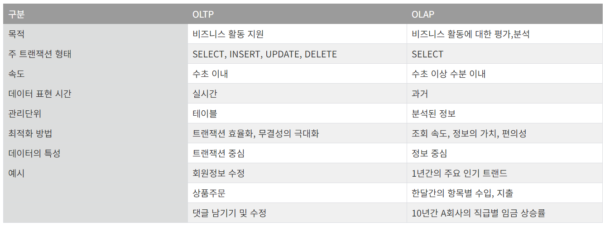
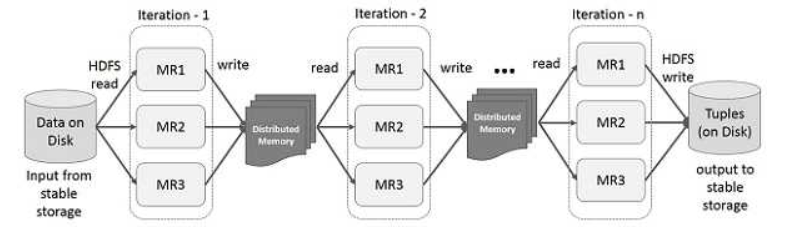
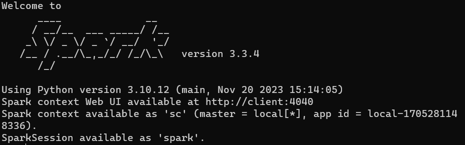

- UC 버클리 대학교에서 2009년 스파크 연구 시작 → 2013년 아파치 재단에 기부
- 클러스터 환경에서 데이터를 병렬로 처리하는 라이브러리 집합
    - HDFS와 MapReduce 처리 엔진으로 구성
    - 하둡과 유사하지만 대량의 데이터를 메모리에 유지하는 설계로 빠른 속도 처리
- 언어지원
    - SQL
    - Python
    - Java
    - R
    - 스칼라
        - 스파크의 Original Language
        - Functional Programing Java인 느낌
- OLTP(온라인 트랜잭션 처리) 애플리케이션을 염두에 두고 설계되지 않음
- 일괄처리, 데이터 마이닝 같은 온라인 분석처리 작업(OL:AP)에 적합
    - OLTP (Online Transaction Processing)
        - 1개의 요청 작업을 처리하는 과정
        - 복수의 사용자 PC에서 발생되는 트랜잭션을 DB서버가 처리하고, 그 결과를 요청한 사용자 PC에 결과값을 되돌려주는 과정
        - 단계적 처리가 다 완료되어야 1개의 요청작업이 완벽하게 처리됨
        - 각 작업요청을 오류없이 처리하고, 그 결과값을 실시간으로 확인시켜주어야 함
        - 1개의 트랜잭션에서 발생되는 INSERT, UPDATE, DELETE 과정의 무결성을 보장하여 처리하고 그 결과는 SELECT 하는 과정
    - OLAP (Online Analytical Processing)
        - 이미 저장된 데이터를 기반하여 분석하는데 중점
        - 데이터 웨어하우스(DW) (= DB에 저장되어 있는 데이터)의 데이터를 분석하고, 데이터 분석을 통해 사용자에게 유의미한 정보를 제공해주는 처리방법
        - 기존에 저장되어 있는 데이터를 사용자의 요구와 목적에 맞게 분석하여 정보를 제공
        - 1년동안의 벌어들인 금액과 지출항목별 금액 정리
    
    
    
- 속도 빠르며 병렬처리
- RDD (Resilient Distrubuted Dataset)
    - 분산 변경 불가능한 객체모음
    - 스파크의 모든 작업은 새로운 RDD를 만들거나 존재하는 RDD를 변형하거나 결과 계산을 위해 RDD에서 연산하는 것을 표현
    - 빠른 MapReduce작업을 RDD 개념을 이용해 사용
        - Hadoop의 MapReduce 단점으로 인해 Spark RDD로 넘어왔다.
    - Spark RDD를 이용한 데이터 공유
        - 메모리 내 처리 연산 지원
        - 메모리에서 데이터 공유는 네트워크나 디스크보다 10 ~ 100배 빠른데, 데이터를 램에 올린 후에 fault-tolerant가 발생해도 문제가 없도록 memory 내용을 갱신하지 않고 readi-only로 사용하는 방법
        - Hadoop의 구조와 동일하지만 hdfs에 접근하는 것이 아닌 memory에 보관하여 실행시간을 줄여준다.
        
        
        
- GraphX : 자료구조 그래프와 동일

---

1. 하둡과 스파크는 다르다
    1. 하둡 : 분산 데이터 인프라
    2. 스파크 : 분산된 데이터 처리 도구
2. 서로 필요는 없다
    1. 하둡 : HDFS와 MapReduce라는 자체 데이터 처리 도구가 포함
    2. 스파크 : 하둡과 가장 잘 동작하지만, 굳이 하둡이 필요하지는 않음
3. 속도
    1. 하둡 : 맵리듀스를 배치방식이라 늦음
    2. 스파크 : 인메모리 처리방식이라 배치는 10배, 인메모리 분석에는 100배 빠름
4. 모든 작업에 속도가 중요한가
    1. 하둡 : 정적이며 배치형태 작업에 적합
    2. 스파크 : 실시간 IoT 센서, 기계학습, 실시간 마케팅, 온라인 추천 등에 적합
5. 장애 복구 능력
    1. 하둡 : 태생적으로 시스템 장애에 내성이 강함
    2. 스파크 : RDD로 장애 복구 능력을 기본 제공

---

- sc : 스파크 세션을 열어서 연결해야 스파크 UI를 들어갈 수 있다

### 스파크의 분산 실행의 이해

- 스파크 드라이버
    - SparkSession 객체를 초기화
    - 클러스터의 분산 컴포넌트(Spark executor)에 접근
    - 클러스터 매니저와 통신해 Spark executor들을 위해 필요한 자원을 요청(CPU, 메모리 등) 모든 스파크 작업은 DAG 연산 형태로 변환

### SparkSession

- 모든 스파크 연산과 데이터에 대한 통합 연결 채널이 됨
- SparkContext, SQLContext, HiveContext, SparkConf, StreamingContext 등을 통합
- JVM 실행

### 분산 데이터

- HDFS나 클라우드 저장소에 존재하는 파티션이 되어 저장소 전체에 분산
- 네트워크에서 가장 가까운 파티션을 읽도록 테스크 할당
    - 청크나 파티션으로 분산해 저장하는 방식 = Spark executor
- 스파크 코어 기능들과 상호작용할 수 있는 진입점 제공
- 그 API로 프로그래밍 할 수 있게 해주는 객체
- 잡(Job)
    - 여행 계획
- 스테이지
- 태스크
- 액션
- 모든 스파크 연산이 하나의 스테이지 안에서 실행될 수 없으므로 여러 스테이지로 나눠어야 함

### 스파크 태스크

- 스파크에서 최소 실행단위
- 각 태스크는 개별 CPU 코어에 할당되고 개별 파티션을 갖고 작업

### ⭐Partition

- RDD나 Dataset을 구성하고 있는 최소 단위 객체
- 각 Partition은 서로 다른 노드에서 분산처리 됨
    - 1 Core = 1 Task = 1Partition
- Spark에서 하나의 최소 연산을 Task → 하나의 Task에서 하나의 Partition 처리 → 하나의 Task는 하나의 Core가 연산 처리
- Partition 수에 따라 각 Partition의 크기가 결정됨
    - Partition의 크기는 Core당 필요한 메모리 크기를 경정
    - Partition 수 → Core 수
    - Partition 크기 → 메모리 크기
- Parition의 수를 늘리는 것은 Task 당 필요한 메모리를 줄이고 병렬화의 정도를 늘린다.
- 병렬로 작업을 수행할 수 있도록 제공
- Parition이 하나라면 Spark에 수천 개의 executor가 있더라도 병렬성은 1
- 수백 개의 Parition이 있더라도 executor가 하나 밖에 없다면 병렬성은 1
- Input Parition
- Output Parition
- Shuffle Parition

### ⭐트랜스포메이션

- 불변성 ⇒ 한번 생성하면 변경 불가
- df를 변경하려면 원하는 변경 방법을 스파크에 알려줘야함
- 즉시 실행되는 것이 아니라 계보라 불리는 형태로 기록
    - 최적의 루트를 찾는다
- 지연연산 (lazy evaluation)
    - 하나의 액션은 모든 기독된 트랜스포메이션의 지연연산 발동
    - Spark가 연산 그래프를 처리하기 직전까지 기다리는 동작 방식
    - 전체 데이터 흐름을 최적화 하는 엄청난 강점
        - Spark가 특정 연산 명령어 내려진 즉시 데이터를 수정하지 않고 원시 데이터에 적용할 트랜스포메이션의 실행 계획을 생성
        - Spark는 코드를 실행하는 마지막 순간까지 대기하다가 원형 DataFrame 트랜스포메이션을 간경한 물리적 실행 계획으로 컴파일
- 지연평가
    - 액션이 실행되는 시점이나 데이터에 실제 접근하는 시점까지 실제 실행을 미루는 스파크 전략

### 좁은 의존성

- filter (where, having)
- 트랜스포메이션은 하나의 Input Parition이 하나의 Output Parition에만 영향을 미침

### 넓은 의존성

- group by, order by는 넓은 트랜스포메이션
- 트랜스포메이션은 하나의 Input Parition이 여러 Outpu Parition에 영향을 미침
- 좁은 트랜스포메이션을 사용하면 Spark에서 파이프라이닝을 자동으로 수행
    - DataFrame에 여러 필터를 지정하는 경우 모든 작업이 메모리에서 발생

### ⭐****Shuffle****

- Spark가 클러스터에서 Parition을 교환하는 작업
- 좁은 트랜스포메이션을 사용하면 Spark에서 파이프라이닝을 자동으로 수행
    - DataFrame에 여러 필터를 지정하는 경우 모든 작업이 메모리에서 발생
- 셔플은 결과를 디스크에 저장함

### ⭐Action

- 일련의 트랜스포메이션으로부터 결과를 계산하도록 지시하는 명령
- 액션을 지정하면 Spark Job이 시작
- Spark Job은 filter(좁은 트랜스포메이션)를 수행한 후 Partition별로 레코드 수를 카운트(넓은 트랜스포메이션) 한다.
- 각 언어에 적합한 네이티브 객체에 결과를 모은다.
- 트랜스포메이션을 사용해 논리적 실행 계획을 세울 수 있다.
- 실제 연산을 수행하려면 액션 명령을 내려야 한다.

---

### 스파크 설치

- 홈페이지 접속
- Download 링크 복사
    - Spark version : 3.3.4
    - Package : Pre-built for Apache Hadrrop 3.3 and later
        
        ```bash
        # client
        wget https://dlcdn.apache.org/spark/spark-3.3.4/spark-3.3.4-bin-hadoop3.tgz
        ```
        
    - 압축 풀기
        
        ```bash
        tar xvzf ./spark-3.3.4/spark-3.3.4-bin-hadoop3.tgz
        ```
        
    - 폴더명 변경
        
        ```bash
        mv spark-3.3.4-bin-hadoop3 ./spark
        ```
        
    - conf 폴더에 데이터 옮기기
        
        ```bash
        # 1. filezilla
        # 2. scp 명령어
        # 파일 목록
        - slaves
        - spark-default.conf
        - spark-env.sh
        ```
        
    - bashrc 적용 → source ~/.bashrc
        
        ```bash
        export SPARK_HOME=/home/hadoop/spark
        export PATH=$PATH:$HADOOP_HOME/sbin:$HADOOP_HOME/bin:$HIVE_HOME/bin:$HIV    E_HOME/bin:$SQOOP_HOME/bin:$SPARK_HOME/bin
        ```
        

### Spark 실행

- pyspark (단일실행)
    
    
    
- Spark UI
    - IP:4040
- pyspark --master yarn --num-executors 3
    - spark를 띄울 건데 일꾼 3명이야
    - error
        - /etc/hosts 에서 127.0.1.1 제거
    - 재시작
        - 굉장히 느리기 때문에 기다려야 한다.
    - jupyter 주소 들어가기
    - 파일을 만들어서 sc 실행
        - Spark UI 가 나오면 들어가서 확인
- jupyter 연동
    - jupyter notebook --generate-config
    - vim /home/hadoop/.jupyter/jupyter_notebook_config.py
        
        ```bash
        # password -> 123
        c.NotebookApp.allow_origin = '*'
        c.NotebookApp.open_browser = False
        c.NotebookApp.password = "argon2:$argon2id$v=19$m=10240,t=10,p=8$JjOUUl+PkMyaeVWz34kP7g$gH7h20sz6D/JmgVtCUKm3RquEAcdCnbDQ4jRL2eFskI"
        ```
        
    - vim ~/.bashrc
        
        ```bash
        export PYSPARK_DRIVER_PYTHON=jupyter
        export PYSPARK_DRIVER_PYTHON_OPTS='notebook --ip=0.0.0.0'
        ```
        

### spark Environment

- spark.scheduler.mode : FIFO ⇒ Queue
- functional programing 방식 (FP)
    - 객체에서 점을 찍고 함수 호출해서 함수한테 결과를 받는다.
    - 함수를 다 import 시켜서 사용해야 한다.
- DAG (Directed Acyclic Graph)
    - 비순환 그래프
- sort : 트랜스포메이션
- take : action
- parquet : 빅데이터 저장

### git 데이터 받아와서 hadoop에 넣기

- 서버에 git이 없는 경우
    - sudo apt install git
- git에서 데이터 받아오기
    - git clone https://github.com/FVBros/Spark-The-Definitive-Guide.git
- 압축 풀기
    - tar xvfz {압축파일}
- 받은 데이터의 csv 파일을 hadoop에 넣기
    - cd {압축푼 폴더}/data/flight-data/csv
    - hadoop에 폴더 만들고 데이터 넣기
        - hdfs dfs -mkdir -p /data/flight
        - hdfs dfs -put *.csv /data/flight/

---

### hadoop에 추가 데이터 넣기

- cd {압축푼 폴더}/data/flight-data/json
- hadoop에 폴더 만들고 데이터 넣기
    - hdfs dfs -mkdir /data/flight/json
    - hdfs dfs -put *.json /data/flight/json

### 스키마

- DB에서의 스키마의 개념은 동일
    - DataFrame의 컬럼명과 데이터 타입을 정의
- ETL(추출, 변환, 적재) 작업에 스파크를 사용한다면 직접 스키마를 정의해야함

### Apache Zeppelin

- 하둡의 에코 시스템
- 데이터를 노트북 기반으로 interactive하게 데이터 분석을 할 수 있게 도와주는 프로그램

---

- 스파크는 함수가 다 분산되어 있다.
- 표현식
    - expr : 간단하게 사용 가능
- spark 내 네임스페이스에 함수명은 유일하다.
    - 동일 함수명을 설정하면 기존의 함수 기능은 실행 불가
    - 마지막 함수명, 함수 기능으로 실행됨
- 각 컬럼별 결측치 확인
    
    ```bash
    # 사용자가 요청 => 아래 코드는 실행 계획만 잡힘
    # show()하면 스테이지가 뜨고 동작을 한다.
    df2 = df.select([count(when(col(c).contains('None') | \
                        col(c).contains('NULL') | \
                        (col(c) == '' ) | \
                        col(c).isNull(), c
                        )).alias(c)
                        for c in df.columns])
    ```
    
    ```bash
    
    df = df.withColumn('성별', when(col('성별') == 'm', 'M').otherwise(col('성별')))
    
    df.groupby("성별").agg( count("성별").alias("값")).show()
    ```
    
- printschema()
    - 테이블 정보 출력 : 컬러명, 데이터 타입

---

### Error

- 나의 환경
    - 노트북 4대 (client, namenode, secondnode, datanode3)
    - jupyer를 이용해서 내 노트북에서 spark 키려 할때 timeout나는 상황이 계속 발생
        - 노트북과 Spark의 통신으로 인한 오류
        - 로컬이 아닌 각 노트북 환경이라서 시간대가 다르게 설정되어 있을 가능성이 존재
- jupyter 환경을 제거 한 후 실행하자
    - 리눅스 환결설정 삭제
        
        ```bash
        # 환경변수 확인
        env
        env | grep 환경변수명
        
        # 환경변수 해제
        unset 환경변수명
        ```
        
    - CLI 환경에서 작업해야함

### Error - jupyter 사용 가능하게 수정

- 서버에서 jupyter 실행
- jupyter에서 Spark 실행
    
    ```python
    import findspark
    findspark.init()
    
    from pyspark.sql import SparkSession
    # SparkSession을 생성하면서 필요한 설정을 지정
    spark = SparkSession.builder \
        .appName("example") \
        .master("yarn") \
        .config("spark.executor.instances", 3) \
        .getOrCreate()
    ```
    
    ```python
    # csv 파일을 불러와 Dataframe으로 만든다
    df = spark.read.csv("/data/bicycle/*", encoding='cp949', inferSchema = True, header=True)
    ```

</br>

### 💡 Reference


- Spark
    - https://spark.apache.org/
    - [https://minsw.github.io/2021/01/20/Spark-The-Definitive-Guide-1장/](https://minsw.github.io/2021/01/20/Spark-The-Definitive-Guide-1%EC%9E%A5/)
- Spark 개념
    - [https://velog.io/@jskim/Spark-설치-및-실행하기-Local-Mode](https://velog.io/@jskim/Spark-%EC%84%A4%EC%B9%98-%EB%B0%8F-%EC%8B%A4%ED%96%89%ED%95%98%EA%B8%B0-Local-Mode)
    - [https://velog.io/@jskim/Spark-배포-및-실행-방법에-대한-이해](https://velog.io/@jskim/Spark-%EB%B0%B0%ED%8F%AC-%EB%B0%8F-%EC%8B%A4%ED%96%89-%EB%B0%A9%EB%B2%95%EC%97%90-%EB%8C%80%ED%95%9C-%EC%9D%B4%ED%95%B4)
- spark RDD 이해하기
    - https://bomwo.cc/posts/spark-rdd/
- Partition /  Shuffle
    - https://spidyweb.tistory.com/312
    - https://firststep-de.tistory.com/54
- OLTP /   OLAP
    - https://too612.tistory.com/511
- Linux 환경변수 확인
    - https://www.leafcats.com/201
    - https://blog.naver.com/PostView.naver?blogId=pmw9440&logNo=223070863428