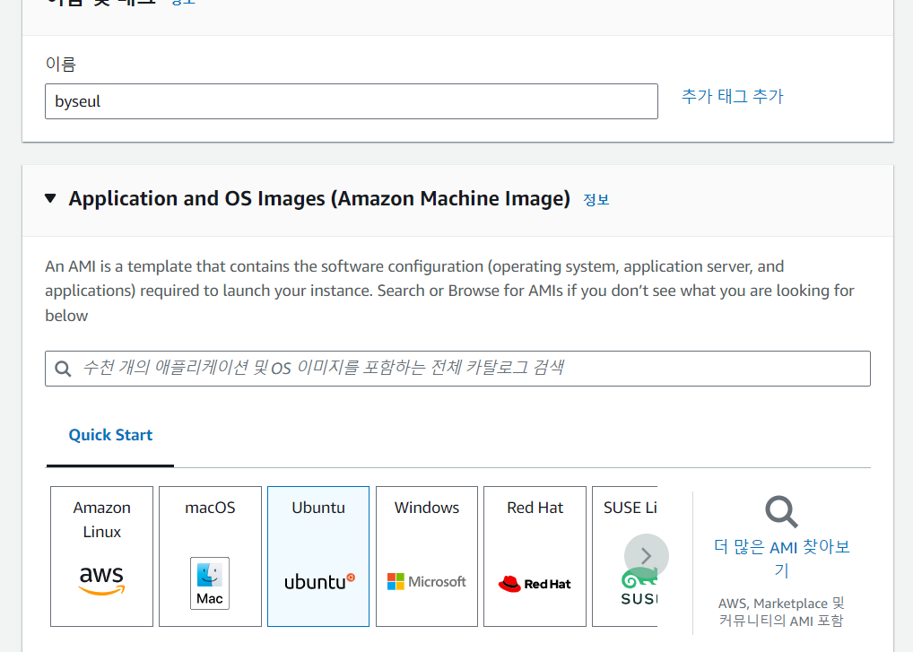
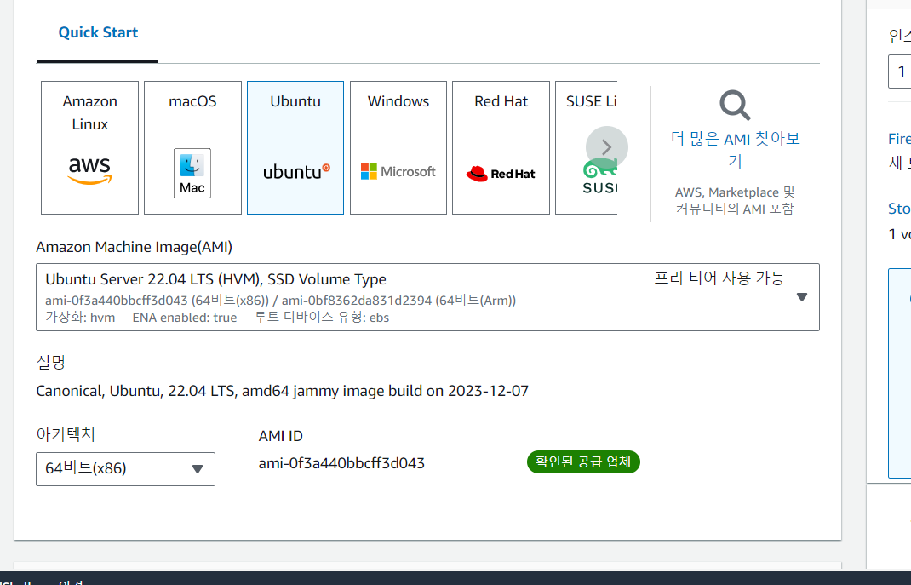
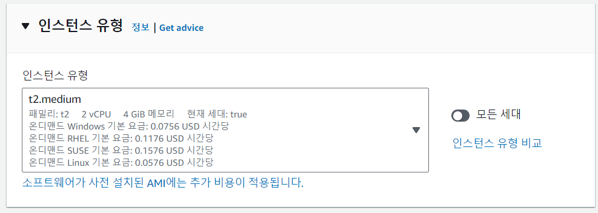

- 저장소 비용 따로
- 네트워크 비용 따로
- 각 컴퓨터에 spark 가 올라가져 있다 → 설정을 하면

### EC2

- 컴퓨터를 켜지는 곳
- AWS 가상머신

### EMR

- 하둡 분석 시스템 = AWS 하둡

### S3

- 데이터 넣기 (AWS 데이터 저장소)
- AWS 의 구글 드라이브

### RDS

- 아마존에서 제공하는 DB
- 오라클, MySQL, MariaDB, PostgreSQL, DB2, MSSQL 등
- 비싸
    - 고가용성
- 네트워크 지식 필요
    - Gateway
    - Proxy
    - 등등

### IAM

- 사용자권한
- 사용자 → 사용자 생성

### 인스턴스 만들기

---

### On-premise

- 전통적인 IT 서비스 방식

### IaaS (Infrastructure as a Service)

- 인프라 네트워크장비
- 클라우드에서 제공해주는 자원을 쓰겠다. ⇒ AWS

### PaaS

- 플랫폼 서비스
- API를 제공해 개발자가 좀 더 편하게 개발할 수 있도록 지원

### SaaS

- 소프트웨어 제공
- 노션, Gmail, Office, Naver Mail, Amazon
- 웹에 접속해서 사용

### 라우터 (Router)

- 서로 다른 지역의 컴퓨터를 연결하는 기기
- 2개 이상의 네트워크와 네트워크 간 데이터 전송을 위한 최적 경로를 설정해주며, 데이터를 해당 경로를 따라 한 통신망에서 다른 통신망으로 통신 가능하게 도와주는 인터넷 접속 장비
- 네트워크를 통해 정보를 주고받을 때 데이터에 담긴 수신처의 주소를 읽고 가장 적절한 통신 경로를 이용해 다른 통신망으로 전송하는 장치, 전화국이랑 비슷

### 스위치 (Switch)

- 공유기
- 하나의 스위치에 여러개의 컴퓨터가 붙어서 사용

### 방화벽 (Firewall)

- 현관문