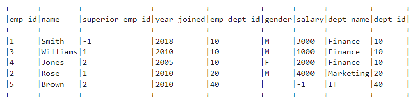
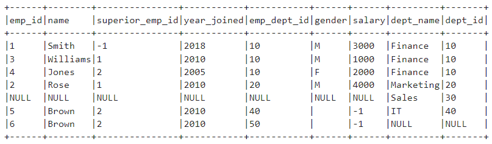
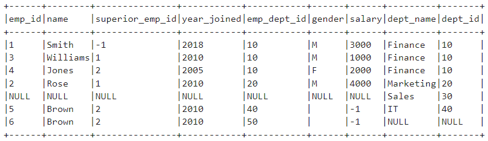
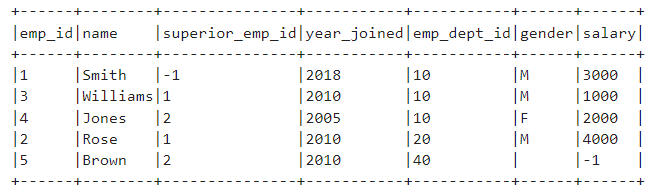
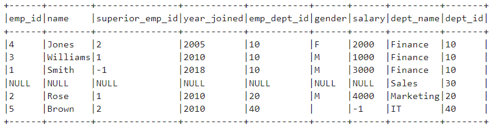
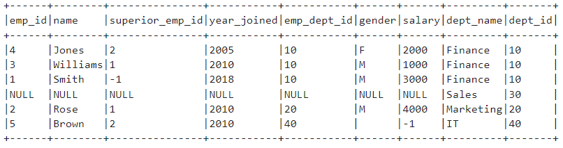

- 세일즈 메이커
    - 아마존에서 제공하는 코랩
    - 주피터와 동일
    - EMR 연동 가능
    - GPU 지원 해줌
    - 금액이 비쌈

### AWS

- EC2
- 인스턴스 시작
- 서버 실행
    - 본인 인스턴스 Public IP로 서버 열기
        - 키 넣어서
- EC2안에 Docker를 설치하고 Container로 Spark를 띄울 것

### Docker 설정

- Docker 설치하기 위해 Docker 공식 GPG key 등록
    - Docker official GPG key
    - Docker를 설치하기 위한 저장소(repository)를 시스템에 추가하는 작업
    - Docker의 공식 GPG 키가 시스템에 추가되고, Docker APT 저장소가 APT 소스 리스트에 등록되어 Docker를 설치할 수 있는 환경을 설정
        - 이후에 **`sudo apt-get update`** 및 **`sudo apt-get install docker-ce docker-ce-cli containerd.io`** 명령어를 사용하여 Docker를 설치 가능
    - Docker 공식 GPG 키 추가 & APT 저장소에 Docker 저장소 추가
        
        ```bash
        # Add Docker's official GPG key:
        # APT 패키지 업데이트
        sudo apt-get update
        # gnupg : GPG 관련작업
        sudo apt-get install ca-certificates curl gnupg
        # GPG 키를 저장하는 곳
        sudo install -m 0755 -d /etc/apt/keyrings
        # GPG 키 다운로드하고 docker.gpg 파일로 저장
        curl -fsSL https://download.docker.com/linux/ubuntu/gpg | sudo gpg --dearmor -o /etc/apt/keyrings/docker.gpg
        # 키파일 읽기 권한 부여
        sudo chmod a+r /etc/apt/keyrings/docker.gpg
        
        # Add the repository to Apt sources:
        # APT 저장소에 Docker 저장소 추가
        # docker.list 파일에 Docker의 APT 저장소를 추가
        # 이 저장소는 Docker를 설치할 때 사용됨
        # dpkg --print-architecture : 시스템 아키텍쳐를 가져오기
        # $(. /etc/os-release && echo "$VERSION_CODENAME") : 운영체제 코드명을 가져온다.
        echo \
          "deb [arch="$(dpkg --print-architecture)" signed-by=/etc/apt/keyrings/docker.gpg] https://download.docker.com/linux/ubuntu \
          "$(. /etc/os-release && echo "$VERSION_CODENAME")" stable" | \
          sudo tee /etc/apt/sources.list.d/docker.list > /dev/null
        
        ```
        
        ```bash
        sudo apt-get update
        ```
        
        ```bash
        sudo apt-get install docker-ce docker-ce-cli containerd.io docker-buildx-plugin docker-compose-plugin
        ```
        
- 서비스 상태 확인 (active 확인)
    - sudo service docker status

### Jupyter 실행

- EC2에 가상 공간이 생김 (Spark)
    
    ```bash
    sudo docker run -p 8888:8888 -e JUPYTER_ENABLE_LAB=yes --restart always jupyter/all-spark-notebook
    ```
    
    - 주피터를 이용해 스파크환경을 만들어 놓은 것을 다운받고
        - -e JUPYTER_ENABLE_LAB=yes --restart always jupyter/all-spark-notebook
    - 8888포트로 해줘
        - -p 8888:8888
- 본인 ec2의 보안그룹
    - 인바운드 규칙 추가 8888
        - 모든 TCP :  포트 걱정 없이 사용 (차피 엔코아 내부에서 할거니까)
        - 아니면 사용자 지정해서 설정
    - 내 아이피 등록
- 내 인스턴스 Public IP:8888로 Jupyter 접속

### Jupyter 작업 (Spark 문법 학습)

```python
pip install findspark
```

- Spark 연결
    
    ```python
    import findspark
    findspark.find()
    
    from pyspark import SparkContext, SparkConf
    from pyspark.sql import SparkSession
    
    spark = SparkSession.builder \
        .master("local") \
        .appName("Spark") \
        .config("spark.sql.repl.eagerEval.enabled", True) \
        .getOrCreate()
    ```
    
- 테이블
    
    ```python
    import pyspark
    from pyspark.sql import SparkSession
    
    emp = [(1,"Smith",-1,"2018","10","M",3000), \
        (2,"Rose",1,"2010","20","M",4000), \
        (3,"Williams",1,"2010","10","M",1000), \
        (4,"Jones",2,"2005","10","F",2000), \
        (5,"Brown",2,"2010","40","",-1), \
          (6,"Brown",2,"2010","50","",-1) \
      ]
    empColumns = ["emp_id","name","superior_emp_id","year_joined", \
           "emp_dept_id","gender","salary"]
    
    empDF = spark.createDataFrame(data=emp, schema = empColumns)
    ```
    
    ```python
    empDF.show()
    ```
    
    ```python
    dept = [("Finance",10), \
        ("Marketing",20), \
        ("Sales",30), \
        ("IT",40) \
      ]
    deptColumns = ["dept_name","dept_id"]
    deptDF = spark.createDataFrame(data=dept, schema = deptColumns)
    ```
    
    ```python
    deptDF.show()
    ```
    
- join(조인할 테이블, 어떤 키로 조인할 것인지, 조인 종류)
    - inner
        
        ```python
        empDF.join(deptDF,empDF.emp_dept_id ==  deptDF.dept_id,"inner") \
             .show(truncate=False)
        ```
        
        
        
    - outer
        
        ```python
        empDF.join(deptDF,empDF.emp_dept_id ==  deptDF.dept_id,"outer") \
             .show(truncate=False)
        ```
        
        
        
    - full
        
        ```python
        empDF.join(deptDF,empDF.emp_dept_id ==  deptDF.dept_id,"full") \
             .show(truncate=False)
        ```
        
        
        
    - fullouter
        
        ```python
        empDF.join(deptDF,empDF.emp_dept_id ==  deptDF.dept_id,"fullouter") \
             .show(truncate=False)
        ```
        
        
        
    - leftsemi (lefi join)
        
        ```python
        empDF.join(deptDF,empDF.emp_dept_id ==  deptDF.dept_id,"leftsemi") \
             .show(truncate=False)
        ```
        
        
        
    - right (Right join)
        
        ```python
        empDF.join(deptDF,empDF.emp_dept_id ==  deptDF.dept_id,"right") \
           .show(truncate=False)
        ```
        
        
        
    - rightouter
        
        ```python
        empDF.join(deptDF,empDF.emp_dept_id ==  deptDF.dept_id,"rightouter") \
           .show(truncate=False)
        ```
        
        
        
- 데이터 다운받기
    - 터미널
        
        ```bash
        cd work 
        git clone https://github.com/FVBros/Spark-The-Definitive-Guide.git
        git clone https://github.com/databricks/LearningSparkV2.git
        ```
        
- 주피터
    
    ```python
    path = "/home/jovyan/work/LearningSparkV2/databricks-datasets/learning-spark-v2/flights/departuredelays.csv"
    ```
    
    ```python
    # 스키마 추론하고 추론한거 헤더 쓸거야.
    # 데이터에 담아줘
    df = spark.read.format("csv").option("inferSchema", "true").option("header", "true").load(path)
    
    # 데이터 보여줘
    df.show()
    ```
    
    - printSchema
        - 테이블 정보 : 컬럼명, 데이터 타입
        
        ```python
        df.printSchema()
        ```
        
        ```python
        # 테이블로 만들고 싶어
        df.createOrReplaceTempView("us_delay_flights_tbl")
        ```
        
    - spark에서 sql 사용
        
        ```python
        # spark sql문으로 사용하기
        spark.sql("SELECT * FROM us_delay_flights_tbl LIMIT 5")
        ```
        
    - 비행거리가 1000 초과되는 결과 출력 (정렬)
        
        ```python
        spark.sql(
            """SELECT *
            FROM us_delay_flights_tbl
            WHERE distance > 1000 ORDER BY distance"""
        )
        ```
        
    - Origin = SFO(샌프랑시스코) / DESTINATION = ORD (시카고) / 2시간 이상 지연된 값들 출력
        
        ```python
        spark.sql(
            """SELECT *
            FROM us_delay_flights_tbl
            WHERE origin = "SFO"
            AND destination = "ORD"
            AND delay >= 2
            ORDER BY delay"""
        )
        # COUNT
        spark.sql(
            """SELECT COUNT(*)
            FROM (SELECT *
            FROM us_delay_flights_tbl
            WHERE origin = "SFO"
            AND destination = "ORD"
            AND delay >= 2
            ORDER BY delay)"""
        )
        ```
        
    - delay 시간별 상태 정의
        
        ```python
        spark.sql(
            """
            SELECT delay, origin, destination,
                CASE
                    WHEN delay > 360 THEN "왕짜증"
                    WHEN delay >= 120 AND delay <=360 THEN "짜증"
                    WHEN delay >= 60 AND delay < 120 THEN "....."
                    WHEN delay > 0 AND delay < 60 THEN "그정도야 뭐.."
                    ELSE "가자"
                END AS delay_status
            FROM us_delay_flights_tbl
            """
        )
        ```
        
    - 데이터를 pandas로 저장
        
        ```python
        pandas = spark.sql(
        			    """
        			    SELECT delay, origin, destination,
        			        CASE
        			            WHEN delay > 360 THEN "왕짜증"
        			            WHEN delay >= 120 AND delay <=360 THEN "짜증"
        			            WHEN delay >= 60 AND delay < 120 THEN "....."
        			            WHEN delay > 0 AND delay < 60 THEN "그정도야 뭐.."
        			            ELSE "가자"
        			        END AS delay_status
        			    FROM us_delay_flights_tbl
        			    """
        ).toPandas()
        ```
        
- Parquet
    - 하둡에서 컬럼방식으로 저장하는 저장포맷
    - 데이터 읽어오기 (parquet)
        
        ```python
        path_parquet = "/home/jovyan/work/LearningSparkV2/databricks-datasets/learning-spark-v2/flights/summary-data/parquet/2010-summary.parquet/"
        df2 = spark.read.format("parquet").load(path_parquet)
        ```
        

### XML Parse

- xml 파일 url 받아오기
    
    ```python
    import requests 
    import xml.etree.ElementTree as ET
    
    url = "http://apis.data.go.kr/B552584/ArpltnInforInqireSvc/getMsrstnAcctoRltmMesureDnsty?serviceKey=34lIyWAciAsJlGtIZ4ltpLy2sLZDR%2BBRWvAv8RgoADNEd%2BKCgHe84XiSRUwL8JMMIubzsFW3ddjcNlhZHhvJIQ%3D%3D&returnType=xml&numOfRows=100&pageNo=1&stationName=%EC%A2%85%EB%A1%9C%EA%B5%AC&dataTerm=DAILY&ver=1.0"
    r = requests.get(url)
    root = ET.fromstring(r.text)
    ```
    
- 가져온 데이터 DataFrame화
    
    ```python
    # 반복해서 해당 tag의 값을 가져오고 싶어
    items = root.iter(tag = "item")
    ```
    
    ```python
    total = []
    for item in items:
        tmp_dict = {}
        for x in item:
            tmp_dict[x.tag] = x.text
        total.append(tmp_dict)
    
    import pandas as pd
    pd.DataFrame(total)
    ```
    

### Crontab

- xml 데이터를 csv 파일로 crontab 등록해서 저장하기
- 배치 돌릴 python 파일만들기 : air.py

```python
import xml.etree.ElementTree as ET
import requests
import pandas as pd
from datetime import date, datetime

def main():
    url = "http://apis.data.go.kr/B552584/ArpltnInforInqireSvc/getMsrstnAcctoRltmMesureDnsty?serviceKey=34lIyWAciAsJlGtIZ4ltpLy2sLZDR%2BBRWvAv8RgoADNEd%2BKCgHe84XiSRUwL8JMMIubzsFW3ddjcNlhZHhvJIQ%3D%3D&returnType=xml&numOfRows=1000&pageNo=1&stationName=서초구&dataTerm=DAILY&ver=1.0"
    r= requests.get(url)
    root = ET.fromstring(r.text)
    items = root.iter(tag='item')
    total = []
    for item in items:
        tmp_dict ={}
        for x in item:
            tmp_dict[x.tag] =  x.text
        total.append(tmp_dict)

    pd.DataFrame(total).to_csv(f"~/air_{datetime.now().strftime('%y%m%d_%H%M%S')}.csv", index=False)

if __name__ == "__main__":
    main()
```

- crontab에 등록할 shell 파일 만들기 : batch.sh

```bash
#!/bin/bash
/usr/bin/python3 /home/ubuntu/air.py
```

- batch.sh 실행권한 주기
    - chmod +x batch.sh
- crontab에 등록하기
    - crontab -e
    
    ```bash
    * * * * * /home/ubuntu/batch.sh
    ```