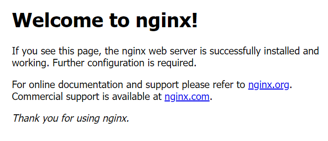

1. Dev & Git server
    1. public IP :
    2. private IP :
    3. Git server에 push
2. Web Server
    1. public IP : 
    2. private IP :
    3. Git server에서 pull
3. Was
    1. public IP : 
    2. private IP :
    3. Git server에서 pull

---

- 새로운 인스턴스 생성
    - was / web
- 각 서버에 내 윈도우 ssh-key 등록(Terminal 사용시)
    - putty는 설정해주기 때문에 무상관
- 각 서버 들어간 후 ssh-key 생성
- 연결확인 (ping)
    - 보안그룹 → 인바운드 규칙
    - ICMP-IPv4 선택
        - ICPM : ping 프로그램이 쓰고 있는 프로토콜
    - 내 보안그룹 선택
    - 규칙 저장
- dev(git)에 was, web의 ssh-key 서로 등록
    - was와 web은 dev(git)에서 접근해서 pull 을 받아야 하기 때문에
    - was, web은 서로 통신할 일은 없다.
- was, web에 workspace 폴더 만들기
    - mkdir ~/workspace
    - cd workspace
- dev(git)에서 pull 받아오기
    - git clone ssh://{서버명}:{repository 경로}
- vscode 수정 (IP가 수정되어서)
    - git remote 연결 해제
        - git remote remove origin
    - git remote 등록
        - git remote add origin ssh://ubuntu@{IP}:/home/ubuntu/repos
- was, web에 설치
    - sudo apt update
    - sudo apt install python3-pip
        - enter
    - mysqlclient 설치
        - sudo apt-get install python3-dev default-libmysqlclient-dev build-essential pkg-config
    - pip3 install -r requirements.txt
- web
    - sudo apt install nginx
    - 인터넷에 public IP 치면 아래와 같은 화면 나옴
    
    
    

- web 운영 넘기기
    - static(정적인 것)을 nginx가 바라보게 만든다
    - was에서 정적인 것을 설정 못하니까 web으로 던진다
    - vscode
        - python manage.py collectstatic
        - 에러발생시 settings.py 수정
            - STATIC_ROOT = BASE_DIR / 'static/'
            - STATICFILES_DIRS = []
            - DEBUG = False
        - 다시 collectstatic 실행
        - git push
    - web, was git pull
- was gunicorn 설정
    - sudo apt install gunicorn
        - Enter
    - gunicorn —bind 0:8000 mysite.wsgi:application
    - 정적인 것이 적용이 안된다. ⇒ web을 붙여야 한다.
- web
    - cd /etc/nginx/sites-available
        - default 파일 삭제
        - mysite 파일 만들기
            - sudo vi mysite
            
            ```bash
            upstream pybo {
                server {hostname}:8000;
            }
            
            server {
                listen 80;
            
                location / {
                    proxy_pass      http://{hostname}:8000;
                    proxy_set_header X-Forwarded-For $proxy_add_x_forwarded_for;
                    proxy_set_header Host $host;
                    proxy_redirect off;
                }
            
                location /static {
                    alias /home/ubuntu/workspace/repos/static;
                }
            }
            ```
            
    - cd /etc/nginx/sites-enabled
        - link된 default 파일 삭제
        - link 걸기
            - sudo ln -s /etc/nginx/sites-available/mysite
    - cd /etc/nginx
        - sudo vi nginx.conf
            - user www-data ⇒ user root 변경
    - nginx 재실행
        - sudo service nginx restart
- aws
    - 보안그룹끼리의 방화벽 뚫기
    - 인바운드 규칙 추가
        - 모든 TCP → 내 보안그룹