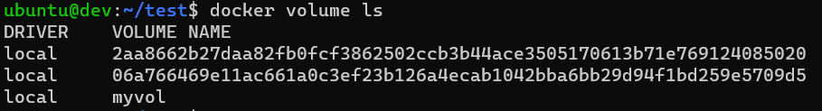
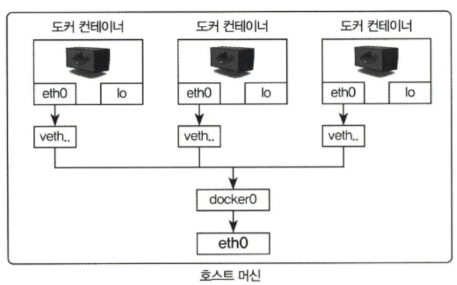

- MSA(Micro Service Architecture) & DevOps & MLOps ⇒ 컨테이너사용하는 회사

### 도커 컨테이너

- 아파치 웹, nginx, mysql, 하둡, 스파크 여러 이미지 존재
- Ubuntu를 사용하는 이유
    - GPU를 가상화 해서 적용이 가능 (Windows는 늦었음)
    - Ubuntu 위에 docker를 깔고 위에 nvidia를 깔고 사용가능
- 한번 만든 컨테이너는 변경이 불가 ⇒ 다시 만들어야함
- 하나의 컨테이너 안에 하나의 서비스만 담는 것을 권장
    - Web, Was, DB 따로 해서 묶어야 한다 ⇒ 도커 컴포즈
- 컨테이너 안에 들어가서 확인하고 싶다.
    
    ```bash
    docker exec -it {컨테이너명} /bin/bash
    ```
    

### 도커 이미지

- 불변성 ⇒ 읽기 전용 : iso 파일과 비슷한 개념
- 레이어 구조로 구성되어 있음
    - 공통된 레이어가 존재하면 같이 쓴다.
    - 없으면 새로 다운 받아서 사용한다.
    - 용량이 비교적 적게 차지함.
- docker run -it —name mycentos centos:7 (아래 4개를 한번에 적용해서 실행)
    - docker pull centos:7
    - docker create -it —name mycentos centos:7
    - docker start mycentos
    - docker attach mycentos
- 도커 볼륨
    - 호스트 파일과 공유가 가능
    - 컨테이너가 삭제가 되도 공유한 파일은 남아있다.
        - 반대로 호스트에 남아있는 파일로 컨테이너 생성 가능
    - 볼륨 컨테이너

---

## 실습

- EC2 실행
- Elastic Container Registry & Elastic Container Service
    - AWS에서 제공하는 private한 이미지 관리할 수 있는 페이지
- EKS (Elastic K8s Service)
- 탄력적 IP (한달에 6천원 정도)
    - 주소할당 ⇒ 연결

### Volume

- 볼륨 이미지 받기

```bash
docker run -it --name volume_dummy alicek106/volume_test
```

```bash
- /home/testdir_2
- exit
- mkdir ~/test
- cd test
- echo "Hi" >> a.txt
```

- docker run -it --name volume_overide -v ~/test:/home/testdir_2 alicek106/volume_test
    - 호스트에 ~/test 폴더를 도커에 /home/testdir_2가 바라본다.
- 각 다른 터미널에서 실행
    - docker run -it --name {컨테이너명} --volumes-from {만든 볼륨 컨테이너명} {이미지}
        
        ```bash
        docker run -it --name vol_from_cont1 --volumes-from volume_overide ubuntu:14.04
        docker run -it --name vol_from_cont2 --volumes-from volume_overide ubuntu:14.04
        ```
        
        - ⭐ cont1, cont2, host는 동기화가 된다.
        - host에서 소스코드 변경시 cont1와 cont2에 적용이 된다.
            - Web, Was, Dev
- 볼륨 컨테이너 생성
    - docker volume create --name {만들 볼륨명}
        
        ```bash
        docker volume create --name myvol
        ```
        
- 볼륨 리스트 확인
    - docker volume ls
    
    
    
- 볼륨 내용 확인
    - docker inspect myvol
    
    ```bash
    [
        {
            "CreatedAt": "2024-01-30T01:18:59Z",
            "Driver": "local",
            "Labels": null,
            "Mountpoint": "/var/lib/docker/volumes/myvol/_data",
            "Name": "myvol",
            "Options": null,
            "Scope": "local"
        }
    ]
    ```
    
    - Mountpoint
        - 실제 호스트 위치
- 만든 볼륨 컨테이너를 공유하여 새로운 컨테이너 생성
    - docker run -it --name {컨테이너명} -v {만든 볼륨명}:{연결경로} {이미지}
        
        ```bash
        docker run -it --name myvol_1 -v myvol:/root ubuntu:14.04
        docker run -it --name myvol_2 -v myvol:/root ubuntu:14.04
        ```
        
        - myvol_1과 myvol_2는 같은 볼륨 컨테이너를 바라보고 있기 때문에 동기화되어 있다.
- ⭐ myvol을 삭제할 때 연결된 컨테이너들을 지우고 지워야 한다
    - docker stop $(docker ps -a -q) : 모든 컨테이너 종료 후
    - docker rm $(docker ps -a -q) : 모든 컨테이너 삭제
    - docker volume rm myvol : 지정 볼륨 삭제
- 현재 사용 중인 상태가 아닌 볼륨 전부 제거
    - docker volume prune ⇒ y
- 도커 이미지 확인
    - docker images

### ⭐ 도커 네트워크 확인

- 호스트에서 ip a
- 도커 컨테이너를 run해서 만드는 순간 가상으로 네트워크를 하나 만든다.
- 도커 컨테이너 생성
    
    ```bash
    docker run -it ubuntu:14.04
    docker run -it ubuntu:14.04
    ```
    
- 각 컨테이너 안에 들어가서 ip a 쳐서 각자 IP 확인
- 호스트에서 ping {컨테이터 IP} 하면 연결됨
- 각자 컨테이너에서 서로의 IP를 ping 해도 연결됨



- 컨테이너를 생성하면 기본적으로 docker0 브리지를 통해 외부와 통신할 수 있는 환경을 사용할 수 있음
    
    ```bash
    sudo apt install bridge-utils
    brctl show docker0
    ```
    
- 네트워크 생성
    - docker network create --driver bridge {네트워크명}
        
        ```bash
        docker network create --driver bridge mybridge
        ```
        
    - 생성한 네트워크에서 컨테이너 생성
        - docker run -it --name {컨테이너명} --net {네트워크명} {이미지}
        
        ```bash
        docker run -it --name mynetwork_cont --net mybridge ubuntu:14.04
        ```
        
    - 기존 생성된 네트워크와 통신 불가
        - 기존은 172.17.0.2
        - 생성한 네트워크는 172.18.0.2
- 네트워트 접속 끊기
    - docker network disconnect {만든 네트워크명} {해당 네트워크로 만든 컨테이너명}
    
    ```bash
    docker network disconnect mybridge myentwork_cont
    ```
    
- 컨테이너 네트워크
    - --net 옵션으로 container를 입력하면 다른 컨테이너의 네트워크 네임스페이스 환경을 공유할 수 있음

### nginx를 이용한 컨테이너 로드 밸런스 구축

- 네트워크 상태확인하기 위한 툴 설치 (ipconfig, netstat 명령어 사용하기 위해)
    
    ```bash
    sudo apt install net-tools
    ```
    
- 현재 살아있는 포트 확인 (sudo 권한)
    
    ```bash
    sudo netstat -ntlp
    sudo netstat -ntlp | grep 80 ⇒ 특정 포트 확인
    ```
    
- Dockerfile 가지고 이미지를 만들기
    
    ```bash
    FROM php:7.2-apache
    
    MAINTAINER datastory Hub <hylee@dshub.cloud>
    
    ADD index.php /var/www/html/index.php
    
    EXPOSE 80
    
    CMD ["/usr/sbin/apache2ctl", "-D", "FOREGROUND"]
    ```
    
    - php 7.2-apache 확
    - 
    - 도커 이미지 빌드
        - 도커 파일이 있는 경로에서 실행해야함
        
        ```bash
        docker build -t phpserver:1.0 .
        ```
        
        - 도커 파일을 빌드할 것이고 이미지 이름은 phpserver로 Tag(버전)는 1.0으로 하겠다.
- 빌드한 이미지로 컨테이너 생성
    
    ```bash
    docker run -itd -p 5001:80 \
    -h nginx-lb01 \
    -v ./lb01:/var/log/apache2 \ # lb01 폴더가 없으면 만든다.
    -e SERVER_PORT=5001 \
    --name=nginx-lb01 \
    phpserver:1.0
    ```
    
    ```bash
    docker run -itd -p 5002:80 \
    -h nginx-lb02 \
    -v ./lb02:/var/log/apache2 \
    -e SERVER_PORT=5002 \
    --name=nginx-lb02 \
    phpserver:1.0
    ```
    
    ```bash
    docker run -itd -p 5003:80 \
    -h nginx-lb03 \
    -v ./lb03:/var/log/apache2 \
    -e SERVER_PORT=5003 \
    --name=nginx-lb03 \
    phpserver:1.0
    ```
    
- php 파일 복사
    
    ```bash
    docker cp index.php3 nginx-lb01:/var/www/html/index.php
    docker cp index.php3 nginx-lb02:/var/www/html/index.php
    docker cp index.php3 nginx-lb03:/var/www/html/index.php
    ```
    
- nginx.conf 파일 수정
    - sudo vim /etc/nginx/nginx.conf
    - events 부터 다 지우기
    - 내용 추가
        
        ```bash
        events {
        	worker_connections 1024;
        }
        
        http {
        	upstream backend-lb {
            server 127.0.0.1:5001;
            server 127.0.0.1:5002;
            server 127.0.0.1:5003;
        	}
        	
        	server {
            listen 80 default_server;
            listen [::]:80 default_server;
        
            # 연결 프락시 정보
            location / {
              proxy_pass      http://backend-lb;
            }
        	}
        }
        ```
        
- nginx 로드 밸런스 연결 알고리즘
    - Round-Robin, RR(기본값)
        - 클라이언트 요청을 서버 가중치를 고려하여 구성된 서버에 균등 배분하는 방식
        - 경로 보장 안됨
    - least connections
        - 현재 연결된 클라이언트 수가 가장 적은 서버로 요청 전달
        - 경로 보장 안됨
    - IP hash
        - 해시 키를 이용하여 IP별 Index를 생성하여 동일 IP 주소는 동일 서버로의 경로 보장
        - 해당 서버 장애 시 주소 변경됨
        - 균등 배분 보장 안됨
    - general hash
        - 사용자가 정의하는 키(IP, Port, URI 문자열등)을 이용한 서버 지정 방식
    - least time
        - 요청에 대한 낮은 평균 지연시간을 다음 지시자를 기준으로 계산하여 서버 지정
    - random
        - 요청에 대한 무작위 서버를 선택하여 특정 기준을 두고 부합되는 서버 선택도 가능
- 도커 이미지 삭제
    - 연결된 컨테이너가 다 삭제되어야 삭제 가능함
    - docker rmi {이미지명}:{태그}
    
    ```bash
    docker rmi phpserver:1.0
    ```
    

### Airflow

- 데이터 파이프라인을 구성하는 프레임워크
- 파이프라인 구축을 위한 batch Task
- 파이프라인이나 워크플로우 Task를 방향성 비순환 그래프(DAG)로 정의
- 데이터 파이프라인을 그래프로 나타내준다.
    - Task를 하나의 노드로 표시
    - Task 간의 의존성 표시
- DAG
- Airflow 웹 서버
- Airflow 스케줄러
- DAG 파일을 작성하면 Airflow가 해석해서 의존성을 확인하고 스케줄
- 장점
    - 파이썬 코드를 이용해 파이프라인을 구현 가능
    - 복잡한 커스텀 파이프라인도 구성 가능
    - 쉬운 확장 가능
    - 다양한 시스템과 통합이 가능
        - 데이터베이스, 클라우드
    - 백필
        - 하나의 플로우(DAG)를 특정 옵션(기간) 기준으로 다시 실행할 수 있는 기능
- 웹 인터페이스는 파이프라인 실행 결과를 모니터링할 수 있고 오류를 디버깅하기 위한 편리한 뷰 제공

### Airflow가 적합하지 않은 경우

- 실시간 처리에 적합하지 않음 ⇒ Kafka
    - 배치 태스크를 실행하는 기능에 초점이 맞춰져 있기 때문에
- 추가, 삭제 태스크가 빈번한 동적 파이프라인의 경우에 적합하지 않음
    - 구현가능하지만 웹 인터페이스는 DAG의 가장 최근 실행 버전에 대한 정의만 표현함
    - 이전 히스토리를 보기 힘들다.
- 파이썬 경험이 없으면 힘듦

## 실습

- DAG 파일 (download_rocket_launches.py) 서버로 옮기기
- airflow docker
    
    ```bash
    docker run -it -p 8080:8080 -v /home/ubuntu/airflow:/opt/airflow/dags/ --entrypoint=/bin/bash --name airflow2 apache/airflow:2.0.0-python3.8
    ```
    
- db 설정 (아마 sqlite로 되어 있을것)
    
    ```bash
    airflow db init
    ```
    
- user 생성
    
    ```bash
    airflow users create --username admin --password admin --firstname Anonymous --lastname Admin --role Admin --email admin@example.org
    ```
    
- webserver 실행
    
    ```bash
    airflow webserver &
    ```
    
- airflow 스케줄러 띄우기
    
    ```bash
    airflow scheduler
    ```
    
- IP:8080 들어가기
- login
    - admin / admin
- DAG 트리거 활성화 ⇒ 실행
- DAG 파일 해석
    - crontab 앞부분
        
        ```bash
        dag = DAG(
          dag_id="download_rocket_launches",
          description="Download rocket pictures of recently launched rockets.",
          start_date=airflow.utils.dates.days_ago(14),
          schedule_interval="@daily",
        )
        ```
        
    - BashOperator등록 : 실제 bash 명령어를 실행하는 부분
        
        ```bash
        download_launches = BashOperator(
        	# Task 명
          task_id="download_launches",
        	# 사용할 bash 명령어
          bash_command="curl -o /tmp/launches.json -L 'https://ll.thespacedevs.com/2.0.0/launch/upcoming'",  # noqa: E501
          dag=dag,
        )
        ```
        
    - 사용자 함수
        
        ```bash
        def _get_pictures():
        	....
        ```
        
    - 파이썬 오퍼레이션에 등록
        
        ```bash
        get_pictures = PythonOperator(
          task_id="get_pictures", python_callable=_get_pictures, dag=dag
        )
        ```
        
    - BashOperator : bash 명령어
        
        ```bash
        notify = BashOperator(
          task_id="notify",
          bash_command='echo "There are now $(ls /tmp/images/ | wc -l) images."',
          dag=dag,
        )
        ```
        
    - 실제 실행 순서
        
        ```bash
        download_launches >> get_pictures >> notify
        ```
        
- airflow 들어가기
    
    ```bash
    docker exec -it airflow2 bash
    cd /tmp/images
    ls
    ```
    
    - 그 전 Task 작동완료가 되어야 그 다음 Task가 실행된다.