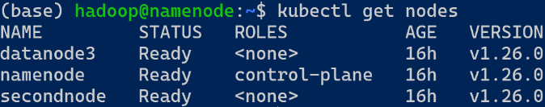

### Master(namenode)에서 node 상태 확인

- kubectl get nodes
    
    
    

### calico

- 3개노드 네트워크 연결
- calico 설치
    
    ```bash
    kubectl create -f https://raw.githubusercontent.com/projectcalico/calico/v3.24.5/manifests/tigera-operator.yaml
    ```
    
    ```bash
    wget https://raw.githubusercontent.com/projectcalico/calico/v3.24.5/manifests/custom-resources.yaml
    ```
    
- yaml 파일 수정
    
    ```bash
    vim custom-resources.yaml
    # ip 변경 ->  172.16.0.0/16
    ```
    
- yaml 파일을 통해 설정
    
    ```bash
    kubectl create -f custom-resources.yaml
    ```
    
- 설치되었는지 확인
    - kubectl get pods --all-namespaces
- swap 영구 제거
    
    ```bash
    sudo vim /etc/fstab
    # swap적혀 있는 부분 주석처리
    ```
    

### k9s

- 쿠버네티스가 살아있는지 확인하는 것
- 여러 명령어를 한번에 실행해서 확인시켜줌

```bash
wget https://github.com/derailed/k9s/releases/download/v0.13.7/k9s_0.13.7_Linux_i386.tar.gz
tar xvzf k9s_0.13.7_Linux_i386.tar.gz

sudo mv k9s /usr/bin
```

- pods 만들어보기
    - yaml 파일 생성
    - nginx-pod.yaml 파일에 정의된 파드를 Kubernetes 클러스터에 생성
        - vim nginx-pod.yaml
    
    ```bash
    apiVersion: v1
    kind: Pod
    metadata:
    name: nginx-pod
    spec:
    containers:
    - name: container-name
    image: nginx
    ```
    
    - kubectl create -f ./nginx-pod.yaml
- 만들어졌는지 확인
    - 방법1 : k9s
    - 방법2 : kubectl get pods -o wide