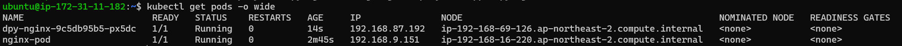
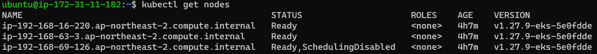
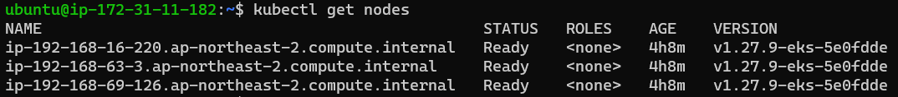

### AWS 인스턴스만들어서 Kubernetes 환경 설정

⭐ 숨만 쉬어도 돈이 나간다!!

- AWS 에서 인스턴스 생성
    - 제어하기 위한 ec2 인스턴스 생성
        - t2.small , storage -> 20G
- Windows Terminals 인스턴스 로그인
- aws cli 설치
    
    ```bash
    sudo apt-get install -y unzip
    
    curl "https://awscli.amazonaws.com/awscli-exe-linux-x86_64.zip" -o "awscliv2.zip"
    
    unzip awscliv2.zip
    
    sudo ./aws/install
    
    aws --version
        - 2.15.17
    ```
    
- AWS configure 설정
    
    ```bash
    AWS Access Key ID [None]: 액세스키
    AWS Secret Access Key [None]: 비밀_액세스키
    Default region name [None]: ap-northeast-2
    Default output format [None]: <Enter>
    ```
    
    - 등록 확인 (인증)
        
        ```bash
        aws sts get-caller-identity
        ```
        
- EKS를 툴 설치
    
    ```bash
    ARCH=amd64
    PLATFORM=$(uname -s)_$ARCH
    
    curl -sLO "https://github.com/eksctl-io/eksctl/releases/latest/download/eksctl_$PLATFORM.tar.gz"
    
    # (Optional) Verify checksum
    curl -sL "https://github.com/eksctl-io/eksctl/releases/latest/download/eksctl_checksums.txt" | grep $PLATFORM | sha256sum --check
    
    tar -xzf eksctl_$PLATFORM.tar.gz -C /tmp && rm eksctl_$PLATFORM.tar.gz
    
    sudo mv /tmp/eksctl /usr/local/bin
    ```
    
    - eksctl 명령어로 설치 확인
- kubectl 설치
    - 제어 툴
    
    ```bash
    curl -O https://s3.us-west-2.amazonaws.com/amazon-eks/1.27.7/2023-11-14/bin/linux/amd64/kubectl
    chmod +x ./kubectl
    mkdir -p $HOME/bin && cp ./kubectl $HOME/bin/kubectl && export PATH=$HOME/bin:$PATH
    echo 'export PATH=$HOME/bin:$PATH' >> ~/.bashrc
    kubectl version --short --client
    ```
    
- eks의 k8s 설치
    - 클러스터 생성
    - worker node 3대 / 3대는 t3.medium / size는 20
    - 권한 필요
        - AWSCloudFormationFullAccess
        - IAMFullAccess
        - AmazonEKSClusterPolicy
        - AmazonEKSServicePolicy
    - 인라인정책
        
        ```bash
        {
        	"Version": "2012-10-17",
        	"Statement": [
        		{
        			"Sid": "Statement1",
        			"Effect": "Allow",
        			"Action": [
        				"eks:CreateCluster",
        				"eks:UpdateClusterConfig",
        				"eks:DescribeCluster",
        				"eks:DescribeUpdate",
        				"eks:ListClusters",
        				"eks:ListUpdates",
        				"eks:DeleteCluster",
        				"eks:TagResource",
        				"eks:CreateNodegroup",
        				"eks:DescribeNodegroup",
        				"cloudformation:CreateStack",
        				"cloudformation:DeleteStack",
        				"cloudformation:DescribeStacks",
        				"iam:CreateRole",
        				"iam:TagRole",
        				"iam:DeleteRole",
        				"iam:AttachRolePolicy",
        				"iam:DetachRolePolicy",
        				"iam:PutRolePolicy",
        				"iam:DeleteRolePolicy"
        			],
        			"Resource": "*"
        		}
        	]
        }
        ```
        
    
    ```bash
    eksctl create cluster \
        --name byseul-k8s \
        --region ap-northeast-2 \
        --with-oidc \
        --ssh-access \
        --ssh-public-key byseul \
        --nodes 3 \
        --node-type t3.medium \
        --node-volume-size=20 \
        --managed
    ```
    
- kubectl 자동완성 사용하기
    
    ```bash
    source <(kubectl completion bash)
    echo "source <(kubectl completion bash)" >> ~/.bashrc
    ```
    
- 현재 띄어져 있는 cluster 확인
    
    ```bash
    kubectl get pods --all-namespaces
    ```
    
- AWS에서는 calico 개별 설치는 필요 없다.

### 용어 설명

- etcd
    - 쿠버네티스에서 사용하는 DB
    - key-value 형식
    - 장고
- kube-apiserver
    - k8s에 보내는 모든 요청은 kube-apiserver를 통해 컴포넌트로 전달
    - 관리자
- kube-scheduler
- kubelet (worker node)
    - 파드의 구성내용을 받아서 컨테이너 런타임으로 전달하고 파드 안의 컨테이너들이 정상적으로 작동하는지 모니터링
- kube-proxy (worker node)
    - 클러스터 안에 별도의 가상 네트워크를 설정하고 관리
    - 가상 네트워크의 동작을 관리하는 컴포넌트
    - 호스트의 네트워크 규칙을 관리하거나 연결을 전달할 수 있음
- 컨테이너 런타임 (CRI : Container Runtime Interface)
    - 파드를 이루는 컨테이너의 실행을 담당
    - 파드 안에서 다양한 종류의 컨테이너가 문제없이 작동하게 만드는 표준 인터페이스
    - 가장 많이 알려진 런타임으로 도커, containerd, runc 등이 존재
- DNS 애드온 (Domain Name Server)
    - 클러스터 안에서 동작하는 DNS 서버
    - 클러스트에서 도메인 이름을 이용해 통신하는데 사용
    - kube-dns, CoreDNS가 주로 사용됨
    - 실무에서 쿠버네티스 클러스터를 구성해 사용할 때는 IP보다는 도메인 네임을 편리하게 관리해주는 CoreDNS를 사용하는 것이 일반적
- 파드(pod)
    - k8s에서 컨테이너는 파드(pod)라는 단위로 관리
    - 파드 안에 컨테이너가 있다.
    - 좀비같은 아이
        - 서비스가 내려가면 자동적으로 복구하기 위해
        - 사용자가 강제로 삭제해도 살아난다.
- 서비스
    - 여러 개의 파드를 관리
    - 통신과 연관되어 있음
- 레플리카셋
    - 파드의 수 관리
    - 장애 들의 이유로 파드가 종료되었을 때, 부족한 파드를 보충하거나 정의 파일에 정의된 파드의 수가 감소하면 그만큼 파드의 수를 실제 감소시킴
    - 서비스랑 같은 레벨
    - self-healing 기능이 있기 때문에 자동복구 됨
- 디폴리먼트
    - 파드를 배포를 관리하는 요소
    - 파드가 사용하는 이미지 등의 정보를 갖고 있음
- 파드, 서비스, 레플리카셋, 디플리먼트 = 오브젝트
- 네임스페이스
    - k8s에서 사용되는 리소스들을 구분해 관리하는 그룹
    - 쿠버네티스를 가동할 때 필요한 것들은 kube-system

---

- pod 생성 방법 1
    
    
    
    - run으로 생성
    
    ```bash
    kubectl run nginx-pod --image=nginx
    ```
    
    - deployment로 생성
    
    ```bash
    kubectl create deployment dpy-nginx --image=nginx
    ```
    
- pod 삭제
    - kubectl delete pods {pod명}
        - run으로 생성한 것만 완전히 삭제됨
        - deployment로 생성한 것은 삭제 불가
    
    ```bash
    kubectl delete pods nginx-pod
    ```
    
    - kubectl delete deployment {pod명}
        - deployment로 생성한 것만 완전히 삭제됨
    
    ```bash
    kubectl delete deployment dpy-nginx
    ```
    
- yaml 파일로 pod 생성 방법 2
    - vi  echo-hname.yaml
    
    ```bash
    apiVersion: apps/v1
    kind: Deployment
    metadata:
      name: echo-hname
      labels:
        app: nginx
    spec:
      replicas: 3 # 파드의 수
      selector:
        matchLabels:
          app: nginx
      template:
        metadata:
          labels:
            app: nginx
        spec:
          containers:
          - name: echo-hname
            image: sysnet4admin/echo-hname
    ```
    
    ```bash
    kubectl create -f echo-hname.yaml
    ```
    
    - yaml 파일에서 pod 수 고치고 적용
    
    ```bash
    kubectl apply -f echo-hname.yaml
    ```
    
- pods 안에 컨테이너 들어가기
    
    ```bash
    k exec -it {pods명} -- /bin/bash
    ```
    
- 순차적 업데이트
    - Rolling update
    - pod 복제
        
        ```bash
        k scale deployment echo-hname --replicas=9
        ```
        
    - pod 줄이기
        
        ```bash
        k scale deployment echo-hname --replicas=3
        ```
        
    - node 정지 시키기 : 스케줄 정지
        - 해당 노드에 1 파드
        
        ```bash
        k cordon {pod node명}
        ```
        
    - 정지시키고 pod복제
        - 정지 시킨 노드는 복제가 안된다.
        
        ```bash
        k scale deployment echo-hname --replicas=9
        ```
        
    - 유지보수를 위해 pod 내리기
        
        ```bash
        kubectl drain {pod node명} --ignore-daemonsets --delete-emptydir-data
        ```
        
        
        
    - 다시 살리기
        
        ```bash
        kubectl uncordon {pod node명}
        ```
        
        
        
    - 노드 상태확인
        
        ```bash
        kubectl get nodes
        ```
        
- nginx 버전 업데이트
    - yaml 파일 만들기
    - vim rollout-hname.yaml
    
    ```bash
    apiVersion: apps/v1
    kind: Deployment
    metadata:
      name: rollout-nginx
    spec:
      replicas: 3
      selector:
        matchLabels:
          app: nginx
      template:
        metadata:
          labels:
            app: nginx
        spec:
          containers:
          - name: nginx
            image: nginx:1.15.12
    ```
    
    - deployment 히스토리 보기
    
    ```bash
    kubectl rollout history deployment rollout-nginx
    ```
    
    - nginx 이미지 버전 변경
    
    ```bash
    kubectl set image deployment rollout-nginx nginx=nginx:1.16.0 --record
    ```
    
    - 상태확인
    
    ```bash
    kubectl rollout status deployment rollout-nginx
    ```
    
    - 롤백
    
    ```bash
    kubectl rollout undo deployment rollout-nginx
    ```
    
- ⭐ eks 삭제
    
    ```bash
    eksctl delete cluster --name {지정한 클러스터명}
    ```
    
- 자동화 도구
    - 테라폼
    - 엔서블