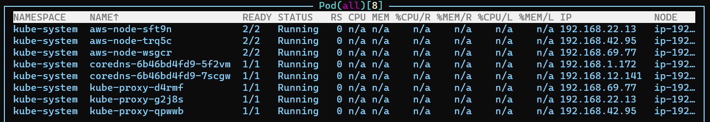
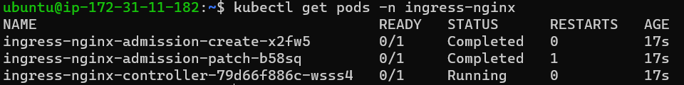
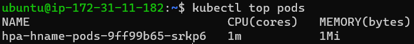
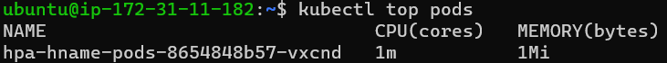

### k8s

- MSA에서 많이 쓰임
- 클러스터 (실제 물리 컴퓨터)
    - 마스터 (워커노드가 많다면 마스터도 1-3정도 구성)
        - 컴포넌트
        
        
        
    - 워커 (일꾼, 여러 대의 컴퓨터로 구성)
        - 컴포넌트
    - aws
        - eks (자동으로 만들어준다)
            - ec2
            - vpc
            - sg(보안그룹)
- 개념
    - POD
        - 하나의 파드에는 하나만 담는 것이 좋다.
            - DB, nginx 각각 따로
        - Container X n
    - Deployment
        - 배포 담당
        - POD에 사용되는 이미지 정보를 담고 있다.
        - 사용자가 원하는 수만큼 만들어준다.
    - ReplicaSet
    - Service

※ 모놀리식 커널 / MSA

- MSA
    - 각각 만들어서 붙인다.
- 모놀리식 커널
    - 한번에 한번
    - 하나가 망가지면 전부 다시 만들어야한다.

---

### k8s Service

- 외부에서 k8s 클러스터에 접속하는 방법
- 다른 Deployment의 POD들의 내부적으로 접근하려면 Service라고 부르는 별도의 쿠버네티스 오브젝트를 생성해야함
- 노드포트
    - 클러스터 내부에서 POD에 접속할 수 있게 외부에서 작업하는 것
    - 모든 워커 노드의 특정 포트를 열고 들어오는 모든 요청을 노드포트 서비스로 전달
- 노드포트 만드는 방법
    - yaml 파일을 통해 만들 수 있다.
        - 포트 지정 가능
    - expose로 노드포트 만들 수 있다.
        - 포트 랜덤 배정 (30000 ~ 39999)
        
        ```python
        kubectl expose deployment np-pods --type=NodePort --name=np-svc-v2 --port=80
        ```
        

### 실습

- yaml 파일 만들기

```bash
# nodeport.yaml 
apiVersion: v1
kind: Service
metadata:
  name: np-svc
spec:
  selector:
    app: np-pods 
  ports:
    - name: http
      protocol: TCP
      port: 80
			# 외부 30000번 포트를 내부 80번 포드랑 연결
      targetPort: 80
      nodePort: 30000
  type: NodePort
```

- 만든 Service 확인

```bash
kubectl get service
```

- ec2에서 30000번 포트 열기
    - 클러스터로 만든 인스턴스에서 인바운드 규칙 추가
    - 보안 → 보안그룹 → 포트 22번이 있는 그룹(nodegroup)
        - 모든 TCP / 내 IP
    - 웹에서 publicIP:30000 테스트
- 부하테스트 (Stress Test)
    - 터미널
    - ipython
        
        ```python
        import requests
        
        url = "http://{IP}:30000/"
        
        for x in range(100):
        	print(requests.get(url).text.strip())
        ```
        
        ⇒ 하나의 노드만 일한다.
        
    - 노드의 수를 늘리기
        - 동일테스트시 여러 노드가 분배되서 일한다.

---

### k8s Ingress

- 노드포트 서비스틑 포트를 중복사용 불가여서 1개의 노드포트에 1개의 디플로이먼트만 적용
- 길을 만들어준다
- 고유한 주소를 제공해 사용 목적에 따라 다른 응답을 제공할 수 있고, 트래픽에 대한 L4 / L7 로드밸런서와 보안 인증서를 처리하는 기능 제공

---

### 실습

- 기존에 만들었던 것 삭제 (pod, deployment)
    
    ```bash
    kubectl delete deployment np-pods
    kubectl delete services np-svc 
    kubectl delete services np-svc-v2
    ```
    
- ingress
    - service 만들기
    
    ```bash
    kubectl create deployment in-hname-pod --image=sysnet4admin/echo-hname
    kubectl create deployment in-ip-pod --image=sysnet4admin/echo-ip
    ```
    
    - deploy
        
        ```bash
        kubectl apply -f https://raw.githubusercontent.com/kubernetes/ingress-nginx/controller-v1.8.2/deploy/static/provider/aws/deploy.yaml
        ```
        
    - baremetal
        - 실제 리얼 머신
        - 클라우드 안에서도 임대를 해준다.
        
        ```bash
        # baremetal에서만 가능
        kubectl apply -f https://raw.githubusercontent.com/kubernetes/ingress-nginx/controller-v1.8.2/deploy/static/provider/baremetal/deploy.yaml
        ```
        
    - nginx로 다루는 컨트롤러
        - 앞단을 만든것
        
        
        
    - yaml 파일 만들기
        
        ```bash
        vim ingress-config.yaml
        ```
        
        ```bash
        apiVersion: networking.k8s.io/v1
        kind: Ingress
        metadata:
          name: ingress-nginx
          annotations:
            nginx.ingress.kubernetes.io/rewrite-target: /
            kubernetes.io/ingress.class: "nginx"
        spec:
          rules:
          - http:
              paths:
              - path: /
                pathType: Prefix
                backend:
                  service:
                    name: hname-svc-default
                    port:
                      number: 80
              - path: /ip
                pathType: Prefix
                backend:
                  service:
                    name: ip-svc
                    port:
                      number: 80
        ```
        
    - yaml 적용
    
    ```bash
    kubectl get ingress
    ```
    
- service
    - yaml 파일 생성
        
        ```bash
        vim ingress.yaml
        ```
        
        ```bash
        apiVersion: v1
        kind: Service
        metadata:
          name: nginx-ingress-controller
          namespace: ingress-nginx
        spec:
          ports:
          - name: http
            protocol: TCP
            port: 80
            targetPort: 80
            nodePort: 30100
          - name: https
            protocol: TCP
            port: 443
            targetPort: 443
            nodePort: 30101
          selector:
            app.kubernetes.io/name: ingress-nginx
          type: NodePort
        ```
        
    - 적용
        
        ```bash
        kubeclt apply -f ingress.yaml
        ```
        
    - service 목록 확인
        
        ```bash
        kubectl get services -n ingress-nginx
        ```
        
    - dd
        
        ```bash
        kubectl expose deployment in-hname-pod --name=hname-svc-default --port=80,443
        kubectl expose deployment in-ip-pod --name=ip-svc --port=80,443
        ```
        
    - 만든 Service 확인
        
        ```bash
        kubectl get services
        ```
        

### Load Balance

- pod
    
    ```bash
    kubectl create deployment hpa-hname-pods --image=sysnet4admin/echo-hname
    kubectl expose deployment hpa-hname-pods --type=LoadBalancer --name=hpa-hname-svc --port=80
    ```
    
- metrics
    
    ```bash
    kubectl create -f https://raw.githubusercontent.com/k8s-1pro/install/main/ground/k8s-1.27/metrics-server-0.6.3/metrics-server.yaml
    kubectl apply -f https://github.com/kubernetes-sigs/metrics-server/releases/latest/download/components.yaml
    ```
    
    - 확인
        - m -> milliunits -> 1000m이면 1개의 cpu
    
    ```bash
    kubectl top pods
    ```
    
    
    
    - 리소스 조절
        
        ```bash
        kubectl edit deployment hpa-hname-pods
        
        resources:
        	limits:
        		cpu: 50m
        	requests:
        		cpu: 10m
        ```
        
        ```bash
        kubectl top pods
        ```
        
        
        
    - dd
        - min은 최소 파드의 수, max는 최대 파드의 수
        - cpu-percent는 cpu 사용량이 50% 넘으면 autoscale 해줘
        
        ```bash
        kubectl autoscale deployment hpa-hname-pods --min=1 --max=30 --cpu-percent=50
        ```
        

### ECR (Registry)

- ECR에 이미지를 넣어서 쓸 수 있다.

### kubeflow

- kustomize
    - kubectl create, apply 자동화
    
    ```bash
    wget https://github.com/kubernetes-sigs/kustomize/releases/download/kustomize%2Fv5.0.3/kustomize_v5.0.3_linux_amd64.tar.gz
    tar xvfz kustomize_v5.0.3_linux_amd64.tar.gz
    sudo mv kustomize /usr/local/bin/kustomize
    kustomize version
    
    git clone -b v1.7.0 https://github.com/kubeflow/manifests.git
    
    cd manifests
    
    while ! kustomize build example | kubectl apply -f -; do echo "Retrying to apply resources"; sleep 10; done
    ```
    
    - manifast