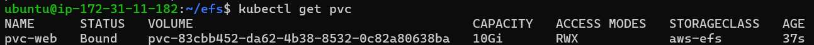

### PV & PVC

- 파드에서 생성한 내용을 기록하고 보관하거나 모든 파드가 동일한 설정 값을 유지하고 관리하기 위해 공유된 볼륨으로부터 공통된 설정을 가지고 올 수 있도록 설계해야 할 때가 필요
- k8s는 다양한 볼륨 제공
    - 임시 : emptyDir
    - 로컬 : host path, local
    - 원격 : persistentVolumeClaim, cephfs, nfs, storageos
    - 특수목적 :
    - 클라우드 : AwsElasticBlockStore, azure

### PVC (Persistent Volume Claim)

- 지속적으로 사용 가능한 볼륨 요청
- PV(Persistent Volume)로 볼륨을 선언해야 사용 가능
- 전체 공간 PV, 방 하나 PVC

### efs

- 로드밸런스를 알아서 해준다.
- PV 만들기
1. EFS 생성하기
    1. vpc는 본인이 만든 eks의 vpc선택
2. 생성된 EFS 수정
    1. 네트워크 → 관리
        1. 기존 보안그룹 삭제
        2. 클러스터의 노드그룹 (nodegroup)
        3. 본인꺼(ClusterSharedNodeSecurityGroup)
    2. 이름 복사 (fs-009062db391d45182)
3. Ec2 노드의 컴퓨터 접속하기
    1. 생성한 클러스터 하나 접속
    2. eks는 amazon-linux k8s를 생성하기 때문에
    3. user명이 ec2-user 로 접속해야 함
    4. 키 설정
        1. ssh -i .\byseul.pem [ec2-user@](mailto:ec2-user@43.203.159.181){클러스터 IP}
    5. root 접속
        1. sudo su
        2. mkdir /encore
    6. mount
        1. mount -t nfs4 fs-009062db391d45182.efs.ap-northeast-2.amazonaws.com:/ /encore
        2. mount -t nfs4 {efs ID}.efs.ap-northeast-2.amazonaws.com:/ /{생성한 폴더}
        3. mount 해서 확인
            1. mount | tail -1 : 마지막 한줄만 보겠다
4. yaml 파일 수정 
    - configMap
        - 파드가 살아날 때 읽어서 적용 시킨다.
        - 컨테이너 안에 시스템 설정 옵션 등을 설정하고 싶다면 yaml 파일에 환경변수를 직접 적어 놓은 하드코딩 방식을 사용 할 수 있음
    
    ```bash
    apiVersion: v1
    kind: ConfigMap
    metadata:
      name: efs-provisioner
    data:
      file.system.id: {efs ID}
      aws.region: ap-northeast-2
      provisioner.name: en-core.com/aws-efs
      dns.name: ""
    ```
    
    - deployment.yaml
    
    ```bash
    apiVersion: v1
    kind: ServiceAccount
    metadata:
      name: efs-provisioner
    ---
    kind: Deployment
    apiVersion: apps/v1
    metadata:
      name: efs-provisioner
    spec:
      replicas: 1
      selector:
        matchLabels:
          app: efs-provisioner
      strategy:
        type: Recreate 
      template:
        metadata:
          labels:
            app: efs-provisioner
        spec:
          serviceAccount: efs-provisioner
          containers:
            - name: efs-provisioner
              image: quay.io/external_storage/efs-provisioner:latest
              env:
                - name: FILE_SYSTEM_ID
                  valueFrom:
                    configMapKeyRef:
                      name: efs-provisioner
                      key: file.system.id
                - name: AWS_REGION
                  valueFrom:
                    configMapKeyRef:
                      name: efs-provisioner
                      key: aws.region
                - name: DNS_NAME
                  valueFrom:
                    configMapKeyRef:
                      name: efs-provisioner
                      key: dns.name
                      optional: true
                - name: PROVISIONER_NAME
                  valueFrom:
                    configMapKeyRef:
                      name: efs-provisioner
                      key: provisioner.name
              volumeMounts:
                - name: pv-volume
                  mountPath: /persistentvolumes
          volumes:
            - name: pv-volume
              nfs:
                server: {efs ID}.efs.ap-northeast-2.amazonaws.com	
                path: /
    ```
    
5. yaml 적용
    1. yaml 파일 옮기기
    2. 적용
    
    ```bash
    kubectl apply -f storage-class.yaml
    kubectl apply -f rbac.yaml
    kubectl apply -f deployment.yaml 
    kubectl apply -f configmap.yaml
    ```
    
6. 적용 확인
    
    ```bash
    kubectl get storageclasses.storage.k8s.io
    ```
    
    
    

### PVC 요청

1. yaml 파일 적용
    
    ```bash
    kubectl apply -f claim.yaml
    ```
    
2. 확인
    
    ```bash
    kubectl get pvc
    ```
    
    
    

- 확인
    - 클러스터 encore 폴더 만들었던 곳에서 encore 폴더에 pvc 만들어 졌는지 확인
    
    
    
    - 해당 폴더 내 들어가서 index.html 파일 하나 만들기
    
    
    
- nginx 적용 및 확인
    
    ```bash
    kubectl apply -f nginx-deployment.yaml
    
    kubectl get pods
    ```
    
    
    
    - web-svc.yaml 적용
    
    ```bash
    kubectl apply -f web-svc.yaml
    ```
    
    
    

### ecr

- 도커허브
- 이미지 올리기
- eks에서 떙겨받아서 사용하면됨