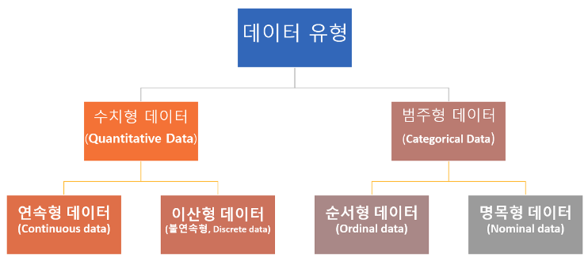
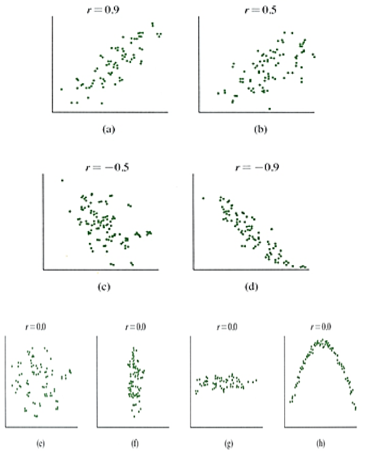
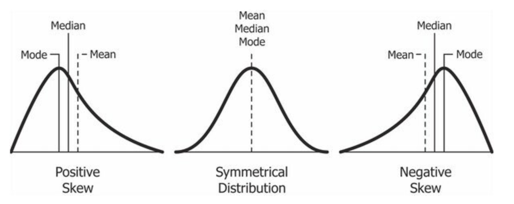
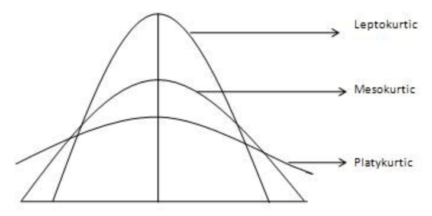
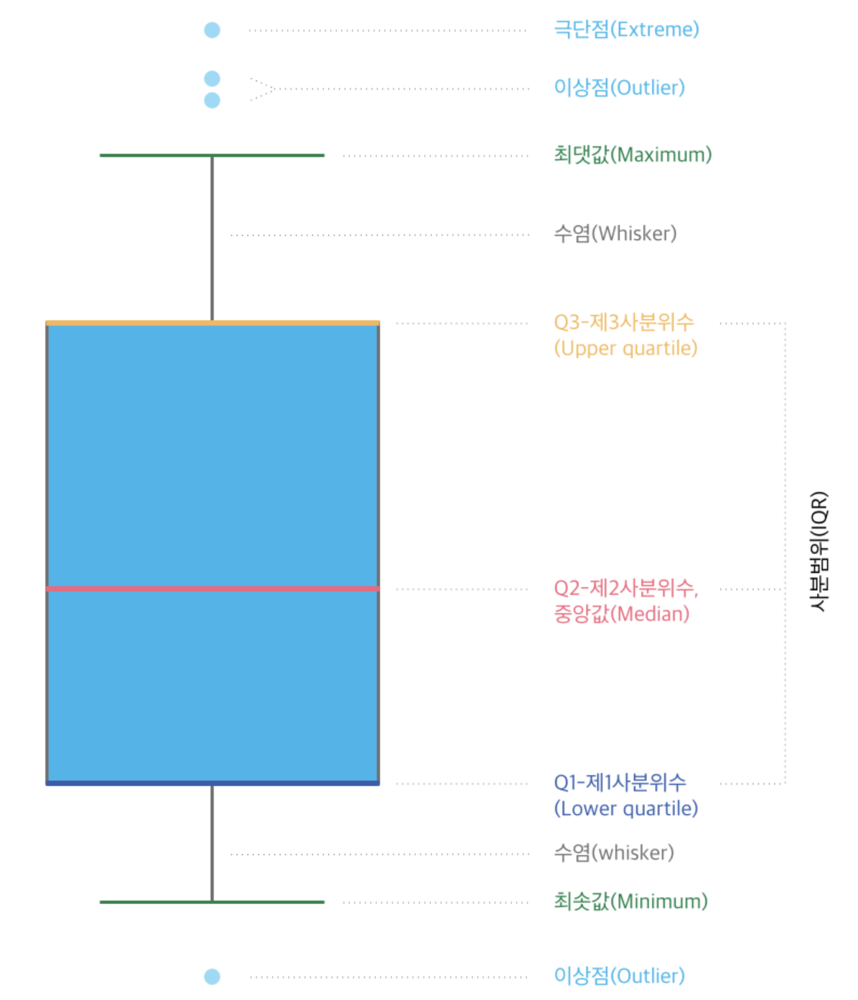
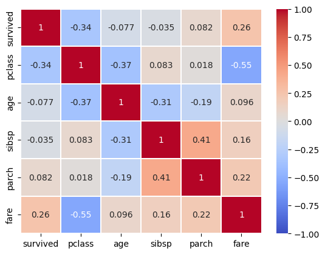

### 데이터

1. 정형 데이터(Structured Data)
    1. 관계형 데이터 베이스, 엑셀 등
    2. 데이터를 저장, 수정, 삭제할 수 있다.
    3. 데이터 타입도 통제 가능
    4. row, column이 존재
2. 반정형 데이터(Semi-Structured Data)
    1. XML, HTML, JSON, 이메일 등
    2. 이메일
        1. 받는 사람, 제목 등의 형식이 존재하기 때문
3. 비정형 데이터(Unstructured Data)
    1. 일상생활은 대부분 비정형 데이터
    2. 텍스트, 영상, 이미지, 음성 등
    3. 딥러닝에서 많이 사용
        1. 의미있는 해석이 가능해 졌지 때문

### 데이터 유형



1. 수치형 데이터
    1. 연속형 데이터
        1. 실수형 데이터
        2. ex) 강수량, 하루에 소비한 물의 양
    2. 이산형 데이터
        1. 정수형 데이터
        2. ex) 책 페이지 수, 한 주에 본 영화의 수
2. 범주형 데이터
    1. 순서형 데이터
        1. 순서는 정해져 있지만, 사람마다 기준이 다르다.
        2. ex) 영화 별점 평가, 대학교 과목 성적
    2. 명목형 데이터
        1. 그 외의 모든 것
        2. 순서가 없다.
        3. ex) 개의 품종, 성별, 혈액형

### ⭐ Data Leakage (데이터 누수, 정보누설)

- test data set을 간접적으로 학습하는 경우

### EDA (Exploratory Data Analysis)

- 탐색적 데이터 분석
1. ⭐ 상관관계
    1. pearson 상관관계
    2. x축과 y축에 상관관계를 표시
    3. 분산, 표준편차의 폭이 작아야 상관관계가 있다. (1에 가깝다)
        1. 분산, 표준편차가 크면 폭이 크다
    
    

2. 왜도 (Skewness)
    1. 0.5 ~ 0.5: 상당히 대칭적
    2. 1 ~ -0.5 또는 0.5 ~ 1: 적당히 치우침
    3. 1보다 작거나 1보다 큰경우: 상당치 치우침
    4. Symmetrical Distribution
        1. Mean = Median = Mode
        2. 이상치가 거의 없다.
    5. Positive Skew (양수)
        1. Mode < Median < Mean
    6. Negative Skew (음수)
        1. Mean < Median < Mode
    
    

3. 첨도
    1. 뾰족하게 삐져나온 것
    2. 데이터가 한 곳에 몰려 있는 것
    3. kurt 값이 0보다 작을 경우에는 정규분포보다 더 완만하고 납작한 분포를 가진다.
    4. kurt 값이 0보다 크면 정규분포보다 더 뽀족한 분포를 가진다.
    
    

4. ⭐ 이상치
    1. 이상치로 인해 모델 학습에 영향을 미친다.



### 예제

1. select_dtypes 로 수치형과 범주형을 나눈다.
- 수치형 데이터
    - 통계석 분석
        - describe()
    - 이상치 분석
        - 이상치를 어떻게 처리할지
        - 항상 처리하는 것은 아니다. ⇒ 상황에 따라 처리
    - 상관관계
        - corr()
        - 히트맵을 많이 사용
            - 절대값으로 관계 확인
            - ex) survived기준으로 pclass(-0.34)와 상관이 있다.
            - ex) pclass와 fare는 상관이 있다.
        
        

- 모델 학습 할 때
    - 컴퓨터가 알아볼 수 있게 변형해서 사용한다.
    - 로그함수 사용 ⇒ 학습을 잘 될 수 있게 하기 위해
        - 데이터가 한 쪽으로 쏠렸을 때 사용
- 범주형 데이터
    - 딱 떨어지는 숫자라면 범주형 데이터
    - unique()
    - value_counts()
    - 통계적 분석
      - describe()
    - normalize : 퍼센트로 변경
    
    ```python
    df_object["embarked"].value_counts(normalize=True) # 범주별 비율
    '''
    S    0.724409
    C    0.188976
    Q    0.086614
    Name: embarked, dtype: float64
    '''
    ```
