- 공식사이트
    - https://matplotlib.org/stable/index.html
    - https://codetorial.net/matplotlib/index.html

### Matplotlib 기초 (import matplotlib.pyplot as plt)

- 데이터 시각화
- x축, y축을 정의해 주어야 한다.
- plt.fiqure
    - 도화지
    - 축과 그래프, 그래프의 제목 같은 것들을 표시할 수 있는 컨테이너
- plt.axes
    - 눈금과 레이블, 그래프가 있는 테두리 박스로 시각화를 형성하는 좌표 평면

```python
plt.figure() # 그래프를 그리기위한 틀을 만든다. (도화지)
plt.axes() # 틀틀안에 좌표평면들을 그린다.
plt.show() # 실제 화면에 표시한다
```

### 단일 그래프

- plot
    - 선형 그래프
    - 그래프를 그리는 함수
    - figure, axes 없으면 만들어서 그려준다.
    
    ```python
    # 리스트 값이면 선형 그래프
    # x축 : index, y축 : 값
    plt.plot(np.arange(2,7)) # 그래프를 그리는 로직
    plt.show() # 그려진 그래프를 보여주는 로직
    ```
    
    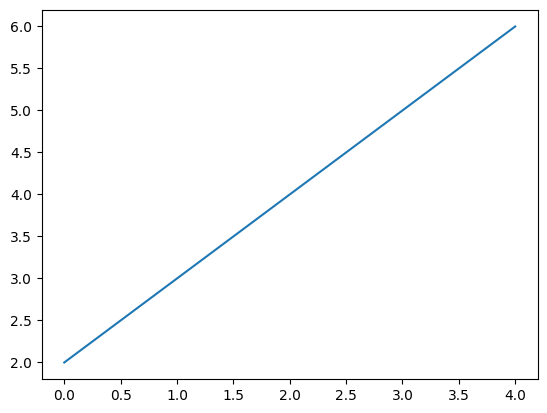

### 다중 그래프

- 1개의 axes 안에 여러개의 그래프를 그린다.

```python
# 틀 크기 (너비, 높이)
plt.figure(figsize=[15,5])
# 그래프 2개
plt.plot(np.arange(5))
plt.plot(np.arange(2,7))
# 화면에 표시
plt.show()
```

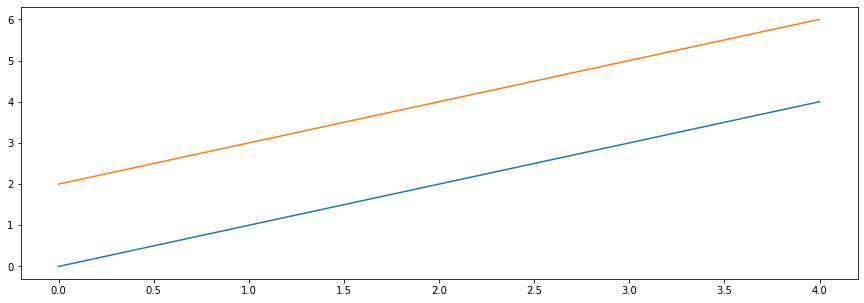

### subplots

- 도화지를 여러개를 만든다.
- ax : 작은 도화지
- 방법 1
    
    ```python
    ⭐ fig, ax = plt.subplots(2,2,figsize=[15,5])
    print(ax.shape)
    
    # 첫번째 로우 & 왼쪽
    ax[0,0].plot(np.arange(5))
    # 첫번째 로우 & 오른쪽
    ax[0,1].plot(np.arange(5))
    ax[0,1].plot(np.arange(2,6))
    # 두번째 로우 & 왼쪽
    ax[1,0].plot(np.arange(5))
    # 두번째 로우 & 오른쪽
    ax[1,1].plot(np.arange(5))
    plt.show()
    ```
    
    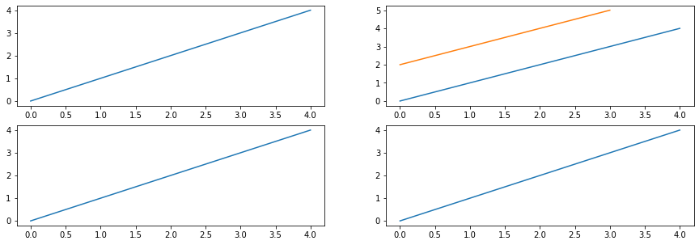

    
- 방법 2
    - 방향은 Z (0행의 컬럼 → 1행의 컬럼 → n행의 컬럼)
    
    ```python
    arr = np.arange(5)
    arr1 = np.arange(2,6)
    plt.figure(figsize=[15,5])
    
    plt.subplot(2,2,1)
    plt.plot(arr)
    
    plt.subplot(2,2,2)
    plt.plot(arr)
    plt.plot(arr1)
    
    plt.subplot(2,2,3)
    plt.plot(arr)
    
    plt.subplot(2,2,4)
    plt.plot(arr)
    
    plt.show()
    ```
    

### 타이틀

- figure의 제목 = suptitle(str)
- axes의 제목(fiqure안에 그래프의 제목) = set_title(str)

```python
fig , ax = plt.subplots(1,2,figsize=(15,5))
fig.suptitle("figure title")

x = range(0,10) # x축
y = np.exp(x) # y축
ax[0].plot(x,y)
ax[0].set_title("exp")

x = range(1,1000) # x 축
y = np.log(x) # y 축
ax[1].plot(x,y)
ax[1].set_title("log")

plt.show()
```


### 축 제목

- x축 제목: set_xlabel()
- y축 제목: set_ylabel()

```python
fig , ax = plt.subplots(1,2,figsize=(15,5))
fig.suptitle("figure title")

x = range(0,10) # x축
y = np.exp(x) # y축
ax[0].plot(x,y)
ax[0].set_title("exp")
ax[0].set_xlabel("X name")
ax[0].set_ylabel("Y name",rotation=0,labelpad=30)

x = range(1,1000) # x 축
y = np.log(x) # y 축
ax[1].plot(x,y)
ax[1].set_title("log")
ax[1].set_xlabel("X name")
ax[1].set_ylabel("Y name",rotation=0,labelpad=30)

plt.show();
```

### 눈금 회전

- axes의 tick_parame()

```python
fig,ax = plt.subplots()
ax.plot(x,y)

# 눈금회전
ax.tick_params(axis="x", labelrotation=45)

plt.show()
```

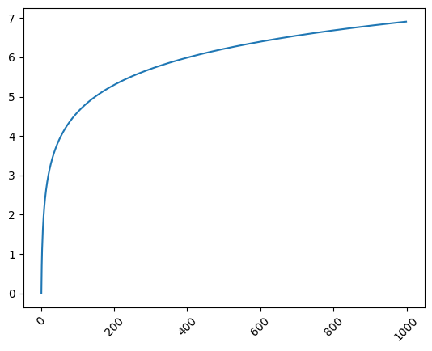

### 눈금 지정

- axes의 set_xticks(), set_yticks()

```python
fig,ax = plt.subplots(figsize=[10,10])
ax.plot(range(50))

# 눈금 지정
ax.set_xticks(range(50))
ax.set_yticks(range(50))

plt.show()
```

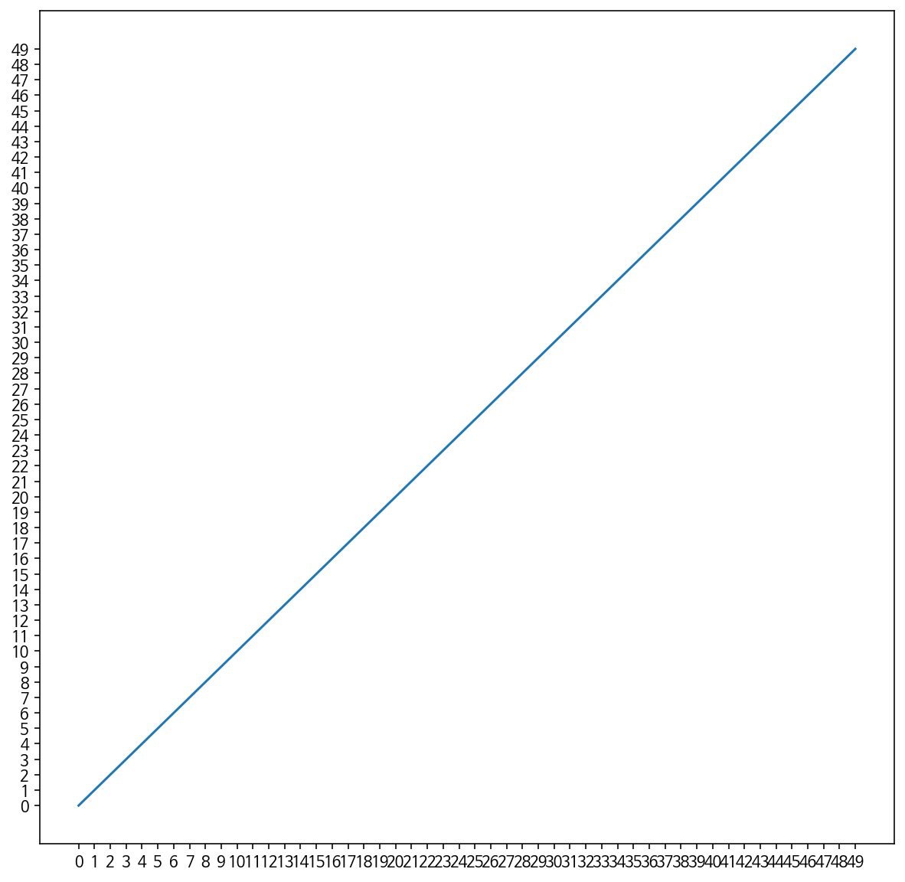

### 그래프 스타일

- marker 변경
    
    ```python
    y = np.exp(range(0,10))
    fig , ax = plt.subplots(2,2,figsize=[15,10])
    
    # marker
    ax[0,0].plot(y,marker="o")
    ax[0,1].plot(y,marker="v")
    ax[1,0].plot(y,marker="x") 
    ax[1,1].plot(y,marker="^")
    
    plt.show()
    ```
    
    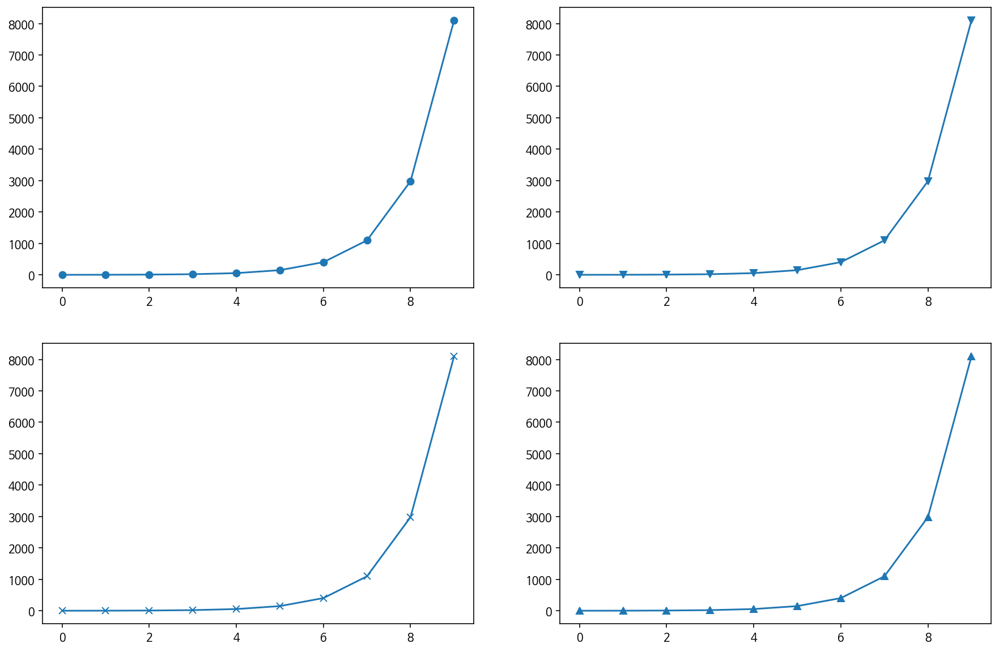

- 선 스타일
    
    ```python
    y = np.exp(range(0,10))
    fig , ax = plt.subplots(2,2,figsize=[15,10])
    
    # line style
    ax[0,0].plot(y,marker="o")
    ax[0,1].plot(y,marker="v",linestyle='--')
    ax[1,0].plot(y,marker="x",linestyle='') 
    ax[1,1].plot(y,marker="^")
    
    plt.show()
    ```
    
    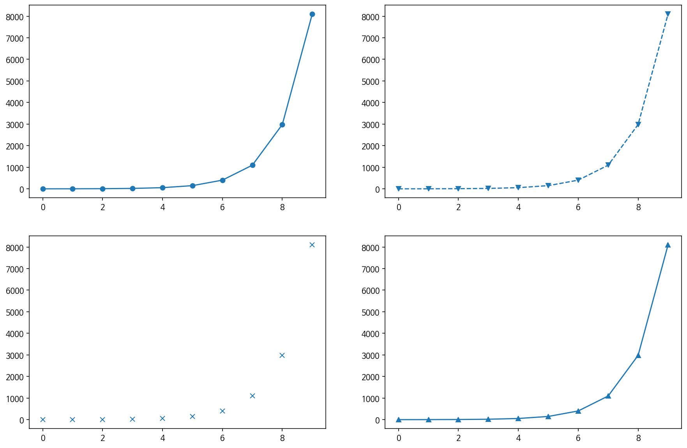

- Color(색)
    
    ```python
    y = np.exp(range(0,10))
    fig , ax = plt.subplots(2,2,figsize=[15,10])
    
    # color
    ax[0,0].plot(y,marker="o")
    ax[0,1].plot(y,marker="v",linestyle='--',color="y")
    ax[1,0].plot(y,marker="x",linestyle='',color="r") 
    ax[1,1].plot(y,marker="^",color="g")
    
    plt.show()
    ```
    
    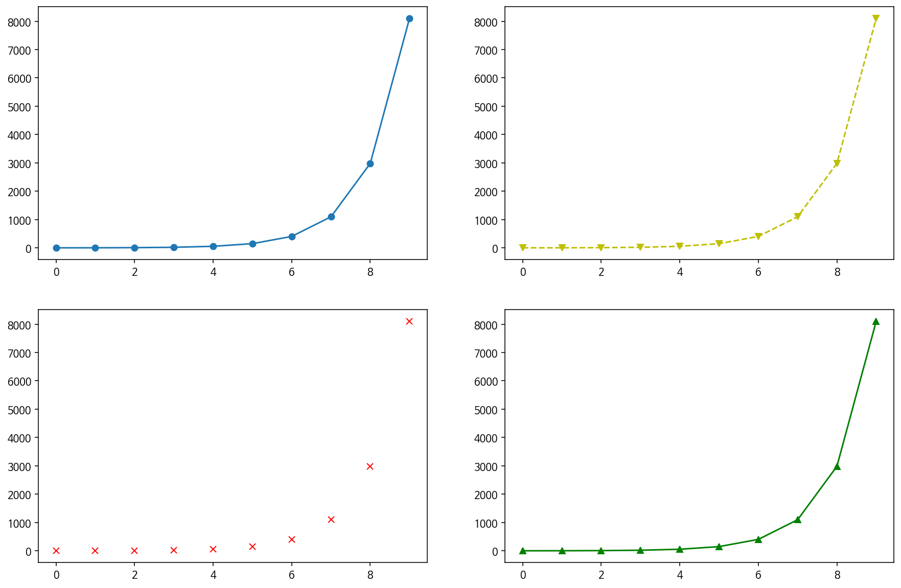

### 범례표시

- axes의 legend()
- 선의 설명

```python
fig,ax = plt.subplots()
x = np.arange(10)

ax.plot(x)
ax.plot(x**2,alpha = 0.2) # alpha 투명도 0~1 사이값을 넣어주면된다.
# 범례 표시
ax.legend(["X","X^2"],loc=[0.5,0.8])

plt.show()
```

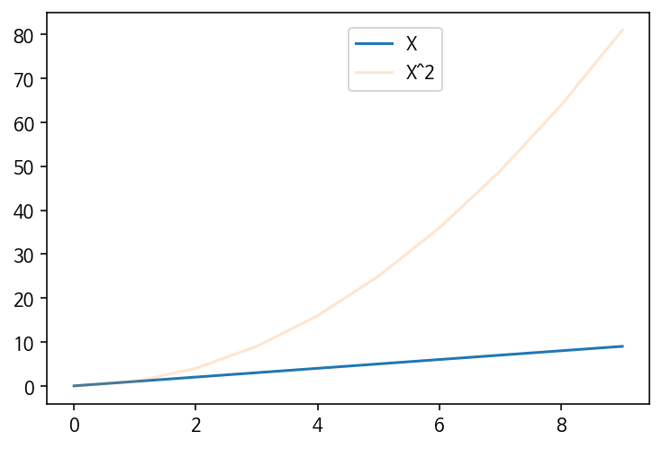

```python
x = np.arange(0, 4, 0.5)

plt.plot(x, x + 1, 'bo')
plt.plot(x, x**2 - 4, 'g--')
plt.plot(x, -2*x + 3, 'r:')

plt.show()
```


### 수평선 그리기

- axhline(y, xmin, xmax)
    - xmin, xmax 값은 0에서 1사이의 값을 입력한다. 0은 왼쪽 끝, 1은 오른쪽 끝을 의미함
- hlines(y, xmin, xmax)
    - 점(xmin,y)에서 점(xmax,y)를 따라 수평선을 표시함

```python
plt.axhline(4.0, 0.1, 0.9, color='lightgray', linestyle='--', linewidth=2)

plt.show()
```

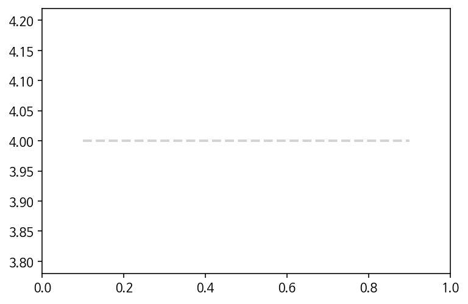


### 수직선 그리기

- axvline(x, ymin, ymax)
- vlines(x, ymin, ymax)

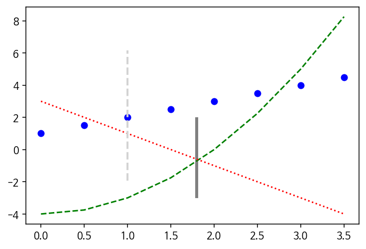


### 막대 그래프(Bar graph)

- plot 에서 사용하는 것을 다 사용.
- 막대 폭, color 등등

```python
x = np.arange(3)
years = ['2018', '2019', '2020']
values = [100, 400, 900]

plt.bar(x, values)
plt.xticks(x, years)

plt.show()

# 수평 막대
plt.barh(x, values)
plt.yticks(x, years)

plt.show()
```

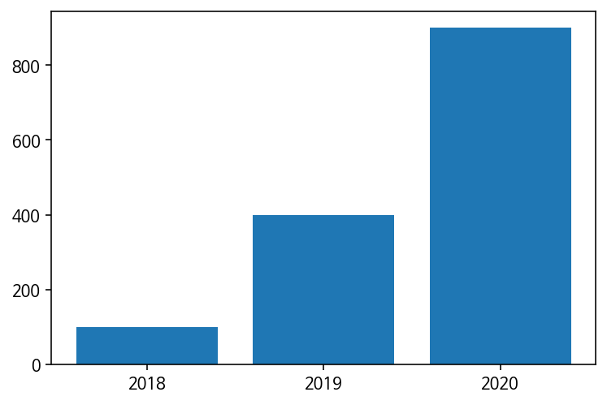


### ⭐ 산점도 그리기

- 실무에서 많이 사용한다.
- 데이터를 점으로 표시한다.
- color, 크기, 투명도, 컬러맵 등등

```python
n = 50
x = np.random.rand(n)
y = np.random.rand(n)

plt.scatter(x, y)
plt.show()
```

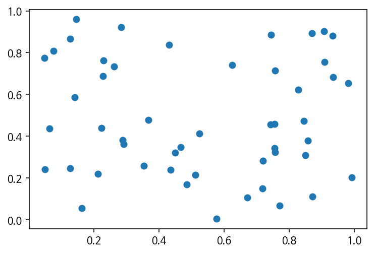


### 히스토그램(Histogram)

- 실무에서 많이 사용한다.
- 막대 그래프와 차이
    - 막대 그래프 : 범주형 데이터 (ex)남/여 등등
    - 히스토그램 : 연속형 데이터 (ex)나이, 요금 등등

```python
weight = [68, 81, 64, 56, 78, 74, 61, 77, 66, 68, 59, 71,
          80, 59, 67, 81, 69, 73, 69, 74, 70, 65]

plt.hist(weight)

plt.show()
```


### 에러바(오차막대)표시

- 오차범위를 그리는 그래프
- 분산

```python
x = [1, 2, 3, 4]
y = [1, 4, 9, 16]
yerr = [2.3, 3.1, 1.7, 2.5] # 대칭 편차

plt.errorbar(x, y, yerr=yerr)
plt.show()
```

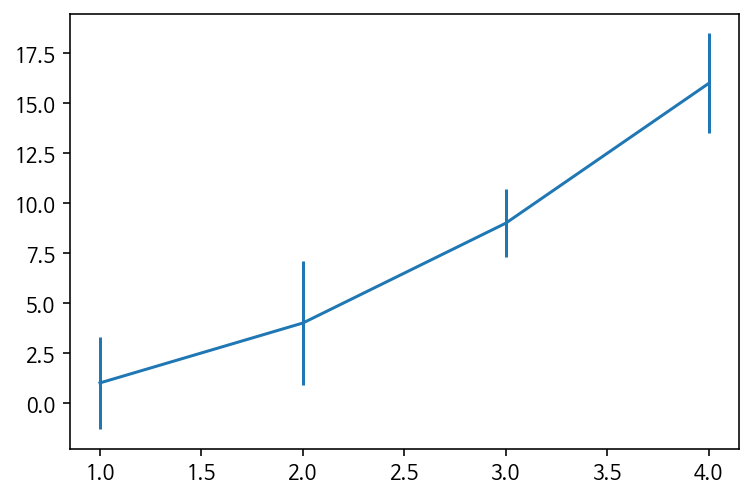


### 파이차트

- 원형 그래프
- 방향, 각도, 띄어지는 정도, 그림자, 색상, 부채꼴스타일 등

```python
ratio = [34, 32, 16, 18]
labels = ['Apple', 'Banana', 'Melon', 'Grapes']

plt.pie(ratio, labels=labels, autopct='%.1f%%')
plt.show()
```

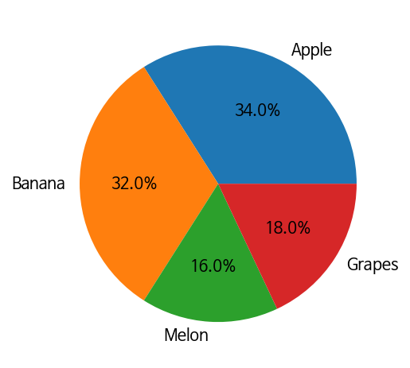


### 히트맵(Heatmap)

- 실무에서 많이 사용한다.
- 다양한 값을 갖는 숫자 데이터를 열분포 형태와 같이 색상을 이용해 시각화
- 컬러바, 색상범위, 컬러맵 등등

```python
arr = np.random.standard_normal((30, 40))

plt.matshow(arr)

plt.show()
```

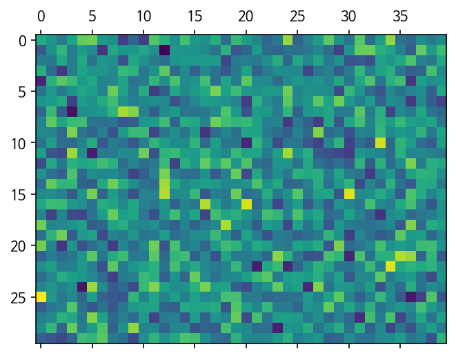


### ⭐ 박스 플롯 그리기

- 주식 그래프
- 전체 데이터로 부터 얻어진 다섯 가지 요약 수치를 사용
    - 최소값
    - 제 1사분위 수(Q1)
    - 제 2사분위 수 또는 중위수(Q2)
    - 제 3사분위 수(Q3)
    - 최대값

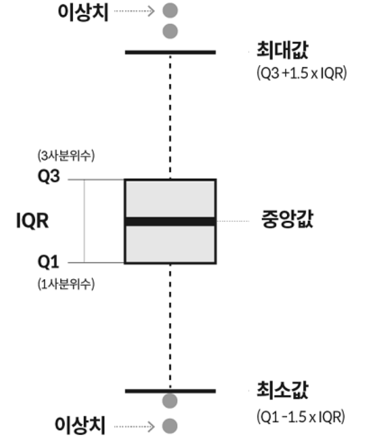


```python
# 1. 기본 스타일 설정
plt.style.use('default')
plt.rcParams['figure.figsize'] = (4, 3)
plt.rcParams['font.size'] = 12

# 2. 데이터 준비
np.random.seed(0)
data_a = np.random.normal(0, 2.0, 1000)
data_b = np.random.normal(-3.0, 1.5, 500)
data_c = np.random.normal(1.2, 1.5, 1500)

# 3. 그래프 그리기
fig, ax = plt.subplots()

ax.boxplot([data_a, data_b, data_c])
ax.set_ylim(-10.0, 10.0)
ax.set_xlabel('Data Type')
ax.set_ylabel('Value')

plt.show()
```

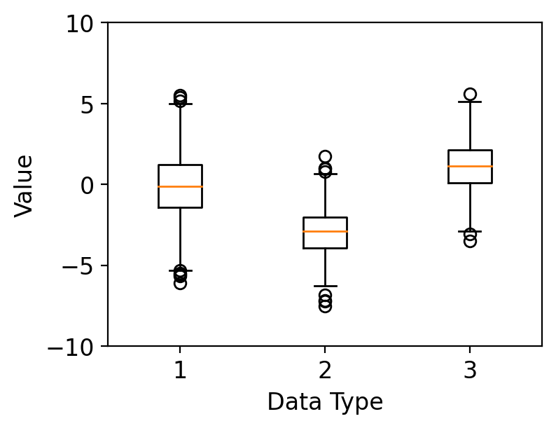
