- 공식 사이트
    - https://seaborn.pydata.org/

### Seaborn

- Relational plots (산전도)
    - 두 변수의 상관관계
- Distribution plots (분포도)
    - 변수의 데이터 분포 볼 때
- Categorical plots
    - 범주형 변수의 집계나 볌주형 변수와 수치형 변수간의 관계를 볼 때

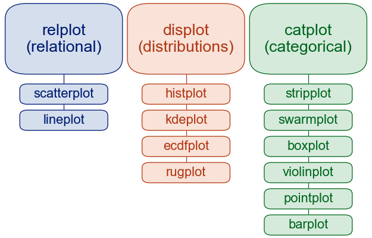


### Relational plots (상관관계)

- 산점도 그래프를 많이 사용
- relplot(kind="scatter") # default
- relplot(kind="line")
- 범주형 : 모양
- 수치형 : 색의 연함, 진함 정도

```python
sns.relplot(data=tips, x="total_bill", y="tip", hue="smoker")
```

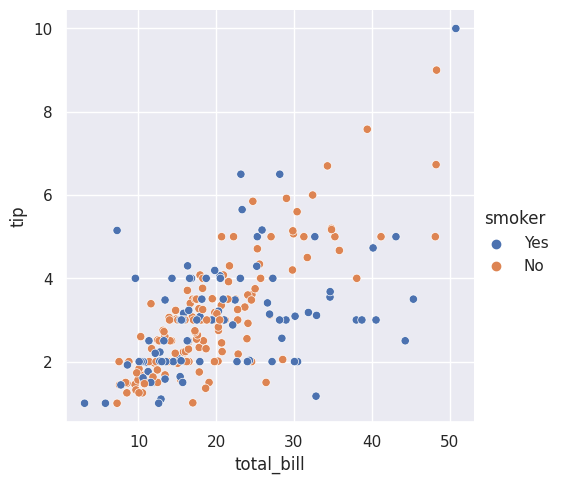


### lineplot

- 시계열 데이터

```python
sns.relplot(
    data=fmri, kind="line",
    x="timepoint", y="signal", hue="event",
)
```

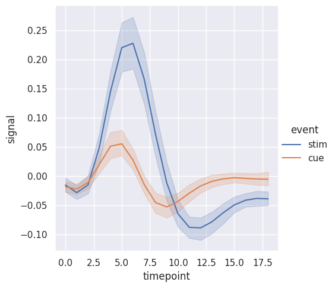


### 여러 관계 그래프

- 하나의 그래프의 많은 정보가 있으면 해석하기에 힘든 점이 존재

```python
sns.relplot(
    data=tips,
    x="total_bill", y="tip", hue="smoker", col="time", # col: 오른쪽에 그래프 추가
)
```

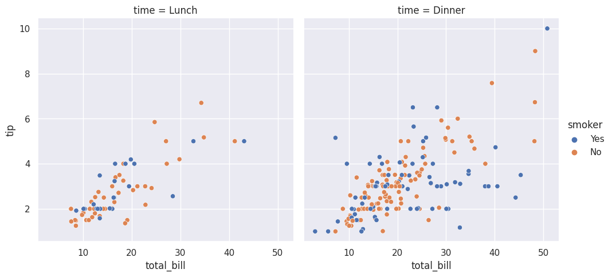


### **Distribution plots**

- 분포도
- 히스토그램 많이 사용
- 히트맵 많이 사용
- histplot

```python
# bins : 쪼갠다.
sns.displot(penguins, x="flipper_length_mm", bins=20)
```

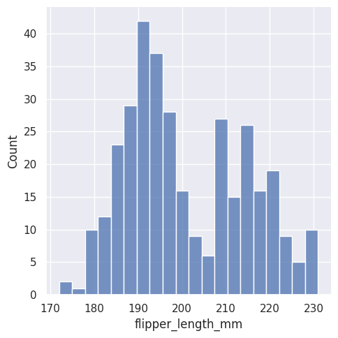


```python
sns.displot(penguins, x="flipper_length_mm", hue="species", multiple="dodge")
```

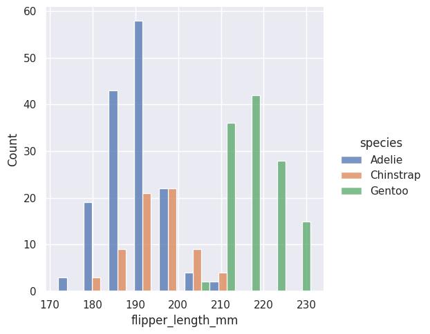


- kdeplot
    - 선형으로도 가능

```python
sns.displot(penguins, x="flipper_length_mm", hue="species", kind="kde", fill=True)
```

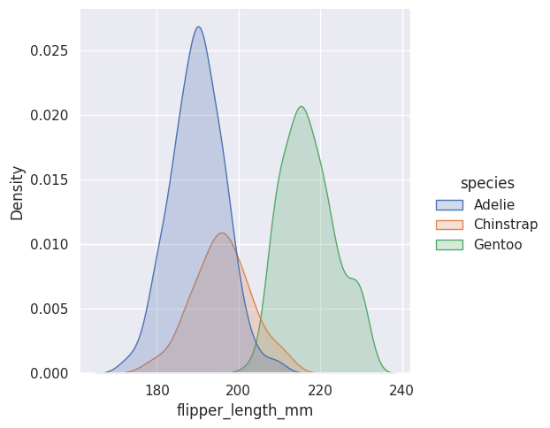


- rugplot

```python
sns.displot(penguins, x="bill_length_mm", y="bill_depth_mm")
```

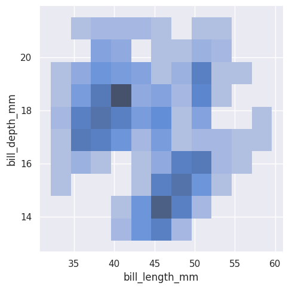


### **Categorical plots**

- 범주형 데이터 분석
- 범주형 산점도
- 단점
    - 점이 몇번 찍힌 것인지 파악 불가능

```python
tips = sns.load_dataset("tips")
# 데이터가 많이 겹쳐있어서 정확한 분석이 힘들다.
sns.catplot(data=tips, x="day", y="total_bill")
```

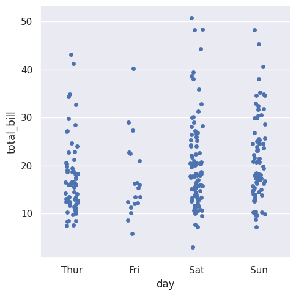


```python
# 어느 곳에 데이터가 많이 있는지 알기 쉽다.
sns.catplot(data=tips, x="day", y="total_bill", kind="swarm")
```

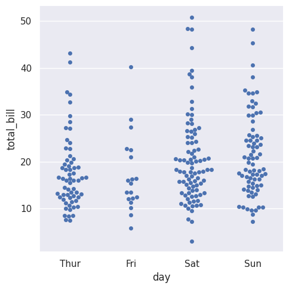


### 분포 비교

### 박스 플롯

- 단점
    - 사분위 값들만 알 수 있지만, 자세한 값을 알 수 없다.

```python
sns.catplot(data=tips, x="day", y="total_bill", hue="smoker", kind="box")
```

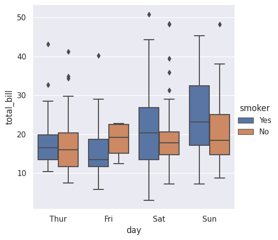


### 바이올린 플롯

- 박스 플롯 단점을 보완

```python
sns.catplot(
    data=tips, x="day", y="total_bill", hue="sex",
    kind="violin", split=True,
)
```

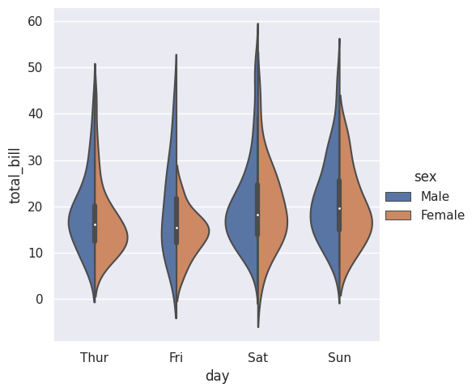
