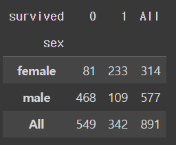
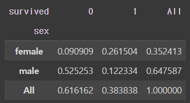
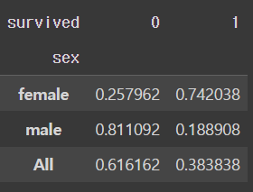
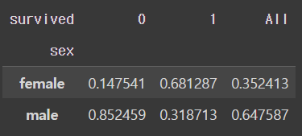
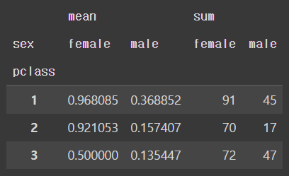

### 교차분석

- crosstab
    - 기준에 따라 결과가 달라진다.

```python
pd.crosstab(df_object["sex"],df_object["survived"],margins = True)
```




```python
 # 전체 기준 데이터 비율
pd.crosstab(df_object["sex"],df_object["survived"],margins=True, normalize= "all")
```




```python
# index 기준 데이터 비율
pd.crosstab(df_object["sex"],df_object["survived"],margins=True, normalize= "index")
```




```python
# columns 기준 데이터 비율
pd.crosstab(df_object["sex"],df_object["survived"],margins=True, normalize= "columns")
```




### pivot_table 분석

```python
df_pivot = pd.pivot_table(df,                # 피벗할 데이터프레임
                     index = 'pclass',    # 행 위치에 들어갈 열
                     columns = 'sex',    # 열 위치에 들어갈 열
                     values = 'survived',     # 데이터로 사용할 열
                     aggfunc = ['mean', 'sum'])   # 데이터 집계함수

df_pivot
# 3등석 보다 1등석에 탄 경우, 생존여부가 높게 나타나며,
# 1등석, 2등석, 3등석 모두에서 여자가 남자보다 생존여부가 높게 나타나고 있다.
```


