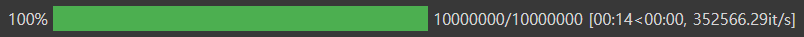
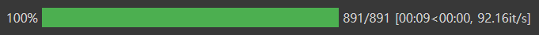

- Feature 만들기
- EDA, Data Cleaning 까지 다 한 상태

### 수치형 데이터 타입 변환

- int32 / int64, float32 / float64
    - 메모리 사용량이 다르다.
    - 숫자가 작을 수록 부하가 적다. (CPU) ⇒ 속도가 빨라진다.

```python
# int64 => int32
# survived
X_tr["survived"] = X_tr["survived"].astype("int32")
X_te["survived"] = X_te["survived"].astype("int32")

# fare
X_tr["fare"] = X_tr["fare"].astype("float32")
X_te["fare"] = X_te["fare"].astype("float32")
```

- 숫자 to Category
    - pclass는 범주형이기에 category로 변경해 준다.
    - 범주형 > 순서형
    - plcass에서 3이 2보다 얼마나 큰지 확실하지 않다.

```python
X_tr["pclass"] = X_tr["pclass"].astype("category")
X_te["pclass"] = X_te["pclass"].astype("category")
```

### 범주형 데이터 타입 변환

- Category가 Object보다 작다. (Category < Object)

### 문자열

- 공백제거
    - 앞뒤 공백제거, lstrip , rstrip

```python
X_tr["name"] = X_tr["name"].map(lambda x: x.strip())
X_tr["ticket"] = X_tr["ticket"].map(lambda x: x.strip())

X_te["name"] = X_te["name"].map(lambda x: x.strip())
X_te["ticket"] = X_te["ticket"].map(lambda x: x.strip())
```

### 문자열 분리

- replace(), split()

### 집계

- pivot_table

### 그룹

- groupby

### 데이터 변환/조합

- 연산하기
- 의미 있는 것을 찾았다면 잘 묶어서 새로운 Feature로 만든다.

### 날짜

- datatime 적용
    - 주말/평일
    - 새벽/오전/오후/저녁/밤
    - 출퇴근시간 인지
    - 점심시간 인지

### 진행바

- 진행 정도를 알 수 있다.

```python
!pip install tqdm
```

```python
from tqdm.auto import tqdm

i=0
for i in tqdm(np.random.rand(10000000)):
    i = i**2
```



- with pandas

```python
# 판다스에서 progress_apply 메소드를 사용할수 있게 된다.
tqdm.pandas()

import time

def do_apply(x):
    time.sleep(0.01)
    return x
tmp = df.progress_apply(do_apply,axis = 1)
```
