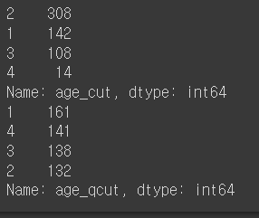
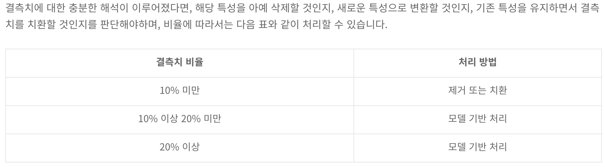
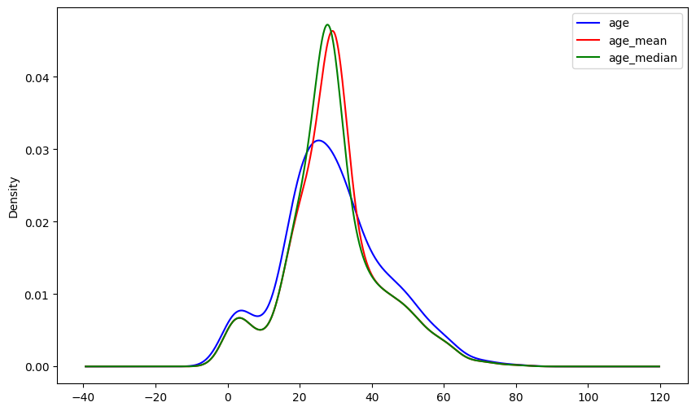
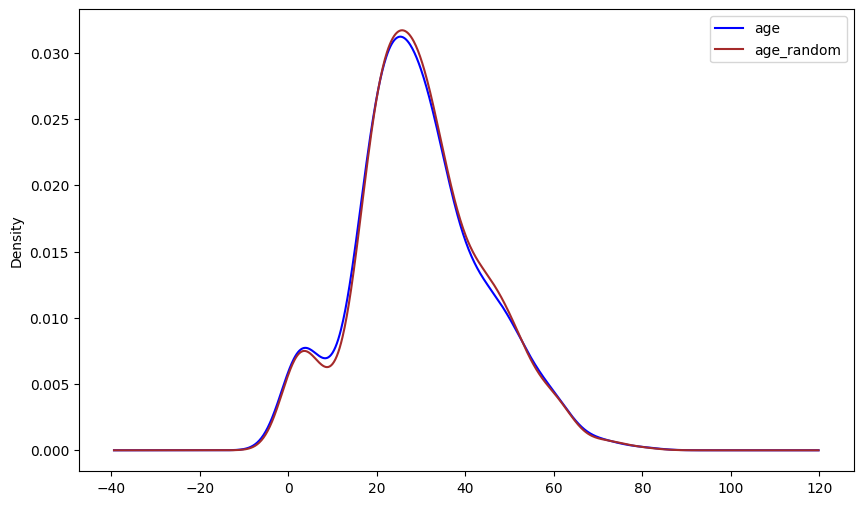
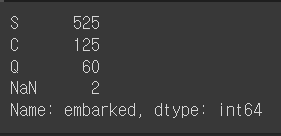
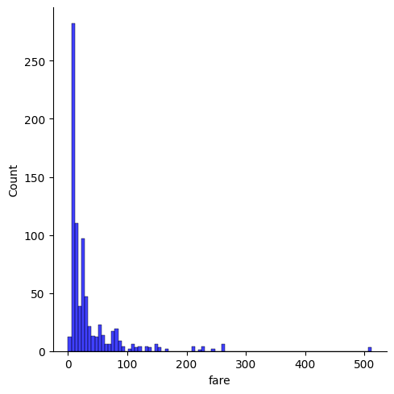
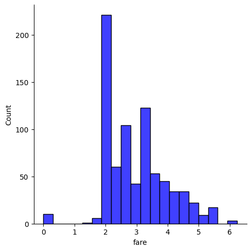
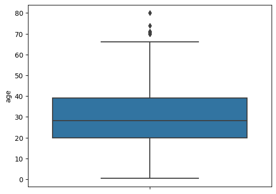
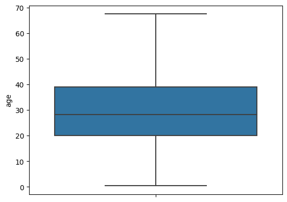

- class별 비율이 중요하다.

## ⭐ Data Cleaning

- 결측치 제거한다.

### 결측치 (Missing Value) 종류

- NaN: Not a Number (숫자가 아닌)
    - 휴지이지만 사용할 수 없다.
    - 데이터는 맞는데 내가 쓸 수 있는 데이터의 형태가 아니다.
    - ex) 사칙연산을 하고 싶은데 데이터가 문자열이라면 사용할 수 없다.
- Null: 아무것도 존재하지 않음
    - 휴지심만 존재
- undefined: 정의되어 있지 않음


### 결측치가 왜 발생 하였나?

- 완전 무작위 결측 (MCAR : Missing Completely At Random)
    - 진짜 우연히 발생
    - 아무런 의도가 없는 상황
- 무작위 결측 (MAR : Missing At Random)
    - 특정 상관관계가 있는 feature에 결측치가 발생
- 비무작위 결측 (NMAR : Not Missing At Random)
    - 의도한 결측치
- 예시) 성별(X)을 사용해 체중(y)을 예측하는 모델을 구축하기 위해, 설문조사를 통해 Xy DataFrame을 구성했는데, y열에 결측치가 있다고 가정합시다.
    - 완전 무작위 결측
        - 그냥 단순히 응답 X
    - 무작위 결측
        - 여성은 잘 응답 X
    - 비무작위 결측
        - 체중이 무거운 사람들은 응답X

### 결측치 확인 방법

- 전체 column의 갯수를 확인할 수 있다.
    
    ```python
    info()
    ```
    
- 전체 결측치 수
    
    ```python
    df.isnull().sum().sum()
    ```
    
- 각 컬럼별 결측치 수
    
    ```python
    X_tr.isnull().sum().sort_values(ascending=False)
    ```
    
- ⭐ 각 컬럼별 결측치 비율
    - 컬럼을 제거를 해야할지 안할지 결정
    - ⭐ 데이터를 마음대로 제거하면 안된다.
    - 비율에 따라 결측치를 처리 방법이 다르다.
        - 비율이 낮으면 수치형이라면 median, 범주형이라면 mode가 많이 활용
        - 비율이 높으면 이상치를 확인하여 어떤 방식으로 할 것인지 결정
    
    ```python
    (X_tr.isnull().sum() / X_tr.shape[0]).round(4).sort_values(ascending=False)
    ```
    
- 그래프로도 확인이 가능하다.
    - 너무 수치가 작을 경우에는 보이지 않을 수 있다는 단점 존재

### 결측치 구간화

- 절대값 (pd.cut)
    - 나이로 나누었다.
- 상대평가 (pd.qcut)
    - 데이터를 고려해서 나누었다.
    - 비율 단위로 자른다.

```python
tmp_train['age_cut'] = pd.cut(tmp_train['age'], bins=4, labels=list(range(1,5)))
tmp_train['age_qcut'] = pd.qcut(tmp_train['age'], q=4, labels=list(range(1,5)))

print(tmp_train['age_cut'].value_counts())
print(tmp_train['age_qcut'].value_counts())
```




### 결측치 처리 (일반적인 방법) : 제거, 치환, 모델처리

- 수치형
    - 50프로가 넘어가면 진지하게 고민
    
    

    
    - 제거
        - 단순히 행 또는 열을 제거
        
        ```python
        df.dropna()
        	df.dropna(axis=0): row 삭제
        	df.dropna(axis=1): column 삭제
        	df[['컬럼명']].dropna(axis=1): column 삭제
        	df.dropna(subset=['원하는 행']): 원하는 행의 결측값이 있는 부분을 기준으로 row 삭제
        ```
        
        ```python
        # 열 제거
        print(f'before: {X_tr.shape} / isnull().sum(): {X_tr.isnull().sum().sum()}')
        # 결측치가 있는 열 제거 : X_tr.dropna(axis=1)
        df_dropcols = X_tr.dropna(axis=1)
        print(f'after: {df_dropcols.shape} / isnull().sum(): {df_dropcols.isnull().sum().sum()}')
        ```
        
    - 치환 (합리적 접근)
        - ex) 1% 미만 ⇒ median or mode
        
        ```python
        df.fillna()
        	df[['컬럼명']].fillna(원하는 값): 원하는 값으로 채우기
        	df[['컬럼명']].fillna(method='ffill'): 결측값을 앞방향의 값으로 채운다.
        	df[['컬럼명']].fillna(method='bfill'): 결측값을 뒤방향의 값으로 채운다.
        ```
        
        ```python
        X_tr['age_mean'] = X_tr['age'].fillna(X_tr['age'].mean())
        X_tr['age_median'] = X_tr['age'].fillna(X_tr['age'].median())
        ```
        
    - 랜덤으로 처리 가능
        
        ```python
        # 분포 시각화
        fig, ax = plt.subplots(figsize=(10,6))
        
        X_tr['age'].plot(kind='kde', ax=ax, color='blue')
        X_tr['age_random'].plot(kind='kde', ax=ax, color='brown')
        
        lines, labels = ax.get_legend_handles_labels()
        ax.legend(lines, labels, loc='best')
        ```
        
        - 위에 그래프가 아래로 바뀐다.
        
        

        
        
        - test에서도 결측치 채워 주어야함
            - train의 값을 가지고 채워야함.
- 범주형
    - 확인
    
    ```python
    # 범주 별 빈도 수 확인
    X_tr['embarked'].value_counts(dropna=False)
    ```
    
    

    
    - 가장 무난한 방법은 최빈값
    
    ```python
    # 최빈값
    embarked_mode = X_tr['embarked'].mode().values[0]
    
    # NA imputation
    X_tr['embarked_filled'] = X_tr['embarked'].fillna(embarked_mode)
    X_te['embarked_filled'] = X_te['embarked'].fillna(embarked_mode)
    
    # 확인
    print(X_tr[['embarked', 'embarked_filled']].isnull().sum())
    print('-'*50)
    print(X_te[['embarked', 'embarked_filled']].isnull().sum())
    ```
    
- 모델 기반 처리
    - 수치형
    - sklearn 사용
    
    ```python
    from sklearn.impute import SimpleImputer
    
    # strategy = mean, median, most_frequent
    imputer = SimpleImputer(strategy="mean")
    
    # fit_transform = 학습을 하고 그 결과를 바탕으로 치환
    # transform = 치환
    # X_tr[["age"]]에서 정상적인 것의 평균을 학습한다. 그리고 그 값으로 치환
    X_tr['age_simple_mean'] = imputer.fit_transform(X_tr[["age"]])
    # tr에서 학습한 값을 test의 결측치를 채운다.
    X_te['age_simple_mean'] = imputer.transform(X_te[["age"]])
    
    X_tr[['age', 'age_simple_mean']].isnull().sum()
    ```
    
    - KNNImputer(K Near Neighbors) 모델 기반
    
    ```python
    from sklearn.impute import KNNImputer
    
    # 결측치를 기준으로 K개의 이웃을 학습해서 결과를 낼 것이다.
    imputer = KNNImputer(n_neighbors=5)
    
    X_tr['age_knn'] = imputer.fit_transform(X_tr[["age"]])
    X_te['age_knn'] = imputer.transform(X_te[["age"]])
    
    X_tr[['age', 'age_knn']].isnull().sum()
    ```
    
    - IterativeImputer 모델 기반
    
    ```python
    from sklearn.experimental import enable_iterative_imputer
    from sklearn.impute import IterativeImputer
    
    imputer = IterativeImputer(random_state=SEED)
    
    X_tr['age_iter_none'] = imputer.fit_transform(X_tr[["age"]])
    X_te['age_iter_none'] = imputer.transform(X_te[["age"]])
    
    X_tr[['age', 'age_iter_none']].isnull().sum()
    ```
    
    - Random 모델
    
    ```python
    from sklearn.ensemble import RandomForestRegressor
    
    imputer = IterativeImputer(estimator=RandomForestRegressor(verbose=0, random_state=SEED),
    max_iter=10, verbose=0, imputation_order='ascending', random_state=SEED)
    
    X_tr['age_iter_none'] = imputer.fit_transform(X_tr[["age"]])
    X_te['age_iter_none'] = imputer.transform(X_te[["age"]])
    
    X_tr[['age', 'age_iter_none']].isnull().sum()
    ```
    

### 비대칭 데이터 (옵션)

- 왜도, 첨도 확인

```python
# 왜도
df['fare'].skew()

# 첨도
df['fare'].kurt()

# 그래프화
sns.displot(df["fare"], color="b", label="Skewness : %.2f"%(df["fare"].skew()))
```




### 비대칭 데이터 처리

- log 처리
    - 왜도, 첨도 처리되지만 이상치도 대부분 처리된다.
    
    ```python
    df["fare"] = df["fare"].map(lambda i: np.log(i) if i > 0 else 0) # log를 이용하여 비대칭 처리
    sns.displot(df["fare"], color="b", label="Skewness : %.2f"%(df["fare"].skew()))
    ```
    
    


### 이상치(옵션)

- 이상치 확인
    
    ```python
    df['age'].skew(), df['age'].kurt()
    
    # 그래프 화
    sns.boxplot(y=df['age'], data=df)
    ```
    
    


### 이상치 처리

```python
quantiles = df['age'].quantile([0.25, 0.75]).values

IQR = quantiles[1] - quantiles[0]
Upper_boundary = quantiles[1] + 1.5*IQR
Lower_boundary = quantiles[0] - 1.5*IQR
print('age outliers are values < {lowerboundary} or > {upperboundary}'.format(lowerboundary=Lower_boundary, upperboundary=Upper_boundary))
```

```python
cond1 = df['age'] > Upper_boundary
cond2 = df['age'] < Lower_boundary

cond = cond1 | cond2
outlier = df.loc[cond]
print(outlier.shape, df.shape)
outlier.head()
```

```python
c1 = outlier['age'] >= Lower_boundary
c2 = outlier['age'] <= Upper_boundary

c = c1 & c2

outlier.loc[c].shape
```

```python
df['age'] = df['age'].map(lambda x: Upper_boundary if x > Upper_boundary else x)
df['age'] = df['age'].map(lambda x: Lower_boundary if x < Lower_boundary else x)
```

```python
cond1 = df['age'] > Upper_boundary
cond2 = df['age'] < Lower_boundary

cond = cond1 | cond2
outlier = df.loc[cond]
print(outlier.shape, df.shape)
outlier.head()

# 그래프화
sns.boxplot(y=df['age'], data=df)
```

