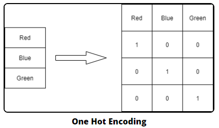
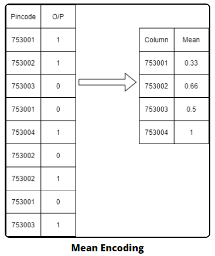
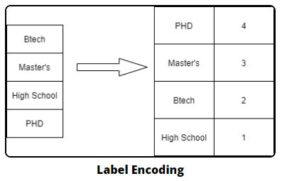
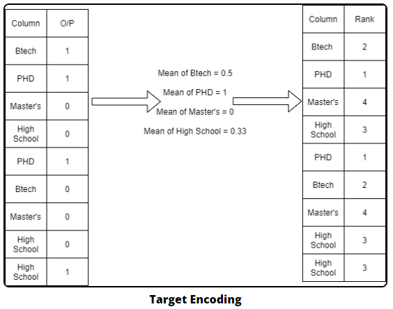

- 학습은 컴퓨터가 한다.
- 컴퓨터는 숫자는 아는데 문자를 모른다.
- 범주형 데이터를 학습할 수가 없다.
- 그렇다면 범주형 데이터는 다 수치화 해주어야 하나?
    - 아니다. ⇒ 어떻게 바꿀 수 있을까? ⇒ Data Encoding

## 데이터 인코딩

- 범주형 데이터만 한다.
- https://contrib.scikit-learn.org/category_encoders/index.html
- 문자열을 수치형으로 바꾸는 과정
- 하지만 범주형이라는 것을 티를 내야 한다.
- 범주형의 갯수(nunique)가 10개 미만이라면 One hot Encoding

### Norminal Encoding

1. ⭐ One hot Encoding
    1. True, False를 활용해 값을 적용
    2. 딥러닝에서 많이 사용
    3. 결측치가 무조건 없어야 한다.
    4. 단점
        1. 연산의 빈도가 늘어난다.
    5. 장점
        1. 다른 방법들은 One hot Encoding처럼 정확하게 못해주기 때문
    
    

    
    ```python
    data = {'color': ['Red', 'Blue', 'Green']}
    df = pd.DataFrame(data) 
    df.head()
    ```
    
    ```python
    # 인코딩 객체 만들어짐.
    # encoder 인스턴스 생성
    # 인스턴스에는 변수와 함수가 존재
    encoder = ce.OneHotEncoder(use_cat_names=True)
    
    # 인코딩 객체가 fit, transform....
    df_encoded = encoder.fit_transform(df)
    
    # transform 결과 보기
    df_encoded.head()
    ```
    
2. Mean Encoding
    1. 각각 데이터에 대한 평균값
    2. 데이터 량이 늘어나지는 않는다.
    3. 단점
        1. 컴퓨터는 순서형으로 인지하지 못한다.



### Ordinal Encoding

1. Label Encoding
    1. 라벨을 적자
    


2. Target Encoding
    1. Target을 고려한 Encoding
    2. Mean Encoding + Label Encoding
    
    
    
3. Ordinal Encoding
    1. Label Encoding과 비슷
