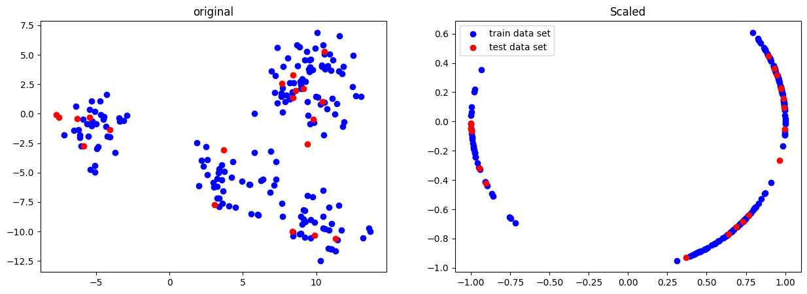
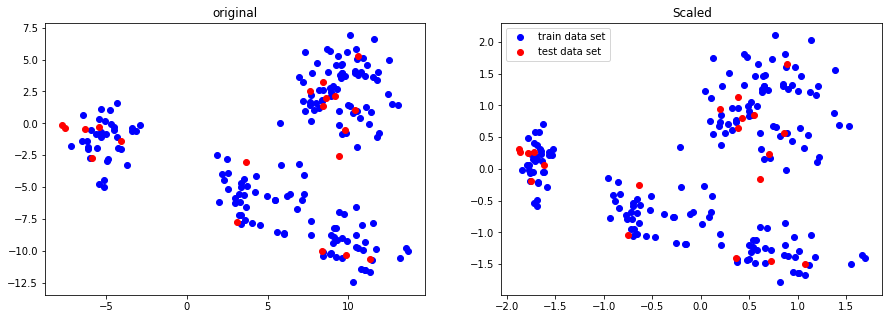
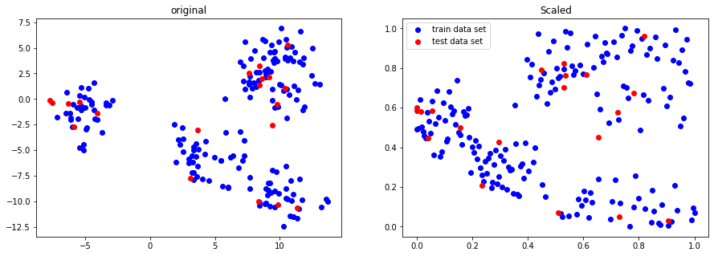
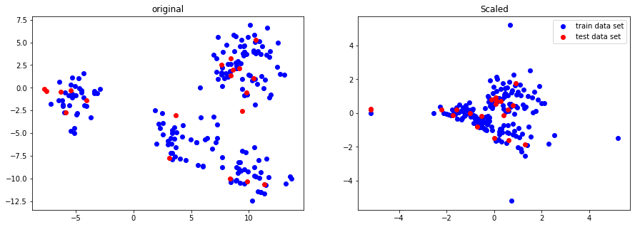
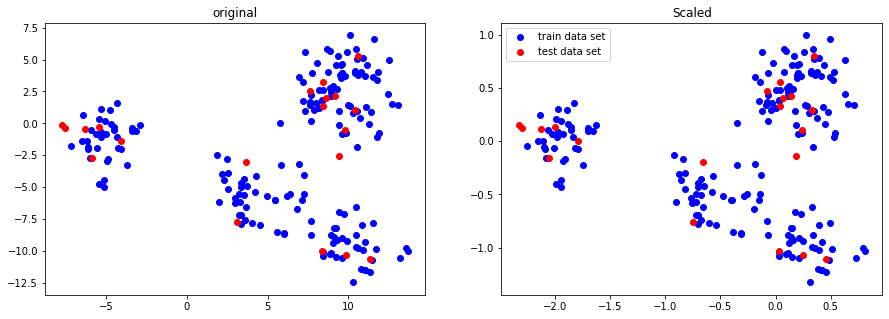

- Scaling을 하는 이유
    - Scale을 통일시켜준다.
    - 키, 나이, 연봉의 기준은 각기 다르다.
        - 0~1
            - 키 : 0 = 0, 190 =1
            - 나이 : 0 = 0, 80 = 1
            - 연봉 : 2000 = 0, 10000 = 1

### Normalizer

- 0~1 사이의 값들로 변환됨
- Scale 다운, 분포도 변경이 많다.

### Transformer : 크기와 분포 변환

1. Power Transformer
    1. 정규분포 형태에 가깝도록 변환
    2. 0을 기준으로 해서 음과 양의 데이터를 재정의
    3. Scale 다운, 분포도 변함이 많이 없다.
    
    

    
2. Quantile Transformer
    1. 정의한 분위대로 N등분 해서 Scale 다운
    2. 일정한 크기로 N등분해서 0과 1사이의 값으로 데이터 재정의
        
        

        
    3. Normal Quantile Transformer
        1. 데이터 자체를 정규분포 형태로 다시 재정의
        
        

        

### Scaler : 크기만 Scaler : 데이터 자체만 Scale

1. ⭐ Standard Scaler
    1. 가장 많이 사용
    2. 정규분포를 기준으로 해서 scaler
    3. 기존 데이터 형태를 유지하면서 데이터 재 배치 (0이 기준)
        
        

        
2. Robust Scaler
    1. 4분위표를 기준으로 Scaler
    2. 형태를 유지하면서 4분위로 잘라서 재 배치
    
    

    
3. ⭐ MinMax Scaler
    1. 꽤 많이 사용
    2. 시계열일 경우 많이 사용
    3. 가장 작은 것 0, 가장 큰 것 1로 하여 사이즈 재정의
    4. 데이터 분포도 유지되면서 데이터 재 배치
    5. 양수만 존재
    
    

    
4. MaxAbs Scaler
    1. 절대값을 이용해 Scaler
    
    

    

### Transformer → Scaler

- 꼭 Transformer하고 나서 Scaler를 해야 한다.
    - Scaler ⇒ Transformer
        - 원래 데이터의 분포도가 변경될 수 있다.
        - 데이터의 조작이 일어난다.
    - Transformer ⇒ Scaler
        - 크기는 줄어들지만 분포도는 그대로이다.
