## 분류 모델 측정

### 혼동행렬 (Confusion Matrix)

- 분석 모델에서 구한 분류의 예측 범주와 데이터의 실제 분류 범주를 교차 표 형태로 정리한 행렬
- 해석하는 방법
    - Accuracy: 정확도
        - 전체 모수 (TP + TN, FP, FN)에 몇 개 (TP + TN)를 맞추었나
    - Specificity: 특이도
        - 실제 Negative 값 (TN + FP)에서 모델이 Negative(TN)를 맞춘 비율
    - Recall, Sensitivity: 민감도
        - 실제 Positive 값 (TP + FN)에서 모델이 Positive(TP)를 맞춘 비율
    - Precision: 정밀도
        - 모델이 예측한 Positive (TP + FP)에서 실제 Positive (TP)를 예측한 비율

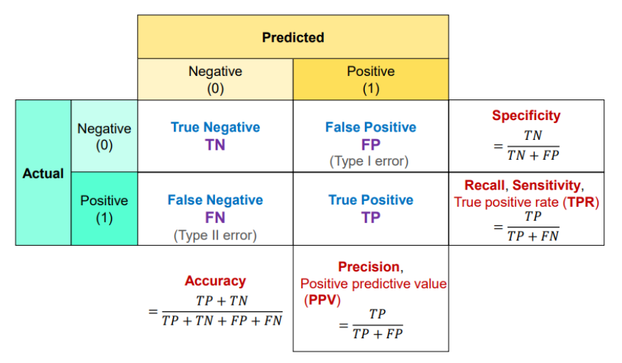

- TP(True Positive) : 모델이 Positive라 예측. 실제 값도 Positive
    - 참긍정.
    - 병에 관해 예라고 예측한 환자가 실제 병을 가진 경우
- TN(True Negative) : 모델이 Negative라 예측. 실제 값도 Negative
    - 참부정.
    - 병에 관해 아니오라고 예측한 환자가 실제로 병이 없는 경우
- FP(False Positive) : 모델이 Positive라 예측. 실제 값은 Negative
    - 거짓긍정.
    - 병에 관해 예라고 예측한 환자가 실제로는 병이 없는 경우
- FN(False Negative) : 모델이 Negative라 예측. 실제 값은 Positive
    - 거짓부정.
    - 병에 관해 아니오라고 예측한 환자가 실제로는 병이 있는 경우
    - 제일 위험
- TF와 TP를 올리는 것이 좋겠지만 상황에 따라 판단한다. FN을 줄이는 것이 좋다.
- ⭐ 분석가들은 Accuracy를 잘 안쓴다.
- ex)
    - A병원의 정확도 = (9+60) / (9+60+1+30) = 0.69
    - B병원의 정확도 = (1+70) / (1+70+9+20) = 0.71
    - Accuracy상 B변원 가야하는데, 실제로는 A가 좋은 것이다.
    
    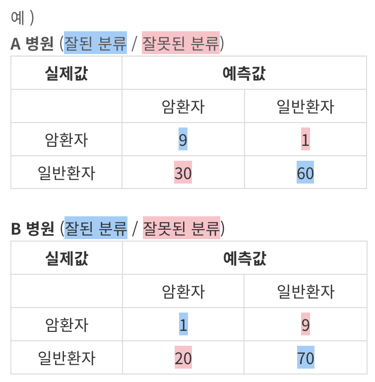

### **분류모델(SGDClassifier) 학습 및 예측**

1. Data
2. Modeling
3. Confusion Matrix
    - `y_true`: 실제 타깃 레이블이 담긴 1차원 배열
    - `y_pred`: 예측한 레이블이 담긴 1차원 배열
    - `labels`: 클래스 레이블로 사용될 값의 리스트. 기본값은 None으로, 레이블은 y_true와 y_pred의 고유한 값으로 설정됩니다.
    - `sample_weight`: 샘플 가중치. 기본값은 None으로, 모든 샘플의 가중치가 1로 설정됩니다.
    - `normalize`: 정규화 방식을 설정하는 문자열. 기본값은 None으로, 오차 행렬의 각 셀은 클래스당 실제 샘플 수로 계산됩니다. normalize=True로 설정하면, 각 클래스당 오차 행렬의 셀 값을 해당 클래스의 전체 샘플 수로 나누어 정규화합니다. normalize='pred'로 설정하면, 각 클래스당 오차 행렬의 셀 값을 해당 클래스를 예측한 전체 샘플 수로 나누어 정규화합니다. normalize='true'로 설정하면, 각 클래스당 오차 행렬의 셀 값을 해당 클래스를 실제 값으로 가진 전체 샘플 수로 나누어 정규화합니다.
    
    ```python
    from sklearn.metrics import confusion_matrix
    
    conf_mx = confusion_matrix(y_train, y_train_pred)
    conf_mx
    
    '''
    array([[1217,    7],   # TN, FP
           [   8,  115]])  # FN, TP
    '''
    ```
    
    ```python
    plt.figure(figsize=(7,5))
    
    # ⭐ 그릴줄 알아야 한다.
    sns.heatmap(conf_mx, annot=True, cmap="coolwarm", linewidth=0.5)
    
    plt.xlabel('Predicted')
    plt.ylabel('Actual')
    plt.show()
    ```
    
    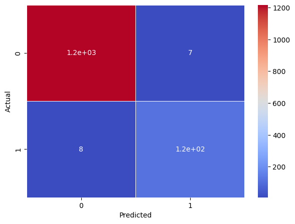

    - ⭐ **위에 이미지는 보기 힘들다. 확률로 확인하는 것이 좋다.**
    
    ```python
    # normalize="true" : 퍼센트로 표시한다.
    norm_conf_mx = confusion_matrix(y_train, y_train_pred, normalize="true")
    norm_conf_mx
    ```
    
    ```python
    plt.figure(figsize=(7,5))
    
    sns.heatmap(norm_conf_mx, annot=True, cmap="coolwarm", linewidth=0.5)
    
    plt.xlabel('Predicted')
    plt.ylabel('Actual')
    plt.show()
    ```
    
    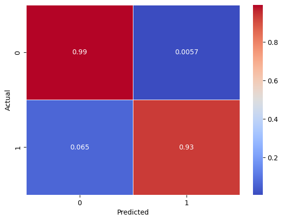

    - FP(0.0057)는 TN(0.99)으로, FN(0.065)은 TP(0.93)로 숫자가 옮겨져야 한다.

### 평가지표

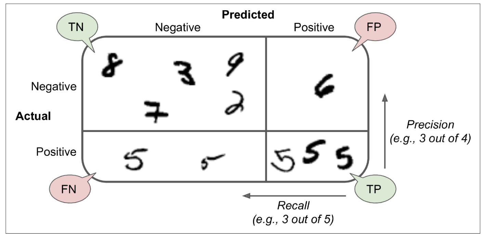

1. Accuracy(정확도)
    1. 분석가들은 Accuracy를 잘 안쓴다.
        1. 오류중에서 FN 오류를 줄이는 것이 더 중요한 경우
        2. 오류 중에 FP 오류를 줄이는 것이 더 중요한 경우
        3. 정확도는 위에 두가지 오류에 정도의 차이를 구분할수 없기 때문에 적절한 성능지표가 될수 없다.
        4. 음성(0)이 양성(1)보다 훨씬 많은경우 음성(0)으로만 예측해도 높은 정확도를 보이기 때문에 적절한 성능지표가 될수없다.
    
    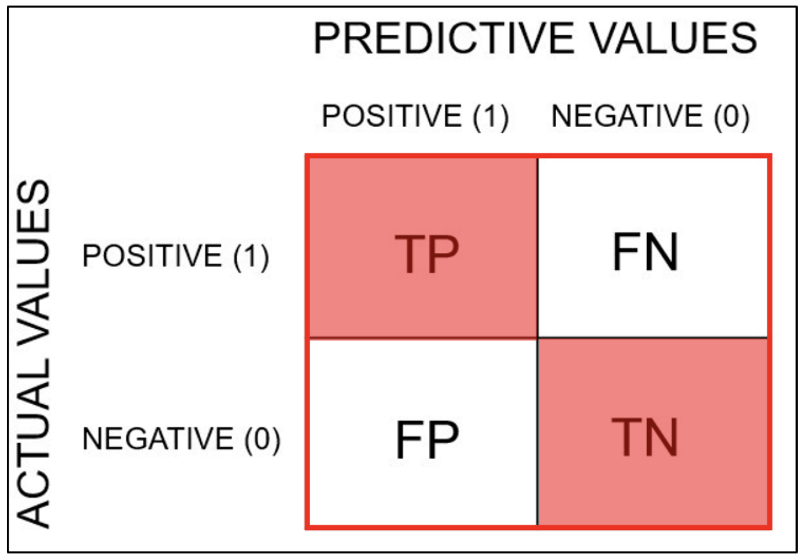

2. Precision(정밀도)
    1. FP 줄이는 것이 목표일 때 사용
    
    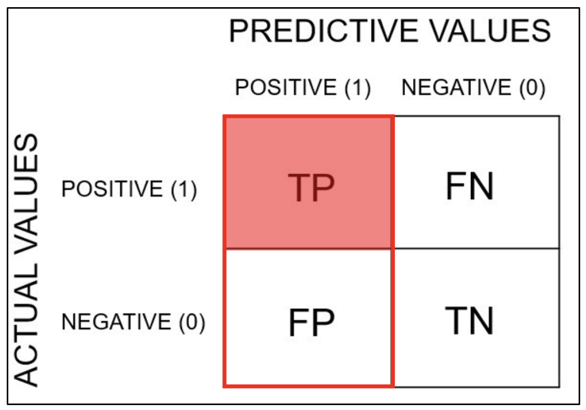

3. Sensitivity(민감도) = Recall(재현도) = TPR
    1. FN 줄이는 것이 목표일 때 사용
    
    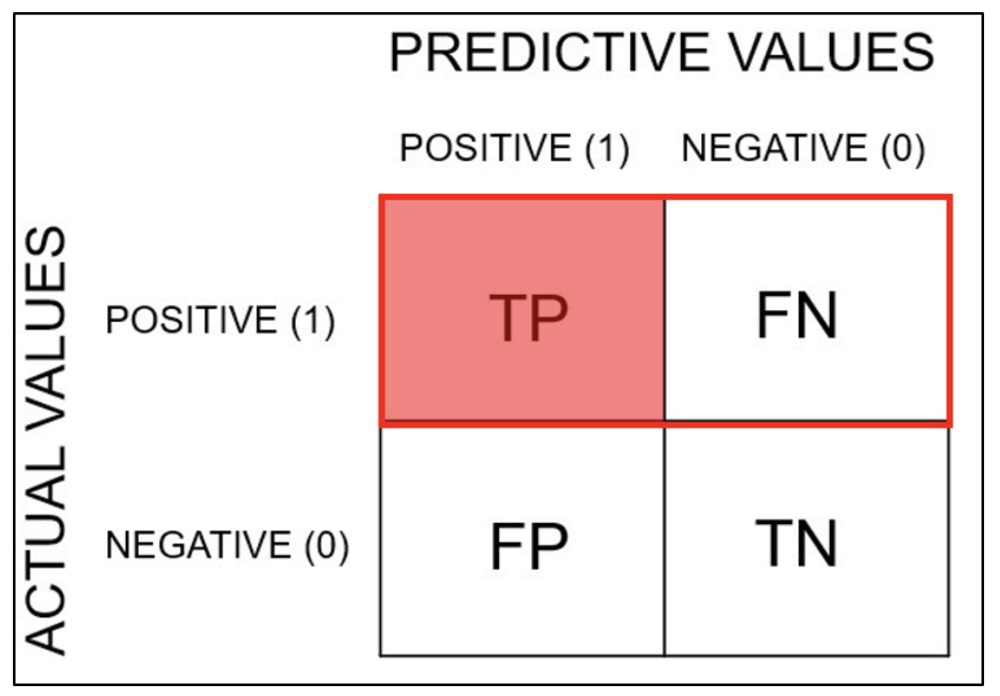

4. ⭐ F1 Score
    1. F1 Score 평가를 많이 쓴다.
    2. 정밀도 + 민감도
    3. 불균형한 데이터가 잘 동작하는지에 대한 평가지표
    4. classification_report : 평가지표 전부 보여준다.
    
    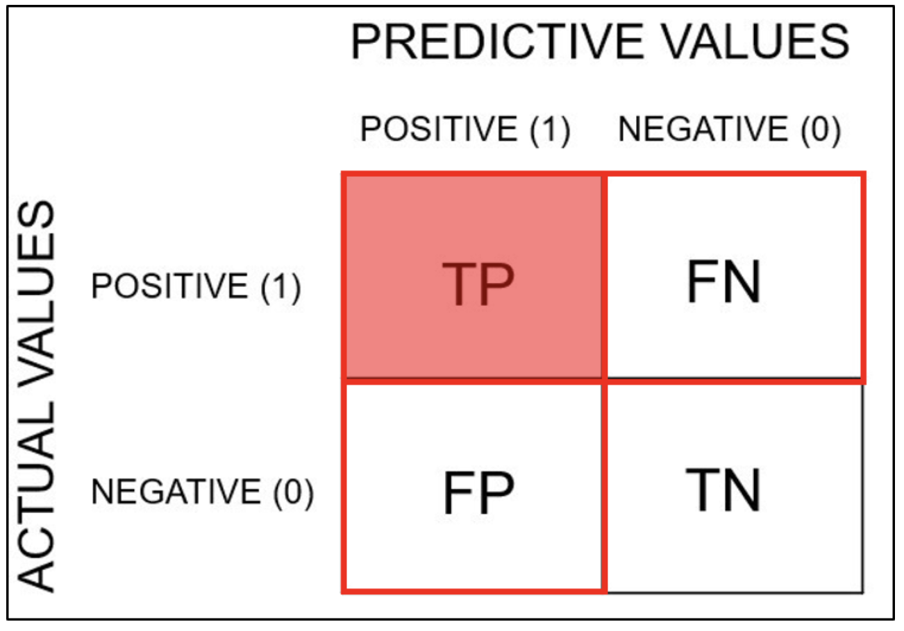

    ```python
    # 전체 평가지표 확인
    from sklearn.metrics import classification_report
    
    print(classification_report(y_valid, pred_dummy))
    print('-'*100)
    print(classification_report(y_valid, pred_clf))
    ```
    
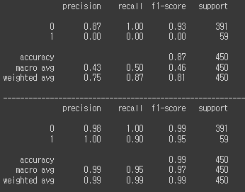

1. ⭐ Precision-Recall Trade-off
    1. Trade-off : 한 쪽이 올라가면 한 쪽이 떨어진다.
    2. 임계값(Thresholds) : 기준 변경
        1. recall : 모델이 T 예측한 값 / 실제 T값
        2. precision : 실제 맞춘 것 / T예측한 전체
        3. precision과 recall은 Trade-off 관계
    
    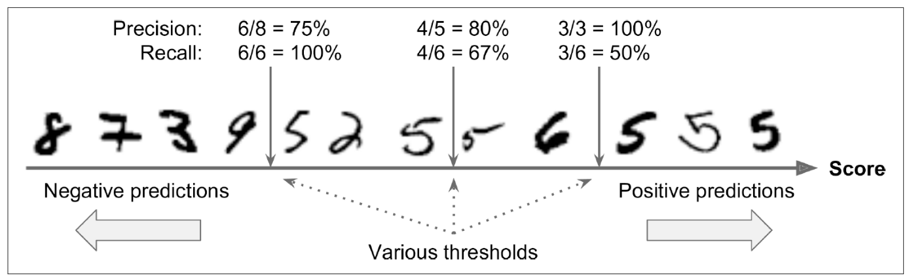


### 이진 분류 모형 예제

1. ⭐ ROC curve(Receiver Operating Characteristic curve)
    
    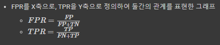

    1. AUROC (Area Under ROC curve)
        1. ROC Curve의 밑부분 면적
        2. 넓을수록 모형 성능이 좋다.
        3. 임계값(threshold)이 어떻게 선택되었는지와 무관하게 모델의 예측 품질을 측정할 수 있다
        4. threshold값에 따라 위치가 달라진다. 좀 더 다양하게 score 값을 낼 수 있다.
            1. Poor model: 0.5 ~ 0.7
            2. Fair model: 0.7 ~ 0.8
            3. Good model: 0.8 ~ 0.9
            4. Excellent model: 0.9 ~ 1.0
            
            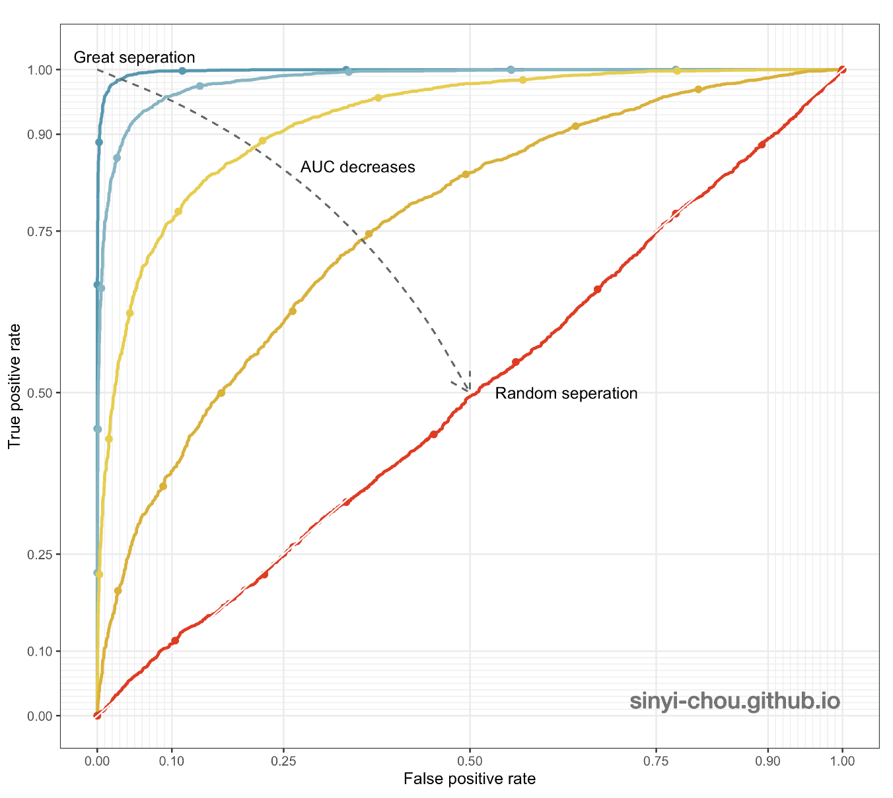

        ```python
        pred_dummy = dummy.predict_proba(x_valid)[:,1] # 1에 대한 확률만 가져오겠다.
        pred_tree = tree.predict_proba(x_valid)[:,1]
        ```
        
        ```python
        from sklearn.metrics import roc_curve, auc
        
        # ROC 커브를 먼저 그려야 한다.
        # AUROC는 ROC의 면적이니까
        fpr, tpr, thresholds = roc_curve(y_valid,pred_dummy)
        print(f'dummy: {auc(fpr, tpr)}')
        print('-'*50)
        fpr, tpr, thresholds = roc_curve(y_valid,pred_tree)
        print(f'model: {auc(fpr, tpr)}')
        ```
        
        ```python
        from sklearn.metrics import RocCurveDisplay
        
        fig,ax = plt.subplots()
        RocCurveDisplay.from_predictions(y_valid,pred_dummy,ax=ax)
        RocCurveDisplay.from_predictions(y_valid,pred_tree,ax=ax)
        plt.show()
        ```
        
        - 그래프 그리기
        
        ```python
        conf_mx = confusion_matrix(y_valid, pred_clf)
        conf_mx
        ```
        
        ```python
        plt.figure(figsize=(7,5))
        
        sns.heatmap(norm_conf_mx, annot=True, cmap="coolwarm", linewidth=0.5)
        
        plt.xlabel('Predicted')
        plt.ylabel('Actual')
        plt.show()
        ```
        

### 다중 분류 모형 예제

- 딥러닝에서 사용
1. Multi Classification 분류방법
    1. 소프트맥스 함수 (Softmax Function)
        1. 각 클래스에 대한 확률을 출력
        2. 모델은 실수가 결과로 나오는데 실수는 기준이 없어 해석을 하기 힘들다. 그래서 확률 값으로 바꾸어 주고 해석하는 것이다.
        
        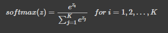

        ```python
        x = tree.predict_proba(x_valid)[0]
        
        y = softmax(x)
        
        print(f'소프트맥스 출력합: {np.sum(y)}')
        
        ratio = y
        labels = [0,1,2,3,4,5,6,7,8,9]
        
        plt.pie(ratio, labels=labels, shadow=True, startangle=90)
        plt.show()
        ```
        
        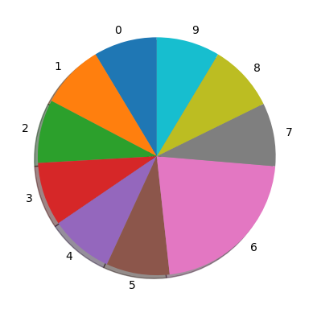
