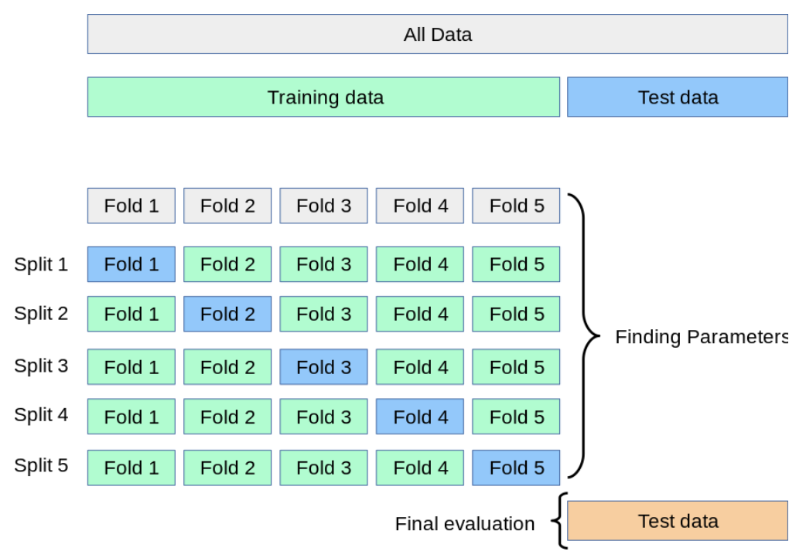
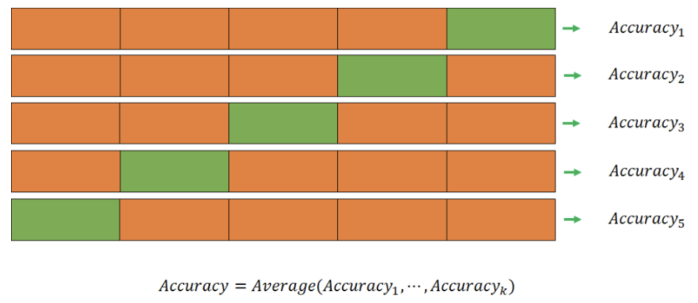
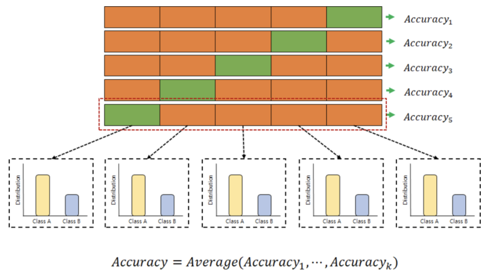

### 교차 검증 (Cross Validation)

- 평가에 대한 기법
- train에서 train과 test로 나누어 모델 검증을 하는데 그렇게도면 test에 과적합하게 되므로, 실제 데이터를 가져와도 예측을 수행하면 맞지 않는 경우 발생. ⇒ 교차검증하자



- 1번은 test로 하고 나머지는 train으로 하자. ⇒ 그것을 N번하자
- 오버피팅을 감소
- 학습량이 많아진다.
- 정확한 판단 가능
1. ⭐ k-fold cross vaildation
    1. 회귀모델일 때 사용
    
    

2. Stratified k-fold cross validation
    1. 분류모델일 때 사용
    
    

```python
import numpy as np 

from sklearn.model_selection import train_test_split
from sklearn import datasets
```

```python
# 데이터 로드
iris = datasets.load_iris()
X = iris.data
y = iris.target

X.shape, y.shape
```

```python
# train set, test set으로 분리
X_train, X_test, y_train, y_test = train_test_split(X, y, test_size=0.4, random_state=0)
```

```python
from sklearn.model_selection import KFold
from sklearn.metrics import accuracy_score

# 모델 정의
clf = svm.SVC(kernel='linear', C=1)

# 교차 검증
# n_splits : 몇 개로 쪼개서 몇 번을 학습할 것인가
# 숫자가 너무 크면, 한쪽으로 편향되어서 문제이다.
# 숫자가 너무 작아도 문제이다.
kf = KFold(n_splits=5, shuffle=True, random_state=0)

n_iter = 0
for train_index, valid_index in kf.split(X_train):
  print(f'train_index: {train_index} / valid_index: {valid_index}')
  if n_iter == 3:
    break
```

```python
train_x = X_train[train_index]
train_x.shape

valid_x = X_train[valid_index]
valid_x.shape

train_y = y_train[train_index]
train_y.shape

clf.fit(train_x, train_y)
```

```python
n_iter = 0
accuracy_lst = []

for train_index, valid_index in kf.split(X_train):
  n_iter += 1
  # 학습용, 검증용 데이터 구성
  train_x, valid_x = X_train[train_index], X_train[valid_index]
  train_y, valid_y = y_train[train_index], y_train[valid_index]
  # 학습
  clf.fit(train_x, train_y)
  # 예측
  pred = clf.predict(valid_x)
  # 평가
  accuracy = np.round(accuracy_score(valid_y, pred), 4)
  accuracy_lst.append(accuracy)
  print(f'{n_iter} 번째 K-fold 정확도: {accuracy}, 학습데이터 크기: {train_x.shape}, 검증데이터 크기: {valid_x.shape}')

# 최종 평가
print('-'*50)
print(f'교차 검증 정확도: {np.mean(accuracy_lst)} / 모델 평가: {clf.score(X_test, y_test)}')
```

1. cross_val_score()
    1. KFold를 많이 사용하지만 간단하게 빠르게 확인하기 위해 많이 사용
    
    ```python
    from sklearn.model_selection import cross_val_score
    
    # 모델 정의
    clf = svm.SVC(kernel='linear', C=1)
    # 교차 검증
    scores = cross_val_score(clf, X_train, y_train, scoring='accuracy', cv=5)
    print(f'각 검증 별 점수: \n{pd.Series(scores)}')
    print(f'교차 검증 평균 점수: {np.mean(scores)}')
    ```
    
    ```python
    skf = StratifiedKFold(n_splits=5, shuffle=True, random_state=0)
    
    # 모델 정의
    clf = svm.SVC(kernel='linear', C=1)
    # 교차 검증
    scores = cross_val_score(clf, X_train, y_train, scoring='accuracy', cv=skf)
    print(f'각 검증 별 점수: \n{pd.Series(scores)}')
    print(f'교차 검증 평균 점수: {np.mean(scores)}')
    ```
