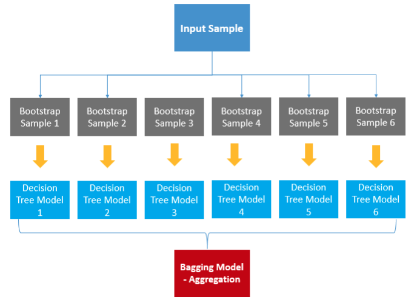

- 여러 머신러닝 모델을 연결해 더 강력한 모델을 만드는 기법
- Decision Tree는 분류, 예측 둘 다 가능하다.

### Bagging

- 동일한 모델을 여러개 사용
- 데이터를 복원추출을 통해 Random하게 데이터를 재정의 (Random 추출)
- 각자 서로 다른 데이터 셋을 가지고 학습.



1. Random Forest
    1. Decision Tree를 여러개 사용
    2. n_estimators : Decision Tree 몇개를 사용할 것인지
    
    

### ⭐ Boosting

- 많이 사용함.
- 기본이 1000개
- Bagging과 동일하게 N개의 Decision Tree를 사용하지만,
    - 첫 번째 모델이 다 학습한다.
    - 첫 번째 결과가 나온다.
    - 첫 번째 결과를 바탕으로 기존 데이터 셋을 변경한다.
    - 두 번째 모델은 변경된 데이터 셋을 가지고 학습한다.
- 약한 모델로 N번을 학습하자.
- 모델이 알아서 노이즈를 제거한다.


1. Gradient Boost (GBM)
    1. 전통적인 Boosting
    2. 병렬 학습이 안된다.
    3. 주요 파라미터
        1. max_depth: 1 ~ 5 이하로 설정
        2. n_estimators: 생성할 트리의 개수
        3. learning_rate(제약조건): 얼마나 강하게 보정할지를 정하는 수치
    
    ```python
    from sklearn.ensemble import GradientBoostingRegressor, GradientBoostingClassifier
    
    from sklearn.datasets import load_breast_cancer
    
    cancer = load_breast_cancer()
    X_tr, X_te, y_tr, y_te = train_test_split(
        cancer.data, cancer.target, stratify=cancer.target, random_state=42
    )
    
    gradient = GradientBoostingRegressor(random_state=0).fit(X_tr, y_tr)
    print(f'훈련용 평가지표: {gradient.score(X_tr, y_tr)} / 테스트용 평가지표: {gradient.score(X_te, y_te)}')
    ```
    
    ```python
    hp = {
        "random_state" : 0,
        "max_depth" : 1,
        "n_estimators" : 100,
        "learning_rate" : 0.2,
    }
    
    gradient = GradientBoostingRegressor(**hp).fit(X_tr, y_tr)
    print(f'훈련용 평가지표: {gradient.score(X_tr, y_tr)} / 테스트용 평가지표: {gradient.score(X_te, y_te)}')
    ```
    
2. ⭐ XGBoost
    1. https://xgboost.readthedocs.io/en/stable/index.html
    2. GBM(Gradient Boost)를 병렬 학습이 지원
    3. GBM 보다 학습이 빠르다.
    4. 주요 파라미터 (https://wooono.tistory.com/97)
        1. 일반 파라미터
            1. Tree 모델에 대한 파라미터
        2. 부스터 파라미터
            1. XGBoost만의 파라미터
        3. 학습 과정 파라미터
            1. 학습 시나리오
    
    ```python
    from xgboost import XGBClassifier, plot_importance
    
    hp = {
        "random_state" : 42
    }
    
    xgb = XGBClassifier(**hp).fit(X_tr, y_tr)
    print(f'훈련용 평가지표: {xgb.score(X_tr, y_tr)} / 테스트용 평가지표: {xgb.score(X_te, y_te)}')
    ```
    
    - 과접합 방지
    
    ```python
    hp = {
        "random_state" : 42,
        "max_depth" : 2,
        "n_estimators" : 200, # 수행할 부스팅 단계 수
        "learning_rate": 0.01,
        "min_child_weight": 2,
        "gamma": 1
    }
    
    xgb = XGBClassifier(**hp).fit(X_tr, y_tr)
    print(f'훈련용 평가지표: {xgb.score(X_tr, y_tr)} / 테스트용 평가지표: {xgb.score(X_te, y_te)}')
    ```
    
    - Tree모델에서 지원하는 Feature Inportance
    
    ```python
    import matplotlib.pyplot as plt
    plot_importance(xgb)
    plt.show()
    ```
    
    

3. ⭐ Light GBM
    1. https://lightgbm.readthedocs.io/en/latest/index.html
    2. 가벼운 GBM
    3. Tree 기준 분할이 아닌 리프 기준 분할방식
        1. Tree처럼 동시에 분할이 아니라 순차적으로 하나씩 하자.
    4. XGBoost보다 빠르다.
    5. 대용량 처리 가능 (메모리 사용량이 상대적으로 적다)
    6. 주요 파라미터 (https://nicola-ml.tistory.com/51)
        1. num_leaves: 클수록 정확도는 높아지지만 오버피팅 발생 가능
        2. min_data_in_leaf: 클수록 오버피팅 방지
        3. max_depth: 낮추기
        4. learning_rate 낮추기 & n_estimators 높이기
    
    

    ```python
    from lightgbm import LGBMClassifier, plot_importance
    
    hp = {
        "random_state" : 42,
        "max_depth" : 2,
        "n_estimators" : 100,
        "learning_rate": 0.01,
    }
    
    lgb = LGBMClassifier(**hp).fit(X_tr, y_tr)
    print(f'훈련용 평가지표: {lgb.score(X_tr, y_tr)} / 테스트용 평가지표: {lgb.score(X_te, y_te)}')
    ```
    
4. Catboost
    1. https://catboost.ai/en/docs/
    2. https://www.rasgoml.com/tutorial-listings/model-selection
    3. 범주형 데이터가 많을 경우 사용.
        1. 인코딩도 알아서 다 해준다.
    
    
    
    ```python
    !pip install catboost
    ```
    
    ```python
    from catboost import CatBoostClassifier
    
    hp = {
        "random_state" : 42,
        "max_depth" : 2,
        "n_estimators" : 100, # 수행할 부스팅 단계 수
        "verbose" : 0 # 부스팅 단계 출력 안보이게 하기ㅗㅖㅒ
    }
    
    cat = CatBoostClassifier(**hp).fit(X_tr, y_tr)
    print(f'훈련용 평가지표: {cat.score(X_tr, y_tr)} / 테스트용 평가지표: {cat.score(X_te, y_te)}')
    ```
    

### Voting

- ⭐ 다른 모델을 여러가지 사용, 동일한 알고리즘 사용X
- 똑같은 데이터 셋, 각기 다른 모델
- Bagging은 이길 수 있지만, Boosting은 이길 수 없다.
    - Voting은 모델이 유한(동일 모델 사용 불가하니까)하지만 Boosting은 기본이 1000개이기에 이길 수 없다.
    - Voting은 모든 모델을 다 알아야 하지만 Boosting은 하나만 파면 된다.


- Hard Voting
    - 모델들의 예측 결과를 다수결로 최종 결과 결정
- Soft Voting
    - 모델들의 예측 결과 확률 값으로 평균하여 최종 결과 결정


```python
from sklearn.ensemble import VotingClassifier

# neural_network에 관련된 모델
# 동일 모델이면 안된다.
# sklearn.neural_network의 다른 모델은 사용할 수 없다.
from sklearn.neural_network import MLPClassifier
from sklearn.linear_model import LogisticRegression
from sklearn.ensemble import RandomForestClassifier
```

```python
SEED = 42
estimators = [
    ( "mlp" , MLPClassifier(max_iter=1000,random_state=SEED) ),
    ( "lr" , LogisticRegression(random_state=SEED) ),
    ( "rf" , RandomForestClassifier(random_state=SEED) )
]

hp = {
    "estimators" : estimators,
    "voting" : "soft"
}

vot = VotingClassifier(**hp).fit(X_tr, y_tr)
print(f'훈련용 평가지표: {vot.score(X_tr, y_tr)} / 테스트용 평가지표: {vot.score(X_te, y_te)}')
```

### Stacking

- 다른 모델을 여러가지 사용
- 모델들의 예측 결과들을 확률로 DataFrame을 만든다.
- 만든 DataFrame으로 최종 결과를 낸다.


```python
from sklearn.ensemble import StackingClassifier

from sklearn.neural_network import MLPClassifier
from sklearn.linear_model import LogisticRegression
from sklearn.ensemble import RandomForestClassifier
```

```python
SEED = 42
estimators = [
    ( "mlp" , MLPClassifier(max_iter=1000,random_state=SEED) ),
    ( "lr" , LogisticRegression(random_state=SEED) ),
    ( "rf" , RandomForestClassifier(random_state=SEED) )
]

hp = {
    "estimators" : estimators,
    "final_estimator" : LogisticRegression(random_state=SEED)
}

stack = StackingClassifier(**hp,n_jobs=-1).fit(X_tr, y_tr)
print(f'훈련용 평가지표: {stack.score(X_tr, y_tr)} / 테스트용 평가지표: {stack.score(X_te, y_te)}')
```
