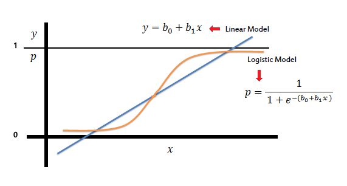
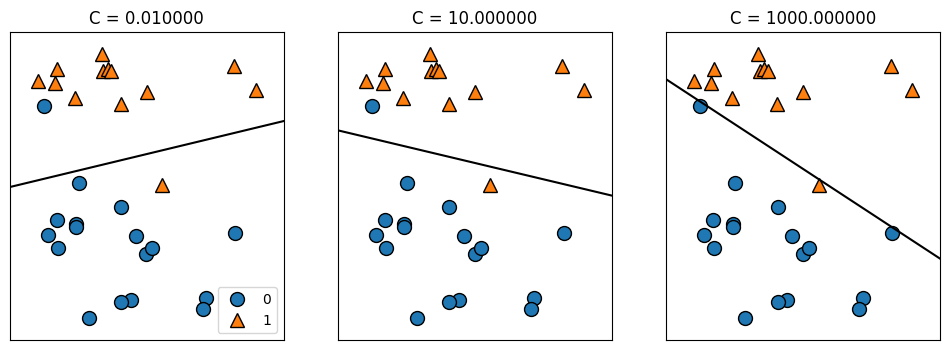
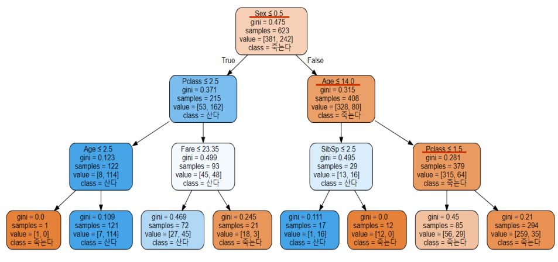
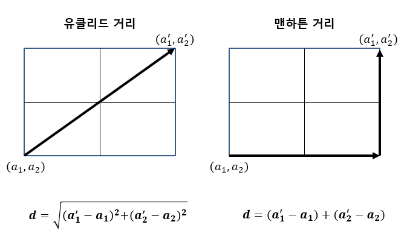
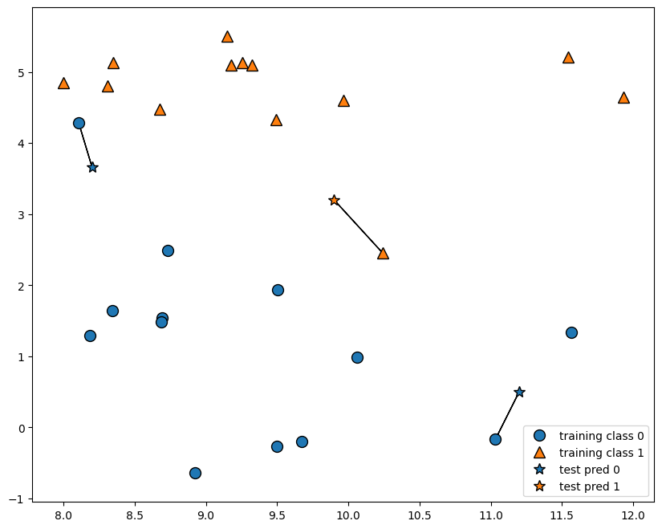
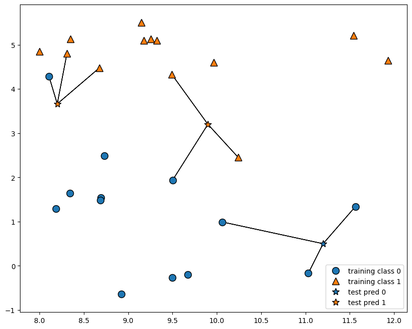

### 분류의 선형 모델

1. 로지스틱 회귀 (Logsitic Regression)
    1. Binary Classification에서 사용이 가능 (이진분류만 가능)
    2. 그래프에서 기준에서 위에는 1, 아래는 0
    3. 하이퍼파리미터 C에 따라 결과값이 달라진다.
    
    

2. 선형 서포트벡터 머신(Linear SVM)
    1. 이진분류
    2. 선을 그어 위에는 1, 아래는 1
    3. 하이퍼파리미터 C에 따라 결과값이 달라진다.
    
    

### ⭐ 의사결정나무 (Decision Tree)

- 앙상블 : 의사결정나무 들의 집합체
- 회귀, 분류 둘다 가능
- 각 Feature를 조건들에 맞추어 True, False로 나누어 준다.
- 여러가지 규칙을 순차적으로 적용하면서 트리기반의 규칙을 만들어 예측하는 알고리즘
- 데이터를 분할 하는데 순수도가 높은 방향으로 규칙을 정한다.
- 순수도
    - 각 노드의 규칙에 의해 동일한 클래스가 포함되는 정도를 의미
    - 부모노드의 순수도에 비해 자식노드들에 순수도가 증가하도록 트리를 형성
- 순수도 척도
    - entropy: 엔트로피는 데이터의 혼자도를 의미한다. 엔트로피값이 0이 될때까지 계층이 만들어진다.
    - gini: gini(불평등지수) 값이 0이면 평등하다는 것을(분류가 잘됐다). 뜻한다. 이 값 역시 0이 될때까지 계층이 만들어진다.
    - gini, entropy값이 0에 가까울 수록 순수도가 높다는 뜻이다.
- root node: 최상단에 위치한 노드(시작점)
- leaf node: 더 이상의 규칙을 정할 수 없는 노드(결정된 클래스 값)
- max nodes: gini/entropy값이 0이 되지 않더라도, max nodes 값 이상으로 노드를 만들지 않음
- min samples split: 해당 노드가 가지고 있는 최소한의 샘플의 개수를 나타낸다.
- min sample leaf: 또 다른 노드를 만들 수 있는 최소한의 샘플 수 조건을 뜻한다.



```python
from sklearn.tree import DecisionTreeClassifier

cancer = load_breast_cancer()
X_tr, X_te, y_tr, y_te = train_test_split(
    cancer.data, cancer.target, stratify=cancer.target, random_state=42
)

tree = DecisionTreeClassifier(random_state=0).fit(X_tr, y_tr)
print(f'훈련용 평가지표: {tree.score(X_tr, y_tr)} / 테스트용 평가지표: {tree.score(X_te, y_te)}')
```

```python
hp = {
    "random_state":42,
    "max_depth":4 ,# 최대 깊이
    "min_samples_split":2, # 노드를 분할하는데 필요한 최소한의 샘플수
    "criterion" : "entropy", # 순수도 척도
    "max_leaf_nodes" : 10, # 최대리프노드수, 과적합 방지
    "min_samples_leaf" : 20, # 리프노드에 있어야할 최소 샘플수
}

tree = DecisionTreeClassifier(**hp).fit(X_tr, y_tr)
print(f'훈련용 평가지표: {tree.score(X_tr, y_tr)} / 테스트용 평가지표: {tree.score(X_te, y_te)}')
```

- 각 Feature들의 중요도 확인

```python
plt.figure(figsize=(10,8))

sns.barplot(x=tree.feature_importances_,y=cancer.feature_names)
plt.show()
```

### K-최근접 이웃 (K-NN)

- 회귀, 분류 둘다 가능
- K개의 최근접 이웃 : 이웃데이터를 K개로 설정
- 나를 기준으로 가까운 데이터로 학습한다.
    - 하나의 데이터와 다른 데이터가 얼마나 가깝나?



- 가장 가까운 이웃 1개를 가지고 학습한다.

```python
plt.figure(figsize=(10,8))

mglearn.plots.plot_knn_classification(n_neighbors=1)
```



- 가장 가까운 이웃 3개를 가지고 학습한다.

```python
plt.figure(figsize=(10,8))

mglearn.plots.plot_knn_classification(n_neighbors=3)
```



```python
from sklearn.neighbors import KNeighborsClassifier

X, y = mglearn.datasets.make_forge()
X_tr, X_te, y_tr, y_te = train_test_split(X, y, random_state=0)

clf = KNeighborsClassifier(n_neighbors=3).fit(X_tr, y_tr)
print(f'훈련용 평가지표: {clf.score(X_tr, y_tr)} / 테스트용 평가지표: {clf.score(X_te, y_te)}')
```

```python
for neighbor in [1, 2, 3, 4, 5, 6, 7, 8]:
  clf = KNeighborsClassifier(n_neighbors=neighbor).fit(X_tr, y_tr)
  print(f'neighbor: {neighbor}')
  print(f'훈련용 평가지표: {clf.score(X_tr, y_tr)} / 테스트용 평가지표: {clf.score(X_te, y_te)}')
```
