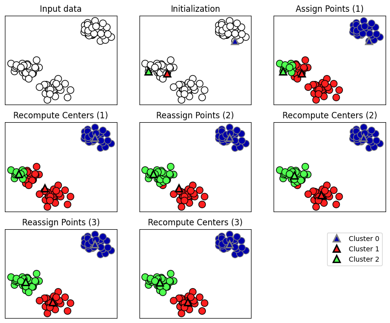
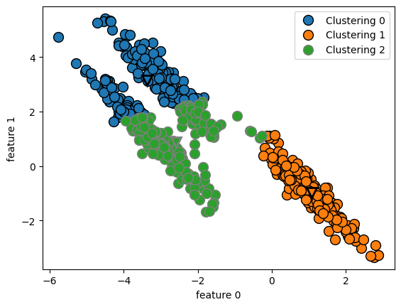
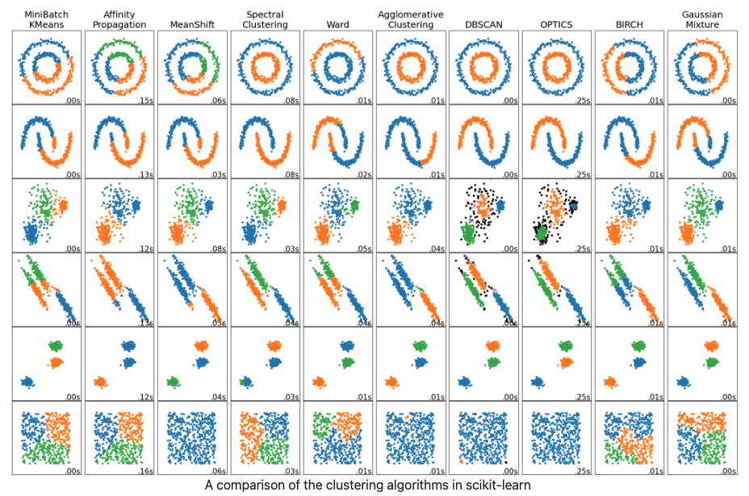

- feature만 있고 target은 없지만 평가를 해야할 때 사용

### Clustering (군집)

1. K-means
    1. ⭐ 전체 class 갯수(label)는 정확하게 알아야 한다.
    2. 랜덤하게 값을 뽑는다.
    3. 값을 중심으로 가장 가까운 데이터들을 묶는다.
    4. 2차로 나눈 데이터를 기반으로 중심점을 다시 잡는다. (중심점 재정의)
    5. 다시 가까운 데이터를 묶는다.
    6. 이러한 작업을 결과가 바뀌지 않을 때까지 반복.
    
    
    
    ```python
    
    ```
    
    - 단점
        - class 갯수를 모르면 사용할 수 없다.
        - 기준을 중심으로 그룹핑을 하면 기본적으로 데이터는 동그래야 한다.
            - 직선일 경우에는 학습이 잘 안된다.
            
            

2. Overview of Clustering methods
    1. https://scikit-learn.org/stable/modules/clustering.html
    
    

    - 데이터의 분포도와 class의 갯수를 정확하게 안다면 상기 이미지에서 괜찮은 것 골라서 쓰면 된다.
