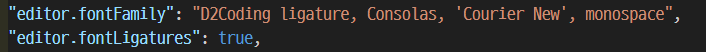

### Python 개발환경 설정

- Download Version
    - Python 3.11.5
    - Python 3.10.11
    - Python 3.9.13
- 여러 버전을 설치하는 이유
    - 패키지, 모듈 때문에
    - 가상환경을 통해 사용
- Python 설치 확인
    - 시스템 환경 변수 확인
        - Python
        - Python\Scripts
- Python Execution Policy (실행정책) 변경
    - 하나의 툴에서 다 개발하기 위해
      
    ```
      💡 IDE (통합개발환경)
      - 어떤 언어 개발에 이용되는지
      - 편리성
    ```
    
    - PowerShell 관리자 권한으로 실행
    - get-ExecutionPolicy - 현재 실행정책
        - Restricted나오는에 RemoteSigned으로 바꾼다.
    - set-ExecutionPolicy RemoteSigned - 실행정책 변경
- VSCode 설치
- VSCode Extension
    - indent-rainbow
    - Jupyter
    - Material Icon Theme
    - Perttier - Code formatter
    - Python
    - Pylance : Python 문법 체크
- D2 Coding 설치 및 설정
    - VSCode 적용
        - File → Preference → Settings → Font Family에 추가
            - D2Coding ligature
        - Edit in settings.json에서 값 변경
            
            

            

### 가상환경

1. 가상환경을 왜 만드나?
    1. 개발환경 맞추어야 Python내 패키지, 모듈을 동일하게 사용 가능하다.
    2. 직접 가상환경을 만드는 것을 권장
        1. venv
2. 가상환경 만드는 방법
    1. VS Code Powershell 실행
    2. File → Terminal → New Terminal
    3. 현재 디렉토리 확인
        1. pwd : present working directory
    4. 가상환경 생성
        1. py -{파이썬 버전} -m venv .venv (m은 관리자권한)
            
            ```python
            py -3.11 -m venv .venv
            ```
            
    5. 가상환경 확인
        1. 가상환경 접속
            
            ```python
            .\.venv\Scripts\activate
            ```
            
        2. 버전 확인
            
            ```python
            python --version
            ```
            
        3. 가상환경 나가기
            
            ```python
            deactivate
            ```
