- 정형 데이터 (Structured Data)
    - 고정된 필드에 저장된 데이터
    - RDBMS, 엑셀
- 반정형 데이터 (Semi-Structured Data)
    - 고정된 필드에 저장되어 있지는 않지만, 메타데이터나 스키마 등을 포함하는 데이터
    - XML, HTML, JSON, 이메일
- 비정형 데이터 (Unstructured Data)
    - 고정된 필드에 저장되어 있지 않은 데이터
    - 텍스트, 이미지, 동영상, 음성 데이터

### Database
- 정형 데이터 (Structured Data)를 다룸
- 데이터의 집합
    - 서로 성향이 비슷한 것들끼리의 모음

### Database 특징

- 다양한 어플리케이션에서의 독립성
- 실시간 접근성
- 동시공유
- 지속적인 업데이트
- 참조

### DBMS(Database Management System)

- Oracle, MySQL 등

### DBMS 기능

- DB 구축
- DB 정의
- DB 조작
- DB 공유
- DB보호
- 권한제어
- 유지보수

### DBMS 유형

- Relational DBMS (RDBMS)
    - 관계형 데이터베이스 : DB 끼리 관계
    - 비용이 들고 데이터량이 많아지면 속도 저하
    - Oracle, MySQL, PostgreSQL
    - Relational, Analytical(OLAP)
- NoSQL DBMS
    - 비관계형 데이터베이스
    - 비용이 저렴하고 데이터량이 많아도 속도가 빠름
    - MongoDB, Hbase, DynamoDB
    - Column-Family, Graph, Document, Key-Value

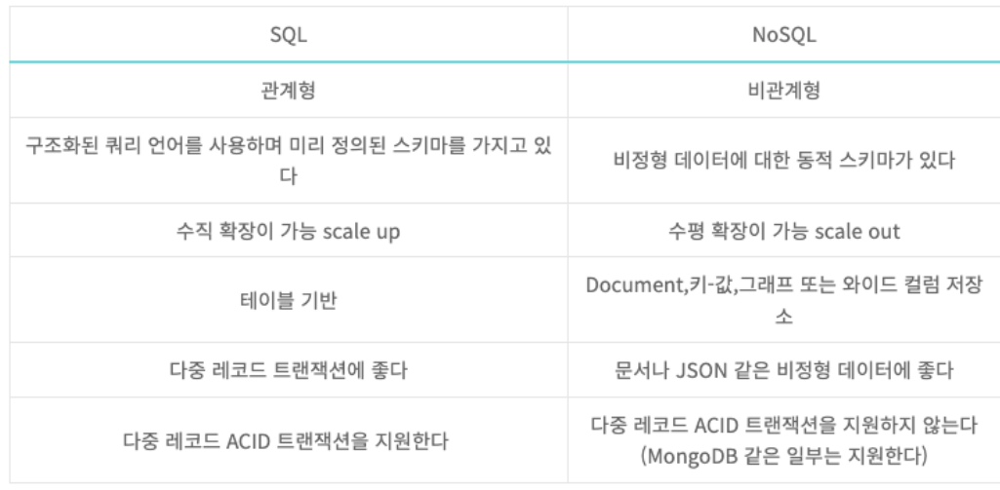

### 데이터 모델링 & ERD

- 효율적으로, 최적화해서 데이터 저장 및 관리

### 데이터 모델링 순서

1. 업무파악 (요구사항 수집 및 분석)
    1. 업무를 데이터화하여 모델링 할 것인지에 대한 요구사항 수집
2. 개념적 데이터 모델링 (ERD 작성)
    1. Entity 도출해 ERD 작성
    2. 객체 간의 상관관계 표시
3. 논리적 데이터 모델링
    1. DBMS에 맞게 Table, 변수, type 설계 및 정규화 ⇒ 정의
4. 물리적 데이터 모델링
    1. 선택한 Database에 실제 테이블을 만드는 작업
    2. 제약조건 정의
    3. 객체의 상관관계 정의

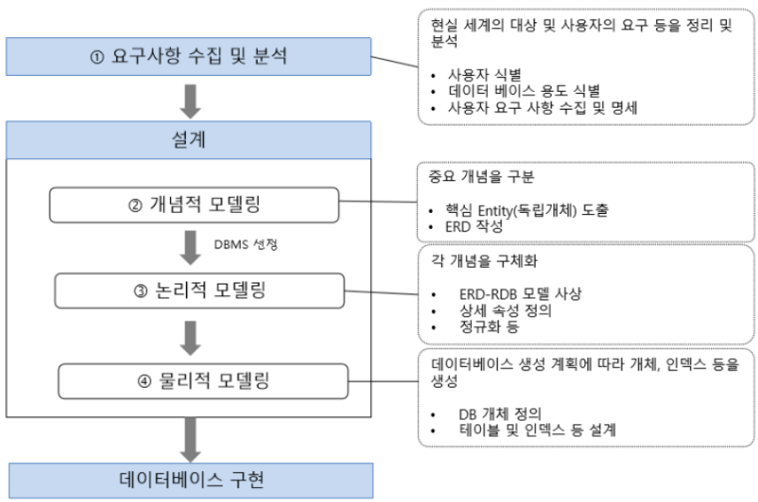

### ERD (Entity-Relation Diagram)

- Entity == Table
    - 학생 : Entity
- Attribute
    - 학번, 이름 : Attribute
- PK (Primary Key)
    - 유일한 식별자
- FK (Foreign Key)
    - 관계
- Domain
    - type : int, varchar, char 등
- 제약조건 (NOT NULL)
    - NULL 허용 유무
- Relation
    - 식별관계
        - 부모 자식 관계에서 자식이 부모의 PK를 FK로 참조해서 자신의 PK로 설정
        - 선으로 표시
        - NULL 미존재
        
        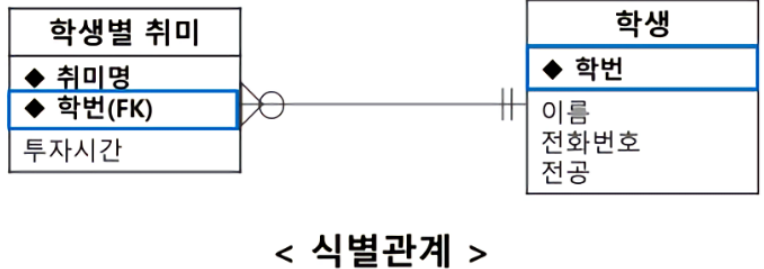

    - 비식별관계
        - 부모 자식 관계에서 자식이 부모의 PK를 FK로 참조해서 일반 속성으로 사용
        - 점선으로 표시
        - NULL 존재
        
        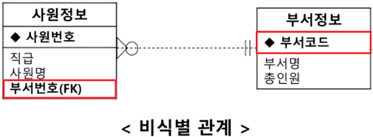

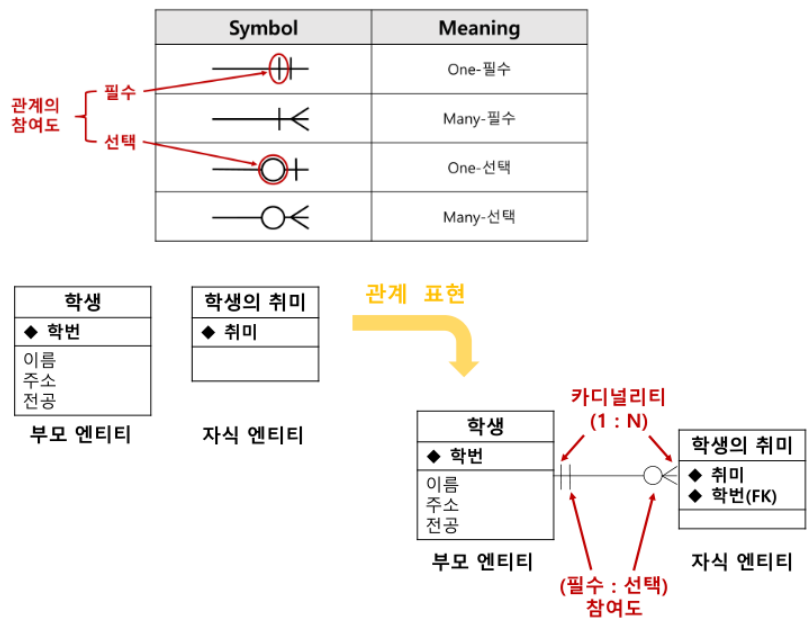

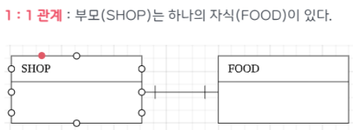

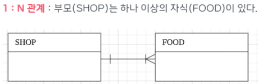

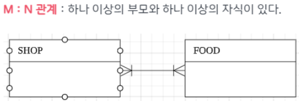

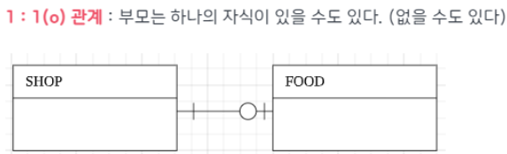

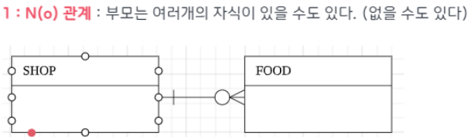

### ⭐ 데이터베이스 정규화

- 데이터의 중복을 최소화하게 구조화하는 프로세스
- 목적
    - 불필요한 데이터 제거, 데이터의 중복을 최소화 함으로써 저장공간이나 자원을 효율적으로 사용하기 위함
    - Insert, Update, Delete 실행 시, 발생할 수 있는 이상현상 방지
1. 제1정규형
    1. 하나의 컬럼에 하나의 값만 기입
    
    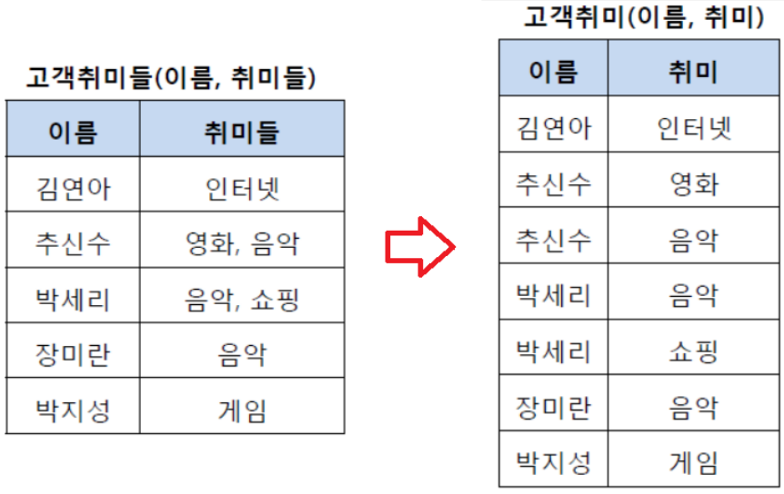

2. 제2정규형
    1. 제1정규형을 거친 테이블 나누기
    2. 중복데이터 제거됨
    
    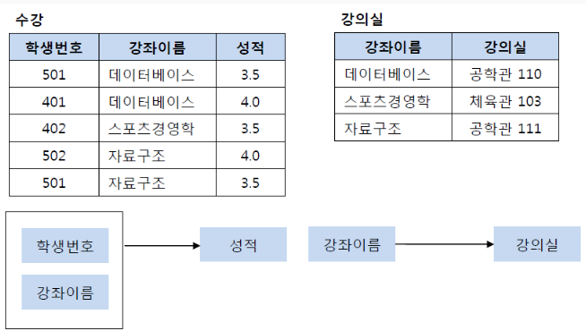

3. 제3정규형
    1. 제2정규형을 거친 테이블 나누기
    2. 여러 정보가 포함되어 있는 것을 나누기
    
    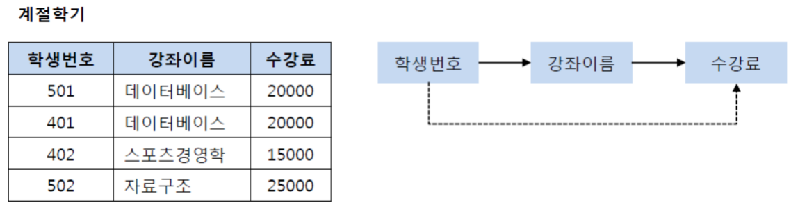

    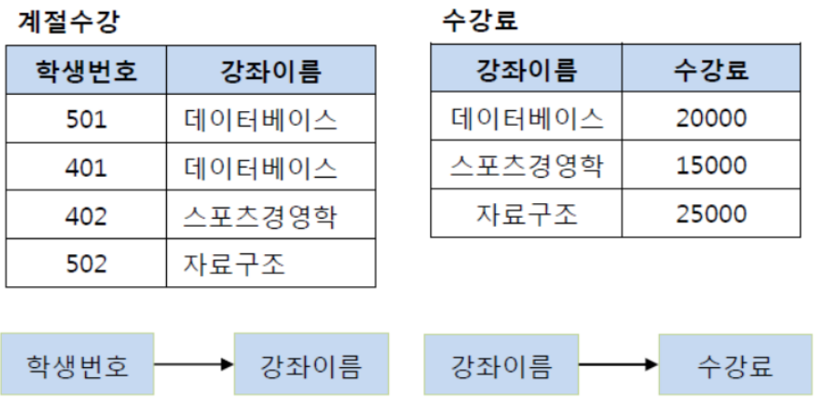

4. BCNF정규화 (선택)

### SQL (Structured Query Language)

- DDL (Data Definition Language)
    - 테이블 정의, 수정, 삭제
    - Create, Alter, Drop, Rename, Truncate
- DML (Data Manipulation Language)
    - 데이터 삽입, 조회, 수정, 삭제
    - Insert, Select, Update, Delete
- DCL (Data Control Language)
    - 데이터 보안, 권한, 무결성, 회복 등 데이터 제어
    - Grant, Revoke
- TCL (Transaction Control Language)
    - Commit, Rollback, Savepoint

--------------------------------
<aside>
💡 Reference

</aside>

- [https://inpa.tistory.com/entry/DB-📚-데이터-모델링-1N-관계-📈-ERD-다이어그램](https://inpa.tistory.com/entry/DB-%F0%9F%93%9A-%EB%8D%B0%EC%9D%B4%ED%84%B0-%EB%AA%A8%EB%8D%B8%EB%A7%81-1N-%EA%B4%80%EA%B3%84-%F0%9F%93%88-ERD-%EB%8B%A4%EC%9D%B4%EC%96%B4%EA%B7%B8%EB%9E%A8)
- [https://inpa.tistory.com/entry/ERD-CLOUD-☁️-ERD-다이어그램을-온라인에서-그려보자](https://inpa.tistory.com/entry/ERD-CLOUD-%E2%98%81%EF%B8%8F-ERD-%EB%8B%A4%EC%9D%B4%EC%96%B4%EA%B7%B8%EB%9E%A8%EC%9D%84-%EC%98%A8%EB%9D%BC%EC%9D%B8%EC%97%90%EC%84%9C-%EA%B7%B8%EB%A0%A4%EB%B3%B4%EC%9E%90)
