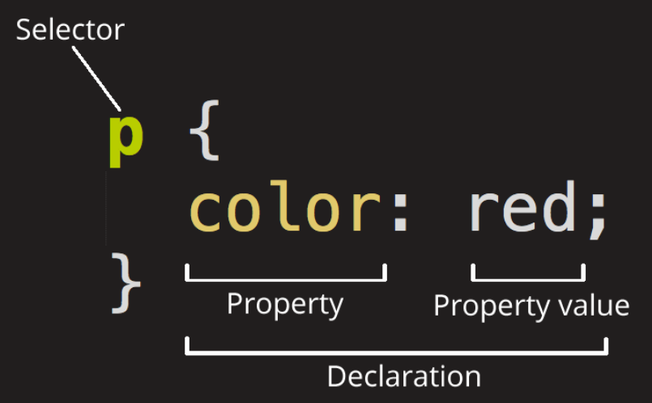

### CSS (**Casading Style Sheet)**



- Selector : Element를 뜻함
- id와 class를 많이 사용
    - id = #
    - class = .

### CSS Framework

(많이 사용)

- Bootstrap
- Tailwind

### CSS Selector

- 전체 선택자 ( * )
    - All Elements 적용
    
    ```css
    * {
      color: green;
    }
    ```
    
- 태그 선택자
    - 지정한 태그만 적용
    
    ```css
    a {
      color: red;
    }
    ```
    
- 클래스 선택자 ( . )
    - class 선택자만 적용
    
    ```css
    /* class="spacious" 전부 */
    .spacious {
      margin: 2em;
    }
    
    /* <li> 태그에 class="spacious" */
    li.spacious {
      margin: 2em;
    }
    
    /* <li> 태그에 spacious, elegant 둘다 있는 경우 */
    li.spacious.elegant {
      margin: 2em;
    }
    ```
    
- ID 선택자 ( # )
    - id 선택자만 적용
    
    ```css
    #demo {
      border: red 2px solid;
    }
    ```
    
- 속성 선택자 ( [ ] )
    - 지정한 Attribute 만 적용
    
    ```css
    /* a태그에 title 속성 */
    a[title] {
      color: purple;
    }
    
    /* a태그에 href 지정값 */
    a[href="https://example.org"] {
      color: green;
    }
    
    /* a태그 href에 example 단어가 포함된 경우 */
    a[href*="example"] {
      font-size: 2em;
    }
    
    /* a태그 href에 .org로 끝나는 경우 */
    a[href$=".org"] {
      font-style: italic;
    }
    
    /* a태그 class에 logo 단어가 포함된 경우 */
    a[class~="logo"] {
      padding: 2px;
    }
    ```
    
- 그룹 선택자 ( , )
    - 여러 태그 지정해서 적용
    
    ```css
    /* 모든 span과 div 요소 선택 */
    span,
    div {
      border: red 2px solid;
    }
    
    #main,
    .content,
    article {
      font-size: 1.1em;
    }
    ```
    
- 결합 선택자
    - A + B (인접 형제 결합자)
    - A ~ B (일반 형제 결합자)
    - A > B (자식 결합자)
    - A B (자손 결합자)

<aside>
💡 Reference

</aside>

- CSS Framework
    - https://github.com/troxler/awesome-css-frameworks
- CSS Selector 놀이
    - https://flukeout.github.io/