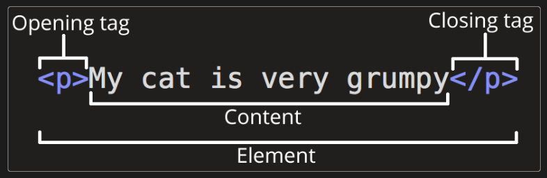
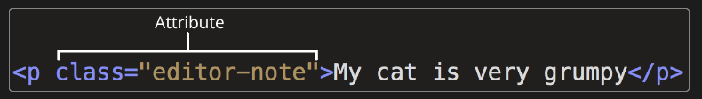
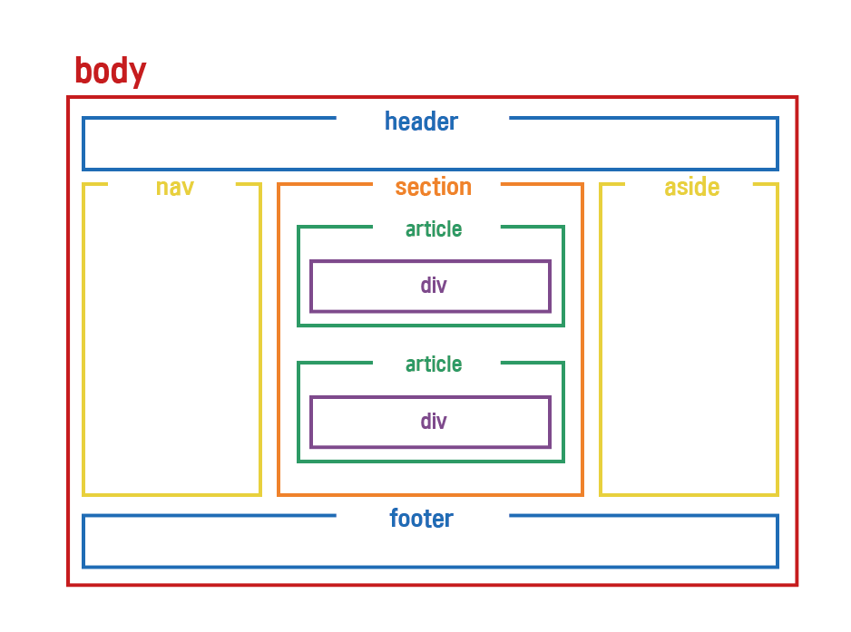

### HTML

- 문서 (파일)
- <!DOCTYPE html> : 문서 타입이 html
    - HTML5 버전
- Element 들의 집합
    - HTML을 구성하는 구성요소
    
    
    
- 속성 (Attribute)
    - 변수 설정
    
    
    

### HTML 기본 구조



```html
<!-- ! 탭을 이용하면 자동으로 만들어짐.  -->
<!DOCTYPE html>
<html lang="en"><!-- 사용할 언어는 영어 -->
<!-- head : 브라우저가 문서를 해적할 때 사용할 정보 -->
<head>
    <meta charset="UTF-8"> <!-- 인코딩 종류 -->
    <!-- http-equiv : MS 브라우저 호환성 -->
    <!-- content : 문서모드 -->
    <meta http-equiv="X-UA-Compatible" content="IE=edge">
    <!-- 브라우저 크기설정 : 브라우저 크기가 다양하기 때문에 device 크기만큼 맞추어줘-->
    <meta name="viewport" content="width=device-width, initial-scale=1.0">
    <title>Document</title> <!-- 탭 제목 -->
</head>
<!-- body : 브라우저 사용자들에게 눈으로 보여줄 정보(데이터) -->
<body>
    <h1>This is h1</h1>
    <hr> <!-- hr 은 구분자가 생기게 함 -->
    <h2>This is h2</h2>
    <br>
    <h3>This is h3</h3>
    <br>
    <!-- lorem을 이용하면 긴 샘플 글을 얻을 수 있음 -->
    <p>Lorem ipsum dolor sit amet consectetur adipisicing elit. Fugiat harum vel ducimus minima unde delectus ad aspernatur vero, odit aperiam ullam id atque ab doloremque ipsam, sed facilis incidunt numquam.</p> 
    <p>Lorem ipsum dolor sit, amet consectetur adipisicing elit. Architecto consequuntur sit nostrum explicabo, illo magni vero unde omnis, eius iure vel dolor itaque alias aliquid eaque distinctio ipsum. Repellendus, asperiores.</p>
</body>
</html>
```

- HyperLink
    - a 태그
    
    ```html
    <a href="https://www.google.com">
            Google1
        </a>
    ```
    
- p, span, div 차이
    - div : Division Tag
        - body 내에 영역 나누기
        - 세션나누기
        - 줄바꿈 O
    - p : Paragraph Tag
        - 문단절을 기재할 때 사용
        - 글자 문단 나누기
    - span : Span Tag
        - 텍스트에 색칠, 크기, 좌우간격을 조절하는데 사용
        - css 속성 inline이 자동으로 적용되어 있음
        - 줄바꿈 X
- head meta tag
    - html 설정
    
    ```html
    <!DOCTYPE html>
    <html lang="en">
    <head>
        <!-- HTML 문서에 대한 인코딩 옵션 -->
        <meta charset="UTF-8">
        <!-- 렌더링 모드: 웹표준을 지키지 않은(IE) 브라우저인 경우 특정 랜더링을 정의하는 옵션 -->
        <!-- html를 사용자가 보기 편하게 만든다 -->
        <meta http-equiv="X-UA-Compatible" content="IE=edge">
        <!-- 웹페이지에 대한 설명 -->
        <meta name="description" content="HTML Tutorial">
        <!-- 검색 엔진을 위한 키워드  -->
        <meta name="keywords" content="HTML, tutorial">
        <!-- 웹페이지의 작성자 -->
        <meta name="author" content="Mr. Cho">
        <!-- 모든 장치(pc, mobile)에서 웹 사이트가 잘 보이도록 설정  -->
        <meta name="viewport" content="width=device-width, initial-scale=1.0">
        <!-- 아이콘 추가 -->
        <link rel="icon" type="image/png" href="../img/icon.png">
        <title>Document</title>
    </head>
    <body>
        <p><a href="https://developer.mozilla.org/en-US/docs/Learn/HTML/Introduction_to_HTML/The_head_metadata_in_HTML#metadata_the_meta_element" target="_blank">metadata:</a> a set of data that describes and gives information about other data.</p>
    </body>
    </html>
    ```
    
- ⭐form
    
    ```html
    <!DOCTYPE html>
    <html lang="en">
    <head>
        <meta charset="UTF-8">
        <meta http-equiv="X-UA-Compatible" content="IE=edge">
        <meta name="viewport" content="width=device-width, initial-scale=1.0">
        <title>Document</title>
        <script>
            function getform(form){
                alert("name: "+form.name.value+", pwd:"+form.pwd.value);
            }
        </script>
    </head>
    <body>
        <!-- action : 전달될 서버 데이터 -->
        <!-- method : 서버 전달 방식 -->
        <!-- onsubmit : 서버에 전달하기 전 실행하는 액션 -->
        <form name="my_form" action="" method="GET" onsubmit="getform(this);">
            <div>
                <label for="name">name:</label>
                <input type="text" id="name" name="name" placeholder="what is your name?" required>
            </div>
            <br>
            <div>
                <label for="pwd">password:</label>
                <input type="password" id="pwd" name="pwd" maxlength="10" required>
            </div>
            <br>
            <div>
                <label for="email">email:</label>
                <input type="email" id="email" name="email" placeholder="example@gmail.com">
            </div>
            <br>
            <div>
                <label for="phone">phone:</label>
                <input type="tel" id="phone" name="phone" placeholder="(123) 123-1234">
            </div>
            <br>
            <div>
                <label for="birth">birthdate:</label>
                <input type="date" id="birth" name="birth" >
            </div>
            <br>
            <div>
                <label for="quantity">quantity:</label>
                <input type="number" id="quantity" name="quantity" min="0" max="100" value="1">
            </div>
            <br>
            <div>
                <label for="title">title: </label>
                <label for="Mr.">Mr.</label>
                <input type="radio" id="Mr." name="title" value="Mr." checked>
                <label for="Mrs.">Mrs.</label>
                <input type="radio" id="Mrs." name="title" value="Mrs.">
                <label for="PhD.">PhD.</label>
                <input type="radio" id="PhD." name="title" value="PhD.">
            </div>
            <br>
            <div>
                <label for="payment">payment:</label> 
                <select id="payment" name="payment">
                    <option value="visa">visa</option>
                    <option value="mastercard">mastercard</option>
                    <option value="giftcard">giftcard</option>
                </select>
            </div>
            <br>
            <div>
                <label for="subscribe">subscribe:</label>
                <input type="checkbox" id="subscribe" name="subscribe">
            </div>
            <br>
            <div>
                <input type="reset">
                <input type="submit">
            </div>
        </form>
    </body>
    </html>
    ```
    

<aside>
💡 Reference

</aside>

- http-equiv
    - [https://webisfree.com/2016-03-23/meta-태그-http-equiv-설정방법과-차이점](https://webisfree.com/2016-03-23/meta-%ED%83%9C%EA%B7%B8-http-equiv-%EC%84%A4%EC%A0%95%EB%B0%A9%EB%B2%95%EA%B3%BC-%EC%B0%A8%EC%9D%B4%EC%A0%90)
- div, p, span 태그 차이
    - [https://inpa.tistory.com/entry/HTML-📚-p-div-span-태그-정리](https://inpa.tistory.com/entry/HTML-%F0%9F%93%9A-p-div-span-%ED%83%9C%EA%B7%B8-%EC%A0%95%EB%A6%AC)