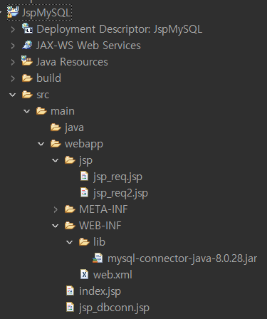

- WEB-INF에서 lib 폴더 생성
- WEB-INF/lib 에 MySQL jar 파일 넣기
- 프로젝트에 build path 추가
    - WEB-INF/lib에 있는 MySQL 사용
    - JSP는 webapp 안에 있는 파일만 인식



### Code

- .jsp

```html
<%@ page import="java.sql.*" %>
<%@ page language="java" contentType="text/html; charset=UTF-8" pageEncoding="UTF-8"%>
<!DOCTYPE html>
<html>
<head>
<meta charset="UTF-8">
<meta name="viewport" content="width=device-width, initial-scale=1.0">

<script src="https://ajax.googleapis.com/ajax/libs/angularjs/1.7.9/angular.min.js"></script>
<link rel="stylesheet" href="https://stackpath.bootstrapcdn.com/bootstrap/4.4.1/css/bootstrap.min.css" />

<link rel="stylesheet" href="../css/index.css">

<title>To Do List Ex</title>
</head>
<body>
	<div class="app-container d-flex align-items-center justify-content-center flex-column">
		<h3>Todo App</h3>
		<form action="https://www.daum.net">
			<div class="d-flex align-items-center mb-3">
				<div class="form-group mr-3 mb-0">
					<input type="text" class="form-control" id="formGroupExampleInput" placeholder="Enter a task here" />
				</div>
				<button type="submit" class="btn btn-primary mr-3">Save</button>
				<button type="button" class="btn btn-warning">Get Tasks</button>
			</div>
		</form>

		<!-- To Do List 화면 -->
		<div class="table-wrapper">
			<table class="table table-hover table-bordered">
				<thead>
					<tr>
						<th>custNum</th>
						<th>city</th>
						<th>country</th>
						<th>Actions</th>
					</tr>
				</thead>
				<tbody>
					<%
					String user1 = "jdbc:mysql://localhost:3306/classicmodels";
					String id = "test";
					String pw = "test1234";
					
					Connection conn = null;
					PreparedStatement pstmt = null;
					ResultSet rs = null;
					String className = "com.mysql.jdbc.Driver";
					
					try {
						// MySQL 드라이버 생성
						Class.forName(className);
						// DB Connection 생성
						conn = DriverManager.getConnection(user1, id, pw);
						System.out.println("DB Connection Success");
						
						// Query
						String query = "SELECT customerNumber, city, country FROM customers WHERE 1=1 LIMIT 5;";
						
						// Connection 객체에 query 전달
						pstmt = conn.prepareStatement(query);
						
						// Query 결과 받기
						rs = pstmt.executeQuery();
						
						String trColor = "";
						String tdStatus = "";
						// 결과를 하나씩 가젼오기
						while (rs.next()) {
							int custNum = rs.getInt("customerNumber");
							String city = rs.getString("city");
							String country = rs.getString("country");
							
							if (custNum >= 115){
								trColor = "table-warning";
								tdStatus = "complete";
							}
							else{
								trColor = "table-success";
								tdStatus = "task";
							}
	       		%>
						<tr class=<%=trColor %>>
							<td class=<%=tdStatus %>><%=custNum %></td>
							<td class=<%=tdStatus %>><%=city %></td>
							<td class=<%=tdStatus %>><%=country %></td>
							<td><a href="https://www.google.com">
									<button class="btn btn-danger">Delete</button>
							</a> <a href="https://www.naver.com">
									<button class="btn btn-success">Finished</button>
							</a></td>
						</tr>
						<%
							}
							
						}
						catch (ClassNotFoundException e) {
							System.out.println("MySQL Driver Error");
							e.printStackTrace();
						} 
						catch (SQLException e) {
							System.out.println("Connection Error");
							e.printStackTrace();
						}
						finally {
							if(rs != null) {
								try { rs.close(); } 
								catch (SQLException e) { e.printStackTrace(); }
							}
							
							if(pstmt != null) {
								try { pstmt.close(); } 
								catch (SQLException e) { e.printStackTrace(); }
							}
							
							if(conn != null) {
								try { conn.close(); } 
								catch (SQLException e) { e.printStackTrace(); }
							}
						}
       		%>
				</tbody>
			</table>
		</div>
	</div>
</body>
</html>
```

- .css

```css
@charset "UTF-8";

.app-container {
  height: 100vh;
  width: 100%;
}
.complete {
  text-decoration: line-through;
}
```