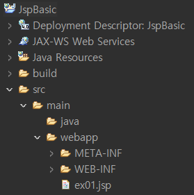
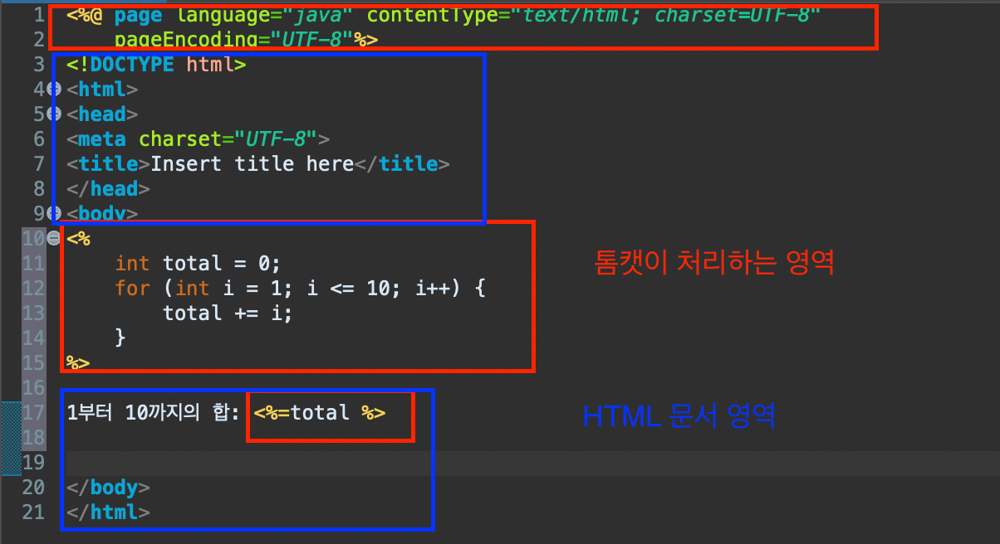
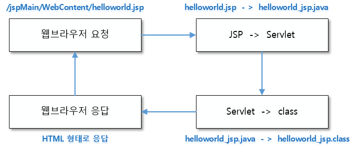

### JSP (Java Server Pages)

- HTML 코드에 JAVA 코드를 넣어 동적 웹페이지 생성

### JSP 파일 구조



- webapp : HTML, CSS 작성하는 곳
    - META-INF
    - WEB-INF
        - 외부에서 바로 접근할 수 없음.
        - WEB-INF내에 있는 jsp 파일은 Servlet으로 접근시켜야함
- Java Resources : Java 코드 작성하는 곳
- JSP file
    - html 파일



```html
<%@ page language="java" contentType="text/html; charset=UTF-8"
    pageEncoding="UTF-8"%>
<!-- 언어: Java, 
본 문서 타입은 HTML, 
문자, 인코딩 : UTF-8 -->
```

### JSP 기본문법

> <%= : HTML 화면에 표시됨
<% : Java 코드
<%! : Java 코드
> 

```html
<%@ page language="java" contentType="text/html; charset=UTF-8"
    pageEncoding="UTF-8"%>
<!DOCTYPE html>
<html>
<head>
<meta charset="UTF-8">
<title>JSP 기본문법</title>
</head>
<body>
<%
	//Scriptlet: 자바코드를 작성할 수 있는 영역(연산, 처리 기능 정의)
	String str = "스크립틀릿 입니다.";
	String comment = "주석";
%>

<!-- 표현식: 값을 출력(처리, 연산 코드 사용 불가)  -->
선언문: <%= declration %> <br/>
스크립틀릿: <%= str %> <br/>
<!-- <%= comment %>  -->  
<%-- <%= comment %> --%>

<%!
	// 선언문 (멤버필드, 멤버 메서드 정의)
	String declration = "선언문";
%>

</body>
</html>
```

- 실행
    - Configured : 웹 반영
    - 하나에 하나의 프로젝트만 실행하는 것이 안전

### JSP Life Cycle



- 요청
    - Browser가 Server에 JSP에 대한 요청 정보 전달
- JSP → Servlet (Transfer)
    - tomcat 서버가 jsp 파일을 서블릿 코드로 변환 (java 파일)
- Servlet → class (Compile)
    - 컴퓨터가 읽을 수 있는 파일로 변환 (class)
    - java 파일을 컴파일해서 실행하능한 bytecode로 변환 (class 파일)
- class → 웹 브라우저
    - tomcat 서버가 class 파일을 Browser에 뿌려준다.

### web.xml

- jsp, Servlet 설정파일
- 2개 이상의 web.xml 사용 불가
- welcome-file-list, context-param, servlet, servlet-mapping 등

### Ex

- basic

```html
<%@ page language="java" contentType="text/html; charset=UTF-8"
    pageEncoding="UTF-8"%>
<!DOCTYPE html>
<html>
<head>
<meta charset="UTF-8">
<title>JSP 기본 문법</title>
</head>
<body>
	<%
		// 자바 코드 작성
		// 스크립틀릿 : 자바로 연산, 처리 등을 할 수 있다.
		String str = "스크립틀릿 입니다.";
		int num = 1;
		num *= 5;
		/* System.out.println("num : " + num); */
	%>
	
	<!-- 자바 변수(스크립틀릿)을 html 문서로 표현 -->
	<h1>num : <%= num %></h1>
	
</body>
</html>
```

- 선언문 사용

```html
<%@ page language="java" contentType="text/html; charset=UTF-8"
    pageEncoding="UTF-8"%>
<!DOCTYPE html>
<html>
<head>
<meta charset="UTF-8">
<title>JSP 선언문</title>
</head>
<body>
	<%!
		// Method 정의하는 영역		
		public int sumAll (int num){
			int total = 0;
			for (int i = 0; i <= num; i++){
				total += i;
			}
			return total;
		}
	
	%>
	
	<%
		// 스클립틀릿 : 자바 연산, 처리하는 영역
		int num = 10;
		int total = sumAll(num);
		System.out.println("total : " + total);
	%>

	<h1>1부터 <%= num %> 까지의 합은 <%= total %></h1>
</body>
</html>
```