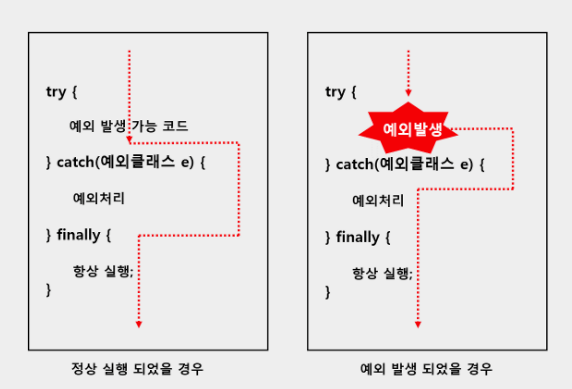

### 예외처리

- try-catch
    
    

    ```java
    public class Exception {
      public static void main(String[] args) {
        int a, b, c;
        try {
          a = 10;
          b = 0;
    			// 10 나누기 0 → 산술오류 ArithmeticException
          c = a / b;
        } catch (NumberFormatException e) {
          System.out.println("숫자로 변환할 수 없습니다.");
        } catch (ClassNotFoundException e) {
          System.out.println("클래스가 존재하지 않습니다.");         
        } catch (Exception e) { // 부모 예외 클래스로 한꺼번에 처리했기 때문에 세세한 예외 클래스 종류는 지금은 알 수는 없다.
          System.out.println("NumberFormatException와 ClassNotFoundException 이외에 모르는 어떠한 에러가 발생하였습니다");
        }
      }
    }
    ```
    
- try-catch-finally
    
    

    ```java
    public class Sample {
      public void shouldBeRun() {
        System.out.println("ok thanks");
      }
    
      public static void main(String[] args) {
        Sample sample = new Sample();
        int c;
        try {
          c = 4 / 0;
        } catch (ArithmeticException e) {
          c = -1;
        } finally {
          sample.shouldBeRun();  // 예외에 상관없이 무조건 수행된다.
        }
      }
    }
    ```
    

### 예외 던지기 (throw / throws)

- throw / throws
    - throw
        - Method 내에서 에러 발생시킬때 사용
        - catch로 던진다.
        
        ```java
        public class myException() {
        	try {
        		throw new Excepiton();
        	}
        	catch (Exception e) {
        		e.printStackTrace();
        		System.out.println("myClass에서 예외 발생");
        	}
        }
        ```
        
        ```java
        public class ExceptionTest {
        	public static void main(String[] args) {
        		try{
        			myException();
        		}
        		catch (Exception e) {
        			e.printStackTrace();
        			System.out.println("myException에서 예외 발생");
        		}
        	}
        }
        ```
        
    - throws
        - 상위 메서드로 예외를 던진다.
        
        ```java
        public class myException() {
        	throw new Exception();
        }
        ```
        
        ```java
        public class ExceptionTest {
        	public static void main(String[] args) {
        		try{
        			myException();
        		}
        		catch (Exception e) {
        			e.printStackTrace();
        			System.out.println("myClass에서 예외 발생");
        		}
        	}
        }
        ```
        
- Custom Exception

---------------------------
<aside>
💡 Reference

</aside>

- throw
    - https://wikidocs.net/229
