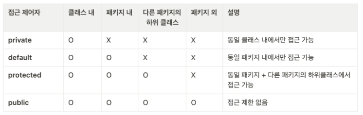

### 객체지향프로그래밍 (Object Oriented Programming)

- 객체
    - Instance
- 생성자
    - new 연산자 ⇒ 객체 초기화 담당
    - void 생략
    - 동일 이름의 생성자 가능 ⇒ Parameter가 다르다.
    
    ```java
    class Car {
      // 속성(변수) 정의 
      String company;
      String color;
    
      // 기본 생성자(생략 가능)
      public Car() {
      }
      // 생성자 정의
      public Car(String company, String color) {
        this.company = company;
        this.color = color;
      }
    }
    ```
    
    ```java
    public static void main(String[] args) {
      Car car1 = new Car(); // 기본 생성자를 이용해서 생성 
      Car car2 = new Car("BMW", "Red"); // 생성자 정의를 이용해서 생성 
    }
    ```
    

### OOP 특징

- 추상화 (Abstration)
    - 공통된 속성과 행위 추출
    - abstract
    - interface
    
    ```java
    public interface Vehicle {
      public abstract void start();
      void moveForward(); // public abstract 생략 가능 
      void moveBackward();
    }
    ```
    
    ```java
    // Car 클래스 
    public class Car implements Vehicle {
    
      @Override
      public void moveBackward() {
        // TODO Auto-generated method stub
        System.out.println("자동차가 앞으로 전진합니다.");
      }
    
      @Override
      public void moveForward() {
        // TODO Auto-generated method stub
        System.out.println("자동차가 위로 후진합니다.");
      }
    
      @Override
      public void start() {
        // TODO Auto-generated method stub
        System.out.println("시동을 겁니다.");
      }
    }
    ```
    
    ```java
    // MotorBike 클래스 
    public class MotorBike implements Vehicle {
    
      @Override
      public void moveBackward() {
        // TODO Auto-generated method stub
        System.out.println("오토바이가  앞으로 전진합니다.");
      }
    
      @Override
      public void moveForward() {
        // TODO Auto-generated method stub
        System.out.println("오토바이가 위로 후진합니다.");
      }
    
      @Override
      public void start() {
        // TODO Auto-generated method stub
        System.out.println("시동을 겁니다.");
      }
    }
    ```
    
- 상속 (Inheritance)
    - 부모클래스의 특성을 이어받는다.
    
    ```java
    public class Vehicle {
    
      String model; 
      String color;
      int wheels; 
    
      void moveForward() {
        System.out.println("전진합니다.");
      }
      void moveBackward() {
        System.out.println("후진합니다.");
      }
    }
    ```
    
    ```java
    public class Car extends Vehicle {
    
      boolean isConvertible;
    
      public void openWindow() {
        System.out.println("모든 창문을 엽니다.");
      }
    }
    ```
    
    ```java
    public class MotorBike extends Vehicle {
    
      boolean isRaceable;
    
      public void stunt() {
        System.out.println("묘기를 부립니다.");
      }
    }
    ```
    
    ```java
    public static void main(String[] args) {
        
      // 객체 생성 
      Car car = new Car();
      MotorBike bike = new MotorBike();
    
      // car 객체의 속성 정의 
      car.model = "테슬라";
      car.color = "빨강색";
      System.out.println("나의 자동차는 "+car.color+" "+car.model+"입니다.");
    
      //객체들의 기능 실행 
      car.moveForward();
      bike.moveForward();
      bike.moveBackward();
    
    }
    ```
    
- 다형성 (Polymorphism)
    - override : 재정의
    - 동일 이름의 메소드 호출시 객체에 따라 다르게 동작
    
    ```java
    public class MotorBike extends Vehicle {
    
      boolean isRaceable;
    
      @Override
      public void moveForward() {
        // 메서드 오버라이딩 -> 다형성을 활용한 기능 재정의 
        System.out.println("오토파이가 앞으로 전진합니다.");
      }
    
      public void stunt() {
        System.out.println("묘기를 부립니다.");
      }
    }
    ```
    
    ```java
    public static void main(String[] args) {
        
      // 객체 생성 
      Car car1 = new Car();
      Car car2 = new Car(); // 다형성을 활용한 객체 생성 
      MotorBike bike = new MotorBike();
    
      // car 객체의 속성 정의 
      car1.model = "테슬라";
      car1.color = "빨강색";
      System.out.println("나의 자동차는 "+car1.color+" "+car1.model+"입니다.");
    
      car2.model = "BMW";
      car2.color = "파랑색";
      System.out.println("나의 자동차는 "+car2.color+" "+car2.model+"입니다.");
    
      //객체들의 기능 실행 
      car1.moveForward();
      bike.moveForward();
      bike.moveBackward();
    
    }
    ```
    
    ```java
    public static void main(String[] args) {
        
      // 상위 클래스 타입의 객체 배열 생성 
      Vehicle vehicles[] = new Vehicle[2];
      vehicles[0] = new Car();
      vehicles[1] = new MotorBike(); 
    
      for (Vehicle vehicle: vehicles) {
        System.out.println(vehicle.getClass());
      }
    }
    ```
    
- 캡슐화 (Encapsulation)
    - 접근자
        
        
        
    - private는 getter / setter로 접근가능
        
        ```java
        public class TestClass {
          private int a = 1;
          public int b = 2;
        
          private void add1() {
            System.out.println(this.a+this.b);
          }
        
          public void add2() {
            this.add1();
          }
        
          public int getA() {
            return a;
          }
        
          public void setA(int a) {
            this.a = a;
          }
        }
        ```
        

<aside>
💡 Reference

</aside>

- OOP
    - [https://www.codestates.com/blog/content/객체-지향-프로그래밍-특징](https://www.codestates.com/blog/content/%EA%B0%9D%EC%B2%B4-%EC%A7%80%ED%96%A5-%ED%94%84%EB%A1%9C%EA%B7%B8%EB%9E%98%EB%B0%8D-%ED%8A%B9%EC%A7%95)