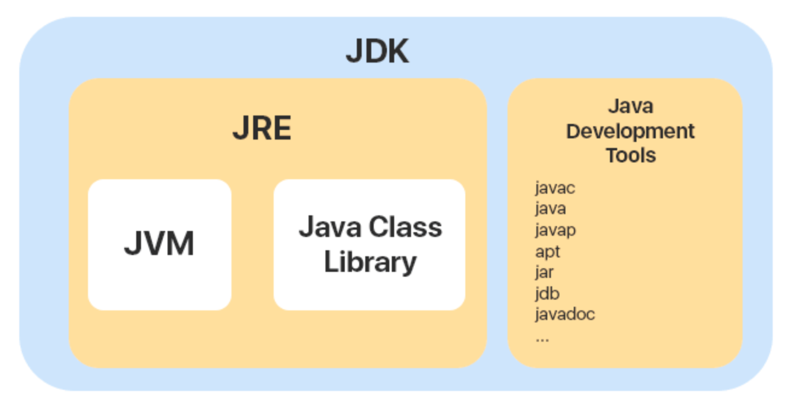
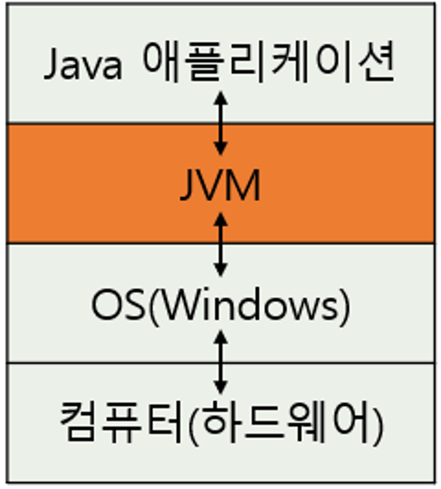
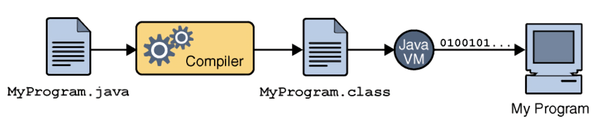
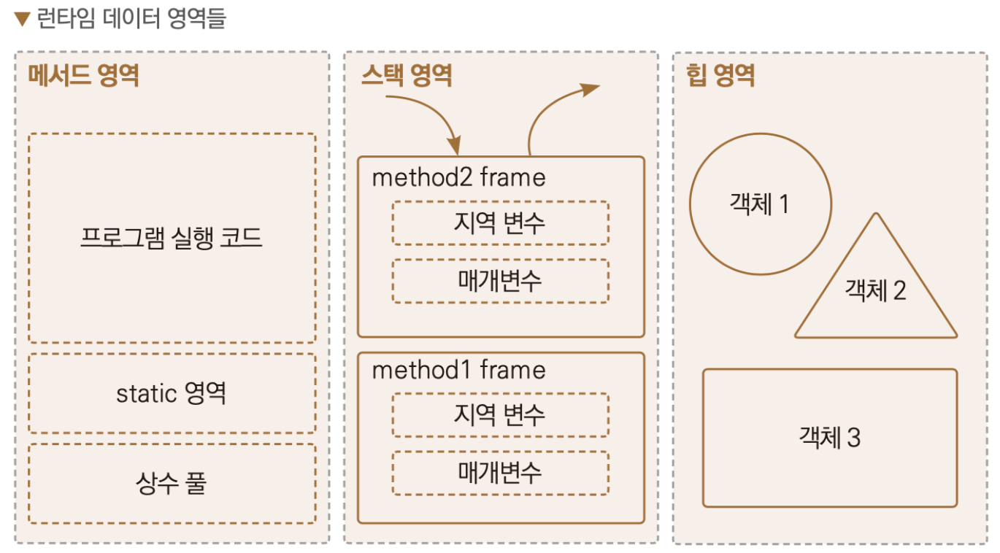

### JDK / JRE / JVM

- JDK (Java Development Kit)
    - 자바 개발
    - java, javac, jar…
- JRE (Java Runtime Environment)
    - 자바 어플리케이션 실행 라이브러리 모듈
- JVM (Java Virtual Machine)
    - 자바 가상머신
    - 모든 OS에서 실행될 수 있게 한다.
    
    
    

### Java 실행과정

- java 파일을 class 파일로 컴파일을 하고, 그 이후에 JVM이 컴퓨터 운영체제가 이해할 수 있는 바이너리 코드(0100100....)로 변환하는 과정을 통해서 실행하게 된다.

### Garbage Collection

- 메모리 관리
    - 자동적으로 관리
    - 메모리 누수 방지
    - 메모리 해제 시점을 알 수 없다.
    - 힙영역에 필요없는 것을 제거

