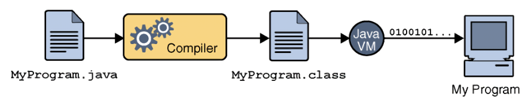

### JVM의 동작 방식

- 자바 애플리케이션을 클래스 로더를 통해 읽어 자바 API와 함께 실행
1. 자바 프로그램을 실행하면 JVM은 OS로부터 메모리를 할당 받는다.
2. 자바 컴파일러(javac)가 자바 소스코드(.java)를 자바 Byte Code(.class)로 컴파일 한다.
3. Class Loader는 동적 로딩을 통해 필요한 클래스들을 로딩 및 링크 하여Runtime Data Area(실질적인 메모리를 할당 받아 관리하는 영역)에 올린다.
4. Runtime Data Area에 로딩 된 Byte Code는 Execution Engine을 통해 해석된다.
5. 이 과정에서Execution Engine에 의해Garbage Collector의 작동과Thread 동기화가 이루어진다.

### JVM 구조

- Class Loader ↔ Execution Engine ↔ Runtime Data Area

- 클래스 로더(Class Loader)
- 실행 엔진(Execution Engine)
    - 인터프리터(Interpreter)
    - JIT 컴파일러(Just-in-Time)
    - 가비지 콜렉터(Garbage collector)
- 런타임 데이터 영역 (Runtime Data Area)
    - 메소드 영역
    - 힙 영역
    - PC Register
    - 스택 영역
    - 네이티브 메소드
- JNI - 네이티브 메소드 인터페이스 (Native Medthod Interface)
- 네이티브 메소드 라이브러리 (Native Method Library)

### 클래스 로더 (Class Loader)

- JVM 내로 클래스 파일(*.class)을 동적으로 로드하고, 링크를 통해 배치하는 작업을 수행하는 모듈
    - Byte Code(.class)들을 엮어서 JVM의 메모리 영역인 Runtime Data Areas에 배치
    - 클래스를 메모리에 올리는 로딩 기능은 한번에 메모리에 올리지 않고, 어플리케이션에서 필요한 경우 동적으로 메모리에 적재~
- 클래스 로더 로딩 순서 (Loading → Linking → Initialization)
    
    
    
    1. Loading(로드) : 클래스 파일을 가져와서 JVM의 메모리에 로드.
    2. Linking(링크) : 클래스 파일을 사용하기 위해 검증하는 과정.
    3. Verifying(검증) : 읽어들인 클래스가 JVM 명세에 명시된 대로 구성되어 있는지 검사.
    4. preparing(준비) : 클래스가 필요로 하는 메모리를 할당.
    5. Resolving(분석) : 클래스의 상수 풀 내 모든 심볼릭 레퍼런스를 다이렉트 레퍼런스로 변경.
    6. Initialization(초기화) : 클래스 변수들을 적절한 값으로 초기화. ( static 필드들을 설정된 값으로 초기화 등 )

### 실행 엔진 (Execution Engine)

- **인터프리터**와 **JIT 컴파일러를 통해** Byte Code**를 실행**
- 클래스 로더를 통해 런타임 데이터 영역에 배치된 Byte Code를 명령어 단위로 읽어서 실행
- Java Byte Code(*.class)는 기계가 바로 수행할 수 있는 언어보다는 가상머신이 이해할 수 있는 중간 레벨로 컴파일 된 코드
- Byte Code를 실제로 JVM 내부에서 기계가 실행할 수 있는 형태로 변경

### 인터프리터 (Interpreter)

- Byte Code 명령어를 하나씩 읽어서 해석하고 바로 실행
- JVM안에서는 기본적으로 인터프리터 방식
- 같은 메소드라도 여러번 호출이 된다면 매번 해석하고 수행하기 때문에 전체적인 속도 느리다.

### JIT 컴파일러 (Just-In-Time Compiler)

- Interpreter 단점을 보완
- Byte Code 전체를 컴파일해 Native Code로 변경
- 동일 메소드를 더 이상 인터프리팅하지 않고 캐싱해 두었다가 네이티브 코드로 직접 실행
- 전체적인 실행 속도가 인터프리팅 방식보다 빠르다.
- Byte Code를 Native Code로 변환하는데 비용이 소모되므로, JVM 은 모든 코드를 JIT 컴파일러 방식으로 실행하지 않고 인터프리터 방식을 사용하다 일정 기준이 넘어가면 JIT 컴파일 방식으로 명령어를 실행한다.
    - Native Code : C언어, C++, 엄셈블리어로 구성된 코드

### 가비지 컬렉터 (Garbage Collector, GC)

- JVM은 GC를 이용해 Heap 메모리 영역에서 더는 사용하지 않는 메모리를 자동으로 회수
- C언어 같은 경우 직접 개발자가 메모리를 해제해줘야 되지만, JAVA는 이 GC를 이용해 자동으로 메모리를 실시간 최적화
- 개발자가 따로 메모리를 관리하지 않아도 되므로, 더욱 손쉽게 프로그래밍 가능
- 일반적으로 자동으로 실행되지만, 단 GC(가비지 컬렉터) 가 실행되는 시간은 정해져 있지 않다.
- 특히 Full GC 가 발생하는 경우, GC 를 제외한 모든 스레드가 중지되기 때문에 장애가 발생할 수 있다.

### 런타임 데이터 영역 (Runtime Data Area)

- JVM의 메모리 영역으로 자바 애플리케이션을 실행할 때 사용되는 데이터들을 적재하는 영역

### Method Area = Class Area, Static Area

- JVM에서 읽어들인 클래스와 인터페이스에 대한 런타임 상수 풀, 메서드와 필드, Static 변수, 메서드 Byte Code 등을 보관
- **정적 필드**와 **클래스 구조만**을 갖고 있다고 할수있다.
- 사용기간
    - JVM 시작 시 생성
    - 프로그램 종료까지
    - 명시적으로 null 선언시
- 스레드 공유
    - 모든 스레드에서 공유

### Runtime Constant Pool

- Method Area에 포함되지만 독자적 중요성을 띈다.
- 클래스 파일 constant_pool 테이블에 해당하는 영역
- 클래스와 인터페이스 상수, 메서드와 필드에 대한 모든 레퍼런스 저장
- JVM은 런타임 상수 풀을 통해 해당 메서드나 필드의 실제 메모리 상 주소를 찾아 참조
- 상수 자료형을 저장하여 참조하고 중복을 막는 역할을 수행
- 사용기간
    - JVM 시작 시 생성
    - 프로그램 종료까지
    - 명시적으로 null 선언시
- 스레드 공유
    - 모든 스레드에서 공유

### Heap Area

- JVM이 관리
- 프로그램 상에서 데이터를 저장하기 위해 런타임 시 동적으로 할당하여 사용하는 메모리 영역
- New 연산자를 통해 생성한 객체 또는 인스턴스와 배열, Reference Type 저장
- Method Area 영역에 저장된 클래스만이 생성이 되어 적재
- 유의할점은 힙 영역에 생성된 객체와 배열은Reference Type으로서, JVM 스택 영역의 변수나 다른 객체의 필드에서 참조된다는 점
- 힙의 참조 주소는 "스택"이 갖고 있고 해당 객체를 통해서만 힙 영역에 있는 인스턴스를 핸들링할 수 있는 것
- 만일 참조하는 변수나 필드가 없다면 의미 없는 객체가 되기 때문에 이것을 쓰레기로 취급하고 JVM은 쓰레기 수집기인 GC를 실행시켜 쓰레기 객체를 힙 영역에서 자동으로 제거

- 사용기간
    - JVM 시작 시 생성
    - 프로그램 종료까지
    - 명시적으로 null 선언시
- 스레드 공유
    - 모든 스레드에서 공유

### 💡GC 5가지 영역 (Eden, survivor 0, survivor 1, Old, Permanent)

- 다섯가지 영역(Eden, survivor 0, survivor 1, Old, Permanent)으로 나뉜 힙 영역은 다시 물리적으로Young Generation 과Old Generation영역으로 구분
- Young Generation : 생명 주기가 짧은 객체를 GC 대상으로 하는 영역.
    - Eden : new를 통해 새로 생성된 객체가 위치. 정기적인 쓰레기 수집 후 살아남은 객체들은 Survivor로 이동
    - Survivor 0 / Survivor 1 : 각 영역이 채워지게 되면, 살아남은 객체는 비워진 Survivor로 순차적으로 이동
- Old Generation : 생명 주기가 긴 객체를 GC 대상으로 하는 영역. Youn Generation에서 마지막까지 살아남은 객체가 이동

### Stack Area

- int, long, boolean 등 기본 자료형을 생성할 때 저장하는 공간으로,임시적으로 사용되는 변수나 정보들이 저장되는 영역
- 선입후출(FILO) 구조
- 메서드 호출 시 생성되는 스레드 수행정보를 기록하는 Frame 저장, 메서드 정보, 지역변수, 매개변수, 연산 중 발생하는 임시 데이터 저장
- 사용기간
    - {}나 메서드가 끝날 때
- 스레드 공유
    - 각 스레드 별로 생성

- 스택 영역은 각 스레드마다 하나씩 존재하며, 스레드가 시작될 때 할당
- 프로세스가 메모리에 로드 될 때 스택 사이즈가 고정되어 있어, 런타임 시에 스택 사이즈를 바꿀 수는 없다.
- 만일 고정된 크기의 JVM 스택에서 프로그램 실행 중 메모리 크기가 충분하지 않다면 StackOverFlowError가 발생하게 된다.
- 쓰레드를 종료하면 런타임 스택도 사라진다.

### PC 레지스터

- 현재 실행 중인 JVM 주소를 저장하는 공간
- CPU 명령어 즉, Instruction을 수행
- 자바는 OS나 CPU의 입장에서는 하나의 프로세스이기 때문에 가상 머신(JVM)의 리소스를 이용
    - CPU에 직접 연산을 수행하도록 하는 것이 아닌,현재 작업하는 내용을 CPU에게 연산으로 제공해야 하며,이를 위한 버퍼 공간으로 PC Register라는 메모리 영역을 만들게 된 것
    - JVM은 스택에서 비연산값 Operand를 뽑아 별도의 메모리 공간인 PC Register에 저장하는 방식
- 스레드 공유
    - 각 스레드 별로 생성

### Native Method Stack Area

- 자바 코드가 컴파일되어 생성되는 바이트 코드가 아닌 실제 실행할 수 있는기계어로 작성된 프로그램을 실행시키는 영역
- 자바 외 언어로 작성된 네이티브 코드를 실행하는 공간
    - C/C++ 등의 코드를 수행하기 위한 스택
- JIT 컴파일러에 의해 변환된 Native Code 여기에서 실행
- 일반적으로 메소드를 실행하는 경우 JVM 스택에 쌓이다가 해당 메소드 내부에 네이티브 방식을 사용하는 메소드가 있다면 해당 메소드는 네이티브 스택에 쌓인다.
- 네이티브 메소드가 수행이 끝나면 다시 자바 스택으로 돌아와 다시 작업을 수행한다.
- 네이티브 코드로 되어 있는 함수의 호출을 자바 프로그램 내에서도 직접 수행할 수 있고 그 결과를 받아올 수도 있다.
    
    
    
- native 메서드의 매개변수, 지역변수 등을 Byte Code로 저장
- 사용기간
    - native interface 호출 시 생성
    - native interface 종료 시 생성
- 스레드 공유
    - 각 스레드 별로 생성

---
<aside>
💡 Reference

</aside>

- [https://inpa.tistory.com/entry/JAVA-☕-JVM-내부-구조-메모리-영역-심화편](https://inpa.tistory.com/entry/JAVA-%E2%98%95-JVM-%EB%82%B4%EB%B6%80-%EA%B5%AC%EC%A1%B0-%EB%A9%94%EB%AA%A8%EB%A6%AC-%EC%98%81%EC%97%AD-%EC%8B%AC%ED%99%94%ED%8E%B8)